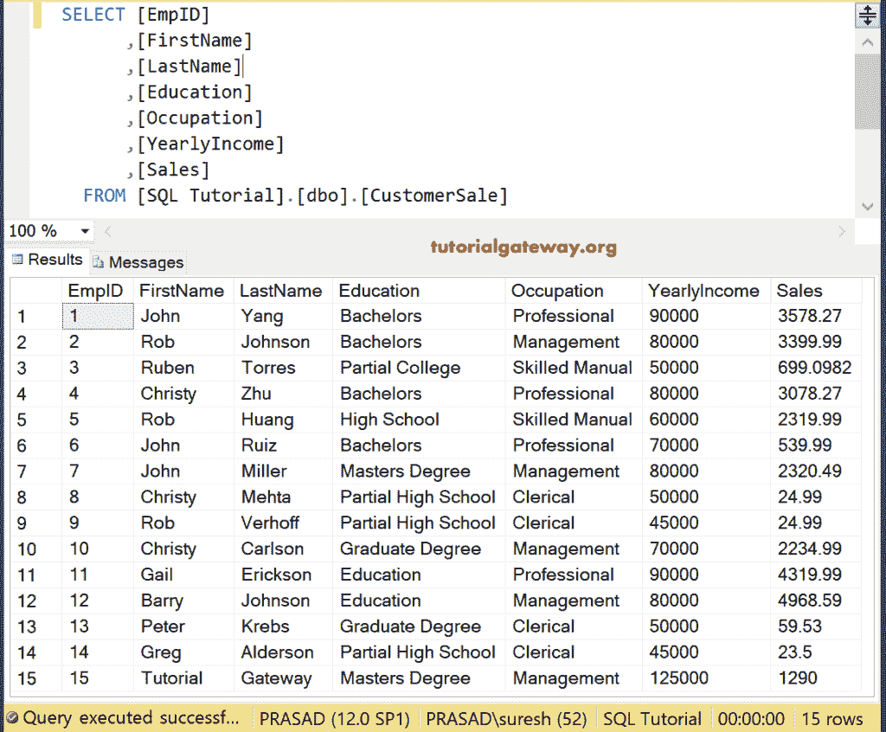
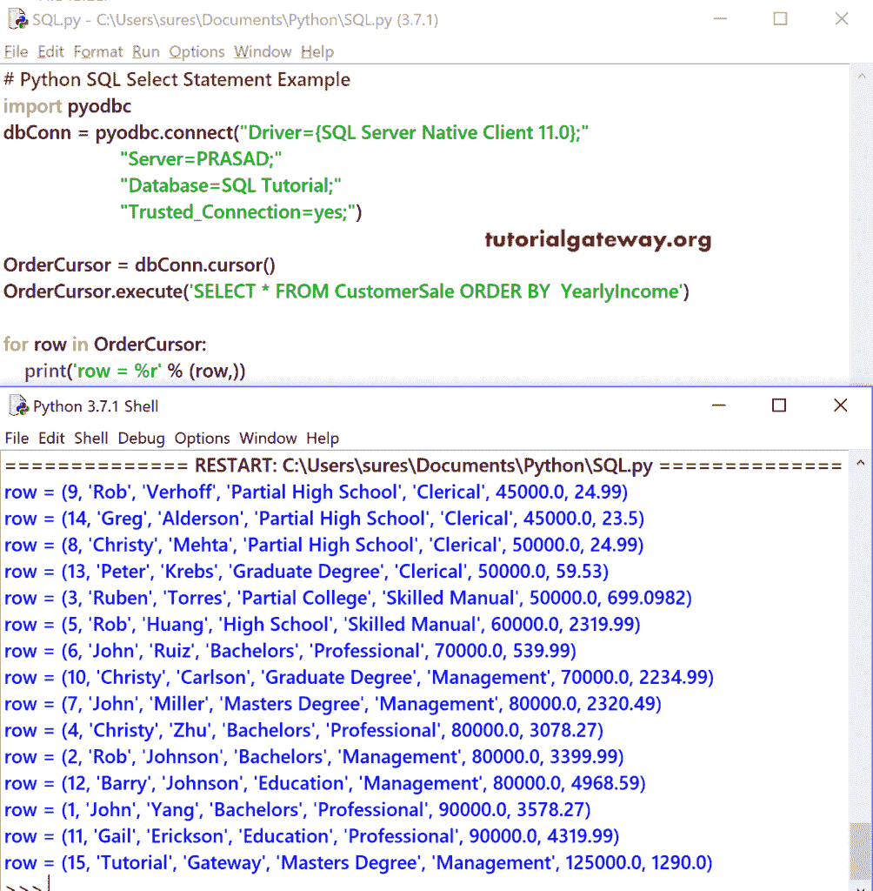
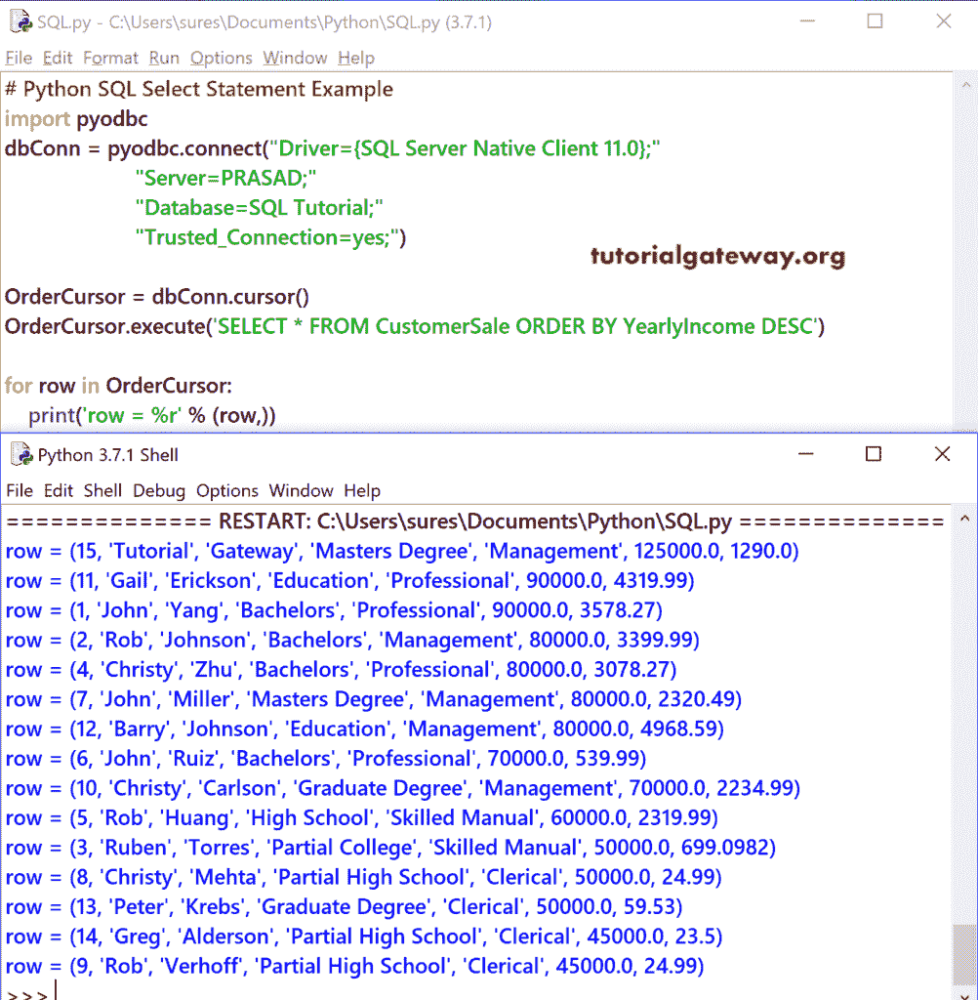

# Python SQL `Order By`

> 原文：<https://www.tutorialgateway.org/python-sql-order-by/>

在本节中，我们将向您解释如何用 Python 编程语言编写一个 SQL Order By。以及如何用 Python 对 SQL Server 表记录进行排序，并举例说明。

在我们进入 Python SQL Order 示例之前，让我向您展示我们使用的数据。



## Python SQL 顺序示例 1

在这个 [Python](https://www.tutorialgateway.org/python-tutorial/) 的例子中，我们展示了如何使用 [Order By 子句](https://www.tutorialgateway.org/sql-order-by-clause/)对数据进行升序排序。

提示:请参考[连接 Python 到 SQL Server](https://www.tutorialgateway.org/connect-python-and-sql-server/) 文章，了解建立连接所涉及的步骤。

这里，ASC 是升序的关键字。默认情况下，Order by 子句按升序对数据进行排序。因此，包含 ASC 关键字是可选的。

```
# Python SQL Order By Example
import pyodbc
dbConn = pyodbc.connect("Driver={SQL Server Native Client 11.0};"
                      "Server=PRASAD;"
                      "Database=SQL Tutorial;"
                      "Trusted_Connection=yes;")

OrderCursor = dbConn.cursor()
OrderCursor.execute('SELECT * FROM CustomerSale ORDER BY  YearlyIncome')

for row in OrderCursor:
    print('row = %r' % (row,))

```



首先，我们从 SQL 教程数据库中的客户销售表中选择数据。该数据按年收入升序排序。

```
OrderCursor.execute('SELECT * FROM CustomerSale ORDER BY YearlyIncome')
```

接下来，我们使用 [`for`循环](https://www.tutorialgateway.org/python-for-loop/)来迭代顺序光标中出现的每一行。在`for`循环中，我们使用 print 语句来打印行。

```
for row in OrderCursor: 
   print('row = %r' % (row,))
```

## Python SQL 按降序排序示例

这个 Python Order By 示例使用年收入列按降序对客户表进行排序。

```
# Python SQL Order By Example
import pyodbc
dbConn = pyodbc.connect("Driver={SQL Server Native Client 11.0};"
                      "Server=PRASAD;"
                      "Database=SQL Tutorial;"
                      "Trusted_Connection=yes;")

OrderCursor = dbConn.cursor()
OrderCursor.execute('SELECT * FROM CustomerSale ORDER BY YearlyIncome DESC')

for row in OrderCursor:
    print('row = %r' % (row,))

```

