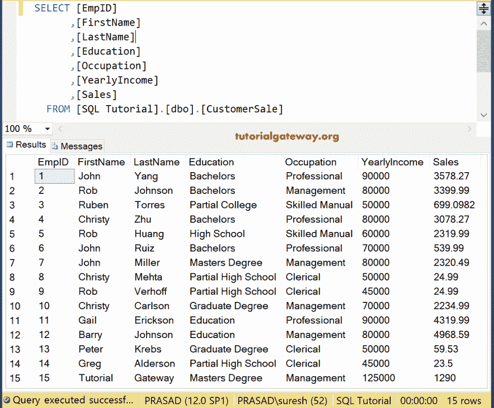
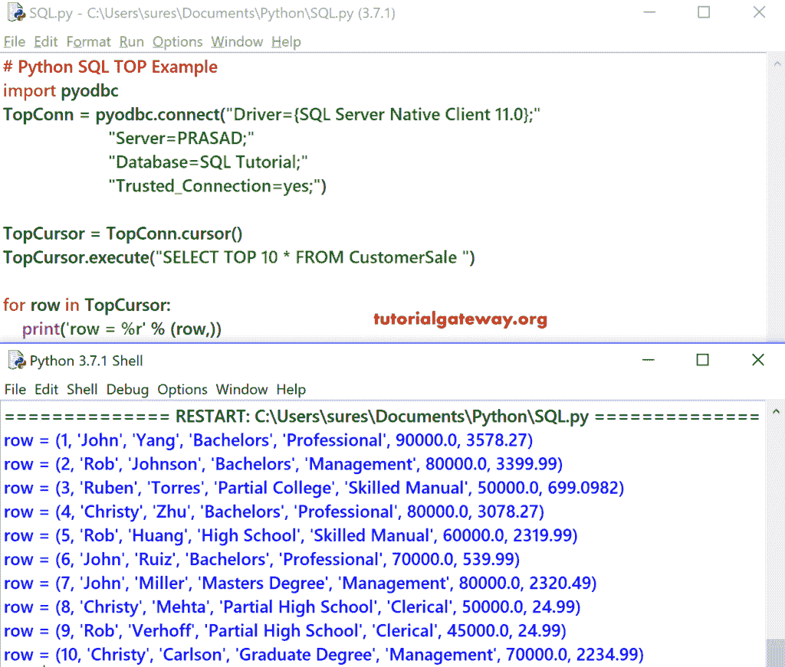
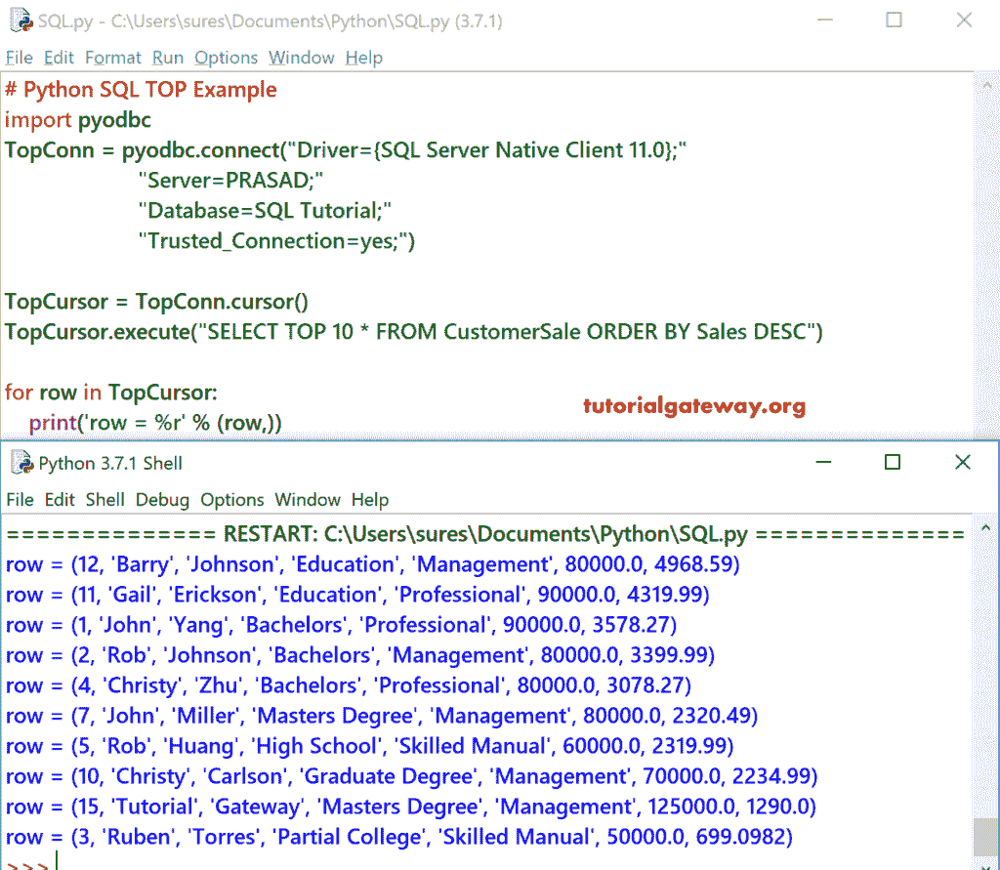
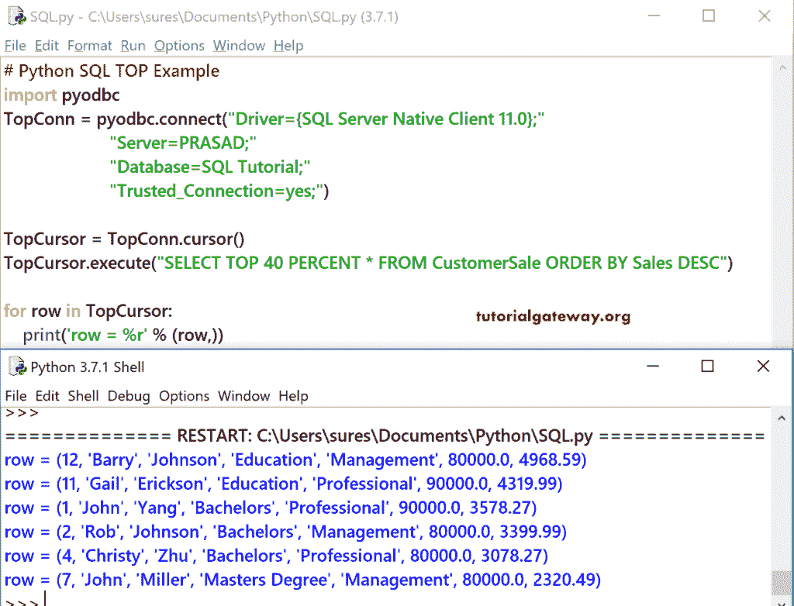

# Python SQL `SELECT TOP`

> 原文：<https://www.tutorialgateway.org/python-sql-select-top/>

在本节中，我们将向您解释如何用 Python 编程语言编写一个 SQL Select Top。或者用一个例子说明如何编写一个 SQL Server 查询来选择 Python 中的前 10 条记录。

在我们进入 SQL Select 前 10 名示例之前，让我向您展示我们使用的数据。



## Python SQL 选择最佳示例 1

在这个 Python 示例中，我们展示了如何使用 `TOP`子句从客户销售表中选择前 10 条记录。

提示:请参考[将 Python 连接到 SQL Server](https://www.tutorialgateway.org/connect-python-and-sql-server/) 文章，了解从 [Python](https://www.tutorialgateway.org/python-tutorial/) 建立连接所涉及的步骤。

```
# Python SQL TOP Example
import pyodbc
TopConn = pyodbc.connect("Driver={SQL Server Native Client 11.0};"
                      "Server=PRASAD;"
                      "Database=SQL Tutorial;"
                      "Trusted_Connection=yes;")

TopCursor = TopConn.cursor()
TopCursor.execute("SELECT TOP 10 * FROM CustomerSale ")

for row in TopCursor:
    print('row = %r' % (row,))
```



下面的 Python 程序选择客户销售表中的前 10 条或前 10 条记录。

```
TopCursor.execute("SELECT TOP 10 * FROM CustomerSale ")
```

接下来，我们使用 [`for`循环](https://www.tutorialgateway.org/python-for-loop/)来迭代出现在顶部游标中的记录。在`for`循环中，我们使用打印语句来打印记录。

```
for row in TopCursor:    
    print('row = %r' % (row,))
```

## Python 选择前 10 条记录示例 2

在这个例子中，我们使用了[订单条款](https://www.tutorialgateway.org/sql-order-by-clause/)和[顶条款](https://www.tutorialgateway.org/sql-top-clause/)。下面的程序使用 Sales 以降序对数据进行排序，然后从排序的表中选择前 10 条记录。

```
# Python SQL TOP Example
import pyodbc
TopConn = pyodbc.connect("Driver={SQL Server Native Client 11.0};"
                      "Server=PRASAD;"
                      "Database=SQL Tutorial;"
                      "Trusted_Connection=yes;")

TopCursor = TopConn.cursor()
TopCursor.execute("SELECT TOP 10 * FROM CustomerSale ORDER BY Sales DESC")

for row in TopCursor:
    print('row = %r' % (row,))
```



## Python SQL 选择最佳示例 3

在这个 Python 示例中，我们使用百分比从客户销售中选择前 40%的记录。

```
# Python SQL TOP Example
import pyodbc
TopConn = pyodbc.connect("Driver={SQL Server Native Client 11.0};"
                      "Server=PRASAD;"
                      "Database=SQL Tutorial;"
                      "Trusted_Connection=yes;")

TopCursor = TopConn.cursor()
TopCursor.execute("SELECT TOP 40 PERCENT * FROM CustomerSale ORDER BY Sales DESC")

for row in TopCursor:
    print('row = %r' % (row,))
```

