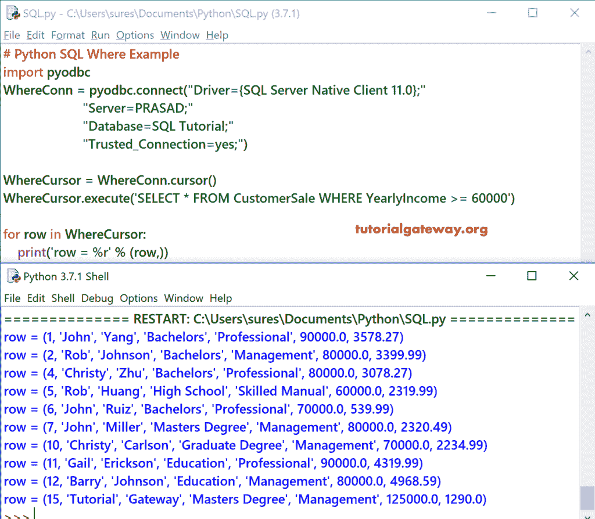

# Python SQL `WHERE`子句

> 原文：<https://www.tutorialgateway.org/python-sql-where-clause/>

在本章中，我们将解释如何用 Python 编程语言编写一个 SQL Where。以及如何用 Python 过滤表记录的例子。在我们进入 SQL Where 示例之前，让我向您展示数据。


## Python SQL`WHERE`子句示例 1

在这个 [Python](https://www.tutorialgateway.org/python-tutorial/) 的例子中，我们展示了如何使用 [`WHERE`子句](https://www.tutorialgateway.org/sql-where-clause/)根据条件过滤数据或限制记录。

提示:请参考[连接 Python 到 SQL Server](https://www.tutorialgateway.org/connect-python-and-sql-server/) 文章，了解建立连接所涉及的步骤。

```
# Python SQL Where Example
import pyodbc
WhereConn = pyodbc.connect("Driver={SQL Server Native Client 11.0};"
                      "Server=PRASAD;"
                      "Database=SQL Tutorial;"
                      "Trusted_Connection=yes;")

WhereCursor = WhereConn.cursor()
WhereCursor.execute('SELECT * FROM CustomerSale WHERE YearlyIncome >= 60000')

for row in WhereCursor:
    print('row = %r' % (row,))
```



下面的 Python 程序从客户销售表中选择年收入大于或等于 60000 的所有记录。

```
OrderCursor.execute('SELECT * FROM CustomerSale ORDER BY YearlyIncome')
```

接下来，我们使用 [`for`循环](https://www.tutorialgateway.org/python-for-loop/)来迭代出现在 Where 游标中的每一行。在`for`循环中，我们使用打印语句来打印记录。

```
for row in WhereCursor:    
    print('row = %r' % (row,))
```

## Python SQL Where 示例 2

在这个 Python 例子中，我们使用[通配符](https://www.tutorialgateway.org/sql-like/)来过滤数据。下面的 Python 程序从一个以 l 结尾的表中返回所有记录

```
# Python SQL Where Example
import pyodbc
WhereConn = pyodbc.connect("Driver={SQL Server Native Client 11.0};"
                      "Server=PRASAD;"
                      "Database=SQL Tutorial;"
                      "Trusted_Connection=yes;")

WhereCursor = WhereConn.cursor()
WhereCursor.execute("SELECT * FROM CustomerSale WHERE Occupation LIKE N'%l' ")

for row in WhereCursor:
    print('row = %r' % (row,))
```

