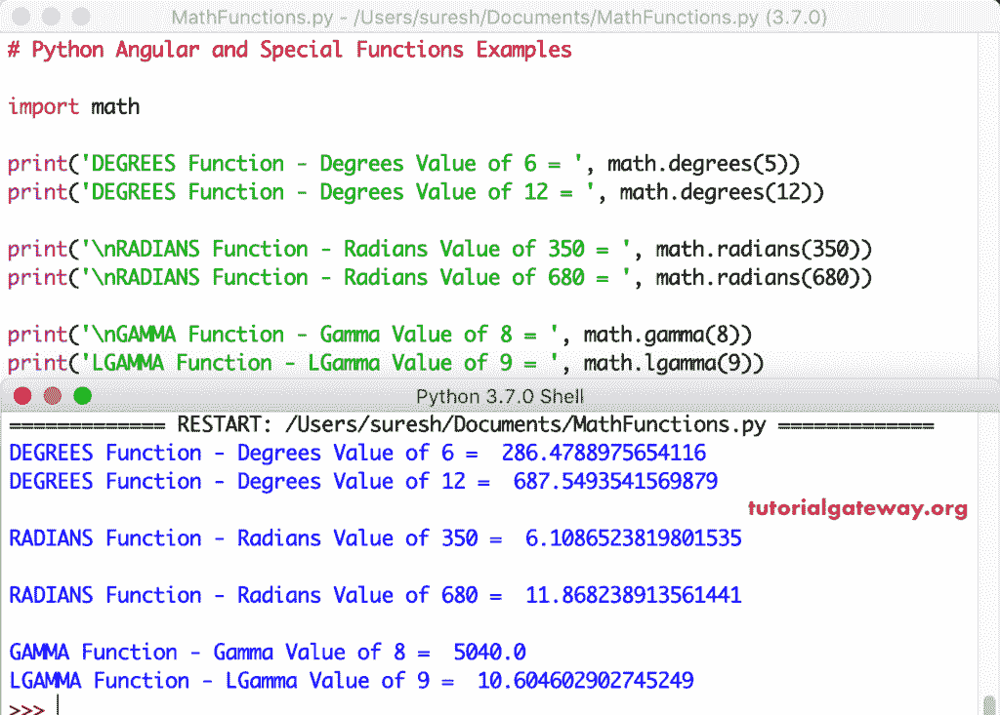

# Python 数学函数

> 原文：<https://www.tutorialgateway.org/python-math-functions/>

Python 数学库提供了各种函数和常量/属性，允许我们执行数学功能。与其他 Python 全局对象不同，Python 数学库对象中的属性和函数是静态的。因此，我们可以将 Python 数学属性作为数学来访问。π和函数是数学。

## Python 数学对象属性

Python 数学库模块中可用的属性或常数列表。

| Python 数学属性 | 描述 |
| 数学 e | 它返回欧拉数 e，约等于 2.71828 |
| 数学. pi | 它返回饼图值，大约等于 3.14 |
| 数学. inf | 此属性返回正无穷大。你可以用-数学。返回负无穷大。 |
| 数学。南 | 它返回非数字作为输出 |

## Python 数学函数

数学库中可用的 Python 数学函数列表。请点击此链接查看 Python 中可用数学函数的教程。


| Python 数学函数 | 描述 |
| [天花板(x)](https://www.tutorialgateway.org/python-ceil/) | 它返回最小的整数，该整数大于或等于指定的表达式或数字。 |
| [复制设计(x)](https://www.tutorialgateway.org/python-copysign/) | 这个 python 数学函数找到第一个参数的绝对值。它返回绝对值以及第二个参数中指定的符号。 |
| [晶圆厂(x)](https://www.tutorialgateway.org/python-fabs/) | 给定数字的绝对值 |
| [因子(x)](https://www.tutorialgateway.org/python-factorial/) | 它查找指定表达式或特定数字的阶乘。 |
| [楼层(x)](https://www.tutorialgateway.org/math-floor-in-python/) | 最大整数值，小于或等于指定的数字。 |
| [fmod（x， y）](https://www.tutorialgateway.org/python-fmod/) | 这个 python 数学函数计算指定给定参数的模。 |
| [frexp(x)](https://www.tutorialgateway.org/python-frexp/) | 它返回 x 的尾数和指数，作为对(m，e)，其中 m 是浮点值，e 是整数值。 |
| [fsum(可滴定)](https://www.tutorialgateway.org/python-fsum/) | 计算并返回迭代的总和(元组和列表) |
| [gcd(x，y)](https://www.tutorialgateway.org/python-gcd/) | 这个 python 数学函数返回两个给定参数的最大公约数。 |
| iscloser(x，y) | 如果两个参数彼此接近，则返回真，否则返回假 |
| [isfinite(x)](https://www.tutorialgateway.org/python-isfinite/) | 用于检查给定的数字/表达式既不是无穷大(正或负)，也不是 NaN。如果给定的数字既不是无穷大也不是(非数字)，则返回真，否则返回假。 |
| [isinf(x)](https://www.tutorialgateway.org/python-isinf/) | 检查给定的数字是否为无穷大(正或负)。如果数字为无穷大，则返回真，否则返回假 |
| [isnan（x）](https://www.tutorialgateway.org/python-isnan/) | 这个 python 数学函数检查给定的数字是否是 NaN(非数字)。如果给定的数字为“否”，则返回“真”，否则返回“假” |
| [圆形(x)](https://www.tutorialgateway.org/python-round/) | 这是一个常规方法(不是数学模块方法)。它将指定的表达式或特定的数字舍入到最接近的整数。 |
| [ldxp(x，i)](https://www.tutorialgateway.org/python-ldexp/) | 这个内置方法返回 x * (2**i)。也叫 [Python frexp 方法的逆](https://www.tutorialgateway.org/python-frexp/)。 |
| [modf(x)](https://www.tutorialgateway.org/python-modf/) | 将给定值分为两个参数:小数部分作为第一个参数，整数值作为第二个参数。 |
| [truc(x)](https://www.tutorialgateway.org/python-trunc/) | 从指定表达式中移除十进制值并返回整数值 |

### Python 幂和`log()`函数

下面是 Python 数学库中可用的幂和`log()`函数列表。

| 幂和对数方法 | 描述 |
| [exp(x)](https://www.tutorialgateway.org/python-exp/) | 它计算 E 的幂，其中 E 是欧拉数，约等于 2.71828。 |
| [露出 1(x)](https://www.tutorialgateway.org/python-expm1/) | 它计算 E 的幂(其中 E 是欧拉数，约等于 2.71828)并从中减去 1。 |
| [对数(x，基数)](https://www.tutorialgateway.org/python-log/) | 这个 Python 幂和对数数学函数可以找到以 e 为基数的数字的对数值 |
| [log2(x)](https://www.tutorialgateway.org/python-log2/) | 基数为 e 的数的对数值。 |
| [log10(x)](https://www.tutorialgateway.org/python-log10/) | 以 e 为基数的给定数的对数值。 |
| [功率(x)](https://www.tutorialgateway.org/python-pow/) | 这个 Python 幂和`log()`函数计算指定表达式的幂 |
| [sqrt(x)](https://www.tutorialgateway.org/python-sqrt/) | 指定的 Python 表达式或单个数字的平方根 |

### Python 三角函数

下面是 Python 数学库中可用的三角函数列表。

| 三角方法 | 描述 |
| [acos(x)](https://www.tutorialgateway.org/python-acos/) | 它返回给定数字的反余弦值 |
| [asin(x)](https://www.tutorialgateway.org/python-asin/) | 这个 Python 三角函数返回给定数字的反正弦值 |
| [阿坦(x)](https://www.tutorialgateway.org/python-atan/) | 数字的反正切值 |
| [atan2(y，x)](https://www.tutorialgateway.org/python-atan2/) | 它返回从 X 轴到指定点(y，X)的角度(以半径为单位)。 |
| [cos(x)](https://www.tutorialgateway.org/python-cos/) | 这个 Python 三角函数返回一个数字的余弦值 |
| [海波(x，y)](https://www.tutorialgateway.org/python-hypot/) | 它根据指定的索引从字符串中提取字符 |
| [sin(x)](https://www.tutorialgateway.org/python-sin/) | 给定数字的正弦值 |
| [tan(x)](https://www.tutorialgateway.org/python-tan/) | 给定数字的正切值 |

### Python 双曲函数

Python 双曲三角函数，它允许我们对双曲而不是圆执行以下数学函数。

| 双曲线方法 | 描述 |
| [acosh(x)](https://www.tutorialgateway.org/python-acosh/) | 它返回给定数字的双曲弧余弦(反双曲余弦)值 |
| 正在使用一个精确的描述方式绘制一个 1231 处分布的样子 | 这个 Python 双曲数学函数返回给定数字的双曲反正弦(反双曲正弦)值 |
| [阿坦(x)](https://www.tutorialgateway.org/python-atanh/) | 给定数字的双曲反正切(反双曲正切)值 |
| [cosh(x)](https://www.tutorialgateway.org/python-cosh/) | 给定数字的双曲余弦值 |
| [sinh(x)](https://www.tutorialgateway.org/python-sinh/) | 它返回给定数字的双曲正弦值 |
| [tanh(x)](https://www.tutorialgateway.org/python-tanh/) | 给定数字的双曲正切值 |

### Python 角度函数

以下是 Python 数学库中可用的角度函数列表。

| 角度方法 | 描述 |
| [度(x)](https://www.tutorialgateway.org/python-degrees/) | 它将指定的角度从弧度转换为度数。 |
| [弧度（x）](https://www.tutorialgateway.org/python-radians/) | 这个 Python`Angular()`函数将指定的角度从度转换为弧度。 |

### Python 特殊函数

以下是 Python 数学库中可用的特殊函数列表。

| 特殊方法 | 描述 |
| 电流变流体(x) | 它以指定的值返回错误。 |
| erfc(x) | 这个 Python 特殊函数返回互补误差函数。或者我们可以简单地说，1–ERF(x) |
| [伽玛(x)](https://www.tutorialgateway.org/python-gamma/) | 它返回指定值的伽玛。 |
| [lgamma(x)](https://www.tutorialgateway.org/python-lgamma/) | 这个 Python 特殊函数以指定的值返回伽马函数的自然对数。 |

## Python 数学函数示例

以下示例帮助您理解 Python 中的这些数学或数学函数

### Python 数学常数示例

在这个 Python 数学常量示例中，我们使用了数学库中可用常量的列表。它们是π，e，τ，inf 和 nan。

```
import math

print('pi Constant - Pi = ', math.pi)
print('pi Constant - Degrees of Pi = ', math.degrees(math.pi))

print('\ne Constant - e = ', math.pi)
print('e Constant - Degrees of e = ', math.degrees(math.e))

print('\ntau Constant - tau = ', math.tau)
print('tau Constant - Degrees of tau = ', math.degrees(math.tau))

print('\ninf Constant - Positive Infinity = ', math.inf)
print('inf Constant - Negative Infinity = ', -math.inf)

print('\nNaN Constant - Not a Number = ', math.nan)
```

```
pi Constant - Pi =  3.141592653589793
pi Constant - Degrees of Pi =  180.0

e Constant - e =  3.141592653589793
e Constant - Degrees of e =  155.74607629780772

tau Constant - tau =  6.283185307179586
tau Constant - Degrees of tau =  360.0

inf Constant - Positive Infinity =  inf
inf Constant - Negative Infinity =  -inf

NaN Constant - Not a Number =  nan
```

### Python 数学函数示例 1

在这个 Python 数学或数学函数的例子中，我们将使用 fabs 来找到绝对值，并使用 copysign 来更改符号。接下来，我们使用 Python 天花板和地板来查找天花板和地板值。在最后一条语句中，我们使用阶乘函数来查找给定值的阶乘。

```
import math

x = 10.98
y = 30.22
z = -40.95

print('FABS  - Absolute Value of z = ', math.fabs(z))
print('FABS  - Absolute Value of -124.897 = ', math.fabs(-124.897))

print('\ncopysign  - copysign of x, z = ', math.copysign(x, z))
print('copysign  - copysign of z, x = ', math.copysign(z, x))

print('\nCEIL  - Ceiling of x = ', math.ceil(x))
print('CEIL  - Ceiling of y = ', math.ceil(y))

print('\nFLOOR  - Floor of x = ', math.floor(x))
print('FLOOR  - Floor of y = ', math.floor(y))

print('\nFactorial  - Factorial of 3 = ', math.factorial(3))
print('Factorial  - Factorial of 5 = ', math.factorial(5))
```

Python 数学函数输出

```
FABS  - Absolute Value of z =  40.95
FABS  - Absolute Value of -124.897 =  124.897

copysign  - copysign of x, z =  -10.98
copysign  - copysign of z, x =  40.95

CEIL  - Ceiling of x =  11
CEIL  - Ceiling of y =  31

FLOOR  - Floor of x =  10
FLOOR  - Floor of y =  30

Factorial  - Factorial of 3 =  6
Factorial  - Factorial of 5 =  120
```

### Python 数学函数示例 2

在这个 Python 数学函数的例子中，我们使用了不同值的 fmod、frexp、fsum 和 gcd。

```
import math

print('FMOD - Mod of 2 and 3 = ', math.fmod(2, 3))
print('FMOD - Mod of 225.55 and 5.5 = ', math.fmod(222.55, 5.5))

print('\nFREXP - Mantissa and Exponent Value of 5 = ', math.frexp(5))
print('FREXP - Mantissa and Exponent Value of -9 = ', math.frexp(-9))

print('\nFSUM - Sum of Tuple Items = ', math.fsum((10, 20, 30, 40)))
print('FSUM - Sum of List Items = ', math.fsum([5, 22, 35, 9]))

print('\nGCD - GCD of two 10 and 2 = ', math.gcd(10, 2))
print('GCD - GCD of two 100 and 15 = ', math.gcd(100, 15))
```

```
FMOD - Mod of 2 and 3 =  2.0
FMOD - Mod of 225.55 and 5.5 =  2.5500000000000114

FREXP - Mantissa and Exponent Value of 5 =  (0.625, 3)
FREXP - Mantissa and Exponent Value of -9 =  (-0.5625, 4)

FSUM - Sum of Tuple Items =  100.0
FSUM - Sum of List Items =  71.0

GCD - GCD of two 10 and 2 =  2
GCD - GCD of two 100 and 15 =  5
```

### Python 数学函数示例 3

在这个 Python 数学函数示例中，我们使用了 round、ldexp、mode、trunc 和余数。

```
import math

print('ROUND - Rounded Number 100.98763 = ', round(100.9876, 2))
print('ROUND - Rounded Number 125.932832 = ', round(125.932832, 3))

print('\nLDEXP - LDEXP (FREXP inverse) Number of 4, 5 = ', math.ldexp(4, 5))
print('LDEXP - LDEXP (FREXP inverse) Number of -9, 2 = ', math.ldexp(-9, 2))

print('\nMODF - Modf (Divided 1 to 2) Number of 100 = ', math.modf(100))
print('MODF - Modf (Divided 1 to 2) Number of 120.98 = ', math.modf(120.98))

print('\nTRUNC - Truncated Number 100.98763 = ', math.trunc(100.9876))
print('ROUND - Truncated Number 125.932832 = ', math.trunc(-125.932832))

print('\nREMAINDER - Remainder of 29 and 5 = ', math.remainder(20, 5))
print('REMAINDER - Remainder of 10 and 3 = ', math.remainder(10, 3))
```

```
ROUND - Rounded Number 100.98763 =  100.99
ROUND - Rounded Number 125.932832 =  125.933

LDEXP - LDEXP (FREXP inverse) Number of 4, 5 =  128.0
LDEXP - LDEXP (FREXP inverse) Number of -9, 2 =  -36.0

MODF - Modf (Divided 1 to 2) Number of 100 =  (0.0, 100.0)
MODF - Modf (Divided 1 to 2) Number of 120.98 =  (0.980000000000004, 120.0)

TRUNC - Truncated Number 100.98763 =  100
ROUND - Truncated Number 125.932832 =  -125

REMAINDER - Remainder of 29 and 5 =  0.0
REMAINDER - Remainder of 10 and 3 =  1.0
```

### Python `log()`函数示例

在这个 Python 对数示例中，我们使用 exp，expm1 来获取 exp 值。接下来，我们使用 log、log2 和 log10 来获得自然对数值，基数为 2 的对数值。和基数 10 对数值。然后我们用幂来求 x 的幂，再用 sqrt 来求一个数的平方根。

```
import math

print('exp of 5 = ', math.exp(5))
print('exp of -3 = ', math.exp(-3))

print('\nexpm1 of 8 = ', math.expm1(8))
print('expm1 of -5 = ', math.expm1(-5))

print('\nLOG  - logarithmic of 5 = ', math.log(5))
print('LOG  - logarithmic of 100 Base 2 = ', math.log(100, 2))

print('\nLOG2  - logarithmic of 120 Base 2 = ', math.log2(120))

print('\nLOG10  - logarithmic of 150 Base 10 = ', math.log2(150))

print('\nPOW  - 2 Power 3  = ', math.pow(2, 3))
print('POW  - 5 Power 4  = ', math.pow(5, 4))

print('\nSQRT  - Square Root of 25 = ', math.sqrt(25))
print('SQRT  - Square Root of 19 = ', math.sqrt(19))
```

Python 数学函数输出

```
exp of 5 =  148.4131591025766
exp of -3 =  0.049787068367863944

expm1 of 8 =  2979.9579870417283
expm1 of -5 =  -0.9932620530009145

LOG  - logarithmic of 5 =  1.6094379124341003
LOG  - logarithmic of 100 Base 2 =  6.643856189774725

LOG2  - logarithmic of 120 Base 2 =  6.906890595608519

LOG10  - logarithmic of 150 Base 10 =  7.22881869049588

POW  - 2 Power 3  =  8.0
POW  - 5 Power 4  =  625.0

SQRT  - Square Root of 25 =  5.0
SQRT  - Square Root of 19 =  4.358898943540674
```

### Python 三角函数示例 1

在这个 Python 三角函数示例中，我们将使用正弦值、余弦值和正切值来查找正弦值、余弦值和正切值。接下来，我们使用 acos、asin、atan 和 atan2 来查找反正弦、反正弦和反正切值。在最后一个陈述中，我们使用了 hypot

```
import math

print('COS  - Cosine of 10 = ', math.cos(10))
print('COS  - Cosine of -15 = ', math.cos(-15))

print('\nSIN  - Sine of 3 = ', math.sin(3))
print('SIN  - Sine of -5 = ', math.sin(-5))

print('\nTAN  - Tangent of 9 = ', math.tan(9))
print('TAN  - Tangent of -3 = ', math.tan(-3))

print('\nACOS  - Arc Cosine of 1 = ', math.acos(1))
print('ACOS  - Arc Cosine of -0.78 = ', math.acos(-0.78))

print('\nASIN  - Arc Sine of 1 = ', math.asin(1))
print('ASIN  - Arc Sine of -2 = ', math.asin(-0.42))

print('\nATAN  - Arc Tangent of 0.72 = ', math.atan(0.72))
print('ATAN  - Arc Tangent of -2.71 = ', math.atan(-2.71))

print('\nATAN2  - Tangent of 2, 5 = ', math.atan2(2, 5))

print('\nHYPOT  - Hypot Value of 2, 3 = ', math.hypot(2, 3))
```

Python 数学方法输出

```
COS  - Cosine of 10 =  -0.8390715290764524
COS  - Cosine of -15 =  -0.7596879128588212

SIN  - Sine of 3 =  0.1411200080598672
SIN  - Sine of -5 =  0.9589242746631385

TAN  - Tangent of 9 =  -0.4523156594418099
TAN  - Tangent of -3 =  0.1425465430742778

ACOS  - Arc Cosine of 1 =  0.0
ACOS  - Arc Cosine of -0.78 =  2.4654621440291318

ASIN  - Arc Sine of 1 =  1.5707963267948966
ASIN  - Arc Sine of -2 =  -0.43344532006988595

ATAN  - Arc Tangent of 0.72 =  0.6240230529767569
ATAN  - Arc Tangent of -2.71 =  -1.2172930308235297

ATAN2  - Tangent of 2, 5 =  0.3805063771123649

HYPOT  - Hypot Value of 2, 3 =  3.6055512754639896
```

### Python 三角函数示例 2

在这个 Python 示例中，我们使用了双曲线函数。首先，我们使用余弦值、正弦值和正切值来计算双曲余弦值、正弦值和正切值。接下来，使用一个、一个和一个来查找双曲弧余弦、弧正弦和双曲弧正切值。

```
import math

print('COSH  - Hyperbolic Cosine of 2 = ', math.cosh(2))
print('COSH  - Hyperbolic Cosine of -1 = ', math.cosh(-1))

print('\nSINH  - Hyperbolic Sine of 3 = ', math.sinh(3))
print('SINH  - Hyperbolic Sine of -5 = ', math.sinh(-5))

print('\nTANH  - Hyperbolic Tangent of 1 = ', math.tanh(1))
print('TANH  - Hyperbolic Tangent of -3 = ', math.tanh(-3))

print('\nACOSH  - Hyperbolic Arc Cosine of 10 = ', math.acosh(10))
print('ACOSH  - Hyperbolic Arc Cosine of 30.78 = ', math.acosh(30.78))

print('\nASINH  - Hyperbolic Arc Sine of 15 = ', math.asinh(15))
print('ASINH  - Hyperbolic Arc Sine of -25 = ', math.asinh(-25))

print('\nATANH  - Hyperbolic Arc Tangent of 0.57 = ', math.atanh(0.57))
print('ATANH  - Hyperbolic Arc Tangent of -0.71 = ', math.atanh(-0.71))
```

Python 双曲三角输出

```
COSH  - Hyperbolic Cosine of 2 =  3.7621956910836314
COSH  - Hyperbolic Cosine of -1 =  1.5430806348152437

SINH  - Hyperbolic Sine of 3 =  10.017874927409903
SINH  - Hyperbolic Sine of -5 =  -74.20321057778875

TANH  - Hyperbolic Tangent of 1 =  0.7615941559557649
TANH  - Hyperbolic Tangent of -3 =  -0.9950547536867305

ACOSH  - Hyperbolic Arc Cosine of 10 =  2.993222846126381
ACOSH  - Hyperbolic Arc Cosine of 30.78 =  4.119748326708938

ASINH  - Hyperbolic Arc Sine of 15 =  3.4023066454805946
ASINH  - Hyperbolic Arc Sine of -25 =  -3.9124227656412556

ATANH  - Hyperbolic Arc Tangent of 0.57 =  0.6475228448273728
ATANH  - Hyperbolic Arc Tangent of -0.71 =  -0.8871838632580928
```

### Python 角度和特殊函数示例

在这个 Python Angular 示例中，我们使用度数和弧度将度数转换为弧度，反之亦然。接下来，我们使用 gamma 和 lgamma 返回 gamma 值。

```
import math

print('DEGREES Function - Degrees Value of 6 = ', math.degrees(5))
print('DEGREES Function - Degrees Value of 12 = ', math.degrees(12))

print('\nRADIANS Function - Radians Value of 350 = ', math.radians(350))
print('\nRADIANS Function - Radians Value of 680 = ', math.radians(680))

print('\nGAMMA Function - Gamma Value of 8 = ', math.gamma(8))
print('LGAMMA Function - LGamma Value of 9 = ', math.lgamma(9))
```



