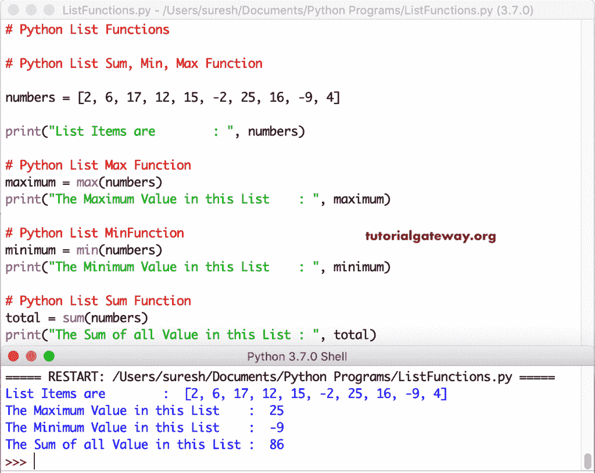

# Python 列表函数

> 原文：<https://www.tutorialgateway.org/python-list-functions/>

Python List 是保存不同类型项目的强大工具。在 python 中，我们有不同种类的列表函数，可以添加、移除、排序、反转项目。

在本节中，我们将向您解释可用的 Python 列表函数，并给出每个函数的示例。我们还包括一些常见的 Python 列表方法，如 sum、min 和`max()`函数。

## Python 列表方法

Python 列表数据类型有单独的函数或方法来添加、移除、查找、操作和反转元素。请使用这些链接通过示例了解 Python 列表函数。

以下是可用的 Python 列表函数。

| 功能 | Python 列表方法描述 |
| [追加()](https://www.tutorialgateway.org/python-append-list-function/) | 它将项目 x 追加或添加到列表的末尾。 |
| [插入()](https://www.tutorialgateway.org/python-insert-list-function/) | 在索引位置 I 插入指定的项 x |
| [extend()](https://www.tutorialgateway.org/python-extend-list-function/) | 它将新的添加到现有的末尾。 |
| 的 | 这个 Python 列表方法移除指定索引处的值。 |
| [pop()](https://www.tutorialgateway.org/python-pop-list-function/) | 移除指定索引处的项目并显示移除的项目。移除后，剩余的项目向前移动以填充索引间隙。 |
| [移除()](https://www.tutorialgateway.org/python-list-remove-function/) | 它移除用户指定的项。如果我们知道这个项目，它是非常有用的。 |
| [副本()](https://www.tutorialgateway.org/python-copy-list-function/) | 这个 Python `List()`函数将项目浅拷贝到一个新的列表中。 |
| [晴()](https://www.tutorialgateway.org/python-clear-list-function/) | 它清除现有的元素。 |
| [计数()](https://www.tutorialgateway.org/python-count-list-items/) | 计算值在其中重复的次数。 |
| [反转()](https://www.tutorialgateway.org/python-reverse-list-function/) | 这种方法颠倒了项目 |
| [排序()](https://www.tutorialgateway.org/python-sort-list-function/) | 按升序排列项目 |
| [指数()](https://www.tutorialgateway.org/python-index-list-function/) | index 方法打印指定值的索引位置。 |

### Python 列表方法示例

以下是可用的 Python 列表函数示例

### 追加方法

Python append 帮助我们在最后添加项目。本示例将数字 520、650 和-70 相加。

提示:请参考 [python](https://www.tutorialgateway.org/python-tutorial/) 中的[列表](https://www.tutorialgateway.org/python-list/)文章。

```
number = [150, 200, 130, 340]

print("Original Items are      : ", number)

number.append(520)
print("After 520 appended are  : ", number)

number.append(650)
print("After 650 appended are  : ", number)

number.append(-70)
print("After -70 appended are  : ", number)
```

```
Original Items are      :  [150, 200, 130, 340]
After 520 appended are  :  [150, 200, 130, 340, 520]
After 650 appended are  :  [150, 200, 130, 340, 520, 650]
After -70 appended are  :  [150, 200, 130, 340, 520, 650, -70]
```

### 扩展

扩展函数在列表末尾添加新列表中的项目。在这个例子中，我们声明了数字 a、b 和 c。接下来，我们使用这个函数向数字中添加 a、b 和 c 项。

```
number1 = [10, 200, 630, 90]

print("Original Items are      : ", number1)

a = [222, 333]
number1.extend(a)
print("After extending to a  : ", number1)

b = [5, 9]
number1.extend(b)
print("After extending to b  : ", number1)

c = [-12, 73]
number1.extend(c)
print("After extending to c  : ", number1)
```

```
Original Items are    :  [10, 200, 630, 90]
After extending to a  :  [10, 200, 630, 90, 222, 333]
After extending to b  :  [10, 200, 630, 90, 222, 333, 5, 9]
After extending to c  :  [10, 200, 630, 90, 222, 333, 5, 9, -12, 73]
```

### 插入

Python `insert()`函数在指定的索引位置插入给定的项。第一条语句在索引位置 2 插入 100，第二条语句在位置 4 插入 500。

```
number2 = [5, 10, 15, 22, 19, 90]

print("Original Items are           : ", number2)

number2.insert(2, 100)
print("After Inserting 100 at 2  : ", number2)

number2.insert(4, 500)
print("After Inserting 500 at 4  : ", number2)

number2.insert(8, 700)
print("After Inserting 700 at 8  : ", number2)
```

```
Original Items are        :  [5, 10, 15, 22, 19, 90]
After Inserting 100 at 2  :  [5, 10, 100, 15, 22, 19, 90]
After Inserting 500 at 4  :  [5, 10, 100, 15, 500, 22, 19, 90]
After Inserting 700 at 8  :  [5, 10, 100, 15, 500, 22, 19, 90, 700]
```

### 是吗

Python `del()`函数删除指定索引处的值。本示例删除位于索引位置 5、0 和 3 的项。

```
number3 = [9, 17, 10, 18, 55, 120, 90]

print("Original Items are                      : ", number3)

del number3[5]
print("After Deleting Item at Index 5 : ", number3)

del number3[0]
print("After Deleting Item at Index 0 : ", number3)

del number3[3]
print("After Deleting Item at Index 3 : ", number3)
```

```
Original Items are                   :  [9, 17, 10, 18, 55, 120, 90]
After Deleting Item at Index 5 :  [9, 17, 10, 18, 55, 90]
After Deleting Item at Index 0 :  [17, 10, 18, 55, 90]
After Deleting Item at Index 3 :  [17, 10, 18, 90]
```

### 弹出功能

Python `pop()`函数移除用户给定索引处的项目，并显示移除的元素。移除后，剩余的值会进行调整以填充索引间隙。下面的程序删除并显示索引位置 6、0 和 4 的项目。

```
number4 = [17, 6, 10, 18, 120, 220, 90, 119]

print("Original Items are                   : ", number4)

a = number4.pop(6)
print("After Deleting Item at Index 6 : ", number4)
print("Items Extracted by the Pop Function       : ", a)

b = number4.pop(0)
print("\nAfter Deleting Item at Index 0 : ", number4)
print("Items Extracted by the Pop Function       : ", b)

c = number4.pop(4)
print("\nAfter Deleting Item at Index 4 : ", number4)
print("Items Extracted by the Pop Function       : ", c)
```

```
Original Items are                   :  [17, 6, 10, 18, 120, 220, 90, 119]
After Deleting Item at Index 6 :  [17, 6, 10, 18, 120, 220, 119]
Items Extracted by the Pop Function       :  90

After Deleting Item at Index 0 :  [6, 10, 18, 120, 220, 119]
Items Extracted by the Pop Function       :  17

After Deleting Item at Index 4 :  [6, 10, 18, 120, 119]
Items Extracted by the Pop Function       :  220
```

### 列表删除方法

如果我们知道项目，我们可以使用移除功能来移除编号。下面的程序删除了数字项 22、19 和 5。

```
number5 = [55, 98, 10, 18, 22, 162, 170, 90]

print("Original Items are           : ", number5)

number5.remove(22)
print("After Removing 22 are  : ", number5)

number5.remove(98)
print("After Removing 98 are  : ", number5)

number5.remove(162)
print("After Removing 162 are : ", number5)
```

```
Original Items are     :  [55, 98, 10, 18, 22, 162, 170, 90]
After Removing 22 are  :  [55, 98, 10, 18, 162, 170, 90]
After Removing 98 are  :  [55, 10, 18, 162, 170, 90]
After Removing 162 are :  [55, 10, 18, 170, 90]
```

### 复制

函数的作用是:将项目复制到一个全新的项目中。

```
numbers6 = [6, 10, 18, 220, 90, 119]

print("Items are        : ", numbers6)

new_list = numbers6.copy()
print("\nNew Items  are   : ", new_list)
```

```
Items are        :  [6, 10, 18, 220, 90, 119]

New Items  are   :  [6, 10, 18, 220, 90, 119]
```

### Python 列表清除方法

清除功能可帮助您清除所有现有项目。执行此函数后，如果您调用或打印同一个函数，它将返回一个空的。

```
numbers7 = [6, 10, 18, 220, 90, 119]

print("Items are        : ", numbers7)

new = numbers7.clear()
print("\nNew Items  are   : ", new)
```

```
Items are        :  [6, 10, 18, 220, 90, 119]

New Items  are   :  None
```

### 数数

列表计数函数计算指定值重复的次数。这里，我们正在计算 22、6 和 19 重复了多少次。

```
numbers8 = [22, 6, 15, 19, 22, 90, 19, 22, 6, 19, 22]

print(numbers8)

a = numbers8.count(22)
print("Number of Times 22 was repeated   : ", a)

b = numbers8.count(6)
print("Number of Times 6 was repeated    : ", b)

c = numbers8.count(19)
print("Number of Times 19 was repeated   : ", c)
```

```
[22, 6, 15, 19, 22, 90, 19, 22, 6, 19, 22]
Number of Times 22 was repeated   :  4
Number of Times 6 was repeated    :  2
Number of Times 19 was repeated   :  3
```

### 指数

Python List 索引方法返回用户给定值的索引位置。在这里，我们找到了数字项 12，-9 和-19 的索引位置。

```
numbers = [22, 6, 12, 15, 19, 16, -9, 4]

print("Items are         : ", numbers)

a = numbers.index(12)
print("Index Position of 12   : ", a)

b = numbers.index(-9)
print("Index Position of -9   : ", b)

c = numbers.index(19)
print("Index Position of 19   : ", c)
```

```
Items are        :  [22, 6, 12, 15, 19, 16, -9, 4]
Index Position of 12  :  2
Index Position of -9  :  6
Index Position of 19  :  4
```

### 反面的

列表反转方法有助于反转项目。这个代码颠倒了数字。

```
numbers = [22, 6, 12, 15, 19, 16, -9, 4]

print("Items are             : ", numbers)

numbers.reverse()
print("\nNew Items are : ", numbers)
```

```
Items are       :  [22, 6, 12, 15, 19, 16, -9, 4]

New Items are   :  [4, -9, 16, 19, 15, 12, 6, 22]
```

### 分类

Python 排序方法以升序对列表项进行排序。

```
numb = [2, 6, 0, 12, 15, -2, 19, 16, -9, 4]
print(numb)

numb.sort()
print("\nSorted   : ", numb)
```

```
[2, 6, 0, 12, 15, -2, 19, 16, -9, 4]

Sorted :  [-9, -2, 0, 2, 4, 6, 12, 15, 16, 19]
```

这个例子展示了 Python 列表方法 sum、min 和 max。Python sum 返回给定项目中所有可用项目的总和。接下来，Python 最小值返回给定项目中的最小值，最大值返回最大值。

```
numbers = [2, 6, 17, 12, 15, -2, 25, 16, -9, 4]

print("List Items are        : ", numbers)

# Max 
maximum = max(numbers)
print("The Maximum Value in this List    : ", maximum)

# Min
minimum = min(numbers)
print("The Minimum Value in this List    : ", minimum)

# Sum
total = sum(numbers)
print("The Sum of all Value in this List : ", total)
```

