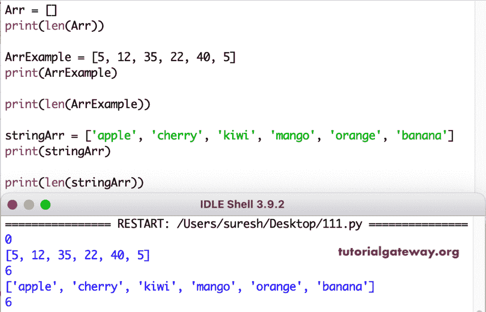

# Python 透镜函数

> 原文：<https://www.tutorialgateway.org/python-len-function/>

Python len 函数可以找到对象的长度。或者，比方说，它返回一个对象中的项数。如果您正在查找字符串长度，那么这个 Python len 函数将返回字符总数。

在本节中，我们将讨论如何在字符串、元组、列表、字典、集合、字节和范围上使用这个 Python len 函数。这个透镜函数语法是

```
len(Object_Name)
```

## 字符串的 Python 长度

当您在[字符串](https://www.tutorialgateway.org/python-string/)对象上使用这个 Python len 函数时，它会计算并返回字符串中的字符总数(包括空格)。或者，比如说，在[蟒蛇](https://www.tutorialgateway.org/python-tutorial/)中找到一根绳子的长度。在这个例子中，我们找到了空字符串和教程网关的大小。

```
a = ''
print(a)
print(len(a))

b = 'Tutorial Gateway'
print(len(b))
```

```
 0

6
```

### 元组的 Python 长度

本示例使用 Python len 函数查找元组的长度。这意味着计算这个元组中的项目总数。首先，我们声明了一个整数和字符串[元组](https://www.tutorialgateway.org/python-tuple/)。接下来，它返回整数和字符串元组中的项数。

```
tupleExample = (10, 20, 30, 40, 50, 60, 70, 80, 90)
print(len(tupleExample))

tupleExample2 = ('Banana', 'Orange', 'Blackberry', 'Apple')
print(len(tupleExample2))
```

```
9

4
```

### 列表示例的 Python 长度

该功能还可以帮助你找到[列表中](https://www.tutorialgateway.org/python-list/)项的总数。首先，我们声明了一个空列表，并找到它的长度。接下来，我们用它来查找数字项。最后，计算字符串列表中的元素数量。

```
listLe = ()
print(len(listLe))

listLeExample = [15, 20, 35, 40, 55, 60, 70]
print(len(listLeExample))

stringListLe = ['apple', 'mango', 'orange', 'cherry','banana']
print(len(stringListLe))
```

```
0

7

5
```

### Python 词典镜头

我们可以在字典、集合或冻结集合等集合上使用这个函数。[字典](https://www.tutorialgateway.org/python-dictionary/)上的 Python len 函数返回 Python 字典长度。或者，计算给定词典中可用项目的总数。

```
DictionaryLe = dict()
print(len(DictionaryLe))
print()

DictionaryLeExample = {1: 'mango', 2: 'kiwi', 3: 'cherry'}
print(len(DictionaryLeExample))
print()

mixedDictionaryLe = {'ID': 42, 'name': 'Kevin', 'age': 25, 1: 1200}
print(len(mixedDictionaryLe))
```

```
0

3

4
```

### 集合示例的 Python 长度

它还查找集合中的项目总数。接下来，我们声明了一个数值集和字符串集。使用这个函数，我们返回数值集和字符串集的元素。

```
SetExample = {125, 200, 350, 400, 505, 607, 760}
print(len(SetExample))

print()
stringSet = {'apple', 'mango', 'cherry', 'kiwi', 'orange', 'banana'}
print(len(stringSet))
```

```
7

6
```

### 数组的 Python 长度

在这个例子中，我们找到了数组的大小。首先，我们计算一个空数组的长度。接下来，找到总项目。在整数数组和字符串[数组](https://www.tutorialgateway.org/python-array/)中。

```
Arr = []
print(len(Arr))

ArrExample = [5, 12, 35, 22, 40, 5]
print("\n", ArrExample)

print(len(ArrExample))

stringArr = ['apple', 'cherry', 'kiwi', 'mango', 'orange', 'banana']
print("\n", stringArr)

print(len(stringArr))
```



### 范围长度

镜头功能不仅仅是返回物体大小，还可以找到[范围](https://www.tutorialgateway.org/python-range-function/)长度。在本例中，我们声明了一个从 4 到 10 的范围，并返回该范围内的所有元素。为了更好地理解，我们使用了另一个大范围的例子。

```
rangeLe = range(4, 10)
print(len(rangeLe))

rangeLe = range(15, 109)
print(len(rangeLe))
```

```
6
94
```

### Python Only Byte

这个函数也允许你找到字节长度，这个例子返回同样的长度。

```
by = b'Python Tutorial'  
print("Bytes = ", len(by)) 
```

```
Bytes =  15
```