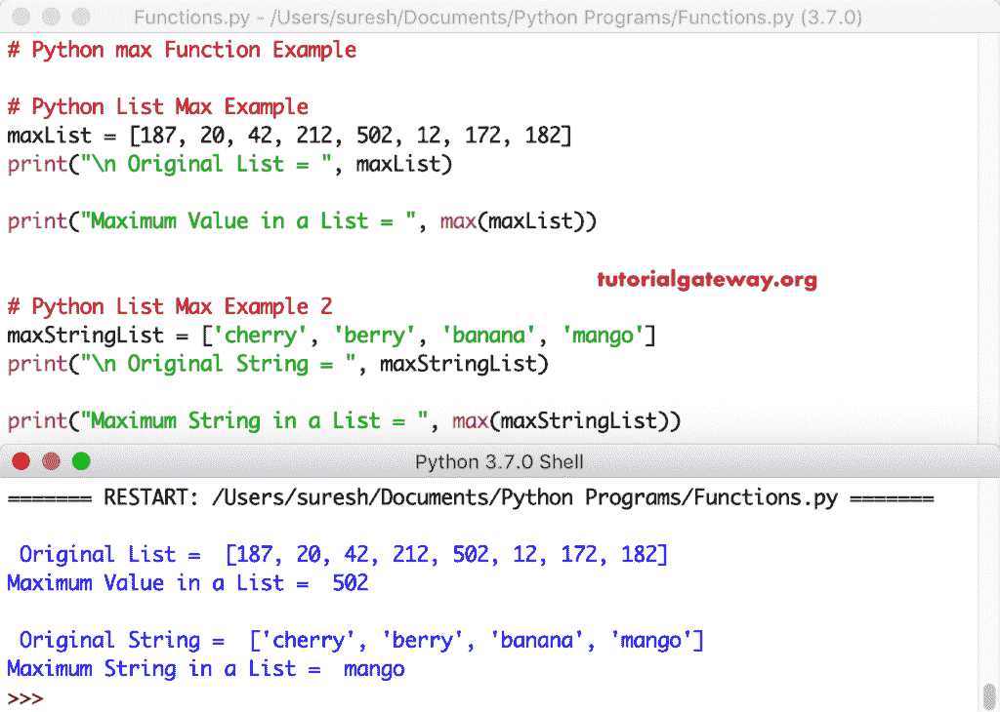

# Python 最大函数

> 原文：<https://www.tutorialgateway.org/python-max-function/>

Python`max()`函数用于查找给定对象的最大项目。或者，比方说，Python`max()`函数返回给定对象中最高、最大或最大的项目。

在本节中，我们将通过实例讨论如何在元组、列表、字典和集合上使用这个 Python`max()`函数。这个函数的语法是:

```
# Simple Syntax
max(Iterable)

# Optional key argument
max(Iterable, key) 

# Directly on arguments
max(num1, num2, num3...., numN)
max(num1, num2,......,numN, key)
```

通常，Python 最大功能键值会分配给默认值。但是，它接受函数。例如，key = function_name。请记住，您可以使用像 len、max 这样的内置函数，也可以使用自己自定义的函数。

## Python 最大示例

在这个例子中，我们直接在打印语句中使用了 Python`max()`函数。下面的代码片段在给定的参数中找到最大数值。

```
print(max(19, 49, 229, 435, 212, 182))
print(max(212, 58, 12, 142, 192, 502, 12, 172, 182))
print(max(10, 20, 30, 40, 70))
print(max(421, 2, 102,  122))
```

```
435
502
70
421
```

## Python 最大元组示例

本示例使用`max()`函数在[元组](https://www.tutorialgateway.org/python-tuple/)中找到最大项目。这意味着找到这个 [Python](https://www.tutorialgateway.org/python-tutorial/) 元组中最大的值。首先，我们声明了一个整数元组，并找到了整数元组中的最高值。接下来，我们将找到字符串元组中最大的值。

注意:在字符串元组中找到最大的意味着它返回以最高字母开头的单词。

```
# Tuple Example 
maxTuple = (12, 22, 32, 42, 52, 62, 72,82)
print(max(maxTuple))

maxStringTuple = ('berry', 'orange', 'banana', 'mango')
print(max(maxStringTuple))
```

```
82

orange
```

## Python 最大列表示例

这个最大值功能还可以帮助你找到给定[列表](https://www.tutorialgateway.org/python-list/)中可用的最大列表项。这里，我们声明了一个数字列表，并使用它找到了该列表中的最大值。接下来，我们将对字符串列表中最大的项目进行细化。

```
# List Example 
maxList = [187, 20, 42, 212, 502, 12, 172, 182]
print("\n Original List = ", maxList)

print("Maximum Value in a List = ", max(maxList))

maxStringList = ['cherry', 'berry', 'banana', 'mango']
print("\n Original String = ", maxStringList)

print("Maximum String in a List = ", max(maxStringList))
```



## Python 最大字典

[字典](https://www.tutorialgateway.org/python-dictionary/)上的 Python`max()`函数可以帮助你在 Python 字典中找到最大值。使用字典时，

1.  如果同时使用[键](https://www.tutorialgateway.org/python-dictionary-keys-function/)功能，它会在字典中找到最大键。
2.  与字典一起使用[值](https://www.tutorialgateway.org/python-dictionary-values/)，在字典中找到最大的<font color="#000000">值</font>。

```
# Dictionary Example 
maxDictionary = {7: 100, 2: 40, 9: 10, 5: 60, 1: 420, 3: 120}      
print("Largest Key = ", max(maxDictionary.keys()))
print("Largest Value = ", max(maxDictionary.values()))

maxStringDictionary = {1: 'grape', 2: 'banana', 3: 'cherry'}
print("Largest Key = ", max(maxStringDictionary.keys()))
print("Largest Value = ", max(maxStringDictionary.values()))
```

```
Largest Key =  9
Largest Value =  420

Largest Key =  3
Largest Value =  grape
```

## Python 最大集示例

该方法还从给定的设置项目中返回最大[设置](https://www.tutorialgateway.org/python-set/)项目。我们声明了一个整数集，并在其中找到了最大集值。接下来，我们找到字符串集合中最大的项目(从最高的字母开始)。

```
# Set Example 
maxSet = {19, 49, 229, 435, 212, 502, 172, 182}     
print(max(maxSet))

maxStringSet = {'cherry', 'berry', 'kiwi', 'banana', 'grape'}  
print(max(maxStringSet))
```

```
502

kiwi
```

在这个例子中，我们展示了如何使用这个方法的键参数。为了演示相同的内容，我们创建了一个名为列表总和的方法。它返回一个数字中各个数字的总和。请参考[位数之和](https://www.tutorialgateway.org/python-program-to-find-sum-of-digits-of-a-number/)篇了解逻辑。

接下来，我们使用这个 Python`max()`函数作为密钥。这意味着这将返回列表项，其位数总和最大。

```
def sum_of_list(Number):
    Sum = 0
    if(Number > 0):
        Reminder = Number % 10
        Sum = Sum + Reminder
        sum_of_list(Number //10)
    return Sum

maxList = [187, 20, 42, 212, 502, 12, 172, 182]
print("Maximum Value in a List = ", max(maxList, key = sum_of_list))

maxSet = {19, 49, 229, 435, 212, 502, 172, 182}
print("\nMaximum Value in a Set = ", max(maxSet, key = sum_of_list))
```

```
Maximum Value in a List =  187

Maximum Value in a Set =  229
```

您也可以在此方法中使用内置函数作为键值。在这个例子中，我们使用[镜头法](https://www.tutorialgateway.org/python-len-function/)作为关键。

这里，它返回一个长度最大(项目数最多)的列表。接下来，我们声明了三个不同的数值列表。使用这个，我们返回一个最大长度的集合。

```
maxList1 = [187, 20, 42, 212]
maxList2 = [212, 58, 12, 142, 192, 502, 12, 172, 182]
maxList3 = [421, 2, 102,  122]

print("List = ", max(maxList1, maxList2, maxList3, key = len))

# Set Example 2
maxSet1 = {19, 49, 229, 435, 212, 502, 182, 1200}
maxSet2 = {9, 249, 977}
maxSet3 = {10, 20, 30, 40, 70}

print("Set = ", max(maxSet1, maxSet2, maxSet3, key = len))

print(max(maxList1, maxSet1, key = len))
print(max(maxList1, maxSet2, key = len))
print(max(maxList1, maxSet3, key = len))
print(max(maxList2, maxSet1, key = len))
```

```
List =  [212, 58, 12, 142, 192, 502, 12, 172, 182]
Set =  {229, 1200, 49, 435, 19, 212, 502, 182}

{229, 1200, 49, 435, 19, 212, 502, 182}
[187, 20, 42, 212]
{20, 70, 40, 10, 30}
[212, 58, 12, 142, 192, 502, 12, 172, 182]
```