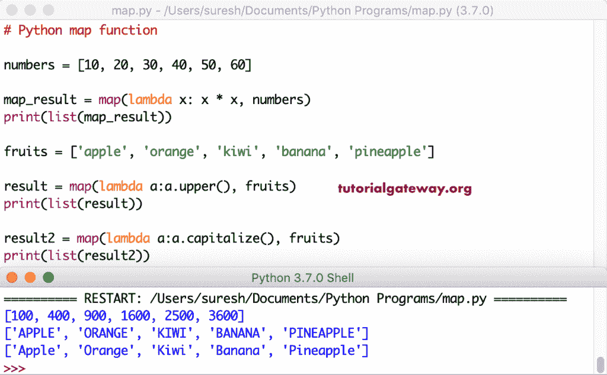

# Python 映射函数

> 原文：<https://www.tutorialgateway.org/python-map-function/>

Python 映射函数将用户给定的函数应用于列表、元组等条目中的每一项。接下来，这个函数返回一个结果值列表。在本节中，我们将通过示例讨论如何在 Python 编程中使用这个映射函数。Python 映射函数的基本语法是

```
map(function_name, iterables,...)
```

## Python 映射值示例

在这个 Python 映射函数示例中，我们声明了一个名为加法的函数。它向自身添加一个数字并返回该值。接下来，我们声明了一个从 10 到 50 的数字列表。接下来，我们用它来给数字中的每一项赋值。

默认情况下，该`Python()`函数返回地图对象作为输出值。所以，我们必须把这个对象转换成任何可迭代的。最后一个 print 语句将其转换为 list 并打印值。

```
def addition(num):
    return num + num

numbers = [10, 20, 30, 40, 50]

result = map(addition, numbers)
print(list(result))
```

```
[20, 40, 60, 80, 100]
```

提示:请参考 [Python 列表](https://www.tutorialgateway.org/python-list/)文章了解列表。

### Python 映射字符串示例

我们同时使用数值和字符列表。在这里，(加法，字符)意味着，对于字符中的每个字符，它调用加法。字符或字符串上的+符号连接它们。

```
def addition(num):
    return num + num

chars = ['a', 'b', 'c', 'd', 'e']
numbers = [10, 20, 30, 40, 50]

res = map(addition, chars)
print('Chars List = ', list(res))

result = map(addition, numbers)
print('Numbers List = ', list(result))
```

```
Chars List =  ['aa', 'bb', 'cc', 'dd', 'ee']
Numbers List =  [20, 40, 60, 80, 100]
```

到目前为止，我们在一个可重复的(单个)上使用这个。在这个例子中，我们创建了一个 Python 映射函数，它接受两个参数并返回这些值的总和。接下来，我们声明了两个数字 1。

这里，(加法，numbers1，numbers2)表示它从两个列表中获取第一个值并应用加法，以此类推。例如，(加法，10，150)变成 160。接下来，我们在水果(字符串)上使用相同的场景。它执行串联。

```
def addition(a, b):
    return a + b

numbers1 = [10, 20, 30, 40, 50]
numbers2 = [150, 250, 350, 450, 550]

res = map(addition, numbers1, numbers2)
print(list(res))

fruits1 = ['apple', 'orange', 'kiwi']
fruits2 = ['banana', 'cherry', 'berry']

result = map(addition, fruits1, fruits2)
print(list(result))
```

```
[160, 270, 380, 490, 600]
['applebanana', 'orangecherry', 'kiwiberry']
```

### Python 映射内置函数示例

这里，我们使用内置函数作为参数。对于这个 [Python](https://www.tutorialgateway.org/python-tutorial/) 演示，我们使用了[阶乘方法](https://www.tutorialgateway.org/python-factorial/)和[透镜方法](https://www.tutorialgateway.org/python-len-function/)。

在这里，阶乘函数找到每个数字元素的阶乘。接下来，镜头找到水果中每个物品或水果的长度。

```
import math

def factorial_func(num):
    return math.factorial(num)

def len_func(x):
    return len(x)

numbers = [1, 2, 3, 4, 5, 6, 7]

result = map(factorial_func, numbers)
print(list(result))

fruits = ['apple', 'orange', 'kiwi', 'banana', 'pineapple']

result1 = map(len_func, fruits)
print(list(result1))
```

```
[1, 2, 6, 24, 120, 720, 5040]
[5, 6, 4, 6, 9]
```

## Python 映射λ示例

您可以使用该函数中的[λ](https://www.tutorialgateway.org/python-lambda/)表达式，使代码易于阅读。

(lambda x: x * x，numbers)返回每个数字项的平方。(λa:a . upper()，水果)使用 [upper](https://www.tutorialgateway.org/python-upper/) 并将每个水果转换为大写。接下来，(λa:a .大写()，水果)使用[大写](https://www.tutorialgateway.org/python-capitalize/)来大写每个水果中的第一个字符。

```
numbers = [10, 20, 30, 40, 50, 60]

map_result = map(lambda x: x * x, numbers)
print(list(map_result))

fruits = ['apple', 'orange', 'kiwi', 'banana', 'pineapple']

result = map(lambda a:a.upper(), fruits)
print(list(result))

result2 = map(lambda a:a.capitalize(), fruits)
print(list(result2))
```



### Python 映射λ多参数示例

让我在 Python 映射函数中使用多个 iterables 和 lambda。本示例接受两个列表，并将其中的每一项与另一项相加。

```
numbers1 = [10, 20, 30, 40, 50]
numbers2 = [150, 250, 350, 450, 550]

res = map(lambda x, y: x + y, numbers1, numbers2)
print(list(res))

fruits1 = ['apple', 'orange', 'kiwi']
fruits2 = ['banana', 'cherry', 'berry']

result = map(lambda a, b: a + b, fruits1, fruits2)
print(list(result))
```

```
[160, 270, 380, 490, 600]
['applebanana', 'orangecherry', 'kiwiberry']
```

### Python 映射 lambda 多个函数示例

到目前为止，我们展示了如何使用一个带有值列表的 Python 映射函数。但是，您也可以对每个项目应用多个函数。这里，我们声明或定义了三个函数。接下来，我们创建了这三个名字的列表。

首先，我们使用[进行循环](https://www.tutorialgateway.org/python-for-loop/)，用范围来迭代从 1 到 9 的值。接下来，我们将其与 lambda 一起用于将每个`for`循环项分配给列表。意思是对于 1，它会调用 square_func，tripple _ func 和 four_func，类似于对于 2，以此类推。

```
def square_func(num):
    return num**2

def tripple_func(num):
    return num * num * num

def four_func(num):
    return num**4

function_list = [square_func, tripple_func, four_func]

for i in range(1, 10):
    number = map(lambda x: x(i), function_list)
    print("For ", i, " = " , list(number))
```

```
For  1  =  [1, 1, 1]
For  2  =  [4, 8, 16]
For  3  =  [9, 27, 81]
For  4  =  [16, 64, 256]
For  5  =  [25, 125, 625]
For  6  =  [36, 216, 1296]
For  7  =  [49, 343, 2401]
For  8  =  [64, 512, 4096]
For  9  =  [81, 729, 6561]
```

## 转换为列表、集合和元组

到目前为止，我们以列表的形式显示结果。但是，您可以将此对象输出转换为任何可迭代的，如[元组](https://www.tutorialgateway.org/python-tuple/)或[集](https://www.tutorialgateway.org/python-set/)。

*   对于列表，使用列表(结果)。
*   对于元组，使用元组(结果)。
*   布景也一样。使用集合(结果)。

首先，我们创建了一个 square_func 来查找给定数字的平方，然后声明一个数字。接下来，我们将 Python 映射函数结果转换为列表、元组和集合。

```
def square_func(num):
    return num**2

numbers = [10, 20, 30, 40, 50]

list_result = map(square_func, numbers)
my_list = list(list_result)
print(my_list)

tuple_result = map(square_func, numbers)
my_tuple = tuple(tuple_result)
print(my_tuple)

set_result = map(square_func, numbers)
my_set = set(set_result)
print(my_set)
```

```
[100, 400, 900, 1600, 2500]
(100, 400, 900, 1600, 2500)
{1600, 900, 2500, 100, 400 
```

您可以使用它将结果转换为嵌套列表或嵌套元组。在这里，我们和水果一起叫名单。

```
fruits = ['apple', 'berry', 'kiwi']

result = map(list, fruits)
print(list(result))

result2 = map(tuple, fruits)
print(tuple(result2))
```

```
[['a', 'p', 'p', 'l', 'e'], ['b', 'e', 'r', 'r', 'y'], ['k', 'i', 'w', 'i']]
(('a', 'p', 'p', 'l', 'e'), ('b', 'e', 'r', 'r', 'y'), ('k', 'i', 'w', 'i'))
```