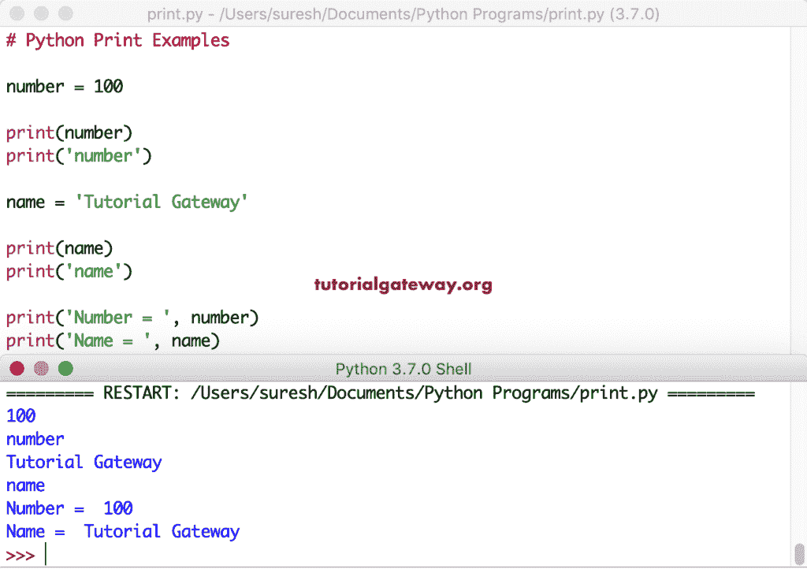
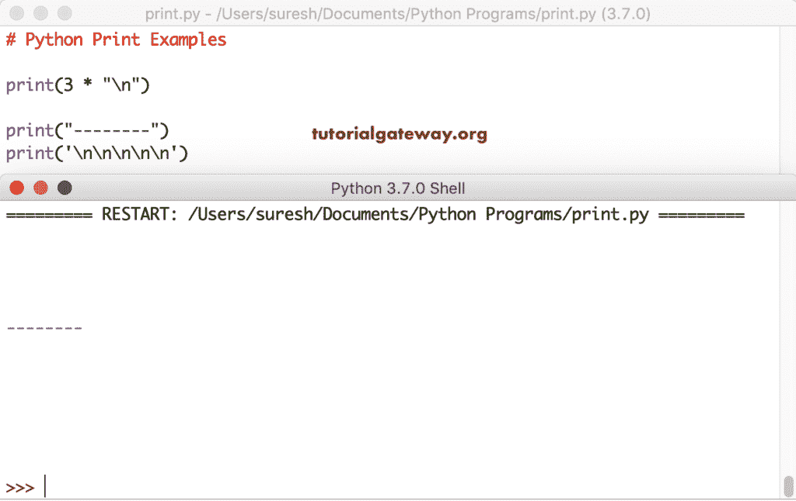
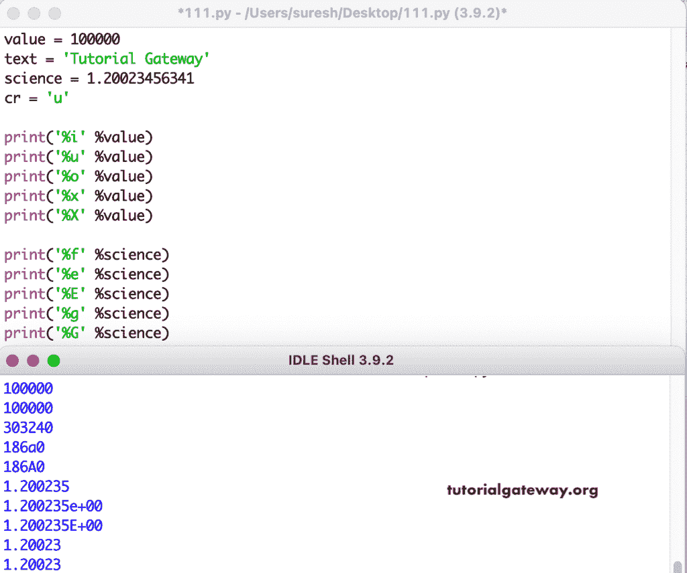
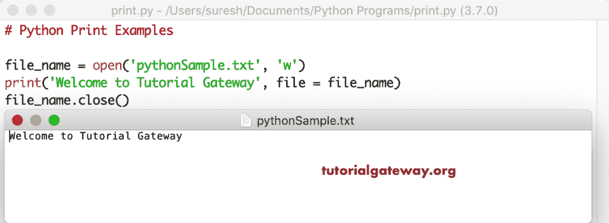

# Python 打印功能

> 原文：<https://www.tutorialgateway.org/python-print-function/>

python print 函数是用于将给定值显示为输出的内置函数之一。如果你想在屏幕或输出设备上写些东西，那么你必须使用这个 Python 打印功能。

在本节中，我们将通过多个示例向您解释如何使用这个 Python 打印函数。这个 Python 打印函数背后的基本语法是

```
print(value,……., sep = ‘ ’, ends = ‘\n’, file = sys.stdout, flush = False)
```

让我看看 Python 打印函数参数背后的详细信息:

*   值:这个 Python 打印函数使用文件参数显示这个值来输出或写入文件。
*   sep:这是一个可选的参数。如果您指定了任何字符串，则该字符串值会插入到值之间。默认情况下，该值为空格。
*   end:是 Python 打印函数的可选参数。如果您已经给出了任何字符串，那么该字符串将被追加到最后一个值之后。默认值是换行符(\n)。
*   文件:这是一个可选参数。您可以使用它在文本文件或类似文件中显示输出。默认情况下，它使用 sys.stdout(标准输出)
*   冲洗:如果你想强行冲洗水流，将其改为真。

## Python 打印示例

在这个例子中，我们使用 Python 打印函数来显示 Hello world 作为输出。

```
print("Hello World")
```

```
Hello World
```

在 Python 打印函数中，您可以使用双引号或单引号或两者的组合来重新调整字符串作为输出。

这里，我们显示由逗号分隔的两个单独的字符串。如前所述，它使用空格作为默认分隔符。

```
print("Learn",  'Free Programming')

print("Learn",  'Free', 'Programming')
```

```
Learn Free Programming
Learn Free Programming
```

使用下面的 Python 打印函数语句返回一个空行，因为默认情况下，它使用换行符作为参数值。

```
print()
```

```
 >>> 
```

我想你可能没有注意到这些空白。所以，让我在这些语句之间使用字符串。这个 Python 打印函数示例标记了两个空行，Hello world，一个空行，Learn [Python](https://www.tutorialgateway.org/python-tutorial/) 编程，一个新行，Hi。

```
print("Hello World")

print()

print('Learn',  'Programming')

print(' ')

print('Hi')
```

```
Hello World

Learn Programming

Hi
```

### 打印变量

当你调用一个变量或显示变量值时，你必须在没有任何引号的情况下调用它的名字。在这里，我们声明了一个数字并分配了 100。接下来，我们在没有引用和引用的情况下调用了这个数字。

第一个 Python 打印函数语句是调用变量值。第二个是在单词号上盖章。因此，在调用变量值或列表值等时请小心。

```
number = 100

print(number)
print('number')

name = 'Tutorial Gateway'

print(name)
print('name')

print('Number = ', number)
print('Name = ', name)
```



### Python 打印列表、元组、集合和字典

使用此 Python 打印功能显示[列表](https://www.tutorialgateway.org/python-list/)、[元组](https://www.tutorialgateway.org/python-tuple/)、[集合](https://www.tutorialgateway.org/python-set/)和[字典](https://www.tutorialgateway.org/python-dictionary/)中的项目。从下面可以看到，我们创建了一个列表、两个元组、集合和一个字典。接下来，我们用它来展示它们。

如果您想单独访问每个项目或对每个项目执行操作，请使用 [For Loop](https://www.tutorialgateway.org/python-for-loop/) 和[范围功能](https://www.tutorialgateway.org/python-range-function/)。

```
numbers_list = [10, 20, 30, 40, 50]
print(numbers_list)

fruits_tuple = ('apple', 'cherry', 'kiwi', 'mango')
print(fruits_tuple)

mixed_Set = {'banana', 1, 2, (1, 2, 3)}
print(mixed_Set)

myDict = {'name': 'Kevin', 'age': 25, 'job': 'Developer'}
print(myDict)
```

打印列表、元组和集合项的 Python 输出

```
[10, 20, 30, 40, 50]
('apple', 'cherry', 'kiwi', 'mango')
{1, 2, (1, 2, 3), 'banana'}
{'name': 'Kevin', 'age': 25, 'job': 'Developer'}
```

### Python 打印 sep 示例

默认情况下，此函数使用空白作为分隔符。但是，您可以用自己的任何字符串来覆盖它。这个 Python print sep 示例中的第三条语句使用*作为 Hello 和 World 两个字符串之间的分隔符。下一条语句使用-作为分隔符。

```
print("A",  "B", "C", sep = "")

print("Hello",  "World", sep = "*")

print('Learn',  'Free Programming', sep = "---")

print("Hello",  "World", sep = " AAA ")
print("Hello",  "World", sep = ',,,...,,,')
```

```
ABC
Hello*World
Learn---Free Programming
Hello AAA World
Hello,,,...,,,World
```

### Python 打印结束示例

没有新线怎么用这个功能？。默认情况下，range 函数使用新行作为结束参数值。但是，您可以覆盖它。这个 python print end 示例中的前两个语句显示了两行不同的字符串。

在第三个语句中，我们使用了以空格为值的 end 参数，第四个语句使用了。作为参数值。意思是，在“欢迎光临”上盖章后，加上空格。接下来，第五条语句在该空格后显示教程网关，该语句以。

```
print('Welcome to')
print('Tutorial Gateway')

print('Welcome to', end = ' ')
print('Tutorial Gateway', end = '.')
```

```
Welcome to
Tutorial Gateway
Welcome to Tutorial Gateway.
```

### Python 打印结束和 sep 参数

在这个 Python 打印函数参数示例中，我们同时使用了 sep 参数和 end 参数。从下面开始，(10，20，30，sep = ' @ '，end = ' *** ')返回由@符号分隔的 10 20 30，并以****结尾。类似地，(' A '，' B '，' C '，sep = '，'，end = ' #### ')语句返回用逗号分隔的 A B C，并以#####结尾

```
print(10, 20, 30, sep = ' @ ')
print('A', 'B', 'C', sep = ' -- ')

print('-------------')
print(10, 20, 30, sep = ' @ ', end = ' **** ')
print('A', 'B', 'C', sep = '--', end = ' . ')

print()
print('A', 'B', 'C', sep = ' , ', end = '  #####  ')
print(10, 20, 30, sep = ' @ ', end = ' !!! ')
```

```
10 @ 20 @ 30
A -- B -- C
-------------
10 @ 20 @ 30 **** A--B--C . 
A , B , C  #####  10 @ 20 @ 30 !!! 
```

这是函数参数的另一个例子。这里，我们还将它与分隔符参数和结束参数一起使用。

例如，(' Number = '，num，sep = '0000 '，end = '？\ n \ n \ n’)显示数字，用 0000 分隔，以？和三条新线路。

```
num = 1234

print('Number = ', num, sep = '0000', end = '?\n\n\n')

print('Number = ', num, sep = '0000', end = '@\n')
```

```
Number = 00001234?

Number = [[email protected]](/cdn-cgi/l/email-protection)
```

### Python For Loop 打印示例

在[范围功能](https://www.tutorialgateway.org/python-range-function/)的同时，在[循环](https://www.tutorialgateway.org/python-for-loop/)中使用该功能。这样，您就可以显示给定范围内的项目—第一条语句返回 1 到 9 之间的数字。

```
for i in range(1, 10):
    print(i)

print("--------------")
for i in range(1, 10):
    print(i, end = "   ")

print("\n--------------")
for i in range(1, 10):
    print(i, end = " , ")
```

```
1
2
3
4
5
6
7
8
9
--------------
1   2   3   4   5   6   7   8   9   
--------------
1 , 2 , 3 , 4 , 5 , 6 , 7 , 8 , 9 , 
```

## Python 打印字符串格式

我们使用打印功能和转换类型。在第一条语句中，我们在后面跟有变量的元组的字符串之间使用了两个%s。这意味着，python 用那些元组值替换了那两个%s 项。

这里，它使用我们指定的相同顺序。我的意思是，首先，%s 被一个 person 变量替换，第二个%s 被 name 变量值替换。这里，(person +'正在处理'+ name)语句是连接三个项目。

```
name = 'Tutorial Gateway'
person = 'suresh'
year = 2019

print('%s is working at %s' %(person, name))
print('Copyright %s at %d' %(name, year))

print(person, ' is working at ', name)
print(person + ' is working at ' + name)
```

字符串格式输出

```
suresh is working at Tutorial Gateway
Copyright Tutorial Gateway at 2019
suresh  is working at  Tutorial Gateway
suresh is working at Tutorial Gateway
```

### Python 打印格式示例

这是一个 Python 打印格式函数的例子。在这个例子中，我们在这个函数中使用了 format 函数。它允许我们格式化数值。建议大家参考[格式功能](https://www.tutorialgateway.org/python-format/)一文。

```
name = 'Tutorial Gateway'
person = 'suresh'
year = 2019

print('{0} is working at {1}'.format(person, name))
print('Copyright {} at {}'.format(name, year))
```

```
suresh is working at Tutorial Gateway
Copyright Tutorial Gateway at 2019
```

## Python 打印功能中的特殊字符

Python 编程语言允许您通过使用转义字符来使用特殊字符。例如，在 s1 内(‘你好，’“你好吗？\ ' \ ')，我们在语句中使用了\字符来转义双引号。接下来，我们在('我不能这么做')中使用\来转义'(单引号)。

```
s = 'Hi there, "How are You?"'
s1 = 'Hi there, \"How are You?\"'

print(s)
print(s1)

print('I Can\'t Do that')
print('I Don\'t Know you')
```

```
Hi there, "How are You?"
Hi there, "How are You?"
I Can't Do that
I Don't Know you
```

第一条语句返回三个新行。最后一句话印了 5 行。

```
print(3 * "\n")

print("--------")
print('\n\n\n\n\n')
```



这个例子与上面的例子相同——但是，这一次，我们在两个字符串 Hi 和 Hello 之间使用了三个空行。

```
print(3 * "\n")

print('-----------')
print('Hi')
print(3 * "\n")
print('Hello')
```

```
 -----------
Hi

Hello
```

在这个例子中，我们使用了新行、水平标签、垂直标签等。，显示它们如何改变输出。例如，第一行中显示“你好”的第一个语句是“你好吗”？在下一行。

```
s = 'Hi there, \nHow are You?'
s1 = 'Hi there,\tHow are You?'
s2 = 'Hi there,\vHow are You?'
s3 = 'Hi there,\fHow are You?'
s4 = 'Hi there,\rHow are You?'

print(s)
print(s1)
print(s2)
print(s3)
print(s4)
```

带有新行、水平制表符和垂直制表符输出

```
Hi there, 
How are You?
Hi there,	How are You?
Hi there,How are You?
Hi there,How are You?
Hi there,
How are You?
```

## Python 打印函数中的转换类型

Python 打印功能中可用的转换类型列表。

*   % c–返回单个字符。
*   % d–返回十进制整数
*   % I–对于长整数
*   % u–返回一个无符号十进制整数
*   %e，% E–以指数表示法返回浮点值。
*   % f–以定点表示法返回浮点值。
*   % g–返回%f 和%e 的较短值
*   % G–返回%f 和%E 的较短值
*   % c–返回一个字符
*   % o–返回一个八进制值
*   % r–用 repr()生成字符串
*   % s–使用 str()函数将该值转换为字符串。
*   %x，% X–返回十六进制整数。

让我使用 Python 打印函数中所有可用的转换类型。为此，我们声明了几个变量，数值为 100000，字符串文本= 'Tutorial Gateway '，十进制值 science = 1.20023456341，字符 cr = 'u '。



### Python 打印文件示例

这里，我们正在打开一个文件(如果存在的话)。否则，Python 会在默认目录中创建该文本文件。接下来，它显示该文本文件对象中的语句。

```
file_name = open('pythonSample.txt', 'w')

print('Welcome to Tutorial Gateway', file = file_name)

file_name.close()
```

