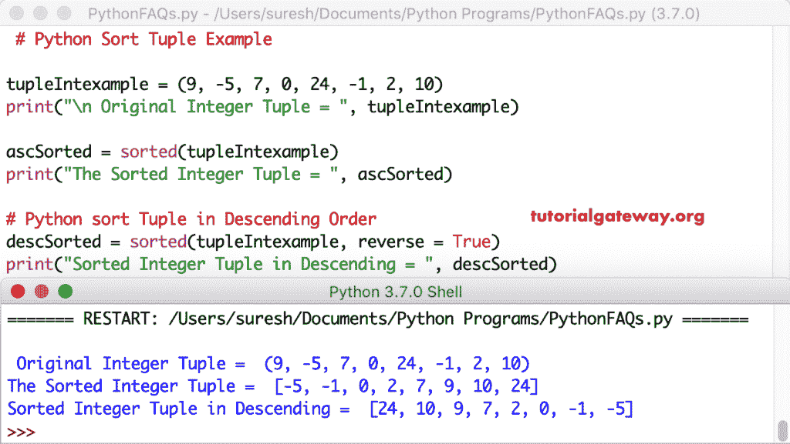

# Python 排序

> 原文:[https://www.tutorialgateway.org/python-sort/](https://www.tutorialgateway.org/python-sort/)

如何使用 Python 排序函数，并用实例说明排序函数。Python 对列表、字典、元组、集合和字符串等对象进行排序是最常见的问题之一。

在 Python 编程中，我们有组织对象的函数，它们被排序和排序。Python 排序函数仅适用于列表项，并对其余对象使用已排序。这种 Python 排序函数的语法如下

```
# List Items in Ascending Order
list_Name.sort()

# List Items using Functions in Reverse Order
list_Name.sort(reverse = True, key = Function_Name) # 1

#  Syntax
# Ascending Order
sorted(Object_Name)

# Reverse Order using Functions
sorted(Object_Name, reverse = True, key = Function_Name) # 2
```

根据上面的语法，如果您观察语句 1 和 2

1.  反向参数和关键参数及其值都是可选的。所以，要么你可以使用其中的任何一个，要么两个都用，要么都不用。这里，反向参数是以反向或降序排列元素。接下来，函数名是传递函数名。
2.  此方法接受对象名作为强制参数。这里，反向参数和关键参数及其值都是可选的。

这里，函数名可以是任何用户定义的函数。或者可以使用 len、 [min](https://www.tutorialgateway.org/python-min-list-function/) 、 [max](https://www.tutorialgateway.org/python-max-function/) 等任意 [Python](https://www.tutorialgateway.org/python-tutorial/) 内置功能。

## Python 排序列表项目示例

使用此列表功能以升序和降序组织列表项目。

### Python 排序列表项目示例 1

这个 python 列表函数对列表项进行处理，以升序对它们进行排序。在这个例子中，首先，我们声明了一个整数列表。接下来，我们使用这个方法以升序组织整数列表和字符串列表。这里，这个函数使用字符串列表的字母顺序。

提示:请参考[列表功能](https://www.tutorialgateway.org/python-sort-list-function/)文章，在[列表](https://www.tutorialgateway.org/python-list/)项目上了解该方法。

```
listexample = [13, 98, 45, 125, 6, 22, 9, 78]
print(listexample)

listexample.sort()
print( listexample)

liststring = ['orange', 'banana', 'kiwi', 'grape', 'blackberry']
print(liststring)

liststring.sort()
print(liststring)
```

```
 [13, 98, 45, 125, 6, 22, 9, 78]
[6, 9, 13, 22, 45, 78, 98, 125]

['orange', 'banana', 'kiwi', 'grape', 'blackberry']
['banana', 'blackberry', 'grape', 'kiwi', 'orange']
```

### Python 排序列表反向示例 2

Python 排序函数包含一个名为 reverse = True 的参数。它允许我们按降序排列列表项。在这里，我们使用了相反的=真。这意味着整数列表元素和字符串列表项都按降序或逆序排序。

```
listexample = [13, 98, 125, 22, 9, 78]
print("\n Original = ", listexample)

listexample.sort(reverse = True)
print("Result = ", listexample)

liststring = ['orange', 'blackberry', 'kiwi', 'grape', 'banana']
print("\nOriginal List String = ", liststring)

liststring.sort(reverse = True)
print("Result String List = ", liststring)
```

以相反顺序列出项目输出

```
 Original =  [13, 98, 125, 22, 9, 78]
Result =  [125, 98, 78, 22, 13, 9]

Original List String =  ['orange', 'blackberry', 'kiwi', 'grape', 'banana']
Result String List =  ['orange', 'kiwi', 'grape', 'blackberry', 'banana']
```

### 例 3

这个列表方法有另一个名为键的参数。这个键接受任何函数，这个函数决定了排序因子。

在这个 Python 排序示例中，我们创建了一个 secondValue 函数。它返回嵌套列表中的第二个参数。接下来，我们使用这个函数作为键值。这意味着列表示例基于嵌套列表中的第二个值进行排列。

在接下来的几行中，我们使用了反向参数以及这个关键参数。这意味着列表项根据嵌套列表中的第二个值以降序排列。

```
def secondValue(value):
    return value[1]

listexample = [[17, 222], [222, 13], [14, 151], [99, 77]]
print("\n Original List = ", listexample)

# List in Ascending using First item
listexample.sort()
print("\nAscending Order using First = ", listexample)

# List in Ascending using Second item
listexample.sort(key = secondValue)
print("Ascending Order using Second = ", listexample)

# List in Descending using First item
listexample.sort(reverse = True)
print("\nDescending List = ", listexample)

# List in Descending using Second item
listexample.sort(reverse = True, key = secondValue)
print("Descending List = ", listexample)
```

```
 Original List =  [[17, 222], [222, 13], [14, 151], [99, 77]]

Ascending Order using First =  [[14, 151], [17, 222], [99, 77], [222, 13]]
Ascending Order using Second =  [[222, 13], [99, 77], [14, 151], [17, 222]]

Descending List =  [[222, 13], [99, 77], [17, 222], [14, 151]]
Descending List =  [[17, 222], [14, 151], [99, 77], [222, 13]]
```

## Python 示例中的排序元组

以下示例显示了如何按升序和降序对[元组](https://www.tutorialgateway.org/python-tuple/)项进行排序。

这个 python 元组函数以升序对给定的元组进行排序。下面的代码将元素组织成一个整数元组。在这个例子中，首先，我们声明了一个字符串元组。

接下来，我们使用 python 函数按升序对它们进行排序。这里，它使用字符串元组的字母顺序。



### Python 排序元组反向示例 2

Python 排序函数使用其名为 reverse = True 的参数。它以逆序或降序组织元组项。下面的代码以降序或逆序排列整数和字符串元组元素。

```
tupleexample = ('orange', 'banana', 'kiwi', 'grape', 'blackberry')
print("\n Original Tuple = ", tupleexample)

ascExm = sorted(tupleexample)
print("Ascending Tuple = ", ascExm)

# Tuple in Descending
descExm = sorted(tupleexample, reverse = True)
print("Descending Tuple = ", descExm)
```

逆序输出中的元组项

```
 Original Tuple =  ('orange', 'banana', 'kiwi', 'grape', 'blackberry')
Ascending Tuple =  ['banana', 'blackberry', 'grape', 'kiwi', 'orange']
Descending Tuple =  ['orange', 'kiwi', 'grape', 'blackberry', 'banana']
```

### Python 排序元组示例 3

这个函数有另一个参数叫做键。这个关键参数接受任何函数并决定排序因子。在这个例子中，我们创建了一个函数来查找字符串的长度。

我们使用这个长度函数作为键值。这意味着元组项根据长度以升序排序。接下来，我们使用了与这个关键参数相反的方法。它使用元组项的长度以降序组织元组项。

```
def length(item):
    return len(item)

tupleexample = ('orange', 'kiwi', 'grape', 'blackberry')
print("\n Original Tuple = ", tupleexample)

ascEx = sorted(tupleexample, key = length)
print("Tuple by Length = ", ascEx)

# Tuple in Descending Order
descEx = sorted(tupleexample, reverse = True, key = length)
print("Descending Tuple by Length = ", descEx)
```

元组项输出

```
 Original Tuple =  ('orange', 'kiwi', 'grape', 'blackberry')
Tuple by Length =  ['kiwi', 'grape', 'orange', 'blackberry']
Descending Tuple by Length =  ['blackberry', 'orange', 'grape', 'kiwi']
```

### 元组示例 4

Python 允许您使用任何内置函数作为关键参数。这个元组示例与上面的示例相同。然而，我们使用 len 函数作为关键参数。这意味着用户定义的函数长度取代了 len 函数。

```
tupleexm1 = ('orange', 'kiwi', 'grape', 'blackberry')
print("\n Original Tuple = ", tupleexm1)

ascExm = sorted(tupleexm1, key = len)
print("Tuple by Length = ", ascExm)

# Tuple in Descending 
descExm = sorted(tupleexm1, reverse = True, key = len)
print("Descending Tuple by Length = ", descExm)
```

```
 Original Tuple =  ('orange', 'kiwi', 'grape', 'blackberry')
Tuple by Length =  ['kiwi', 'grape', 'orange', 'blackberry']
Descending Tuple by Length =  ['blackberry', 'orange', 'grape', 'kiwi']
```

## Python 排序集合示例

下面的例子展示了如何按照升序和降序对[和](https://www.tutorialgateway.org/python-set/)项进行排序。

这个 python 函数可以用来以升序和降序组织集合项。

在这个 set 函数示例中，首先，我们声明了一组正值和负值。接下来，我们使用这个函数以升序排列它们。最后，我们使用集合函数和反向参数来按降序排列集合。

```
setExample = {22, -15, 17, 0, 12, -4, 7, 10}
print("\n Original Set = ", setExample)

print("\nAscending Set = ", sorted(setExample))

# Set in Descending
descSet = sorted(setExample, reverse = True)
print("Descending = ", descSet)
```

```
 Original Set =  {0, 7, 10, 12, -15, 17, 22, -4}

Ascending Set =  [-15, -4, 0, 7, 10, 12, 17, 22]
Descending =  [22, 17, 12, 10, 7, 0, -4, -15]
```

### 反向示例 2 中的 Python 排序集

在这个集合反转示例中，我们在字符串值集合上使用这个函数——下面的代码按照升序和降序对字符串集合进行排序。

```
setStringExample = {'mango', 'kiwi', 'apple', 'orange', 'banana'}
print("\n Original Set = ", setStringExample)

print("\nAscending String Set = ", sorted(setStringExample))

# Set in Descending Order
descStrSet = sorted(setStringExample, reverse = True)
print("Set in Descending = ", descStrSet)
```

```
 Original Set =  {'kiwi', 'mango', 'apple', 'banana', 'orange'}

Ascending Set =  ['apple', 'banana', 'kiwi', 'mango', 'orange']
Set in Descending =  ['orange', 'mango', 'kiwi', 'banana', 'apple']
```

### 例 3

这个 Python 排序示例展示了如何在集合项上使用关键参数。这里我们声明了一个[函数](https://www.tutorialgateway.org/functions-in-python/)来求字符串长度。接下来，我们使用这个函数作为设置项的键值。它的意思是，按照长度的升序排列集合元素。

在下一行中，我们还使用了相反的参数。它根据集合元素的长度以降序组织它们。

```
def stringlength(item):
    return len(item)

setCountryExample = {'USA', 'UK', 'Canada', 'India', 'Australia'}
print("\n Original Set = ", setCountryExample)

ascCountrySet = sorted(setCountryExample, key = stringlength)
print("\nString Set = ", ascCountrySet)

# Descending Order
descCountrySet = sorted(setCountryExample, reverse = True, key = stringlength)
print("Set in Desc = ", descCountrySet)
```

```
 Original Set =  {'UK', 'Australia', 'Canada', 'India', 'USA'}

String Set =  ['UK', 'USA', 'India', 'Canada', 'Australia']
Set in Desc =  ['Australia', 'Canada', 'India', 'USA', 'UK']
```

### Python 排序集反向示例 4

这个设定示例与上面的示例相同。我们刚刚用内置的标准[镜头功能](https://www.tutorialgateway.org/python-len-function/)替换了用户自定义功能。

```
setCountryExample = {'USA', 'UK', 'Canada', 'India', 'Australia'}
print("\n Original Set = ", setCountryExample)

ascCountrySet = sorted(setCountryExample, key = len)
print("\nString Set = ", ascCountrySet)

# Descending Order
descCountrySet = sorted(setCountryExample, reverse = True, key = len)
print("Set in Desc = ", descCountrySet)
```

```
 Original Set =  {'Australia', 'India', 'UK', 'Canada', 'USA'}

String Set =  ['UK', 'USA', 'India', 'Canada', 'Australia']
Set in Desc =  ['Australia', 'Canada', 'India', 'USA', 'UK']
```

## Python 排序字符串示例

本节向您展示如何按升序和降序对[字符串](https://www.tutorialgateway.org/python-string/)进行排序。

### Python 排序字符串示例 1

不能在字符串项上直接使用此函数。为了达到同样的目的，首先，我们按照升序组织它们。它将一个字符串拆分成单独的字符。接下来，我们使用 join 函数来连接各个字符。

首先，我们声明了一个字符串。接下来，我们使用这个方法和连接函数来按升序排列它们。这里，这个函数使用字母顺序来排列字符串中的字符。接下来，我们使用 reverse= true 参数以降序对字符串进行排序。

```
stringExample = 'tutorialgateway'
print("\n Original String = ", stringExample)

newString = ''.join(sorted(stringExample))
print("\n String in Ascending = ", newString)

descString = ''.join(sorted(stringExample, reverse = True))
print("\n String in Descending = ", descString)
```

```
 Original String =  tutorialgateway

 String in Ascending =  aaaegilortttuwy

 String in Descending =  ywutttroligeaaa
```

### Python 排序字符串反向示例 2

Python 排序字符串反向示例与上面的示例相同。但是，这一次，我们允许用户输入自己的字符串。接下来，我们将按照升序和 Desc 顺序或逆序排列用户输入的字符串。

```
strExample = input("Please Enter Your Own String : ")
print("\n Original String = ", strExample)

newString = ''.join(sorted(strExample))
print("\n String in Ascending = ", newString)

descString = ''.join(sorted(strExample, reverse = True))
print("\n String in Descending = ", descString)
```

```
Please Enter Your Own String : pythontutorial

 Original String =  pythontutorial

 String in Ascending =  ahilnooprtttuy

 String in Descending =  yutttrpoonliha
```

## Python 排序字典示例

下面的例子展示了如何按照升序和降序对[字典](https://www.tutorialgateway.org/python-dictionary/)项目进行排序。

我们可以在字典项目上使用相同的功能，以升序和降序排列它们。这里，我们使用[键](https://www.tutorialgateway.org/python-dictionary-keys-function/)、[值](https://www.tutorialgateway.org/python-dictionary-values/)和[项](https://www.tutorialgateway.org/python-dictionary-items/)功能从字典中提取键、值和项。

在这个 Python 例子中，我们声明了一个字典。接下来，我们在字典键上使用这个方法，以升序组织字典键。第二，我们使用字典值来按升序排列字典值。第三，我们在条目上使用它来基于字典关键字组织完整的字典条目。

```
dictIntExample = {1: 10, 4: 70, 3: 30, 5: 50, 2: 200 }
print("\nOriginal Dictionary = ", dictIntExample)

ascKDictionary = sorted(dictIntExample.keys())
print("\nDictionary Keys in Ascending = ", ascKDictionary)

ascVDictionary = sorted(dictIntExample.values())
print("Dictionary Values in Ascending = ", ascVDictionary)

ascDictionary = sorted(dictIntExample.items())
print("Dictionary in Ascending= ", ascDictionary)
```

```
 Original Dictionary =  {1: 10, 4: 70, 3: 30, 5: 50, 2: 200}

Dictionary Keys in Ascending =  [1, 2, 3, 4, 5]
Dictionary Values in Ascending =  [10, 30, 50, 70, 200]
Dictionary in Ascending=  [(1, 10), (2, 200), (3, 30), (4, 70), (5, 50)]
```

### 按键和值对字典排序示例 2

字典反向示例与上面的示例相同。然而，我们使用了相反的=真。这意味着 Python 函数以逆序或降序对字典键、值、项目进行排序。

```
dictExample = {1: 10, 4: 70, 3: 30, 5: 50, 2: 200 }
print("\nOriginal Dictionary = ", dictExample)

descKDictionary = sorted(dictExample.keys(), reverse = True)
print("\nDictionary Keys in Descending = ", descKDictionary)

descVDictionary = sorted(dictExample.values(), reverse = True)
print("Dictionary Values in Descending = ", descVDictionary)

descDictionary = sorted(dictExample.items(), reverse = True)
print("Dictionary in Descending= ", descDictionary)
```

```
 Original Dictionary =  {1: 10, 4: 70, 3: 30, 5: 50, 2: 200}

Dictionary Keys in Descending =  [5, 4, 3, 2, 1]
Dictionary Values in Descending =  [200, 70, 50, 30, 10]
Dictionary in Descending=  [(5, 50), (4, 70), (3, 30), (2, 200), (1, 10)]
```

### Python 按键和值字符串对字典排序示例 3

在这个字典函数示例中，我们对字符串字典值使用这个函数。

```
dictStrExm = {3: 'cherry', 10: 'banana' , 5: 'orange', 9: 'kiwi'}
print("\nOriginal Dictionary = ",dictStrExm)

ascKDictionary = sorted(dictStrExm.keys())
print("\nDictionary Keys in Ascending = ", ascKDictionary)

ascVDictionary = sorted(dictStrExm.values())
print("Dictionary Values in Ascending = ", ascVDictionary)

ascDictionary = sorted(dictStrExm.items())
print("Dictionary in Asc = ", ascDictionary)
```

```
 Original Dictionary =  {3: 'cherry', 10: 'banana', 5: 'orange', 9: 'kiwi'}

Dictionary Keys in Ascending =  [3, 5, 9, 10]
Dictionary Values in Ascending =  ['banana', 'cherry', 'kiwi', 'orange']
Dictionary in Asc =  [(3, 'cherry'), (5, 'orange'), (9, 'kiwi'), (10, 'banana')]
```

### Python 按键和值反向排序字典

本词典示例使用了相反的参数并赋值为真。下面的代码按降序对字典进行排序。

```
dictStrExm = {3: 'cherry', 10: 'banana' , 5: 'orange', 9: 'kiwi'}
print("\nOriginal Dictionary = ",dictStrExm)

descKDictionary = sorted(dictStrExm.keys(), reverse = True)
print("\nDictionary Keys in Descending = ", descKDictionary)

descVDictionary = sorted(dictStrExm.values(), reverse = True)
print("Dictionary Values in Descending = ", descVDictionary)

descDictionary = sorted(dictStrExm.items(), reverse = True)
print("Dictionary in Desc= ", descDictionary)
```

```
 Original Dictionary =  {3: 'cherry', 10: 'banana', 5: 'orange', 9: 'kiwi'}

Dictionary Keys in Descending =  [10, 9, 5, 3]
Dictionary Values in Descending =  ['orange', 'kiwi', 'cherry', 'banana']
Dictionary in Desc=  [(10, 'banana'), (9, 'kiwi'), (5, 'orange'), (3, 'cherry')]
```