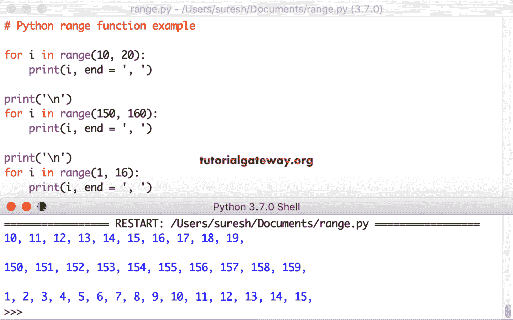

# Python `range()`函数

> 原文：<https://www.tutorialgateway.org/python-range-function/>

Python `range()`函数有助于生成数字序列。或者 Python `range()`函数有助于迭代列表中的项目，如列表、元组、集合、字符串等。

在本节中，我们将通过多个步骤示例讨论如何使用 Python `range()`函数从起点到终点生成数字。

## Python 范围语法

这个 Python 函数的语法包含范围开始、停止、步进。

```py
range(start, stop, step)
```

Python `range()`函数中的所有参数，如开始、停止和步骤，都接受正整数或负整数。

*   开始(可选)-开始位置编号。如果省略此选项，它将从 0 开始。
*   停止–此数字之前的值将是结束值。例如，(1，10)打印从 1 到 9 的值。
*   步骤(可选)-生成的数字序列。它决定了每个整数值之间的间距或差值。例如，(1，10，2)返回 1，3，5，7，9。你可以注意到每个整数之间的差是 2。

## Python 范围示例

下面的 Python `range()`函数示例列表使用指定的步骤从给定的起点到终点生成一系列数字。要在单个语句中显示更多的项，可以将输出分配给一个 iterable。

### Python 范围列表示例

在这个列表范围对象示例中，我们使用一个参数，它将是停止值。第一条语句从 0 开始，到 0 结束。第二个从 0 开始，到 5 结束。同样，最后一条语句从 0 开始，到 9 结束。这里，我们使用`list()`函数来绑定和显示它生成的数字。

```py
print(list(range(0)))

print(list(range(5)))

print(list(range(10)))
```

```py
[]
[0, 1, 2, 3, 4]
[0, 1, 2, 3, 4, 5, 6, 7, 8, 9]
```

### Python 范围元组函数

在这个 Python 整数范围示例中，我们也使用了单个参数。但是，这次我们使用元组函数来显示生成的项目。

提示:参考 [Python](https://www.tutorialgateway.org/python-tutorial/) 中的[列表](https://www.tutorialgateway.org/python-list/)和[元组](https://www.tutorialgateway.org/python-tuple/)文章。

```py
print(tuple(range(5)))
```

```py
(0, 1, 2, 3, 4)
```

### 带两个参数的 Python `range()`函数

这个例子使用了两个参数，它们是起点和终点。例如，print(5，15)打印从 5 到 14 开始的数字序列，print(150，165)返回从 150 到 164 的整数序列。

在 Python `range()`函数中，可以使用负值作为参数值。这里，我们也用负值作为起点、终点。第四条语句从-10 开始，到 0 结束，第五条语句从-15 开始，到-4 结束。

```py
print(list(range(5, 15)))

print(list(range(-10, 1)))
```

```py
[5, 6, 7, 8, 9, 10, 11, 12, 13, 14]
[-10, -9, -8, -7, -6, -5, -4, -3, -2, -1, 0]
```

### Python 范围步长

使用带三个参数的 Python `range()`函数，它们是起点、终点和步骤。这里，print(0，10，2)打印从 0 到 9 的数字列表，连续数字之间的间隔差应为 2。最后一条语句 print(150，500，50)返回 150 到 499 之间的数字，间隔为 50。

```py
print(list(range(0, 10, 2)))

print(list(range(150, 500, 50)))
```

```py
[0, 2, 4, 6, 8]
[150, 200, 250, 300, 350, 400, 450]
```

### Python 范围反转

这是 Python 范围保留的一个例子。这意味着，您也可以使用它以相反的顺序打印项目。

这里，我们使用负值作为起点、终点和步长。如果使用负值作为步长参数，反向`range()`函数会以相反的顺序返回值。例如，print(300，1，-25)返回从 300 到 1 的数字，间隔差为 25 (300，275，250…).

```py
print(list(range(-10, 1, 2)))

print(list(range(-45, -5, 5)))

print(list(range(300, 1, -25)))

print(list(range(450, -200, -50)))
```

```py
[-10, -8, -6, -4, -2, 0]
[-45, -40, -35, -30, -25, -20, -15, -10]
[300, 275, 250, 225, 200, 175, 150, 125, 100, 75, 50, 25]
[450, 400, 350, 300, 250, 200, 150, 100, 50, 0, -50, -100, -150]
```

### Python `for`循环`range()`函数

到目前为止，我们使用列表或元组来保存元素，并将该列表打印为输出。一般来说，我们使用这个函数和 [For Loop](https://www.tutorialgateway.org/python-for-loop/) 来迭代任何可选项。

第一个 Python `for`循环范围打印从 0 到 4 的值，下一个`for`循环生成从 0 到 9 的值。然而，在第二个例子中，我们将每个数字乘以 2。因此，输出将是 0、2、4、6 等。

```py
for i in range(5):
    print(i)

print('-----------')
for i in range(10):
    print(i * 2)
```

```py
0
1
2
3
4
-----------
0
2
4
6
8
10
12
14
16
18
>>>
```

使用 Python 实现带两个参数的循环`range()`函数。为了缩短输出，我们在 print 语句中使用了 end 参数。



这里，我们使用了步骤。第一个`for`循环从 15 开始，到 110 结束。这里两个数字之间的间隔差是 10。还使用了具有负步长值的此对象。

```py
for i in range(15, 110, 10):
    print(i, end = ', ')

print('\n')
for i in range(150, 1, -10):
    print(i, end = ', ')

print('\n')
for i in range(-150, -300, -25):
    print(i, end = ', ')

print('\n')
for i in range(-300, -150, 25):
    print(i, end = ', ')
```

```py
15, 25, 35, 45, 55, 65, 75, 85, 95, 105, 

150, 140, 130, 120, 110, 100, 90, 80, 70, 60, 50, 40, 30, 20, 10, 

-150, -175, -200, -225, -250, -275, 

-300, -275, -250, -225, -200, -175, 
```

### Python 范围字符串示例

使用它可以多次打印同一语句或同一字符串。第一条语句从 1 到 4 打印(四次)。默认情况下，它从 0 开始，要打印五次，请删除第一个参数 1。

```py
for i in range(1, 5):
    print('Python')

print('-----------')    
for i in range(2**3):
    print('Tutorial Gateway')
```

```py
Python
Python
Python
Python
-----------
Tutorial Gateway
Tutorial Gateway
Tutorial Gateway
Tutorial Gateway
Tutorial Gateway
Tutorial Gateway
Tutorial Gateway
Tutorial Gateway
```

在这个例子中，我们声明了一个[字符串](https://www.tutorialgateway.org/python-string/)。接下来，我们使用`for`循环使用`range()`函数迭代字符串中的每个字符。

在其中，我们使用内置函数 [`len()`函数](https://www.tutorialgateway.org/python-len-function/)来寻找字符串的长度，并将其用作`range()`函数的端点。意思是，循环从 0 开始，到 len(公司)结束。我们使用索引值来打印字符。

```py
company = 'Tutorial Gateway'

for i in range(len(company)):
    print(company[i], end = ', ')

print('\n-----------')
for i in range(0, len(company)):
    print(company[i])
```

```py
T, u, t, o, r, i, a, l,  , G, a, t, e, w, a, y, 
-----------
T
u
t
o
r
i
a
l

G
a
t
e
w
a
y
```

### 迭代器示例

让我用它来迭代像 list 和 tuple 这样的 iterables。第一个是循环水果清单并打印出来。下一步迭代元组并打印元组项。

```py
Fruits = ['Apple', 'Orange', 'Grape', 'Banana']
for i in range(len(Fruits)):
    print(Fruits[i])

print('--------------')
x = (10, 20, 30, 40, 50, 60, 70, 80, 90)
for i in range(len(x)):
    print(x[i])
```

```py
Apple
Orange
Grape
Banana
--------------
10
20
30
40
50
60
70
80
90
```

元组上 Python 范围迭代器的另一个例子。

```py
fruits_tuple = ('apple', 'cherry', 'kiwi', 'mango')

for i in range(len(fruits_tuple)):
    print(fruits_tuple[i], end = ', ')
```

```py
apple, cherry, kiwi, mango, 
```