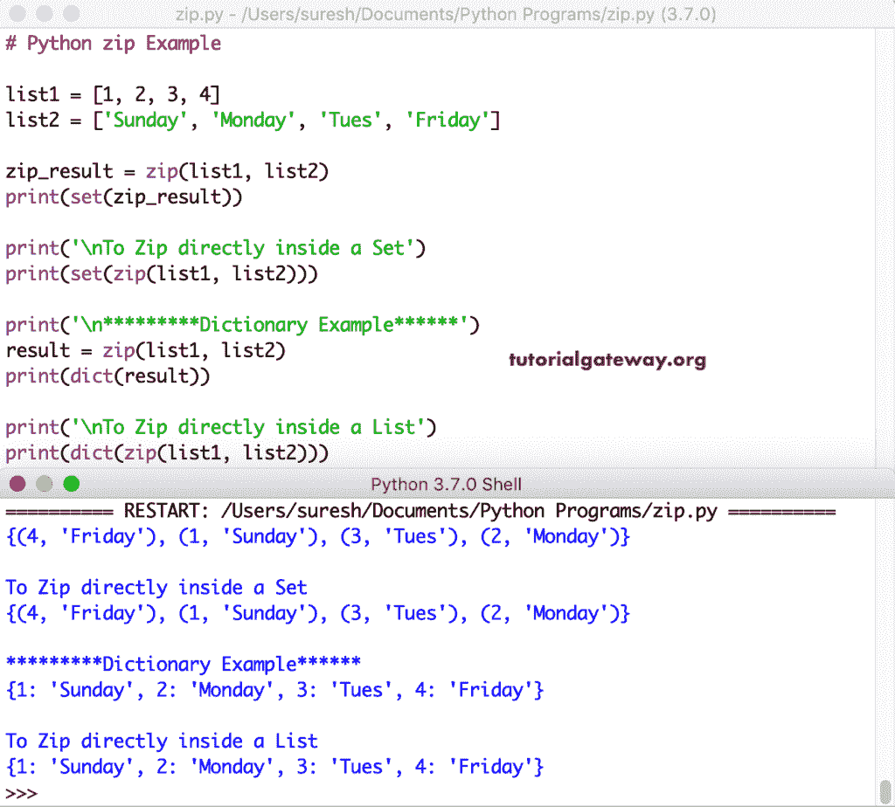

# Python 压缩函数

> 原文:[https://www.tutorialgateway.org/python-zip-function/](https://www.tutorialgateway.org/python-zip-function/)

Python zip 函数接受零个或多个迭代器，并返回一个迭代器元组。在这一节中，我们将讨论如何使用这个函数来结合可迭代项和示例。在这个 Python zip 函数中，迭代器对象可以是列表、元组、字符串等。，或者也可以使用用户定义的迭代器。Python zip 函数的语法是

```
zip(*iterables)
```

## 简单 Python zip 两个列表示例

这是一个演示 Python zip 函数的简单示例。它组合了列表 1 和列表 2 中的项目。

```
list1 = [1, 2, 3, 4, 5]
list2 = ['a', 'b', 'c', 'd', 'e']

result = zip(list1, list2)

print(result)
```

上面的代码打印了对象。若要显示结果，请使用`for`循环或任何可迭代的。

```
<zip object at 0x109c7b448>
```

### Python zip 两个列表示例

我们使用`for`循环来迭代两个列表的 Python zip 结果并显示输出。参考 [Python](https://www.tutorialgateway.org/python-tutorial/) 文章中的[列表](https://www.tutorialgateway.org/python-list/)。

```
list1 = [1, 2, 3, 4, 5]
list2 = ['a', 'b', 'c', 'd', 'e']

result = zip(list1, list2)

for x, y in result:
    print(x, y)
```

使用`for`循环输出对两个列表进行迭代

```
1 a
2 b
3 c
4 d
5 e
```

### Python zip 多个列表示例

在这里，我们使用它来执行三个列表。

在第二个`for`循环中，我们将第一个循环中的[改为了](https://www.tutorialgateway.org/python-for-loop/)，以查看[元组](https://www.tutorialgateway.org/python-tuple/)格式的实际值。

```
i = [1, 2, 3, 4, 5]
j = ['a', 'b', 'c', 'd', 'e']
k = ['Sunday', 'Monday', 'Tuesday', 'Thursday', 'Friday']

result = zip(i, j, k)

for x, y, z in result:
    print(x, y, z)

for val in result:
    print(val)
```

处理多个列表，并使用`for`循环进行迭代

```
1 a Sunday
2 b Monday
3 c Tuesday
4 d Thursday
5 e Friday

(1, 'a', 'Sunday')
(2, 'b', 'Monday')
(3, 'c', 'Tuesday')
(4, 'd', 'Thursday')
(5, 'e', 'Friday')
```

### Python 压缩元组示例

到目前为止，我们在单个可迭代元组上使用了 Python zip 函数。这里，我们在元组上使用这个。

```
tuple1 = (1, 2, 3, 4, 5)
tuple2 = ('a', 'b', 'c', 'd', 'e')
tuple3 = ('Sunday', 'Monday', 'Tuesday', 'Thursday', 'Friday')

result = zip(tuple1, tuple2, tuple3)

for val in result:
    print(val)
```

```
(1, 'a', 'Sunday')
(2, 'b', 'Monday')
(3, 'c', 'Tuesday')
(4, 'd', 'Thursday')
(5, 'e', 'Friday')
```

### Python 压缩列表和元组示例

您也可以在多个迭代器的组合中使用它。在这个例子中，我们在两个列表和一个元组中使用了它。

```
listA = [1, 2, 3, 4, 5]
listB = ['a', 'b', 'c', 'd', 'e']
tuple1 = ('Sunday', 'Monday', 'Tuesday', 'Thursday', 'Friday')

result = zip(listA, listB, tuple1)

for val in result:
    print(val)
```

```
(1, 'a', 'Sunday')
(2, 'b', 'Monday')
(3, 'c', 'Tuesday')
(4, 'd', 'Thursday')
(5, 'e', 'Friday')
```

### Python zip 不均匀项目示例

到目前为止，我们在一个列表或元组或任何可迭代列表中使用了相同数量的项目。让我向您展示如果我们在 Python zip iterable 中使用不同数量的项目会发生什么。为此，我们使用了列表 2 中的 4 个项目。

```
list1 = [1, 2, 3, 4, 5]
list2 = ['a', 'b', 'c', 'd']
tuple1 = ('Sunday', 'Monday', 'Tuesday', 'Thursday', 'Friday')

res = zip(list1, list2, tuple1)

for val in res:
    print(val)
```

这个函数只从每个条目中返回了 4 个条目。

```
(1, 'a', 'Sunday')
(2, 'b', 'Monday')
(3, 'c', 'Tuesday')
(4, 'd', 'Thursday')
```

### 转换 Python 压缩列表

在前面的例子中，我们使用`for`循环来显示对象中的项目。但是，您可以将对象转换为任何可迭代的。在本例中，我们使用 list()函数将结果转换为列表。

```
lt1 = [1, 2, 3, 4]
lt2 = ['a', 'b', 'c', 'd']
lt3 = ['Sunday', 'Monday', 'Tues', 'Friday']

res = zip(lt1, lt2, lt3)
print(list(res))

print('\nDirectly inside')
print(list(zip(lt1, lt2, lt3)))
```

将结果转换为列表

```
[(1, 'a', 'Sunday'), (2, 'b', 'Monday'), (3, 'c', 'Tues'), (4, 'd', 'Friday')]

Directly inside
[(1, 'a', 'Sunday'), (2, 'b', 'Monday'), (3, 'c', 'Tues'), (4, 'd', 'Friday')]
```

### 转换 Python zip 字典并设置

我们正在使用 set()函数和 dict()函数将对象转换为 [set](https://www.tutorialgateway.org/python-set/) 和[字典](https://www.tutorialgateway.org/python-dictionary/)。

```
list1 = [1, 2, 3, 4]
list2 = ['Sunday', 'Monday', 'Tues', 'Friday']

zip_result = zip(list1, list2)
print(set(zip_result))

print('\nTo Zip directly inside a Set')
print(set(zip(list1, list2)))

print('\n*********Dictionary Example******')
result = zip(list1, list2)
print(dict(result))

print('\nTo Zip directly inside a List')
print(dict(zip(list1, list2)))
```



### Python 压缩列表理解示例

这个例子展示了如何在[列表理解](https://www.tutorialgateway.org/python-list-comprehensions/)中使用这个函数。

在列表理解示例中的 Python zip 函数中，第二个函数通过组合 x、y、z 中的项来显示元组。

```
x = [10, 20, 30, 40, 50]
y = ['a', 'b', 'c', 'd', 'e']
z = ['Sunday', 'Monday', 'Tuesday', 'Thursday', 'Friday']

[print(x, y, z) for x, y, z in zip(x, y, z)]

[print(values) for values in zip(x, y, z)]
```

在列表理解输出中使用此方法创建一个元组

```
10 a Sunday
20 b Monday
30 c Tuesday
40 d Thursday
50 e Friday

(10, 'a', 'Sunday')
(20, 'b', 'Monday')
(30, 'c', 'Tuesday')
(40, 'd', 'Thursday')
(50, 'e', 'Friday')
```

## Python 解压缩示例

在 python 中，您可以使用这个函数来解压缩其中的项目。首先，我们声明了三个列表项。接下来，我们使用它来组合两个列表项，并将它们转换为一个列表。接下来，x，y = (*list_result)语句将第一组值赋给 x，将第二组值赋给 y。

```
lt1 = [10, 20, 30, 40]
lt2 = ['a', 'b', 'c', 'd']
lt3 = ['Sunday', 'Monday', 'Thursday', 'Friday']

result = list(zip(lt1, lt3))
print(result)

a, b = zip(*result)
print('Values in a = ', a)
print('Values in b = ', b)
```

Python 解压缩示例输出

```
[(10, 'Sunday'), (20, 'Monday'), (30, 'Thursday'), (40, 'Friday')]
Values in x = (10, 20, 30, 40)
Values in y = ('Sunday', 'Monday', 'Thursday', 'Friday')
```

### Python 解压缩示例 2

这次我们使用了三个列表项，并执行了压缩和解压缩操作。

```
i = [10, 20, 30, 40]
j = ['a', 'b', 'c', 'd']
k = ['Sunday', 'Monday', 'Thursday', 'Friday']

result = list(zip(i, j, k))
print(result)

x, y, z = zip(*result)
print('Values in x = ', x)
print('Values in y = ', y)
print('Values in z = ', z)
```

Python 解压缩输出

```
[(10, 'a', 'Sunday'), (20, 'b', 'Monday'), (30, 'c', 'Thursday'), (40, 'd', 'Friday')]
Values in x = (10, 20, 30, 40)
Values in y = ('a', 'b', 'c', 'd')
Values in z = ('Sunday', 'Monday', 'Thursday', 'Friday')
```

### Python 解压缩示例 3

我们将结果用作解压缩函数源，而不是将结果转换为列表。

```
a = [10, 20, 30, 40]
b = ['a', 'b', 'c', 'd']
c = ['Sunday', 'Monday', 'Thursday', 'Friday']

result = zip(a, b, c)

x, y, z = zip(*result)
print('Values in x = ', x)
print('Values in y = ', y)
print('Values in z = ', z)
```

Python 解压缩结果，并为其分配多个变量。

```
Values in x = (10, 20, 30, 40)
Values in y = ('a', 'b', 'c', 'd')
Values in z = ('Sunday', 'Monday', 'Thursday', 'Friday')
```