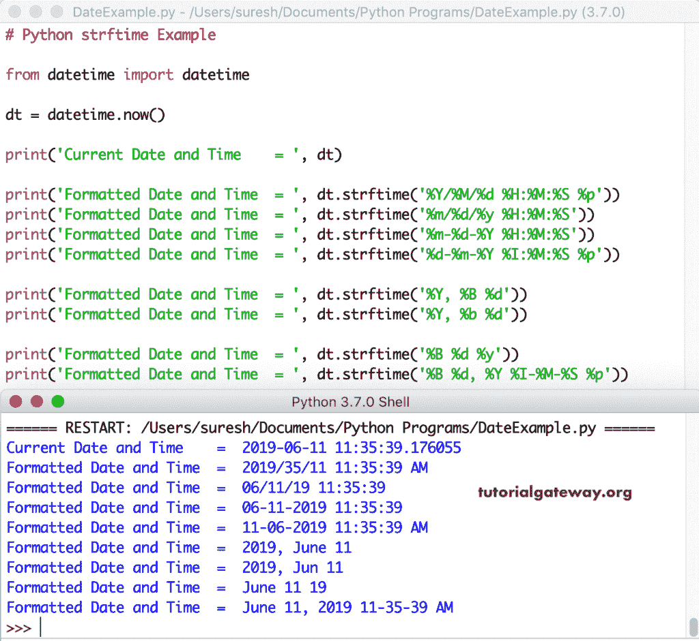

# Python `strftime()`

Python `strftime()`函数是日期时间模块和时间模块函数之一。这个 Python `strftime()`函数帮助您将给定的日期格式化为所需的字符串格式。日期时间模块中 Python `strftime()`函数的语法是

```py
datetime_Object_Value.strftime(Directives)
```

时间模块中 Python `strftime()`函数的语法是

```py
time.strftime(Directives, time_object_value)
```

Python `strftime()`函数中可用指令及其描述的列表。

| 指令 | 描述 | 示例输出 |
| %a | 工作日的简短版本 | 结婚 |
| %A | 工作日的完整版本 | 星期三 |
| %b | 月份名称的简短版本 | 一月 |
| %B | 月份名称的完整版本 | 一月 |
| %c | Dt 和 tm 的本地版本 | 2019 年 5 月 23 日星期四 10:35:32 |
| %d | 一个月的天数 01 到 31 | Twenty-three |
| %f | 微秒 000000 到 999999 | Nine hundred and sixty-five thousand and sixty |
| %H | 00 至 23 时 | Fifteen |
| %I | 00 至 12 时 | Ten |
| %j | 001 到 366 年的日数 | Three hundred and twenty |
| %m | 作为数字 01 到 12 的月份 | 05 |
| %M | 从 00 到 59 分钟 | Thirty-five |
| %p | 上午或下午 | 是 |
| %S | 从 00 到 59 的秒数 | Thirty-two |
| %U | 从 00 到 53 的一年中的周数，其中一周的第一天=星期日 | Twenty |
| %w | 工作日为 0 到 6 之间的数字，其中 0 =周日 | four |
| %W | 从 00 到 53 的一年中的周数，其中一周的第一天=星期一 | Twenty |
| %x | 日期的本地版本 | 05/23/19 |
| %X | 当地时间 | 10:35:32 |
| %y | 年度短版本 | Nineteen |
| %Y | 年度完整版 | Two thousand and nineteen |
| %z | 世界协调时偏移 |  |
| %Z | 时区 |  |
| %% | %字符 | % |

## Python strftime Examples

我们使用 Python `strftime()`函数返回当前日期和时间的日期、时间和日期时间的本地版本。

```py
from datetime import datetime

dt = datetime.now()

print(dt)

print('Local Version = ', dt.strftime('%c'))
print('Local Version of Dt          = ', dt.strftime('%x'))
print('Local Version of Tm          = ', dt.strftime('%X'))
```

```py
2021-05-02 16:00:01.379106
Local Version = Sun May 2 16:00:01 2021
Local Version of Dt = 05/02/21
Local Version of Tm = 16:00:01
```

使用 Python strftime 从当前日期返回年、月和日。

```py
from datetime import datetime

dt = datetime.now()

print('Current = ', dt)

print('Current Year          = ', dt.strftime('%Y'))
print('Month Name            = ', dt.strftime('%B'))
print('Day Number            = ', dt.strftime('%d')) 
```

```py
Current = 2021-05-02 16:01:05.071968
Current Year = 2021
Month Name = May
Day Number = 02
```

这个 strftime 示例返回年、月名、月号、日号等。，从今天的日期和时间开始。

```py
from datetime import datetime

dt = datetime.now()

print(dt)
print('Year in Short            = ', dt.strftime('%y'))
print('Year                     = ', dt.strftime('%Y'))
print('Month Name in Short      = ', dt.strftime('%b'))
print('Month Name               = ', dt.strftime('%B'))
print('Month Number             = ', dt.strftime('%m'))
print('Day Number of the Month  = ', dt.strftime('%d'))
print('Day Number of the Year   = ', dt.strftime('%j'))
print('Week Number of Year      = ', dt.strftime('%W'))
print('Short Version of Weekday = ', dt.strftime('%a'))
print('Full Version of Weekday  = ', dt.strftime('%A'))
print('Weekday as a Number      = ', dt.strftime('%w'))
```

使用此功能从今天的日期获取年、月、月、日。

```py
2021-05-02 15:58:43.549339
Year in Short = 21
Year = 2021
Month Name in Short = May
Month Name = May
Month Number = 05
Day Number of the Month = 02
Day Number of the Year = 122
Week Number of Year = 17
Short Version of Weekday = Sun
Full Version of Weekday = Sunday
Weekday as a Number = 0
```

让我使用这个 Python strftime 从当前的 DateTime 类返回小时、分钟、秒、微秒、上午或下午。

```py
from datetime import datetime

dt = datetime.now()

print(dt)
print('Hours                 = ', dt.strftime('%H'))
print('Hours                 = ', dt.strftime('%I'))
print('Minutes               = ', dt.strftime('%M'))
print('Seconds               = ', dt.strftime('%S'))
print('Microseconds          = ', dt.strftime('%f'))
print('AM or PM              = ', dt.strftime('%p'))
```

使用此方法输出打印小时、分钟、秒、微秒

```py
2021-05-02 15:57:46.656409
Hours = 15
Hours = 03
Minutes = 57
Seconds = 46
Microseconds = 656409
AM or PM = PM
```

在一个示例中，我们使用了所有可用的指令。在一个地方看到它们可能会有所帮助。

```py
from datetime import datetime

dt = datetime.now()

print('Today\'s Date and Time             = ', dt)

print('Local Version of Date and Time     = ', dt.strftime('%c'))
print('Local Version of Date              = ', dt.strftime('%x'))
print('Local Version of Time              = ', dt.strftime('%X'))

print('Short Version of the Year          = ', dt.strftime('%y'))
print('Full Version of the Year           = ', dt.strftime('%Y'))

print('Short Version of Month Name        = ', dt.strftime('%b'))
print('Full Version of Month Name         = ', dt.strftime('%B'))
print('Month Number from 01 to 12         = ', dt.strftime('%m'))

print('Day Number of the Month from 01-31 = ', dt.strftime('%d'))
print('Day Number of Year from 001 to 366 = ', dt.strftime('%j'))

print('Week Number of Year from 00 to 53  = ', dt.strftime('%U'))
print('Week Number of Year from 00 to 53  = ', dt.strftime('%W'))

print('Short Version of Weekday           = ', dt.strftime('%a'))
print('Full Version of Weekday            = ', dt.strftime('%A'))
print('Weekday as a Number from 0 to 6    = ', dt.strftime('%w'))

print('Hours from 00 to 23 (24hr Format)  = ', dt.strftime('%H'))
print('Hours from 00 to 12 (12hr Format)  = ', dt.strftime('%I'))
print('Minutes from 00 to 59              = ', dt.strftime('%M'))
print('Seconds from 00 to 59              = ', dt.strftime('%S'))
print('Microseconds from 000000 to 999999 = ', dt.strftime('%f'))
print('AM or PM                           = ', dt.strftime('%p'))
print('% Charcter                         = ', dt.strftime('%%'))
```

```py
Today's Date and Time = 2021-05-02 15:55:13.539316
Local Version of Date and Time = Sun May 2 15:55:13 2021
Local Version of Date = 05/02/21
Local Version of Time = 15:55:13
Short Version of the Year = 21
Full Version of the Year = 2021
Short Version of Month Name = May
Full Version of Month Name = May
Month Number from 01 to 12 = 05
Day Number of the Month from 01-31 = 02
Day Number of Year from 001 to 366 = 122
Week Number of Year from 00 to 53 = 18
Week Number of Year from 00 to 53 = 17
Short Version of Weekday = Sun
Full Version of Weekday = Sunday
Weekday as a Number from 0 to 6 = 0
Hours from 00 to 23 (24hr Format) = 15
Hours from 00 to 12 (12hr Format) = 03
Minutes from 00 to 59 = 55
Seconds from 00 to 59 = 13
Microseconds from 000000 to 999999 = 539316
AM or PM = PM
% Charcter = %
```

## 用于格式化日期时间的 strftime

到目前为止，我们使用一个 [Python](https://www.tutorialgateway.org/python-tutorial/) 指令来返回日期的一部分。但是，将日期和时间格式化为所需的格式非常有用。它以年/月/日小时:分钟:秒上午/下午显示当前日期和时间。

```py
import datetime

dt = datetime.datetime.now()

print(dt)

print(dt.strftime('%Y/%m/%d %H:%M:%S %p'))
```

```py
2021-05-02 15:54:05.603666
2021/05/02 15:54:05 PM
```

没有更多的格式选项。

```py
from datetime import datetime

dt = datetime.now()

print('Current Date and Time    = ', dt)

print('Formatted Date and Time  = ', dt.strftime('%Y/%M/%d %H:%M:%S %p'))
print('Formatted Date and Time  = ', dt.strftime('%m/%d/%y %H:%M:%S'))
print('Formatted Date and Time  = ', dt.strftime('%m-%d-%Y %H:%M:%S'))
print('Formatted Date and Time  = ', dt.strftime('%d-%m-%Y %I:%M:%S %p'))

print('Formatted Date and Time  = ', dt.strftime('%Y, %B %d'))
print('Formatted Date and Time  = ', dt.strftime('%Y, %b %d'))

print('Formatted Date and Time  = ', dt.strftime('%B %d %y'))
print('Formatted Date and Time  = ', dt.strftime('%B %d, %Y %I-%M-%S %p'))
```



## Python 时间模块中的时间

您也可以使用时间库来使用这个 strftime。这里，我们使用了时间库中的`strftime()`函数。

```py
import time

dt = time.localtime(1234567)

print(time.strftime('%Y/%M/%d %H:%M:%S %p', dt))
print(time.strftime('%m/%d/%y %H:%M:%S', dt))
print(time.strftime('%d-%m-%Y %I:%M:%S %p', dt))

print(time.strftime('%I:%M:%S %p', dt))
```

```py
1970/26/15 12:26:07 PM
01/15/70 12:26:07
15-01-1970 12:26:07 PM
12:26:07 PM
```