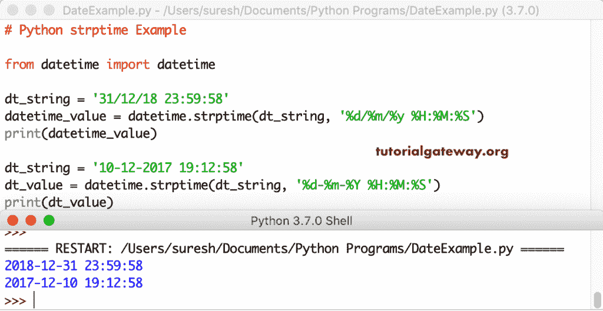

# Python `strptime()`

Python `strptime()`函数在日期时间和时间模块中都可用。这个 Python `strptime()`函数帮助您解析字符串形式的日期时间、日期或时间。

这个 Python `strptime()`函数使用一些指令来解析字符串日期。请记住，这些指令与我们在`strftime()`函数中用来格式化日期和时间的指令相同。这个 Python strptime 的语法是

```
datetime.strptime(string_value, format) # format using directives
```

让我看看支持 Python 的 strptime 指令

*   % a–工作日(星期三)的简短版本
*   % A–工作日(星期三)的完整版本
*   % b–月份名称的简短版本(1 月)
*   % B–月份名称的完整版本(1 月)
*   % c–日期和时间的本地版本
*   % d–01 至 31 月的天数
*   % f–微秒 000000 到 999999
*   % H–00 到 23 小时
*   % 1–00 至 12 时
*   % j–001 至 366 年的日数
*   % m–从 01 到 12 的月份
*   % M–从 00 到 59 分钟
*   % p–上午或下午
*   % S–从 00 到 59 的秒数
*   % U–从 00 到 53 的一年中的周数，其中一周的第一天=周日
*   % w–工作日为 0 到 6 之间的数字，其中 0 =周日
*   % W–从 00 到 53 的一年中的周数，其中一周的第一天=星期一
*   % x–日期的本地版本(2019 年 5 月 23 日)
*   % X–时间的本地版本(10:45:32)
*   % y–年度短版本(19)
*   % Y–年度完整版(2019 年)
*   % z–utc 偏移
*   % Z–时区

## Python strptime Examples

Python `strptime()`函数将天/月/年格式的给定字符串日期转换为本地版本的日期时间。

```

from datetime import datetime

datetime_value = datetime.strptime('30/12/18', '%d/%m/%y')

print(datetime_value)
```

```
2018-12-30 00:00:00
```

这个 python strptime 接受日、月、日和整年格式的日期，并返回日期和时间。

```
from datetime import datetime

dt_string = '31 December 2018'
datetime_value = datetime.strptime(dt_string, '%d %B %Y')
print(datetime_value)

dt_str = '31 December 17'
dt_value = datetime.strptime(dt_str, '%d %B %y')
print(dt_value)
```

```
2018-12-31 00:00:00
2017-12-31 00:00:00
```

使用 Python `strptime()`函数转换日期时间字符串。

```
from datetime import datetime

dt_string = '31/12/18 23:59:58'
datetime_value = datetime.strptime(dt_string, '%d/%m/%y %H:%M:%S')
print(datetime_value)

dt_string = '10-12-2017 19:12:58'
dt_value = datetime.strptime(dt_string, '%d-%m-%Y %H:%M:%S')
print(dt_value)
```



让我使用这个 Python strptime 从给定的小时、分钟、秒返回日期时间。请参考 [Python](https://www.tutorialgateway.org/python-tutorial/) 中的[str time](https://www.tutorialgateway.org/python-strftime/)。

```
from datetime import datetime

dt_string = '14:22:33'
time_value = datetime.strptime(dt_string, '%H:%M:%S')
print(time_value)

dt_str = '10-45-59'
t_value = datetime.strptime(dt_str, '%H-%M-%S')
print(t_value)
```

使用此功能打印给定时、分、秒的日期和时间。

```
1900-01-01 14:22:33
1900-01-01 10:45:59
```

## Python strptime 时间库

您也可以利用时间库来使用此功能。在这个时间实例中，我们在时间库中使用这个函数。

```
import time

datetime_value = time.strptime('31/12/18', '%d/%m/%y')
print(datetime_value)
```

```
time.struct_time(tm_year=2018, tm_mon=12, tm_mday=31, tm_hour=0, tm_min=0, tm_sec=0, tm_wday=0, tm_yday=365, tm_isdst=-1)
```

如果您以错误的顺序指定缩写或者使用错误的格式，那么 Python `strptime()`函数会抛出一个错误。

```
from datetime import datetime

dt_string = '31/12/18'
datetime_value = datetime.strptime(dt_string, '%d %m %y')

print(datetime_value)
```

```
Traceback (most recent call last):
  File "/Users/suresh/Desktop/simple.py", line 4, in <module>
    datetime_value = datetime.strptime(dt_string, '%d %m %y')
  File ...
......
......
>>> 
```