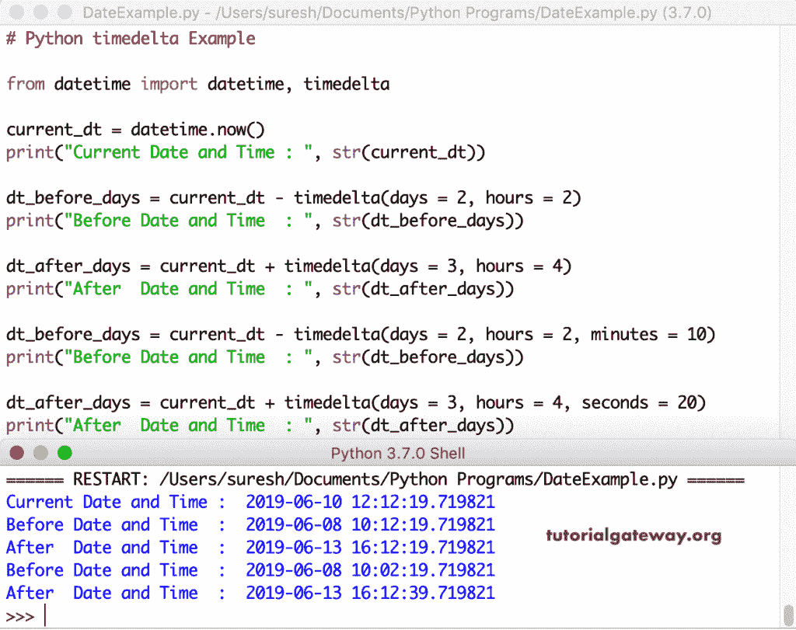

# Python 时间

> 原文：<https://www.tutorialgateway.org/python-timedelta/>

Python 时间增量函数在日期时间库中可用。我们使用这个 Python 时间增量函数来计算两个日期之间的差异。或者，您可以使用 Python 时间增量来预测过去的日期和未来的日期。

在本节中，我们展示了 Python 时间增量的最大示例数。这个 Python 日期时间时间增量函数的语法是

```
datetime.timedelta(days = 0, seconds = 0, microseconds = 0, milliseconds = 0, minutes = 0, hours = 0, weeks = 0)
```

## Python 时间增量示例

这是 datetime timedelta 的一个基本示例。

```
import datetime

print("Microseconds = ", datetime.timedelta(microseconds = 1))
print("Milliseconds = ", datetime.timedelta(milliseconds = 1))
print("Seconds      = ", datetime.timedelta(seconds = 1))
print("Minutes      = ", datetime.timedelta(minutes = 1))
print("Hours        = ", datetime.timedelta(hours = 1))
print("Days         = ", datetime.timedelta(days = 1))
print("Weeks        = ", datetime.timedelta(weeks = 1))
```

```
Microseconds = 0:00:00.000001
Milliseconds = 0:00:00.001000
Seconds = 0:00:01
Minutes = 0:01:00
Hours = 1:00:00
Days = 1 day, 0:00:00
Weeks = 7 days, 0:00:00
```

### Python 时间增量属性

datetime timedelta 对象有三个特殊属性 min、max、resolution，用于返回两个不相等的 timedelta 对象之间的最大负值、最大正值和最小差值。

```
import datetime

print("Minimum = ", datetime.timedelta.min)
print("Maximum = ", datetime.timedelta.max)
print("Resoultion = ", datetime.timedelta.resolution)
```

返回总天数的 Python 时间增量最小值、最大值和分辨率输出。

```
Minimum = -999999999 days, 0:00:00
Maximum = 999999999 days, 23:59:59.999999
Resoultion = 0:00:00.000001
```

### Python 时间增量未来日期示例

让我给你一个简单的时间增量例子来返回一年后和两年后的日期。我们可以用 datetime 对象中的 import timedelta 类来预测未来的日期。

```
from datetime import datetime, timedelta

current_dt = datetime.now()
print("Current Date and Time : ", str(current_dt))

dt_after_one_year = current_dt + timedelta(days = 365)
print("Date and Time After One Year : ", str(dt_after_one_year))

dt_after_two_years = current_dt + timedelta(days = 730)
print("Date and Time of Two Years from Now : ", str(dt_after_two_years))
```

使用 Python 时间增量函数打印未来日期。

```
Current Date and Time : 2021-05-02 16:40:59.308324
Date and Time After One Year : 2022-05-02 16:40:59.308324
Date and Time of Two Years from Now : 2023-05-02 16:40:59.308324
```

### Python 时间增量过去日期

在这里，我们在 timedelta 函数中减去天数来查找过去的日期。从下面的时间增量代码中，days = 730 表示从当前日期减去 730 天。

```
from datetime import datetime, timedelta

current_dt = datetime.now()
print("Current Date and Time : ", str(current_dt))

dt_before_two_years = current_dt - timedelta(days = 730)
print("Date and Time before Two Years from Now : ", str(dt_before_two_years))

dt_before_six_years = current_dt - timedelta(days = 2190)
print("Date and Time before Six Years from Now : ", str(dt_before_six_years))

dt_before_thirty_years = current_dt - timedelta(days = 10950)
print("Date and Time before Thirty Years       : ", str(dt_before_thirty_years))
```

使用 Python 时间增量函数打印过去的日期。

```
Current Date and Time : 2021-05-02 16:41:41.735466
Date and Time before Two Years from Now : 2019-05-03 16:41:41.735466
Date and Time before Six Years from Now : 2015-05-04 16:41:41.735466
Date and Time before Thirty Years : 1991-05-10 16:41:41.735466
```

### Python 时间增量周

我们使用 timedelta 函数中的 weeks 参数来查找 2 周/ 4 周之前和之后的日期。首先，从日期时间导入时间增量

```
from datetime import datetime, timedelta

current_dt = datetime.now()
print("Current Date and Time : ", str(current_dt))

dt_before_two_weeks = current_dt - timedelta(weeks = 2)
print("DateTime before Two Weeks from Now : ", str(dt_before_two_weeks))

dt_after_two_weeks = current_dt + timedelta(weeks = 2)
print("DateTime after Two Weeks from Now  : ", str(dt_after_two_weeks))

print()
dt_before_four_weeks = current_dt - timedelta(weeks = 4)
print("DateTime before Four Weeks from Now : ", str(dt_before_four_weeks))

dt_after_six_weeks = current_dt + timedelta(weeks = 6)
print("DateTime after Six Weeks from Now  : ", str(dt_after_six_weeks))
```

周产出

```
Current Date and Time : 2021-05-02 16:42:36.626051
DateTime before Two Weeks from Now : 2021-04-18 16:42:36.626051
DateTime after Two Weeks from Now : 2021-05-16 16:42:36.626051

DateTime before Four Weeks from Now : 2021-04-04 16:42:36.626051
DateTime after Six Weeks from Now : 2021-06-13 16:42:36.626051
```

### Python 时间间隔天数

我们使用 Python timedelta 函数中的 days 参数来返回从现在起 2 天之前和之后的日期。

```
from datetime import datetime, timedelta

current_dt = datetime.now()
print("Current Date and Time : ", str(current_dt))

dt_before_two_days = current_dt - timedelta(days = 2)
print("Date and Time before Two Days from Now : ", str(dt_before_two_days))

dt_after_two_days = current_dt + timedelta(days = 2)
print("Date and Time of Two Days from Now     : ", str(dt_after_two_days))
```

Python 时间增量天数输出

```
Current Date and Time : 2021-05-02 18:18:45.436689
Date and Time before Two Days from Now : 2021-04-30 18:18:45.436689
Date and Time of Two Days from Now : 2021-05-04 18:18:45.436689
```

在这里， [Python](https://www.tutorialgateway.org/python-tutorial/) 返回从现在起两天前后的日期(不是日期和时间)。

```
from datetime import datetime, timedelta

dt = datetime.now()

current_dt = dt.date()
print("Current Date and Time : ", str(current_dt))

dt_before_two_days = current_dt - timedelta(days = 2)
print("Date and Time before Two Days from Now : ", str(dt_before_two_days))

dt_after_five_days = current_dt + timedelta(days = 2)
print("Date and Time of Five Days from Now    : ", str(dt_after_five_days))
```

使用 Python 时间增量函数获取过去和未来的日期

```
Current Date and Time : 2021-05-02
Date and Time before Two Days from Now : 2021-04-30
Date and Time of Five Days from Now : 2021-05-04
```

### Python 超时时间

这个时间增量返回从现在起两小时之前和之后的日期和时间。

```
from datetime import datetime, timedelta

current_dt = datetime.now()
print("Current Date and Time : ", str(current_dt))

dt_before_two_hours = current_dt - timedelta(hours = 2)
print("Date and Time before Two Hours from Now : ", str(dt_before_two_hours))

dt_after_two_hours = current_dt + timedelta(hours = 2)
print("Date and Time of Two Hours from Now     : ", str(dt_after_two_hours))
```

日期时间增量小时输出

```
Current Date and Time : 2021-05-02 18:32:28.658184
Date and Time before Two Hours from Now : 2021-05-02 16:32:28.658184
Date and Time of Two Hours from Now : 2021-05-02 20:32:28.658184
```

### Python 时间增量分钟

使用 timedelta 在两分钟前返回 DateTime，从现在起在 6 分钟后返回。

```
from datetime import datetime, timedelta

current_dt = datetime.now()
print("Current Date and Time : ", str(current_dt))

dt_before_two_minutes = current_dt - timedelta(minutes = 2)
print("Date and Time before Two Minutes from Now : ", str(dt_before_two_minutes))

dt_after_six_minutes = current_dt + timedelta(minutes = 6)
print("Date and Time After Six Minutes from Now  : ", str(dt_after_six_minutes))
```

Python 时间增量分钟输出

```
Current Date and Time : 2021-05-02 18:31:35.962983
Date and Time before Two Minutes from Now : 2021-05-02 18:29:35.962983
Date and Time After Six Minutes from Now : 2021-05-02 18:37:35.962983
```

### 时间增量秒

在本例中，我们使用 Pythontimedelta 函数在 20 秒之前返回日期时间，从现在开始在 90 秒之后返回日期时间。

```
from datetime import datetime, timedelta

current_dt = datetime.now()
print("Current Date and Time : ", str(current_dt))

dt_before_twenty_seconds = current_dt - timedelta(seconds = 20)
print("DateTime before Twenty seconds : ", str(dt_before_twenty_seconds))

dt_after_ninty_seconds = current_dt + timedelta(seconds = 90)
print("DateTime After Ninty seconds  : ", str(dt_after_ninty_seconds))
```

日期时间增量秒输出

```
Current Date and Time : 2021-05-02 16:39:06.479500
DateTime before Twenty seconds : 2021-05-02 16:38:46.479500
DateTime After Ninty seconds : 2021-05-02 16:40:36.479500
```

### 时间增量毫秒

Python timedelta 函数打印 10000 毫秒之前和 9000000 毫秒之后的日期和时间。

```
from datetime import datetime, timedelta

current_dt = datetime.now()
print("Current Date and Time : ", str(current_dt))

dt_before_mseconds = current_dt - timedelta(milliseconds = 10000)
print("DateTime before Ten Thousand Milliseconds : ", str(dt_before_mseconds))

dt_after_mseconds = current_dt + timedelta(milliseconds = 900000)
print("DateTime After 900000 Milliseconds  : ", str(dt_after_mseconds))
```

日期时间增量毫秒输出

```
Current Date and Time : 2021-05-02 16:38:29.428497
DateTime before Ten Thousand Milliseconds : 2021-05-02 16:38:19.428497
DateTime After 900000 Milliseconds : 2021-05-02 16:53:29.428497
```

### Python 时间增量多参数

在这个 timedelta 示例中，我们使用了多个参数(多个参数)。current _ dt–time delta(days = 2，hours = 2)返回 2 天前和 2 小时后的日期和时间。

```
from datetime import datetime, timedelta

current_dt = datetime.now()
print("Current Date and Time : ", str(current_dt))

dt_before_days = current_dt - timedelta(days = 2, hours = 2)
print("Before Date and Time  : ", str(dt_before_days))

dt_after_days = current_dt + timedelta(days = 3, hours = 4)
print("After  Date and Time  : ", str(dt_after_days))

dt_before_days = current_dt - timedelta(days = 2, hours = 2, minutes = 10)
print("Before Date and Time  : ", str(dt_before_days))

dt_after_days = current_dt + timedelta(days = 3, hours = 4, seconds = 20)
print("After  Date and Time  : ", str(dt_after_days))
```



如果您知道参数的顺序，并且以相同的顺序使用它们，则不需要名称。我是说，你可以设置参数值。这里，current _ dt–time delta(2，2)返回 2 天零 2 秒之前的日期和时间。

```
from datetime import datetime, timedelta

current_dt = datetime.now()
print("Current Date and Time : ", str(current_dt))

dt_before_days = current_dt - timedelta(2, 2)
print("Before Date and Time  : ", str(dt_before_days))

dt_before_days = current_dt - timedelta(2, 2, 2)
print("Before Date and Time  : ", str(dt_before_days))

dt_before_days = current_dt - timedelta(2, 2, 0, 2, 0, 2)
print("Before Date and Time  : ", str(dt_before_days))

dt_before_days = current_dt - timedelta(2, 2, 0, 2, 0, 2, 1)
print("Before Date and Time  : ", str(dt_before_days))
```

带参数输出的时间增量

```
Current Date and Time : 2021-05-02 16:36:23.452245
Before Date and Time : 2021-04-30 16:36:21.452245
Before Date and Time : 2021-04-30 16:36:21.452243
Before Date and Time : 2021-04-30 14:36:21.450245
Before Date and Time : 2021-04-23 14:36:21.450245
```

这里，我们使用带有参数值的时间增量来预测未来的日期。

```
from datetime import datetime, timedelta

current_dt = datetime.now()
print("Current Date and Time : ", str(current_dt))

dt_after_days = current_dt + timedelta(3, 3)
print("After  Date and Time  : ", str(dt_after_days))

dt_after_days = current_dt + timedelta(3, 3, 3, 3)
print("After  Date and Time  : ", str(dt_after_days))

dt_after_days = current_dt + timedelta(3, 3, 0, 0, 3, 3)
print("After  Date and Time  : ", str(dt_after_days))

dt_after_days = current_dt + timedelta(3, 0, 0, 4, 2, 3, 1)
print("After  Date and Time  : ", str(dt_after_days))

dt_after_days = current_dt + timedelta(3, 0, 0, 0, 0, 0, 5)
print("After  Date and Time  : ", str(dt_after_days))
```

```
Current Date and Time : 2021-05-02 16:35:20.057643
After Date and Time : 2021-05-05 16:35:23.057643
After Date and Time : 2021-05-05 16:35:23.060646
After Date and Time : 2021-05-05 19:38:23.057643
After Date and Time : 2021-05-12 19:37:20.061643
After Date and Time : 2021-06-09 16:35:20.057643
```

### Python 时间增量负值

到目前为止，我们用时间增量值减去当前日期和时间。但是，您可以使用负值作为 timedelta 参数。例如，current_dt + timedelta(days = -35)返回从现在起 35 天之前的日期。

```
from datetime import datetime, timedelta

current_dt = datetime.now()
print("Current Date and Time : ", str(current_dt))

dt_after_days = current_dt + timedelta(days = -35)
print("After  Date and Time  : ", str(dt_after_days))

dt_after_days = current_dt + timedelta(days = -3, hours = -4)
print("After  Date and Time  : ", str(dt_after_days))

dt_after_days = current_dt + timedelta(days = -10, hours = -40, minutes = -10)
print("After  Date and Time  : ", str(dt_after_days))
```

```
Current Date and Time : 2021-05-02 16:34:19.936194
After Date and Time : 2021-03-28 16:34:19.936194
After Date and Time : 2021-04-29 12:34:19.936194
After Date and Time : 2021-04-21 00:24:19.936194
```

### 使用时间增量查找总秒数

此时间增量示例打印一小时、一天、一年和一周的总秒数

```
from datetime import datetime, timedelta

dt = timedelta(hours = 1)
print("One Hour                  = ", dt)
print("Total Seconds in One Hour = ", dt.total_seconds())

dt = timedelta(days = 1)
print("One Day                   = ", dt)
print("Total Seconds in One day  = ", dt.total_seconds())

dt = timedelta(days = 365)
print("Total Days                = ", dt)
print("Total Seconds in a Year   = ", dt.total_seconds())

dt = timedelta(weeks = 1)
print("One Week                  = ", dt)
print("Total Seconds in a Week   = ", dt.total_seconds())
```

```
One Hour = 1:00:00
Total Seconds in One Hour = 3600.0
One Day = 1 day, 0:00:00
Total Seconds in One day = 86400.0
Total Days = 365 days, 0:00:00
Total Seconds in a Year = 31536000.0
One Week = 7 days, 0:00:00
Total Seconds in a Week = 604800.0
```

### Python timedelta strftime

使用时间增量函数预测未来日期。接下来，我们使用[str time 函数](https://www.tutorialgateway.org/python-strftime/)来格式化日期和时间。

```
from datetime import datetime, timedelta

current_dt = datetime.now()
print("Current Date and Time : ", str(current_dt))

dt_after = current_dt + timedelta(days = 30)
print("Formatted DateTime  : ", dt_after.strftime('%Y/%M/%d %H:%M:%S %p'))

dt_after = current_dt + timedelta(days = 365)
print("Formatted DateTime  : ", dt_after.strftime('%A, %d %b %Y'))

dt_after = current_dt + timedelta(days = 365)
print("Formatted DateTime  : ", dt_after.strftime('%A, %d %b %Y %H:%M:%S %p'))
```

预测未来日期输出

```
Current Date and Time : 2021-05-02 16:32:18.348961
Formatted DateTime : 2021/32/01 16:32:18 PM
Formatted DateTime : Monday, 02 May 2022
Formatted DateTime : Monday, 02 May 2022 16:32:18 PM
```

## Python 时差

在 datetime 模块中查找当前日期和 timedelta 类返回的日期之间的时间差。

```
from datetime import datetime, timedelta

current_dt = datetime.now()
print("Current Date and Time : ", str(current_dt))

dt_before_ten_days = current_dt - timedelta(days = 10)
print("DateTime before Ten Days from Now : ", str(dt_before_ten_days))
print("Time Difference = ", current_dt - dt_before_ten_days)

dt_after_two_days = current_dt + timedelta(days = 2)
print("DateTime of Two Days from Now     : ", str(dt_after_two_days))
print("Time Difference = ", current_dt - dt_after_two_days)
```

时差输出。

```
Current Date and Time : 2021-05-02 16:30:49.956443
DateTime before Ten Days from Now : 2021-04-22 16:30:49.956443
Time Difference = 10 days, 0:00:00
DateTime of Two Days from Now : 2021-05-04 16:30:49.956443
Time Difference = -2 days, 0:00:00
```