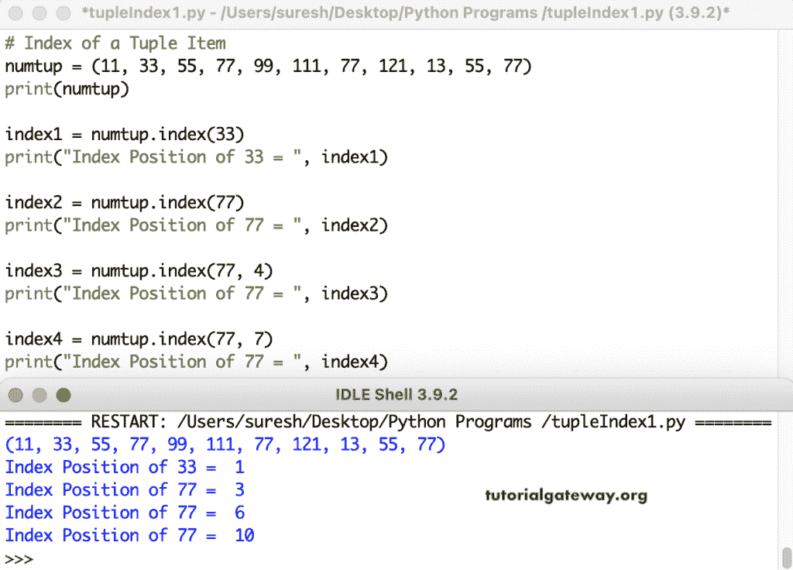

# 寻找元组项目索引的 Python 程序

> 原文:[https://www . tutorialgateway . org/python-program-to-find-index-of-tuple-item/](https://www.tutorialgateway.org/python-program-to-find-index-of-a-tuple-item/)

编写 Python 程序来查找元组中给定元组项的索引。Python 有一个元组索引函数，它返回给定元组项的索引。元组索引函数返回第一个找到的值的索引位置。Python 元组索引的语法

```
TupleName.index(tupleValue, start, end)
```

如果指定起始值，索引函数将从该位置开始查找。同样，如果我们设置结束位置，元组索引函数将停止查看该数字。在第三个示例中，元组索引从第四个位置开始查找，下一个将从第七个位置开始查找。

```
# Index of a Tuple Item

numtup = (11, 33, 55, 77, 99, 111, 77, 121, 13, 55, 77)
print(numtup)

index1 = numtup.index(33)
print("Index Position of 33 = ", index1)

index2 = numtup.index(77)
print("Index Position of 77 = ", index2)

index3 = numtup.index(77, 4)
print("Index Position of 77 = ", index3)

index4 = numtup.index(77, 7)
print("Index Position of 77 = ", index4)
```

Python Tuple 索引函数输出



## 寻找元组项目索引的 Python 程序示例 2

第三个示例中的 Python 元组索引代码从第八个位置开始寻找“a”，并在第十三个位置停止。

```
# Index of a Tuple Item

strTup = tuple("tutorialgateway")
print(strTup)

index1 = strTup.index("a")
print("Index Position of a = ", index1)

index2 = strTup.index("t", 3)
print("Index Position of t = ", index2)

index3 = strTup.index("a", 8, 13)
print("Index Position of a = ", index3)

index4 = strTup.index("x")
print("Index Position of x = ", index4)
```

Python 元组项索引值输出

```
('t', 'u', 't', 'o', 'r', 'i', 'a', 'l', 'g', 'a', 't', 'e', 'w', 'a', 'y')
Index Position of a =  6
Index Position of t =  10
Index Position of a =  9
Traceback (most recent call last):
  File "/Users/suresh/Desktop/simple.py", line 13, in <module>
    index4 = strTup.index("x")
ValueError: tuple.index(x): x not in tuple
```

## Python 程序无需使用索引函数即可找到元组项的索引。

在这个例子中，我们使用 for 循环和枚举来迭代元组值。所有示例中的 lf 语句将检查元组中给定值的索引位置。第一个中的 [break 语句](https://www.tutorialgateway.org/python-break/)将退出循环，并打印第一个找到的元组项的索引位置。第二个和第三个将打印[元组](https://www.tutorialgateway.org/python-tuple/)项的所有索引位置。

```
# Index of a Tuple Item

numtup = (10, 20, 30, 20, 40, 50, 20, 70, 80, 20)
print(numtup)

val = 20
for i in range(len(numtup)):
    if numtup[i] == val:
        print("Index Position of 20 = ", i)
        break

print("All the Index Positions")
for i in range(len(numtup)):
    if numtup[i] == val:
        print("Index Position of 20 = ", i)

print("All the Index Positions using enumerate")
for i, x in enumerate(numtup):
    if x == val:
        print("Index Position of 20 = ", i)
```

元组项目索引值输出

```
(10, 20, 30, 20, 40, 50, 20, 70, 80, 20)
Index Position of 20 =  1
All the Index Positions
Index Position of 20 =  1
Index Position of 20 =  3
Index Position of 20 =  6
Index Position of 20 =  9
All the Index Positions using enumerate
Index Position of 20 =  1
Index Position of 20 =  3
Index Position of 20 =  6
Index Position of 20 =  9
```