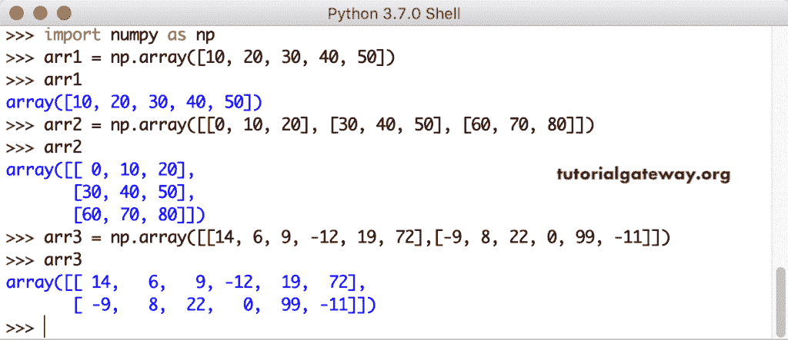

# Python 数字聚合函数

> 原文：<https://www.tutorialgateway.org/python-numpy-aggregate-functions/>

在 Python numpy 模块中，我们有许多聚合函数或统计函数来处理一维或多维数组。Python numpy 聚合函数是求和、最小值、最大值、平均值、平均值、乘积、中值、标准差、方差、argmin、argmax、百分位、cumprod、cumsum 和 corrcoef。

为了演示这些 Python numpy 聚合函数，我们使用下面显示的数组。

```
import numpy as np
arr1 = np.array([10, 20, 30, 40, 50])
arr1

arr2 = np.array([[0, 10, 20], [30, 40, 50], [60, 70, 80]])
arr2

arr3 = np.array([[14, 6, 9, -12, 19, 72],[-9, 8, 22, 0, 99, -11]])
arr3
```



## Python numpy 聚合函数示例

可用 Python numpy 聚合函数的列表，每个函数都有一个示例。

### python num py sum(python num py sum)函数

Python numpy`sum()`函数计算数组中值的总和。

```
arr1.sum()
arr2.sum()
arr3.sum()
```

这个 Python numpy`sum()`函数允许您使用一个称为轴的可选参数。这个 Python numpy 聚合函数有助于计算给定轴的总和。例如，axis = 0 返回 [Numpy](https://www.tutorialgateway.org/python-numpy-array/) 数组中每一列的总和。

```
arr2.sum(axis = 0)
arr3.sum(axis = 0)
```

axis = 1 返回数组中每行的总和

```
arr2.sum(axis = 1)
arr3.sum(axis = 1)
```


你不必在那些 [Python](https://www.tutorialgateway.org/python-tutorial/) 数组和括号里使用这个轴名。我的意思是，arr2.sum(轴= 1)与 arr2.sum(1)相同。

```
arr2.sum(0)
arr2.sum(1)
arr3.sum(0)
arr3.sum(1)
```


### Python numpy 平均值

Python numpy`average()`函数返回给定数组的平均值。

```
np.average(arr1)
np.average(arr2)
np.average(arr3)
```

x 轴和 Y 轴的平均值

```
np.average(arr2, axis = 0)
np.average(arr2, axis = 1)
```

不使用轴名计算 numpy 数组平均值。

```
np.average(arr3, 0)
np.average(arr3, 1)
```


### Python numpy prod

Python numpy`prod()`函数查找给定数组中所有元素的乘积。对于空数组，此 numpy`prod()`函数返回 1

```
np.prod([])
np.prod(arr1)
np.prod(arr2) # any number multiply by zero gives zero
```

这次我们使用的是二维数组。

```
x = np.array([[1, 2, 3], [4, 5, 6]])
np.prod(x)

y = np.random.randint(1, 10, size = (5, 5))
np.prod(y)
```

接下来，我们要分别计算 X 轴和 Y 轴上所有数字的乘积。

```
np.prod(x, axis = 0)
np.prod(x, axis = 1)
np.prod(y, axis = 0)
np.prod(y, axis = 1)
```

在不使用轴名的情况下找到 numpy 阵列产品。

```
np.prod(x, 1)
np.prod(y, 1)
```


### Python numpy min

Python `numpymin()`函数返回数组或给定轴中的最小值。

```
arr1.min()
arr2.min()
arr3.min()
```

我们正在寻找 X 轴和 Y 轴上的 numpy 数组最小值。

```
arr2.min(axis = 0)
arr2.min(axis = 1)
arr3.min(0)
arr3.min(1)
```


### Python 数组最小值

与`min()`函数不同，这个 Python 数组最小值函数接受两个数组。接下来，numpy array minimum 将一个数组中的每个数组项与另一个进行一对一的比较，并返回一个最小值数组。

```
import numpy as np

a = np.array([1, 20, 5, 22, 8, 15])
print(a)

b = np.array([12, 9, 3, 42, 6, 33])
print(b)

print('\n-----Minimum Array----')
print(np.minimum(a, b))
```


这次我们在随机生成的 5 * 5 矩阵上应用 Python 数组最小值函数。

```
import numpy as np
x = np.random.randint(1, 10, size = (5, 5))
print(x)
print()

y = np.random.randint(1, 10, size = (5, 5))
print(y)

print('\n-----Minimum Array----')
print(np.minimum(x, y))
```


### Python numpy 最大

Python numpy`max()`函数返回给定数组或给定轴中的最大数值。

```
arr1.max()
arr2.max()
arr3.max()
```

使用 numpy`max()`函数找到 X 轴和 Y 轴的最大值。

```
arr2.max(axis = 0)
arr2.max(axis = 1)
arr3.max(0)
arr3.max(1)
```


### Python numpy 阵列最大值

与`max()`函数不同，这个 Python numpy 数组最大值函数接受两个数组作为参数。接下来，该函数以一对一的方式将每个数组项与其他数组项进行比较，并返回一个最大值数组。

```
import numpy as np

a = np.array([1, 20, 5, 22, 8, 15])
print(a)

b = np.array([12, 9, 3, 42, 6, 33])
print(b)

print('\n-----Maximum Array----')
print(np.maximum(a, b))
```


这次我们生成了两个 5 * 5 的随机数矩阵。接下来，我们对它们使用了这个 Python 数组最大函数。

```
import numpy as np

x = np.random.randint(1, 10, size = (5, 5))
print(x)
print()
y = np.random.randint(1, 10, size = (5, 5))
print(y)

print('\n-----Maximum Array----')
print(np.maximum(x, y))
```


### Python numpy 的意思

Python numpy`mean()`函数返回给定数组或给定轴的平均值。这个数值平均值的数学公式是一个数组中所有项目的总和/元素的总数组。

```
arr1.mean()
arr2.mean()
arr3.mean()
```

x 轴和 Y 轴(或每行和每列)的平均值

```
arr2.mean(axis = 0)
arr2.mean(axis = 1)
```

我们在不使用轴名的情况下计算数值数组平均值。

```
arr3.mean(0)
arr3.mean(1)
```


### Python numpy median

Python numpy 中值函数返回数组或轴的中值。

```
np.median(arr1)
np.median(arr2)
np.median(arr3)

# Median of x and Y axis
np.median(arr2, axis = 0)
np.median(arr2, axis = 1)

# Find median with axis number.
np.median(arr3, 0)
np.median(arr3, 1)
```


### Python numpy`var()`函数

Python numpy`var()`函数返回给定数组或给定轴的方差。这个 Python numpy var 的公式是:(item 1–均值)2+……(item n–均值)2 /项目总数

```
arr1.var()
arr2.var()
arr3.var()

x.var()
y.var()
```


### Python numpy std

Python numpy`std()`函数返回给定数组或给定轴的标准偏差。这背后的公式是 numpy 数组方差的平方根。

```
arr1.std()
arr2.std()
arr3.std()

x.std()
y.std()
```


### Python numpy cumsum

Python numpy`cumsum()`函数返回给定数组或给定轴中的累积和。

```
arr1.cumsum()
arr2.cumsum()
arr3.cumsum()
```

求 x 轴和 Y 轴的累计和

```
arr2.cumsum(axis = 0)
arr2.cumsum(axis = 1)

# Cumulative Sum of an array by axis without using the axis name.
arr3.cumsum(0)
arr3.cumsum(1)
```


### python numpy cumprod

Python numpy`cumprod()`函数返回给定数组或给定轴中的累计乘积。

```
arr1.cumprod()
 arr2.cumprod()
 arr3.cumprod()

# Let me find the cumulative product of array elements in x and Y axis
arr2.cumprod(axis = 0)
arr2.cumprod(axis = 1)
```

我们在不使用轴名的情况下，通过轴找到第三个数组的累积积。

```
arr3.cumprod(0)  
arr3.cumprod(1)
```


### Python numpy 百分位数

Python numpy 百分点函数查找数组或轴的百分点(基于给定值)。

```
np.percentile(arr1, 10)
np.percentile(arr1, 30)
np.percentile(arr1, 50)
np.percentile(arr1, 75)
np.percentile(arr1, 100)

np.percentile(arr2, 50)
np.percentile(arr3, 50)

# Let me find the percentile of x and Y axis
np.percentile(arr2, 50, axis = 0)
np.percentile(arr2, 50, axis = 1)

# Cumulative Product of third array by axis without using the axis name.
np.percentile(arr3, 75, 0)
np.percentile(arr3, 75, 1)
```


### Python numpy argmin

Python numpy 参数返回给定数组或给定轴中最小值的索引位置。为了演示这个 numpy argmin 和`argmax()`函数，我们声明了另外两个随机值数组

```
arr4 = np.random.randint(9, size = (9))
arr4

arr5 = np.random.randint(25, size = (5, 5))
arr5
```

接下来，我们将在这些数组上使用 Python numpy`argmin()`函数

```
arr4.argmin()
arr5.argmin()
arr3.argmin()

# Let me find the index position of minimum value in arr5 x and Y axis
arr5.argmin(axis = 0)
arr5.argmin(axis = 1)

# Index of minimum values in third array by axis.
arr3.argmin(0)
arr3.argmin(1)
```


### Python numpy argmax

Python numpy argmax 返回给定数组或给定轴中最大值的索引位置。这里，我们对 arr3、arr4 和 arr5 使用了`numpy.argmax()`函数。

```
arr4.argmax()
arr5.argmax()
arr3.argmax()
```

让我们通过 X 轴和 Y 轴找到 arr3 和 arr5 中最大值的索引位置。

```
arr3.argmax(axis = 0)
arr3.argmax(axis = 1)

# Index of the maximum values in an array arr5 by axis.
arr5.argmax(0)
arr5.argmax(1)
```


### python numpy corrcoef

Python numpy`corrcoef()`函数查找并返回数组的相关系数。

```
np.corrcoef(arr1)
np.corrcoef(arr2)
np.corrcoef(arr3)

np.corrcoef(x)
np.corrcoef(y)
```

