# NumPy 算术运算

> 原文：<https://www.tutorialgateway.org/python-numpy-arithmetic-operations/>

NumPy 模块提供加、减、乘、除等各种算术功能，对数组进行 NumPy 算术运算。除了它们之外，您还可以使用标准的 Python 算术运算符。数组应该是相同的形状，或者它们必须绑定到数组规则才能使用 numpy 算术函数。

我们使用下面的数组来演示使用算术函数和算术运算符的 NumPy 算术运算

```py
a = np.array([10, 50, 100, 150, 250])
a 

b = np.array([6, 5, 4, 3, 2])
b

c = np.array([[26,  48,  91,  57, 120], [33,  95,  68, 109, 155], [111, 194,   7,  22, 124], [ 82, 119,  18, 156,  81],[ 38,  10, 151,  24,  14]])
c
# You can create an array of random numbers using the below statement
# c = np.random.randint(0, 200, size = (5, 5))
# c

d = np.array([[12, 11,  0,  9,  7], [10,  4, 11,  6,  9], [ 9,  2, 10,  9, 11], [ 5, 14,  0, 11,  8], [ 5, 12,  5,  5, 11]])
d

# d = np.random.randint(0, 15, size = (5, 5))
# d

e = np.array([11, 22, 33, 44, 55])
e
```

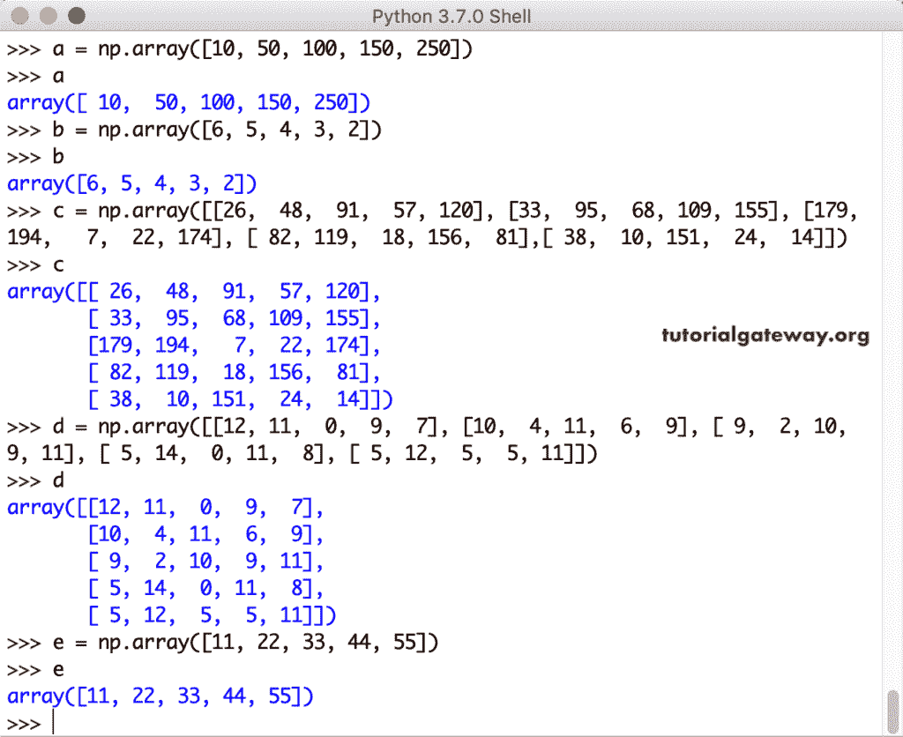

## NumPy 算术运算示例

[Python](https://www.tutorialgateway.org/python-tutorial/) 中可用于执行 NumPy 算术运算的[算术运算符](https://www.tutorialgateway.org/python-arithmetic-operators/)和算术函数列表

### NumPy 添加函数

这个 NumPy`add()`函数添加了两个数组。

```py
np.add(a, b)
np.add(c, d)
```

让我尝试添加一个不同大小的 [NumPy](https://www.tutorialgateway.org/python-numpy-array/) 数组

```py
np.add(a, c)
```

我们得到了意想不到的结果。让我尝试添加三个数组

```py
np.add(a, b, c)
```

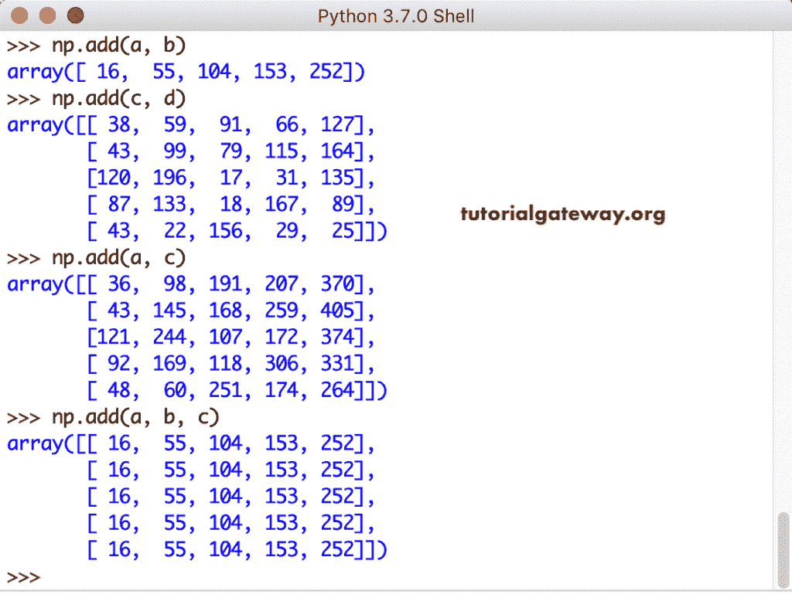

我想你明白使用这个 NumPy`add()`函数的局限性了。

#### NumPy 算术运算符+

让我使用算术运算符+来添加数组

```py
a + b
c + d
a + c
a + b + c
a + b + c + d
```

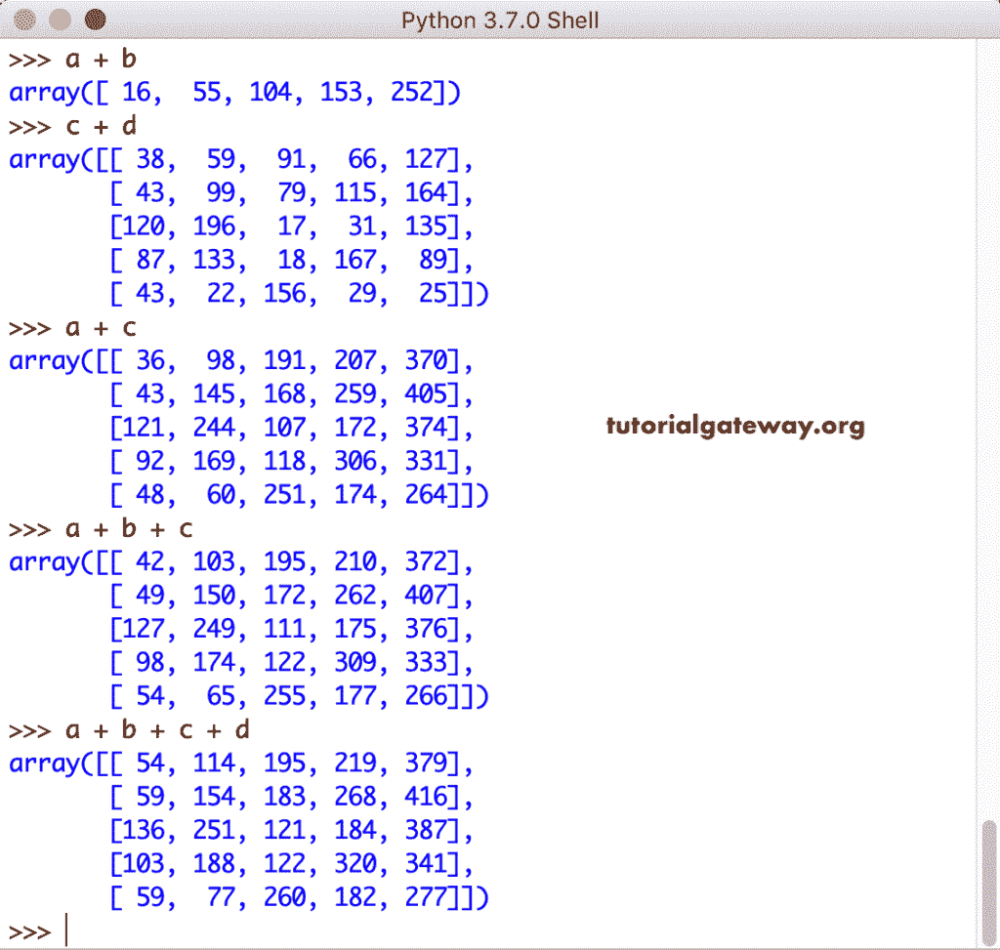

### NumPy 减法函数

这个 NumPy 减法函数从另一个数组中减去一个数组。

```py
np.subtract(a, b)
np.subtract(c, d)
np.subtract(d, c)
```

我们正在减去不同大小的数组。

```py
np.subtract(a, c)
```

让我尝试在三个数组上使用 NumPy 减法函数

```py
np.subtract(a, b, c)
```

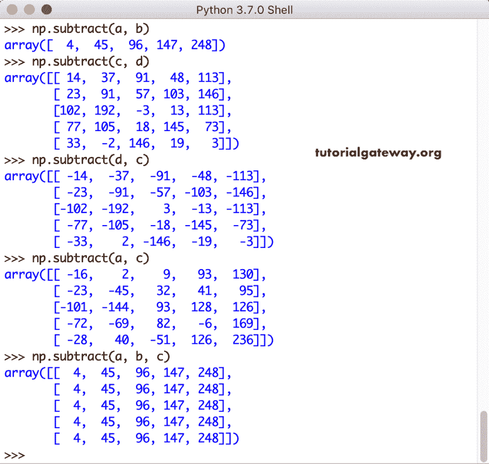

#### NumPy 算术运算符–

我们得到了意想不到的结果！。让我用算术运算符来减去数组

```py
a - b
c - d
a - c
a - b - c
c - a - b - d
```

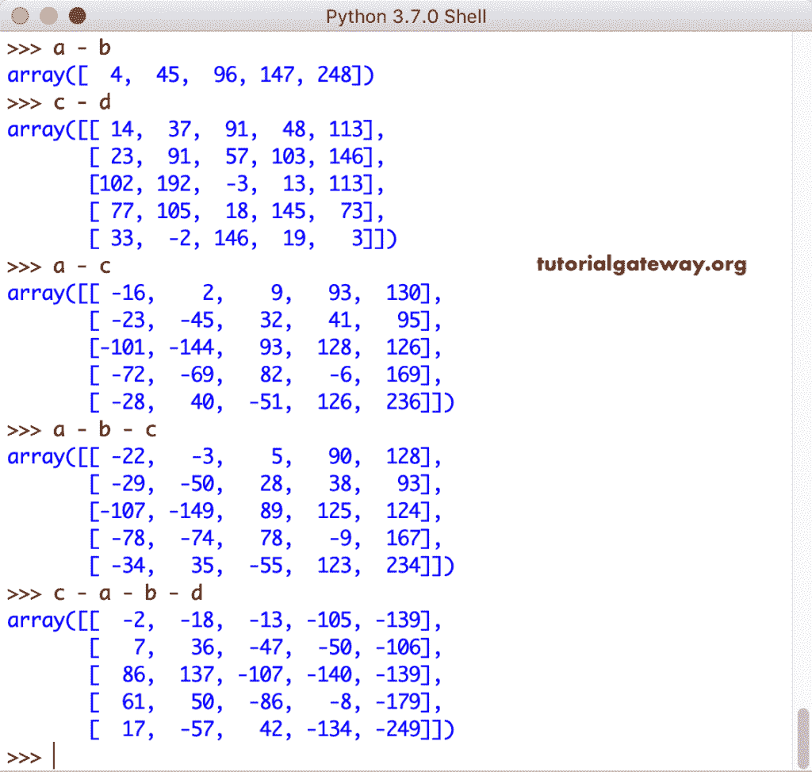

### NumPy 乘法函数

这个 NumPy 乘法函数将两个数组相乘。

```py
np.multiply(a, b)
np.multiply(c, d)
np.multiply(d, c)
```

将不同大小的数组相乘。

```py
np.multiply(a, c)
```

让我乘以三个不同大小的数组

```py
np.multiply(a, b, c)
```

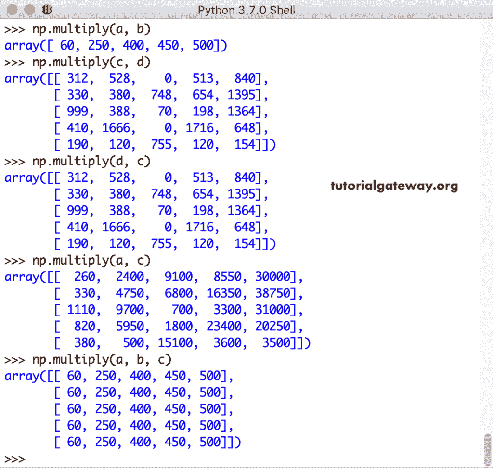

#### NumPy 算术运算符*

这次，我们使用算术运算符*来乘法数组

```py
a * b
c * d
a * c
a * b * c
a * b * c * d
```

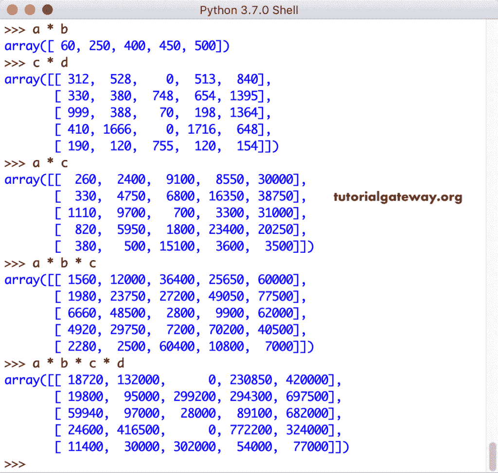

### NumPy 除法函数

Python `numpydivide()`函数将一个数组与另一个数组分开。

```py
np.divide(a, b)
np.divide(c, d)
np.divide(d, c)
```

划分不同大小的数组。

```py
np.divide(a, c)
```

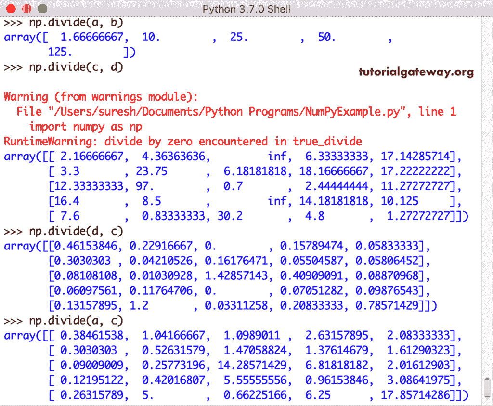

#### NumPy 算术运算符/

使用算术运算符/来划分这些数组

```py
a / b
d / c
a / c
a / b / c
c / a / b / d
```

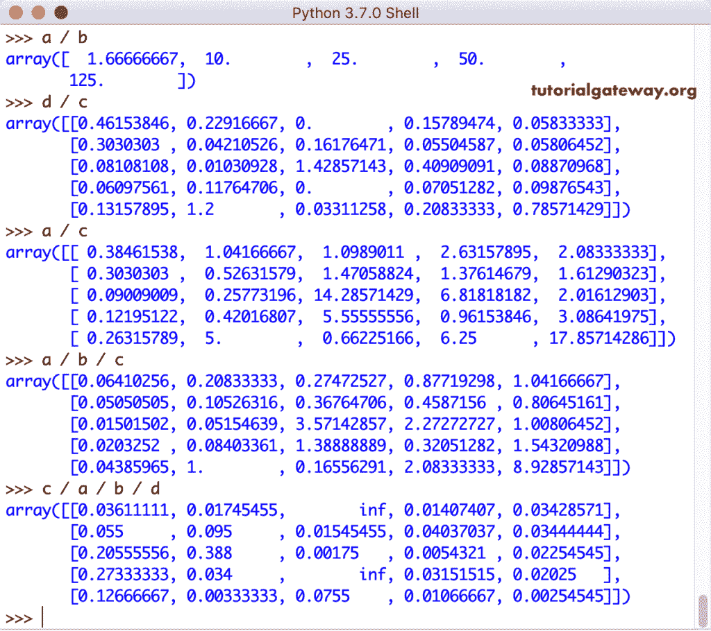

### NumPy`mod()`函数

NumPy`mod()`函数返回除法的余数。

```py
np.mod(a, 3)
np.mod(a, 6)
np.mod(c, 4)
np.mod(d, 2)
```

现在，我们在多个数组上使用了这个 NumPy`mod()`函数

```py
np.mod(a, b)
np.mod(a, e)
np.mod(d, c)
```

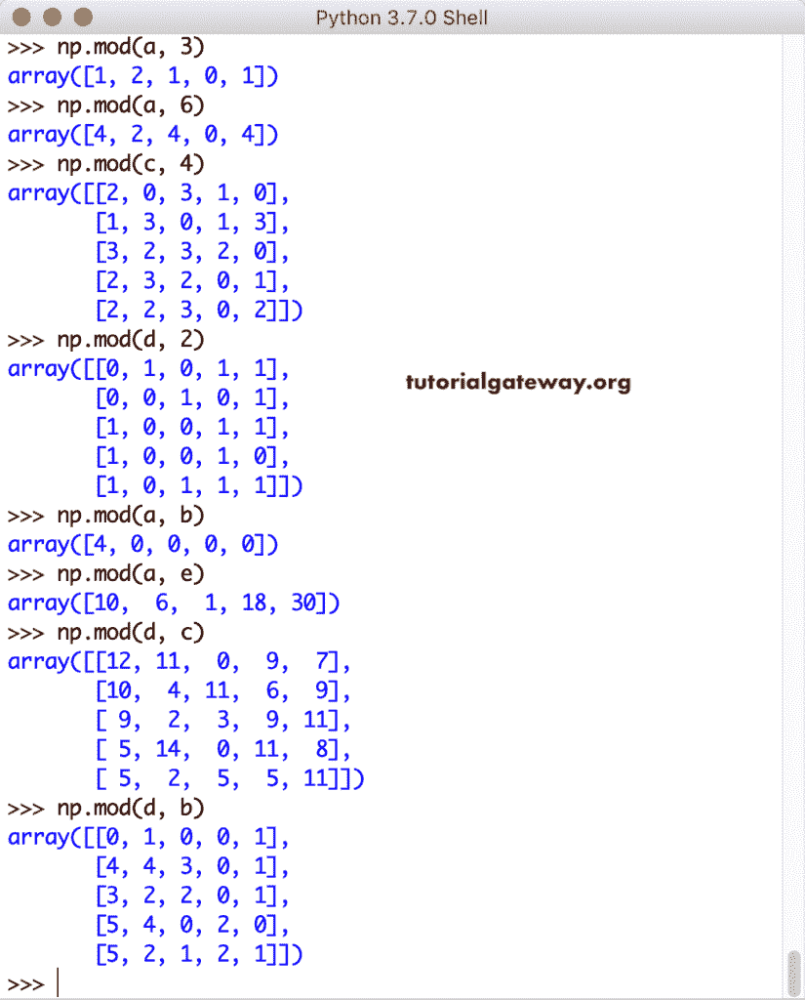

### NumPy 余数函数

与`mod()`函数类似，NumPy 提醒函数返回算术除法的余数。

```py
np.remainder(a, 4)
np.remainder(a, 7)
np.remainder(c, 5)
np.remainder(d, 9)
```

让我使用这个带有两个参数的 numpy 余数函数作为数组

```py
np.remainder(a, b)
np.remainder(a, e)

np.remainder(c, d)
np.remainder(d, b)
```

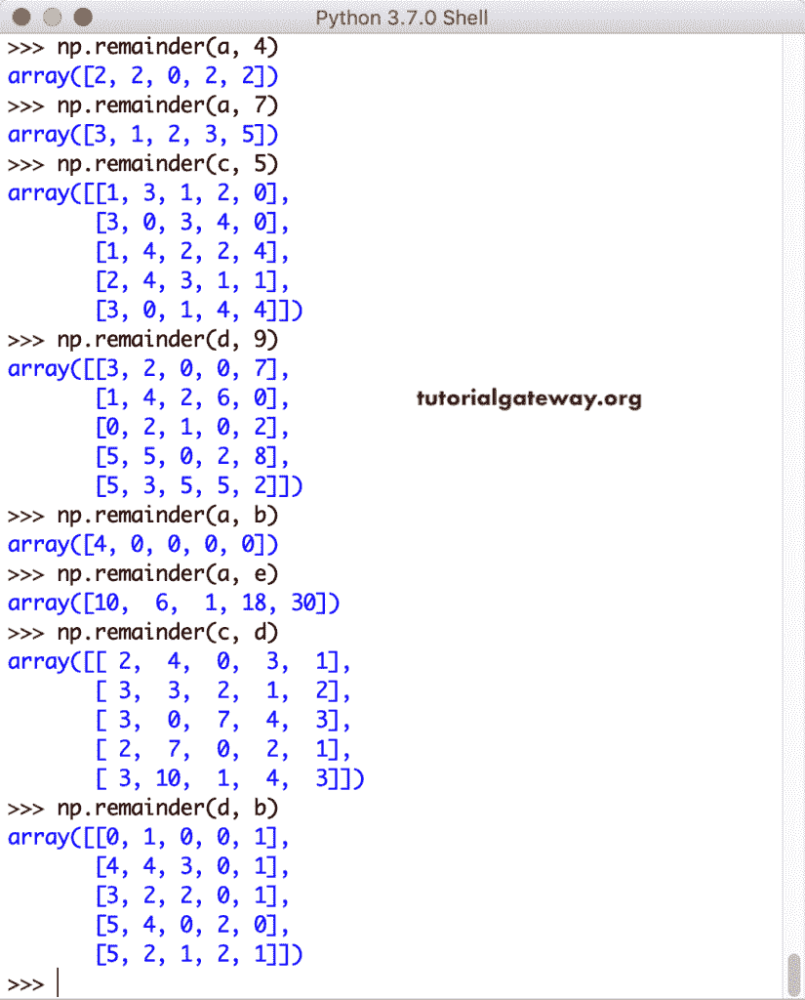