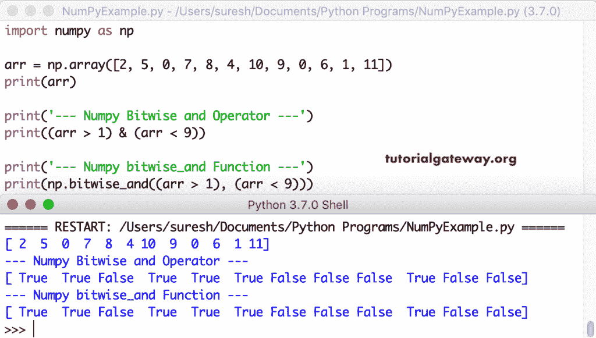

# Python Numpy 按位运算符

> 原文：<https://www.tutorialgateway.org/python-numpy-bitwise-operators/>

用于执行按位运算的 Python 按位运算符和函数。它们是按位 and、&、按位 or、|、反转(按位非)、左移位、<>。这些 Python Numpy 按位运算符比较两个值的二进制表示，并返回输出。您也可以使用这些 Python Numpy 按位运算符和函数作为比较运算符。我是说，把每一个项目和一个条件进行比较。

## Python Numpy 按位“与”

Python Numpy 按位 and 运算符按位`and()`函数返回真，如果两个位值都返回真，否则返回假。在我们进入实际示例之前，让我使用下面的 Python 程序向您展示这个按位 and 背后的真值表。

```
import numpy as np

print('----Bitwise and operator Example----')
print('True & True   = ', (True & True))
print('True & False  = ', (True & False))
print('False & True  = ', (False & True))
print('False & False = ', (False & False))

print('\n----bitwise_and Function Example----')
print('True bitwise_and True   = ', np.bitwise_and(True, True))
print('True bitwise_and False  = ', np.bitwise_and(True, False))
print('False bitwise_and True  = ', np.bitwise_and(False, True))
print('False bitwise_and False = ', np.bitwise_and(False, False))
```

Numpy 数组按位与运算符输出

```
----Bitwise and operator Example----
True & True   =  True
True & False  =  False
False & True  =  False
False & False =  False

----bitwise_and Function Example----
True bitwise_and True   =  True
True bitwise_and False  =  False
False bitwise_and True  =  False
False bitwise_and False =  False
```

在这个例子中，我们声明了两个整数变量，并对它们使用了按位 and。首先，它将它们转换为二进制格式，然后将 a 的每个位与 b 进行比较。这里，12 = 00001100，25 = 00011001，因此，00001100 & 00011001 返回 00001000 意味着 8。

```
import numpy as np

a = 12
b = 25

print('Binary Value of 12 = ', bin(a))
print('Binary Value of 25 = ', bin(b))

print('\nBinary Value of 12 = ', np.binary_repr(a))
print('Binary Value of 25 = ', np.binary_repr(b))

print('\nBitwise and Operator Result = ', a & b)
print('bitwise_and Function Result = ', np.bitwise_and(a, b))
```

Numpy 数组按位与运算符输出

```
Binary Value of 12 =  0b1100
Binary Value of 25 =  0b11001

Binary Value of 12 =  1100
Binary Value of 25 =  11001

Bitwise and Operator Result =  8
bitwise_and Function Result =  8
```

在上面的 [Python](https://www.tutorialgateway.org/python-tutorial/) 示例中，我们对单个值使用了这个 [Numpy](https://www.tutorialgateway.org/python-numpy-array/) 按位 _and。让我在两个数组上尝试这个按位 and 运算符和函数。这意味着 arr1 中的单个项与 arr2 执行二进制“与”运算，并返回按位“与”结果。

```
import numpy as np

arr1 = np.array([2, 12, 9, 12, 17, 11])
print(arr1)
arr2 = np.array([14, 13, 65, 25, 42, 65])
print(arr2)

print('\nNumpy Bitwise and Operator Result = ', (arr1 & arr2))
print('Numpy bitwise_and Function Result = ', np.bitwise_and(arr1, arr2))
print()

x = np.random.randint(1, 20, size = (3, 7))
print(x)
y = np.random.randint(50, 125, size = (3, 7))
print(y)

print('\n---Numpy Bitwise and Operator Result---\n', (x & y))
print('---Numpy bitwise_and Function Result---\n ', np.bitwise_and(x, y))
```

Numpy 数组按位与运算符输出

```
[ 2 12  9 12 17 11]
[14 13 65 25 42 65]

Numpy Bitwise and Operator Result =  [ 2 12  1  8  0  1]
Numpy bitwise_and Function Result =  [ 2 12  1  8  0  1]

[[18  1 11 10  5 14  6]
 [13  6  3 14  3  7  6]
 [10 14 18 12  4 19  6]]
[[121  86  73  98  73  96  82]
 [ 72 119 113 103 110  65 120]
 [ 55  77  75  72  59  64 113]]

---Numpy Bitwise and Operator Result---
 [[16  0  9  2  1  0  2]
 [ 8  6  1  6  2  1  0]
 [ 2 12  2  8  0  0  0]]
---Numpy bitwise_and Function Result---
  [[16  0  9  2  1  0  2]
 [ 8  6  1  6  2  1  0]
 [ 2 12  2  8  0  0  0]]
```

到目前为止，我们使用 Numpy 按位和执行按位运算。但是，您也可以使用它们来执行比较操作。让我使用按位“与”来检查该项是否大于 1 且小于 9。如果条件为真，则返回真，否则返回假。

```
import numpy as np

arr = np.array([2, 5, 0, 7, 8, 4, 10, 9, 0, 6, 1, 11])
print(arr)

print('--- Numpy Bitwise and Operator ---')
print((arr > 1) & (arr < 9))

print('--- Numpy bitwise_and Function ---')
print(np.bitwise_and((arr > 1), (arr < 9)))
```



这里，我们使用按位`and()`函数和按位 and 运算符对多维数组进行比较。

```
import numpy as np

arr = np.random.randn(3, 5)
print(arr)

print('--- Two Dimensional Numpy Bitwise and Operator ---')
print((arr > 0) & (arr < 0.5))

print('--- Two Dimensional Numpy bitwise_and Function ---')
print(np.bitwise_and((arr > 0), (arr < 0.5)))

arr2 = np.random.randint(1, 25, size = (2, 2, 4))
print('--- Three Dimensional Random Array ---')
print(arr2)

print('--- Three Dimensional Numpy Bitwise and Operator ---')
print((arr2 > 5) & (arr2 < 20))

print('--- Three Dimensional Numpy bitwise_and Function ---')
print(np.bitwise_and((arr2 > 5), (arr2 < 20)))
```

数字数组按位与输出

```
[[-0.49370172  0.36784164 -0.5634175  -1.52734428  1.97063201]
 [ 0.33895941 -0.07471463  2.26536834 -1.80136643 -0.06620597]
 [-0.20766583  0.38012599 -0.85149217  0.01983919 -1.45677273]]
--- Two Dimensional Numpy Bitwise and Operator ---
[[False  True False False False]
 [ True False False False False]
 [False  True False  True False]]
--- Two Dimensional Numpy bitwise_and Function ---
[[False  True False False False]
 [ True False False False False]
 [False  True False  True False]]
--- Three Dimensional Random Array ---
[[[24 21 24 23]
  [10 11  7 13]]

 [[17 19 13 20]
  [ 5 24  4 16]]]
--- Three Dimensional Numpy Bitwise and Operator ---
[[[False False False False]
  [ True  True  True  True]]

 [[ True  True  True False]
  [False False False  True]]]
--- Three Dimensional Numpy bitwise_and Function ---
[[[False False False False]
  [ True  True  True  True]]

 [[ True  True  True False]
  [False False False  True]]]
```

## Python Numpy 按位或

如果两个位值都返回 False，Python Numpy 按位或运算符和按位或函数返回 False，否则返回 true。让我用下面的程序向您展示按位或真值表。

```
import numpy as np

print('----Bitwise or operator Example----')
print('True | True   = ', (True | True))
print('True | False  = ', (True | False))
print('False | True  = ', (False | True))
print('False | False = ', (False | False))

print('\n----bitwise_or Function Example----')
print('True bitwise_or True   = ', np.bitwise_or(True, True))
print('True bitwise_or False  = ', np.bitwise_or(True, False))
print('False bitwise_or True  = ', np.bitwise_or(False, True))
print('False bitwise_or False = ', np.bitwise_or(False, False))
```

数字数组按位或输出

```
----Bitwise or operator Example----
True | True   =  True
True | False  =  True
False | True  =  True
False | False =  False

----bitwise_or Function Example----
True bitwise_or True   =  True
True bitwise_or False  =  True
False bitwise_or True  =  True
False bitwise_or False =  False
```

这里，我们声明了两个 int 变量，并对这两个变量使用了按位 or 和按位 or。我们已经知道，12 = 00001100，25 = 00011001 所以，00001100 | 00011001 retunes 00011101 表示 29。

```
import numpy as np

a = 12
b = 25

print('Binary Value of 12 = ', np.binary_repr(a))
print('Binary Value of 25 = ', np.binary_repr(b))

print('Bitwise or Operator Result = ', a | b)
print('bitwise_or Function Result = ', np.bitwise_or(a, b))
```

数字数组按位或输出

```
Binary Value of 12 =  1100
Binary Value of 25 =  11001
Bitwise or Operator Result =  29
bitwise_or Function Result =  29
```

在这个例子中，我们在两个数组上使用了 Numpy 按位`or()`函数和按位 or 运算符。

```
import numpy as np

arr1 = np.array([2, 5, 0, 12, 8, 10])
print(arr1)

arr2 = np.array([12, 30, 6, 25, 12, 65])
print(arr2)

print('\nNumpy Bitwise or Operator Result = ', (arr1 | arr2))
print('Numpy bitwise_or Function Result = ', np.bitwise_or(arr1, arr2))
print()

x = np.random.randint(1, 15, size = (3, 5))
print(x)
y = np.random.randint(10, 25, size = (3, 5))
print(y)

print('\n---Numpy Bitwise or Operator Result---\n', (x | y))
print('---Numpy bitwise_or Function Result---\n ', np.bitwise_or(x, y))
```

数字数组按位或输出

```
[ 2  5  0 12  8 10]
[12 30  6 25 12 65]

Numpy Bitwise or Operator Result =  [14 31  6 29 12 75]
Numpy bitwise_or Function Result =  [14 31  6 29 12 75]

[[11  7 12  7 10]
 [ 4  2  5 12 12]
 [ 9 12  3 11 13]]
[[16 17 11 15 10]
 [18 19 19 22 19]
 [22 17 14 19 23]]

---Numpy Bitwise or Operator Result---
 [[27 23 15 15 10]
 [22 19 23 30 31]
 [31 29 15 27 31]]
---Numpy bitwise_or Function Result---
  [[27 23 15 15 10]
 [22 19 23 30 31]
 [31 29 15 27 31]]
```

像按位“与”一样，您也可以使用按位“或”和按位“或”函数来执行逻辑比较。让我使用这个按位 or 运算符来检查数组中的项是小于 3 还是大于 8。如果任一条件为真，则返回真，否则返回假。

```
import numpy as np

arr = np.array([2, 5, 0, 7, 8, 4, 10, 9, 0, 6, 1, 11])
print(arr)

print('--- Numpy Bitwise or Operator ---')
print((arr < 3) | (arr > 8))

print('--- Numpy bitwise_or Function ---')
print(np.bitwise_or((arr < 3), (arr > 8)))
```

数字数组按位或输出

```
[ 2  5  0  7  8  4 10  9  0  6  1 11]
--- Numpy Bitwise or Operator ---
[ True False  True False False False  True  True  True False  True  True]
--- Numpy bitwise_or Function ---
[ True False  True False False False  True  True  True False  True  True]
```

这里，我们使用按位“或”和按位“或”对多维数组进行比较。

```
import numpy as np

arr = np.random.randn(3, 5)
print(arr)

print('--- Two Dimensional Numpy Bitwise or Operator ---')
print((arr < 0) | (arr > 1))

print('--- Two Dimensional Numpy bitwise_or Function ---')
print(np.bitwise_or((arr < 0), (arr > 1)))

arr2 = np.random.randint(1, 25, size = (2, 2, 4))
print('--- Three Dimensional Random Array ---')
print(arr2)

print('--- Three Dimensional Numpy Bitwise or Operator ---')
print((arr2 < 8) | (arr2 > 17))

print('--- Three Dimensional Numpy bitwise_or Function ---')
print(np.bitwise_or((arr2 < 8), (arr2 > 17)))
```

数字数组按位或输出

```
[[ 1.04390004  0.66190755  0.27436456 -1.80262006 -0.263908  ]
 [ 0.4266228  -0.08927048  0.48680432 -3.34951675  0.36628762]
 [-1.41136647 -0.42538889 -1.88675276 -1.11568904  0.47588306]]
--- Two Dimensional Numpy Bitwise or Operator ---
[[ True False False  True  True]
 [False  True False  True False]
 [ True  True  True  True False]]
--- Two Dimensional Numpy bitwise_or Function ---
[[ True False False  True  True]
 [False  True False  True False]
 [ True  True  True  True False]]
--- Three Dimensional Random Array ---
[[[ 8 17 10  5]
  [ 9 16 10 23]]

 [[11 11  6 10]
  [ 9  4  6 15]]]
--- Three Dimensional Numpy Bitwise or Operator ---
[[[False False False  True]
  [False False False  True]]

 [[False False  True False]
  [False  True  True False]]]
--- Three Dimensional Numpy bitwise_or Function ---
[[[False False False  True]
  [False False False  True]]

 [[False False  True False]
  [False  True  True False]]]
```

## Python Numpy 左移位

Python Numpy 左移运算符将二进制数向左移动指定的位置数。例如，a<<1 或 left_shift(a，1)将 12 转换为二进制值，然后左移一个位置。a = 00001100<<1 = 00011000 = 24。如果 a<<2，那么 00110000。

```
import numpy as np

a = 12
b = 25

print('Binary Value of 12 = ', np.binary_repr(a))
print('Binary Value of 25 = ', np.binary_repr(b))

print('\nLeft Shift Operator Result = ', a << 1)
print('left_shift Function Result = ', np.left_shift(a, 1))

print('\nLeft Shift Operator Result = ', b << 1)
print('left_shift Function Result = ', np.left_shift(b, 1))
```

数字数组左移输出

```
Binary Value of 12 =  1100
Binary Value of 25 =  11001

Left Shift Operator Result =  24
left_shift Function Result =  24

Left Shift Operator Result =  50
left_shift Function Result =  50
```

在这个例子中，我们在一个数组上使用了 Numpy 左移函数和左移运算符。第一个语句(arr1 << 1)将对数组中的每一项执行一个位置的二进制左移。第二个(arr1 << arr2)基于 arr2 项目执行左移。我的意思是，2 << 1，12 << 2，9 << 3，12 << 4，17 << 5，11 << 6

```
import numpy as np

arr1 = np.array([2, 12, 9, 12, 17, 11])
print(arr1)

arr2 = np.array([1, 2, 3, 4, 5, 6])
print(arr2)

print('\nNumpy Left Shift Operator Result = ', (arr1 << 1))
print('Numpy left_shift Function Result = ', np.left_shift(arr1, 1))

print('\nNumpy Left Shift Operator Result = ', (arr1 << arr2))
print('Numpy left_shift Function Result = ', np.left_shift(arr1, arr2))
print()

x = np.random.randint(1, 20, size = (3, 7))
print(x)
y = np.random.randint(1, 5, size = (3, 7))
print(y)

print('\n---Numpy Left Shift Operator Result---\n', (x << y))
print('---Numpy left_shift Function Result---\n ', np.left_shift(x, y))
```

数字数组左移输出

```
[ 2 12  9 12 17 11]
[1 2 3 4 5 6]

Numpy Left Shift Operator Result =  [ 4 24 18 24 34 22]
Numpy left_shift Function Result =  [ 4 24 18 24 34 22]

Numpy Left Shift Operator Result =  [  4  48  72 192 544 704]
Numpy left_shift Function Result =  [  4  48  72 192 544 704]

[[ 3 13 18 14  5  4  2]
 [13 14  7  9  7  6  4]
 [ 8 13  4  3 18  4  8]]
[[2 3 1 3 4 2 1]
 [2 2 3 2 2 2 1]
 [4 2 2 2 4 3 4]]

---Numpy Left Shift Operator Result---
 [[ 12 104  36 112  80  16   4]
 [ 52  56  56  36  28  24   8]
 [128  52  16  12 288  32 128]]
---Numpy left_shift Function Result---
  [[ 12 104  36 112  80  16   4]
 [ 52  56  56  36  28  24   8]
 [128  52  16  12 288  32 128]]
```

## Python Numpy 右移

Python Numpy 右移运算符将二进制数向右移动给定数量的位置。例如，b>>1 或 right_shift(b，1)将 25 转换为二进制值，然后，右移一个位置。b>>1 = 00011001>>1 = 00001100 = 12。

```
import numpy as np

a = 12
b = 25

print('Binary Value of 12 = ', np.binary_repr(a))
print('Binary Value of 25 = ', np.binary_repr(b))

print('\nRight Shift Operator Result = ', a >> 1)
print('right_shift Function Result = ', np.right_shift(a, 1))

print('\nRight Shift Operator Result = ', b >> 1)
print('right_shift Function Result = ', np.right_shift(b, 1))
```

数字数组右移输出

```
Binary Value of 12 =  1100
Binary Value of 25 =  11001

Right Shift Operator Result =  6
right_shift Function Result =  6

Right Shift Operator Result =  12
right_shift Function Result =  12
```

这里，我们在数组上使用 Numpy 右移函数和右移运算符。第一个 [Numpy](https://www.tutorialgateway.org/python-numpy-array/) 语句(arr1 > > 1)对数组中的每个项目执行一个位置的二进制右移。第二个(arr1 > > arr2)根据 arr2 项进行右移。我的意思是，2 > > 1、12 > > 2、9 > > 3、12 > > 4、17 > > 5、11 > > 6

```
import numpy as np

arr1 = np.array([2, 12, 9, 12, 17, 11])
print(arr1)

arr2 = np.array([1, 2, 3, 4, 5, 6])
print(arr2)

print('\nNumpy right Shift Operator Result = ', (arr1 >> 1))
print('Numpy right_shift Function Result = ', np.right_shift(arr1, 1))

print('\nNumpy right Shift Operator Result = ', (arr1 >> arr2))
print('Numpy right_shift Function Result = ', np.right_shift(arr1, arr2))
print()

x = np.random.randint(1, 20, size = (3, 7))
print(x)
y = np.random.randint(1, 5, size = (3, 7))
print(y)

print('\n---Numpy right Shift Operator Result---\n', (x >> y))
print('---Numpy right_shift Function Result---\n ', np.right_shift(x, y))
```

数字数组右移输出

```
[ 2 12  9 12 17 11]
[1 2 3 4 5 6]

Numpy right Shift Operator Result =  [1 6 4 6 8 5]
Numpy right_shift Function Result =  [1 6 4 6 8 5]

Numpy right Shift Operator Result =  [1 3 1 0 0 0]
Numpy right_shift Function Result =  [1 3 1 0 0 0]

[[11 12 12 12  2 12  4]
 [ 1 14 14 14 17 12  2]
 [12 11 10 12  2  9 11]]
[[3 3 1 1 3 3 3]
 [4 4 4 1 2 4 4]
 [1 3 1 2 4 3 1]]

---Numpy right Shift Operator Result---
 [[1 1 6 6 0 1 0]
 [0 0 0 7 4 0 0]
 [6 1 5 3 0 1 5]]
---Numpy right_shift Function Result---
  [[1 1 6 6 0 1 0]
 [0 0 0 7 4 0 0]
 [6 1 5 3 0 1 5]]
```

## Python Numpy 变频器

Python Numpy 反转函数与按位非运算符相同。我们用下面显示的 [Python](https://www.tutorialgateway.org/python-tutorial/) 例子来展示同样的用法。

```
import numpy as np

arr1 = np.array([10], dtype = np.uint8)
print(arr1)

print('Invert Value of arr1 = ', np.invert(arr1))

print('Binary Representation of arr1 = ', np.binary_repr(10, 8))
print('Binary Representation of x    = ', np.binary_repr(245, 8))

arr2 = np.array([1, 2, 3, 4, 5, 6], dtype = np.uint8)
print(arr2)
print('Invert Value of arr1 = ', np.invert(arr2))

for x in arr2:
    print('Binary Value of arr2  =', np.binary_repr(x, 8))

print('Binary Representation of 254 = ', np.binary_repr(254, 8))
print('Binary Representation of 253 = ', np.binary_repr(253, 8))
print('Binary Representation of 252 = ', np.binary_repr(252, 8))
print('Binary Representation of 251 = ', np.binary_repr(251, 8))
print('Binary Representation of 250 = ', np.binary_repr(250, 8))
print('Binary Representation of 249 = ', np.binary_repr(249, 8))
```

Python Numpy 数组反转函数

```
[10]
Invert Value of arr1 =  [245]
Binary Representation of arr1 =  00001010
Binary Representation of x    =  11110101
[1 2 3 4 5 6]
Invert Value of arr1 =  [254 253 252 251 250 249]
Binary Value of arr2  = 00000001
Binary Value of arr2  = 00000010
Binary Value of arr2  = 00000011
Binary Value of arr2  = 00000100
Binary Value of arr2  = 00000101
Binary Value of arr2  = 00000110
Binary Representation of 254 =  11111110
Binary Representation of 253 =  11111101
Binary Representation of 252 =  11111100
Binary Representation of 251 =  11111011
Binary Representation of 250 =  11111010
Binary Representation of 249 =  11111001
```