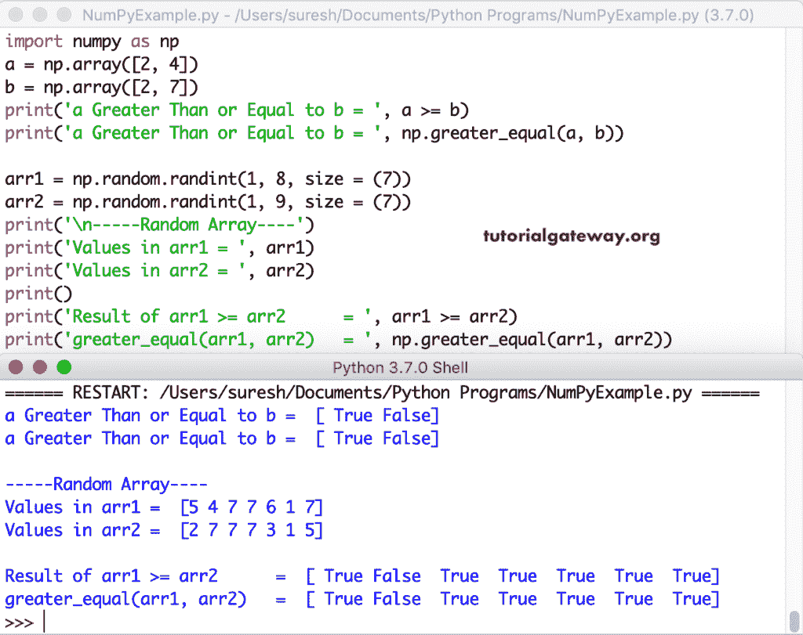

# Python 数字比较运算符

> 原文：<https://www.tutorialgateway.org/python-numpy-comparison-operators/>

Python numpy 比较运算符和函数用于比较数组项，并返回布尔值 True 或 false。Python Numpy 比较函数有大于、大于等于、小于、小于等于、等于和不等于。和其他的一样，Python Numpy 比较运算符是、> =、==和！=

为了演示这些 Python numpy 比较运算符和函数，我们使用 numpy randint 随机函数来生成随机的二维和三维整数数组。

第一个数组生成一个大小为 5 行 8 列的二维数组，值在 10 到 50 之间。

```
arr1 = np.random.randint(10, 50, size = (5, 8))
```

第二个数组生成大小为 2 * 3 * 6 的随机三维数组。生成的随机值介于 1 和 20 之间。

```
arr2 = np.random.randint(1, 20, size = (2, 3, 6))
```

## Python 数字数组更大

这是一个简单的 Python Numpy 比较运算符示例，演示了 Python Numpy 的更大功能。首先，我们声明了一个随机元素的数组。接下来，我们检查数组中的元素是否大于 0，大于 1 和 2。如果为真，则返回真，否则返回假。

```
# Python array greater

import numpy as np

x = np.array([0, 2, 3, 0, 1, 6, 5, 2])
print('Original Array = ', x)
print('\nGreater Than 0 = ', np.greater(x, 0))
print()

print('Greater Than 1 = ', np.greater(x, 1))
print()

print('Greater Than 2 = ', np.greater(x, 2))
```


在这个例子中，我们在 2D 和三维数组上使用了 Python`Numpy()`函数。第一个数组较大函数检查二维中的值是否大于 30。如果为真，则返回布尔真，否则返回假。接下来，我们检查三维数组中的 [Python](https://www.tutorialgateway.org/python-tutorial/) 数组元素是否大于 10。

```
import numpy as np

arr1 = np.random.randint(10, 50, size = (5, 8))
print('\n-----Two Dimensional Random Array----')
print(arr1)
print()
print(np.greater(arr1, 30))

arr2 = np.random.randint(1, 20, size = (2, 3, 6))
print('\n-----Three Dimensional Random Array----')
print(arr2)
print()
print(np.greater(arr2, 10))
```


## Python Numpy 数组大于等于

Python Numpy`greater_equal()`函数检查给定数组中的元素(第一个参数)是否大于或等于指定的数字(第二个参数)。如果为真，则返回真，否则返回假。

第一个 [Numpy](https://www.tutorialgateway.org/python-numpy-array/) 语句检查区域中的项目是否大于等于 2。第二个语句检查随机 2D 数组中大于或等于 25 的项。第三条语句随机检查生成的大于等于 7 的三维数组项。

```
import numpy as np

arr = np.array([0, 2, 3, 0, 1, 6, 5, 2])
print('Original Array = ', arr)
print('Greater Than or Equal to 2 = ', np.greater_equal(arr, 2))

arr1 = np.random.randint(10, 50, size = (5, 8))
print('\n-----Two Dimensional Random Array----')
print(arr1)
print()
print(np.greater_equal(arr1, 25))

arr2 = np.random.randint(1, 15, size = (2, 3, 6))
print('\n-----Three Dimensional Random Array----')
print(arr2)
print()
print(np.greater_equal(arr2, 7))
```


## Python 无数组

Python Numpy`less()`函数检查给定数组中的元素是否小于指定的数量。如果为真，则返回布尔值真，否则返回假。这个 Python Numpy`less()`函数的语法是

```
numpy.less(array_name, integer_value).
```

在这个例子中，

*   np.less(arr，4)–检查 arr 数组中的项目是否小于 4。
*   np.less(arr1，32)–检查 2D 数组 arr1 中的项目是否小于 32。
*   np.less(arr2，15)–随机生成的 3D 数组中的检查项小于 15。

```
import numpy as np

arr = np.array([0, 2, 3, 0, 1, 6, 5, 2])
print('Original Array = ', arr)
print('Less Than 4 = ', np.less(arr, 4))

arr1 = np.random.randint(10, 50, size = (5, 8))
print('\n-----Two Dimensional Random Array----')
print(arr1)
print()
print(np.less(arr1, 32))

arr2 = np.random.randint(1, 25, size = (2, 3, 6))
print('\n-----Three Dimensional Random Array----')
print(arr2)
print()
print(np.less(arr2, 15))
```

Python Numpy 数组无函数输出

```
Original Array =  [0 2 3 0 1 6 5 2]
Less Than 4 =  [ True  True  True  True  True False False  True]

-----Two Dimensional Random Array----
[[42 49 34 12 38 12 34 33]
 [24 13 47 15 41 10 20 14]
 [24 46 30 41 11 47 37 36]
 [26 40 13 10 34 38 36 11]
 [19 46 37 17 38 15 38 19]]

[[False False False  True False  True False False]
 [ True  True False  True False  True  True  True]
 [ True False  True False  True False False False]
 [ True False  True  True False False False  True]
 [ True False False  True False  True False  True]]

-----Three Dimensional Random Array----
[[[ 4 24 22  4 12 10]
  [23 24  7 13  4  8]
  [12  9 23  3  2  1]]

 [[22 19 18 21  7 16]
  [11 17 12  2 21 14]
  [ 1 15 16  7  4  5]]]

[[[ True False False  True  True  True]
  [False False  True  True  True  True]
  [ True  True False  True  True  True]]

 [[False False False False  True False]
  [ True False  True  True False  True]
  [ True False False  True  True  True]]]
```

## Python Numpy 数组小于等于

Python Numpy`less_equal()`函数检查给定数组中的每个元素是否小于或等于指定的数字。如果为真，则返回布尔值真，否则返回假。这个 Python Numpy`less_equal()`函数的语法是。

```
numpy.less_equal(array_name, integer_value).
```

在这个例子中，

*   np.less_equal(arr，3)–检查 arr 数组中的项是否小于或等于 3。
*   np.less_equal(arr1，30)–检查 2D 数组 arr1 中的项目是否小于或等于 30。
*   np.less_equal(arr2，9)–检查随机生成的三维数组中的项目是否小于或等于 9。

```
import numpy as np

arr = np.array([0, 2, 3, 0, 1, 6, 5, 2])
print('Original Array = ', arr)
print('Less Than or Equal to 3 = ', np.less_equal(arr, 3))

arr1 = np.random.randint(10, 50, size = (5, 8))
print('\n-----Two Dimensional Random Array----')
print(arr1)
print()
print(np.less_equal(arr1, 30))

arr2 = np.random.randint(1, 15, size = (2, 3, 6))
print('\n-----Three Dimensional Random Array----')
print(arr2)
print()
print(np.less_equal(arr2, 9))
```

数字数组小于等于输出

```
Original Array =  [0 2 3 0 1 6 5 2]
Less Than or Equal to 3 =  [ True  True  True  True  True False False  True]

-----Two Dimensional Random Array----
[[13 21 24 37 34 19 43 20]
 [19 32 28 41 34 36 41 10]
 [23 29 37 49 24 39 48 12]
 [34 26 20 36 18 36 22 25]
 [25 43 33 15 13 45 36 13]]

[[ True  True  True False False  True False  True]
 [ True False  True False False False False  True]
 [ True  True False False  True False False  True]
 [False  True  True False  True False  True  True]
 [ True False False  True  True False False  True]]

-----Three Dimensional Random Array----
[[[ 3  6  7  2  9  1]
  [ 9  4  2  3  2  8]
  [ 2  4 11  8  2  6]]

 [[ 5  7 14  3 12 13]
  [ 5 13  6  3 10  8]
  [14  8  3  3 12  5]]]

[[[ True  True  True  True  True  True]
  [ True  True  True  True  True  True]
  [ True  True False  True  True  True]]

 [[ True  True False  True False False]
  [ True False  True  True False  True]
  [False  True  True  True False  True]]]
```

## Python 数组相等

Python Numpy`equal()`函数检查数组中的每个项目是否等于给定的数字。如果为真，则返回布尔值真，否则返回假。这个 Python Numpy 等号函数的语法是

```
numpy.equal(array_name, integer_value).
```

在这个例子中，

*   np.equal(arr，0)–检查 arr 数组中的项是否等于 0。
*   np.equal(arr1，28)–检查二维数组 arr1 中的项目是否等于 28。
*   np.equal(arr2，8)–检查 3D 数组项目是否等于 8。

```
import numpy as np

arr = np.array([0, 2, 3, 0, 1, 6, 0, 2])
print('Original Array = ', arr)
print('Equal to 0 = ', np.equal(arr, 0))

arr1 = np.random.randint(20, 30, size = (5, 8))
print('\n-----Two Dimensional Random Array----')
print(arr1)
print()
print(np.equal(arr1, 28))

arr2 = np.random.randint(1, 10, size = (2, 3, 6))
print('\n-----Three Dimensional Random Array----')
print(arr2)
print()
print(np.equal(arr2, 8))
```

数字阵列等函数输出

```
Original Array =  [0 2 3 0 1 6 0 2]
Equal to 0 =  [ True False False  True False False  True False]

-----Two Dimensional Random Array----
[[20 23 20 26 22 23 22 22]
 [22 27 25 29 24 25 24 22]
 [27 22 22 27 22 22 20 25]
 [26 28 28 27 28 28 24 22]
 [25 28 21 24 27 26 24 21]]

[[False False False False False False False False]
 [False False False False False False False False]
 [False False False False False False False False]
 [False  True  True False  True  True False False]
 [False  True False False False False False False]]

-----Three Dimensional Random Array----
[[[8 2 8 3 1 4]
  [2 9 2 6 9 8]
  [4 1 6 6 5 5]]

 [[1 2 7 7 8 4]
  [3 7 9 5 7 7]
  [1 2 8 8 9 7]]]

[[[ True False  True False False False]
  [False False False False False  True]
  [False False False False False False]]

 [[False False False False  True False]
  [False False False False False False]
  [False False  True  True False False]]]
```

## Python 数组不相等

Python Numpy`not_equal()`函数检查数组中的每个项目是否不等于给定的数字。如果为真，则返回布尔值真，否则返回假。这个 Python Numpy not _`equal()`函数的语法是

```
numpy.equal(array_name, integer_value).
```

在这个例子中，

*   np.not_equal(arr，0)–检查 arr 数组中的项是否不等于 0。
*   np.not_equal(arr1，25)–检查二维数组 arr1 中的项目是否不等于 25。
*   np.not_equal(arr2，6)–检查 3D 数组项目是否不等于 6。

```
import numpy as np

arr = np.array([0, 2, 3, 0, 1, 6, 0, 2])
print('Original Array = ', arr)
print('Equal to 0 = ', np.not_equal(arr, 0))

arr1 = np.random.randint(20, 30, size = (5, 8))
print('\n-----Two Dimensional Random Array----')
print(arr1)
print()
print(np.not_equal(arr1, 25))

arr2 = np.random.randint(1, 10, size = (2, 3, 6))
print('\n-----Three Dimensional Random Array----')
print(arr2)
print()
print(np.not_equal(arr2, 6))
```

Numpy 数组不等于函数输出

```
Original Array =  [0 2 3 0 1 6 0 2]
Equal to 0 =  [False  True  True False  True  True False  True]

-----Two Dimensional Random Array----
[[23 25 28 24 24 26 27 24]
 [25 29 23 22 22 20 21 20]
 [27 26 25 22 20 27 22 21]
 [24 24 21 28 27 24 22 21]
 [25 23 24 24 26 28 20 24]]

[[ True False  True  True  True  True  True  True]
 [False  True  True  True  True  True  True  True]
 [ True  True False  True  True  True  True  True]
 [ True  True  True  True  True  True  True  True]
 [False  True  True  True  True  True  True  True]]

-----Three Dimensional Random Array----
[[[1 3 1 7 6 8]
  [6 3 1 7 7 8]
  [4 4 3 6 3 9]]

 [[8 8 1 8 9 4]
  [7 6 6 7 8 1]
  [3 1 1 4 2 2]]]

[[[ True  True  True  True False  True]
  [False  True  True  True  True  True]
  [ True  True  True False  True  True]]

 [[ True  True  True  True  True  True]
  [ True False False  True  True  True]
  [ True  True  True  True  True  True]]]
```

## Python 数字>运算符

Python Numpy >运算符与更大的函数相同。您可以使用它将数组中的每个元素与静态值进行比较，或者使用它来比较两个数组或矩阵。

```
import numpy as np
x = np.array([0, 2, 3, 0, 1, 6, 5, 2])

print('Original Array = ', x)
print('x Greater Than 2 = ', x > 2)
```


这次，我们使用>运算符和更大函数来比较两个一维数组，并检查一个数组中的项是否大于另一个。

```
import numpy as np

a = np.array([2, 4])
b = np.array([2, 3])

print('a Greater Than b = ', a > b)
print('a Greater Than b = ', np.greater(a, b))

arr1 = np.random.randint(1, 8, size = (7))
arr2 = np.random.randint(1, 9, size = (7))
print('\n-----Random Array----')
print('Values in arr1 = ', arr1)
print('Values in arr2 = ', arr2)
print()

print('Result of arr1 > arr2 = ', arr1 > arr2)
print('greater(arr1, arr2)   = ', np.greater(arr1, arr2))
```


在上面的例子中，我们只使用了一维数组。然而，这一次，我们比较二维和多维数组，以找到两个数组中的最大值。

```
import numpy as np

arr1 = np.random.randint(1, 8, size = (3, 5))
arr2 = np.random.randint(1, 9, size = (3, 5))

print('-----Two Dimensional Random Array----')
print('Values in arr1 = \n', arr1)
print('Values in arr2 = \n', arr2)

print('Result of arr1 > arr2 = \n', arr1 > arr2)
print('greater(arr1, arr2)   = \n', np.greater(arr1, arr2))

arr1 = np.random.randint(1, 8, size = (1, 2, 8))
arr2 = np.random.randint(1, 9, size = (1, 2, 8))

print('\n-----Three Dimensional Random Array----')
print('Values in arr1 = \n', arr1)
print('Values in arr2 = \n', arr2)

print('Result of arr1 > arr2 = \n', arr1 > arr2)
print('greater(arr1, arr2)   = \n', np.greater(arr1, arr2))
```

Numpy 数组>运算符和更大的函数输出

```
-----Two Dimensional Random Array----
Values in arr1 = 
 [[2 6 2 5 2]
 [2 3 7 4 7]
 [7 4 1 5 4]]
Values in arr2 = 
 [[6 3 5 8 7]
 [8 3 4 1 2]
 [2 7 7 6 2]]
Result of arr1 > arr2 = 
 [[False  True False False False]
 [False False  True  True  True]
 [ True False False False  True]]
greater(arr1, arr2)   = 
 [[False  True False False False]
 [False False  True  True  True]
 [ True False False False  True]]

-----Three Dimensional Random Array----
Values in arr1 = 
 [[[7 2 7 2 4 6 5 5]
  [6 6 4 1 4 2 1 7]]]
Values in arr2 = 
 [[[3 5 1 8 8 6 5 7]
  [1 6 5 6 2 1 2 5]]]
Result of arr1 > arr2 = 
 [[[ True False  True False False False False False]
  [ True False False False  True  True False  True]]]
greater(arr1, arr2)   = 
 [[[ True False  True False False False False False]
  [ True False False False  True  True False  True]]]
```

## Python 数值> =运算符

Python Numpy >=运算符与`greater_equal()`函数相同。您可以使用> =运算符将数组元素与静态值进行比较，或者在两个数组或矩阵中查找大于相等的值。

```
import numpy as np
x = np.array([0, 2, 3, 0, 1, 6, 5, 2])

print('Original Array = ', x)
print('x Greater Than or Equal to 3 = \n', x >= 3)
```


这里，我们使用> =运算符和`greater_equal()`函数来比较两个一维数组。如果 a 或 arr1 中的值大于或等于 b 和 arr2，则下面的代码返回 true，否则返回 False。

```
import numpy as np

a = np.array([2, 4])
b = np.array([2, 7])
print('a Greater Than or Equal to b = ', a >= b)
print('a Greater Than or Equal to b = ', np.greater_equal(a, b))

arr1 = np.random.randint(1, 8, size = (7))
arr2 = np.random.randint(1, 9, size = (7))

print('\n-----Random Array----')
print('Values in arr1 = ', arr1)
print('Values in arr2 = ', arr2)
print()
print('Result of arr1 >= arr2      = ', arr1 >= arr2)
print('greater_equal(arr1, arr2)   = ', np.greater_equal(arr1, arr2))
```



让我在二维和三维数组中使用它们

```
import numpy as np

arr1 = np.random.randint(1, 8, size = (3, 5))
arr2 = np.random.randint(1, 9, size = (3, 5))

print('-----Two Dimensional Random Array----')
print('Values in arr1 = \n', arr1)
print('Values in arr2 = \n', arr2)

print('Result of arr1 >= arr2 = \n', arr1 >= arr2)
print('greater_equal(arr1, arr2)   = \n', np.greater_equal(arr1, arr2))

arr1 = np.random.randint(1, 8, size = (1, 2, 8))
arr2 = np.random.randint(1, 9, size = (1, 2, 8))

print('\n-----Three Dimensional Random Array----')
print('Values in arr1 = \n', arr1)
print('Values in arr2 = \n', arr2)

print('Result of arr1 >= arr2      = \n', arr1 >= arr2)
print('greater_equal(arr1, arr2)   = \n', np.greater_equal(arr1, arr2))
```

数值数组> =运算符和大于等于的函数输出

```
-----Two Dimensional Random Array----
Values in arr1 = 
 [[5 7 3 4 4]
 [5 2 3 2 5]
 [5 1 6 7 7]]
Values in arr2 = 
 [[7 7 1 1 4]
 [1 5 2 7 4]
 [8 4 7 1 6]]
Result of arr1 >= arr2 = 
 [[False  True  True  True  True]
 [ True False  True False  True]
 [False False False  True  True]]
greater_equal(arr1, arr2)   = 
 [[False  True  True  True  True]
 [ True False  True False  True]
 [False False False  True  True]]

-----Three Dimensional Random Array----
Values in arr1 = 
 [[[5 7 3 1 6 2 5 7]
  [5 4 3 5 4 2 2 4]]]
Values in arr2 = 
 [[[6 3 3 2 3 2 1 1]
  [7 7 6 5 8 7 8 2]]]
Result of arr1 >= arr2      = 
 [[[False  True  True False  True  True  True  True]
  [False False False  True False False False  True]]]
greater_equal(arr1, arr2)   = 
 [[[False  True  True False  True  True  True  True]
  [False False False  True False False False  True]]]
```

## Python 数值

Python Numpy

```
import numpy as np
x = np.array([0, 2, 3, 0, 1, 6, 5, 2])

print('Original Array = ', x)
print('x Less Than 2 = ', x < 2)
```


这一次，我们使用

```
import numpy as np

arr1 = np.random.randint(1, 8, size = (3, 5))
arr2 = np.random.randint(1, 9, size = (3, 5))

print('-----Two Dimensional Random Array----')
print('Values in arr1 = \n', arr1)
print('Values in arr2 = \n', arr2)

print('Result of arr1 > arr2 = \n', arr1 < arr2)
print('less(arr1, arr2)   = \n', np.less(arr1, arr2))

arr1 = np.random.randint(1, 8, size = (1, 2, 8))
arr2 = np.random.randint(1, 9, size = (1, 2, 8))

print('\n-----Three Dimensional Random Array----')
print('Values in arr1 = \n', arr1)
print('Values in arr2 = \n', arr2)

print('Result of arr1 > arr2 = \n', arr1 < arr2)
print('less(arr1, arr2)   = \n', np.less(arr1, arr2))
```

Numpy 数组

```
-----Two Dimensional Random Array----
Values in arr1 = 
 [[6 7 3 3 6]
 [2 3 5 3 3]
 [6 7 2 2 2]]
Values in arr2 = 
 [[8 5 3 2 2]
 [7 8 3 3 3]
 [7 1 8 6 2]]
Result of arr1 > arr2 = 
 [[ True False False False False]
 [ True  True False False False]
 [ True False  True  True False]]
less(arr1, arr2)   = 
 [[ True False False False False]
 [ True  True False False False]
 [ True False  True  True False]]

-----Three Dimensional Random Array----
Values in arr1 = 
 [[[2 5 6 3 7 5 4 1]
  [3 7 5 1 3 3 6 7]]]
Values in arr2 = 
 [[[1 4 2 6 4 6 8 6]
  [1 6 6 1 3 4 1 4]]]
Result of arr1 > arr2 = 
 [[[False False False  True False  True  True  True]
  [False False  True False False  True False False]]]
less(arr1, arr2)   = 
 [[[False False False  True False  True  True  True]
  [False False  True False False  True False False]]]
```

## Python Numpy <=运算符

Python Numpy <=运算符与`less_equal()`函数相同。使用 Numpy <=运算符检查数组项是否小于或等于一个数字或另一个数组。

```
import numpy as np
x = np.array([0, 2, 3, 0, 1, 6, 5, 2])

print('Original Array = ', x)
print('x Less Than or Equal to 3 = \n', x <= 3)
```


这里，我们使用 Python Numpy <=运算符和 Python`less_equal()`函数来比较二维和三维数组。如果 arr1 中的值小于或等于 arr2，则下面的代码返回 true，否则返回 False。

```
import numpy as np

arr1 = np.random.randint(1, 8, size = (3, 5))
arr2 = np.random.randint(1, 9, size = (3, 5))

print('-----Two Dimensional Random Array----')
print('Values in arr1 = \n', arr1)
print('Values in arr2 = \n', arr2)
print('Result of arr1 <= arr2 = \n', arr1 <= arr2)
print('less_equal(arr1, arr2)   = \n', np.less_equal(arr1, arr2))

arr1 = np.random.randint(1, 8, size = (1, 2, 8))
arr2 = np.random.randint(1, 9, size = (1, 2, 8))
print('\n-----Three Dimensional Random Array----')
print('Values in arr1 = \n', arr1)
print('Values in arr2 = \n', arr2)
print('Result of arr1 <= arr2      = \n', arr1 <= arr2)
print('less_equal(arr1, arr2)   = \n', np.less_equal(arr1, arr2))
```

Numpy 数组< =运算符和小于等于函数输出

```
-----Two Dimensional Random Array----
Values in arr1 = 
 [[7 2 6 3 7]
 [2 7 1 7 3]
 [3 3 3 1 2]]
Values in arr2 = 
 [[1 6 2 6 1]
 [8 4 8 7 3]
 [8 2 8 2 7]]
Result of arr1 <= arr2 = 
 [[False  True False  True False]
 [ True False  True  True  True]
 [ True False  True  True  True]]
less_equal(arr1, arr2)   = 
 [[False  True False  True False]
 [ True False  True  True  True]
 [ True False  True  True  True]]

-----Three Dimensional Random Array----
Values in arr1 = 
 [[[3 1 2 2 6 3 7 4]
  [6 6 5 4 6 7 7 6]]]
Values in arr2 = 
 [[[7 4 5 2 5 5 1 7]
  [3 8 7 6 2 1 7 5]]]
Result of arr1 <= arr2      = 
 [[[ True  True  True  True False  True False  True]
  [False  True  True  True False False  True False]]]
less_equal(arr1, arr2)   = 
 [[[ True  True  True  True False  True False  True]
  [False  True  True  True False False  True False]]]
```

## Python Numpy ==运算符

Python Numpy ==运算符与等号函数相同。使用==运算符检查数组项是等于一个数字还是另一个数组。

```
import numpy as np
x = np.array([0, 2, 3, 0, 1, 6, 0, 2])

print('Original Array = ', x)
print('x Equal to 0 = ', x == 0)
```


这里，我们使用==运算符和等号函数来比较 2D 和三维数组。如果 arr1 中的值等于 arr2，则下面的代码返回 true，否则返回 False。

```
import numpy as np

arr1 = np.random.randint(1, 8, size = (3, 5))
arr2 = np.random.randint(1, 9, size = (3, 5))
print('-----Two Dimensional Random Array----')
print('Values in arr1 = \n', arr1)
print('Values in arr2 = \n', arr2)
print('Result of arr1 == arr2 = \n', arr1 == arr2)
print('equal(arr1, arr2)   = \n', np.equal(arr1, arr2))

arr1 = np.random.randint(1, 8, size = (1, 2, 8))
arr2 = np.random.randint(1, 9, size = (1, 2, 8))
print('\n-----Three Dimensional Random Array----')
print('Values in arr1 = \n', arr1)
print('Values in arr2 = \n', arr2)
print('Result of arr1 == arr2      = \n', arr1 == arr2)
print('equal(arr1, arr2)   = \n', np.equal(arr1, arr2))
```

Numpy Array ==运算符和相等的函数输出

```
-----Two Dimensional Random Array----
Values in arr1 = 
 [[2 2 6 4 2]
 [5 5 6 5 2]
 [1 4 5 2 3]]
Values in arr2 = 
 [[1 8 1 7 6]
 [1 5 4 2 5]
 [6 1 7 1 6]]
Result of arr1 == arr2 = 
 [[False False False False False]
 [False  True False False False]
 [False False False False False]]
equal(arr1, arr2)   = 
 [[False False False False False]
 [False  True False False False]
 [False False False False False]]

-----Three Dimensional Random Array----
Values in arr1 = 
 [[[5 2 4 7 2 6 1 4]
  [7 3 1 7 5 7 2 7]]]
Values in arr2 = 
 [[[1 3 7 6 6 4 1 4]
  [6 4 1 4 1 5 3 6]]]
Result of arr1 == arr2      = 
 [[[False False False False False False  True  True]
  [False False  True False False False False False]]]
equal(arr1, arr2)   = 
 [[[False False False False False False  True  True]
  [False False  True False False False False False]]]
```

## Python Numpy！=操作员

蟒蛇皮！=运算符与`not_equal()`函数相同。使用！=运算符检查一个数组中的项是否不等于一个数字或另一个数组。

```
import numpy as np
x = np.array([0, 2, 3, 0, 1, 6, 0, 2])

print('Original Array = ', x)
print('x Not Equal to 0 = \n', x != 0)
```

Numpy 数组！=操作员输出

```
Original Array =  [0 2 3 0 1 6 0 2]
x Not Equal to 0 = 
 [False  True  True False  True  True False  True]
```

在这里，我们同时使用 Python 和 Numpy！=运算符和 Python`not_equal()`函数来比较 2D 和三维数组。如果 arr1 中的数组值不等于 arr2，则返回真，否则返回假。

```
import numpy as np

arr1 = np.random.randint(1, 8, size = (3, 5))
arr2 = np.random.randint(1, 9, size = (3, 5))
print('-----Two Dimensional Random Array----')
print('Values in arr1 = \n', arr1)
print('Values in arr2 = \n', arr2)
print('Result of arr1 != arr2 = \n', arr1 != arr2)
print('not_equal(arr1, arr2)   = \n', np.not_equal(arr1, arr2))

arr1 = np.random.randint(1, 8, size = (1, 2, 8))
arr2 = np.random.randint(1, 9, size = (1, 2, 8))
print('\n-----Three Dimensional Random Array----')
print('Values in arr1 = \n', arr1)
print('Values in arr2 = \n', arr2)
print('Result of arr1 != arr2      = \n', arr1 != arr2)
print('not_equal(arr1, arr2)   = \n', np.not_equal(arr1, arr2))
```

Numpy 数组！=运算符和不等函数输出

```
-----Two Dimensional Random Array----
Values in arr1 = 
 [[6 2 3 3 3]
 [4 5 2 7 7]
 [2 1 7 7 4]]
Values in arr2 = 
 [[6 1 5 6 3]
 [2 3 3 8 6]
 [7 7 5 2 4]]
Result of arr1 != arr2 = 
 [[False  True  True  True False]
 [ True  True  True  True  True]
 [ True  True  True  True False]]
not_equal(arr1, arr2)   = 
 [[False  True  True  True False]
 [ True  True  True  True  True]
 [ True  True  True  True False]]

-----Three Dimensional Random Array----
Values in arr1 = 
 [[[1 2 2 1 2 4 6 1]
  [2 6 5 4 7 2 2 3]]]
Values in arr2 = 
 [[[8 3 7 3 5 2 6 1]
  [5 4 5 4 3 3 2 2]]]
Result of arr1 != arr2      = 
 [[[ True  True  True  True  True  True False False]
  [ True  True False False  True  True False  True]]]
not_equal(arr1, arr2)   = 
 [[[ True  True  True  True  True  True False False]
  [ True  True False False  True  True False  True]]]
```

## Python Numpy alltrue 和一些函数

Python Numpy`alltrue()`函数类似于 [`if`语句](https://www.tutorialgateway.org/python-if-statement/)。如果该函数中的条件为真，则返回真，否则返回假。例如，np.alltrue(np.greater(x，2))–如果 x 数组中的所有元素都大于 2，则返回 true，否则返回 True；否则，该函数返回 False。

如果指定数组中至少有一个元素必须满足条件，Python Numpy`sometrue()`函数返回 true，否则返回 False。例如，np.alltrue(np.less(x，3))–如果至少一个元素或一个数组项小于 3，则返回 True 否则，此函数返回 False。

```
import numpy as np
x = np.array([0, 2, 3, 0, 1, 6, 5, 2])
print('Original Array x = \n', x)

print('\nalltrue of x = ', np.alltrue(np.greater(x, 2)))
print('sometrue of x = ', np.sometrue(np.greater(x, 2)))

print('\nalltrue of x = ', np.alltrue(np.greater_equal(x, 0)))
print('sometrue of x = ', np.sometrue(np.greater_equal(x, 10)))

print('\nalltrue of x = ', np.alltrue(np.less(x, 3)))
print('sometrue of x = ', np.sometrue(np.less(x, 3)))
print('alltrue of x = ', np.alltrue(np.less(x, 7)))

print('\nalltrue of x = ', np.alltrue(np.less_equal(x, 6)))
print('sometrue of x = ', np.sometrue(np.less_equal(x, -1)))
```

Numpy 数组全真，有些函数输出

```
Original Array x = 
 [0 2 3 0 1 6 5 2]

alltrue of x =  False
sometrue of x =  True

alltrue of x =  True
sometrue of x =  False

alltrue of x =  False
sometrue of x =  True
alltrue of x =  True

alltrue of x =  True
sometrue of x =  False
```