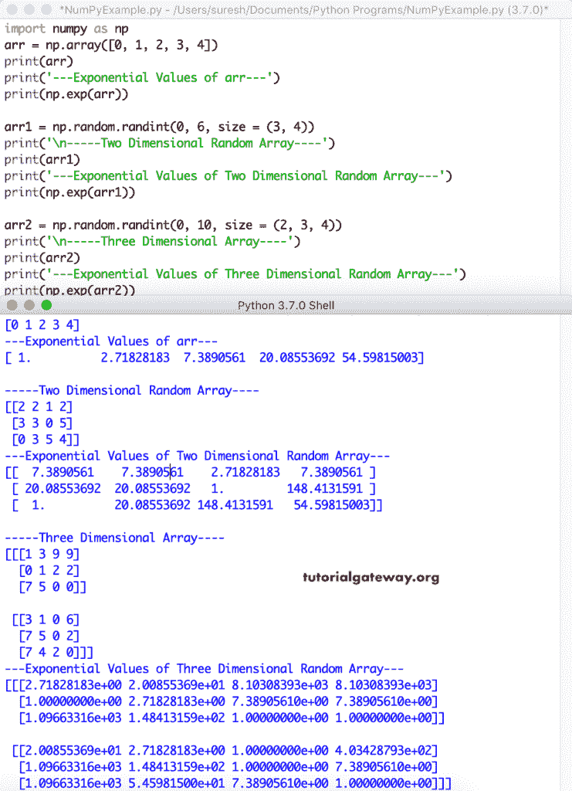
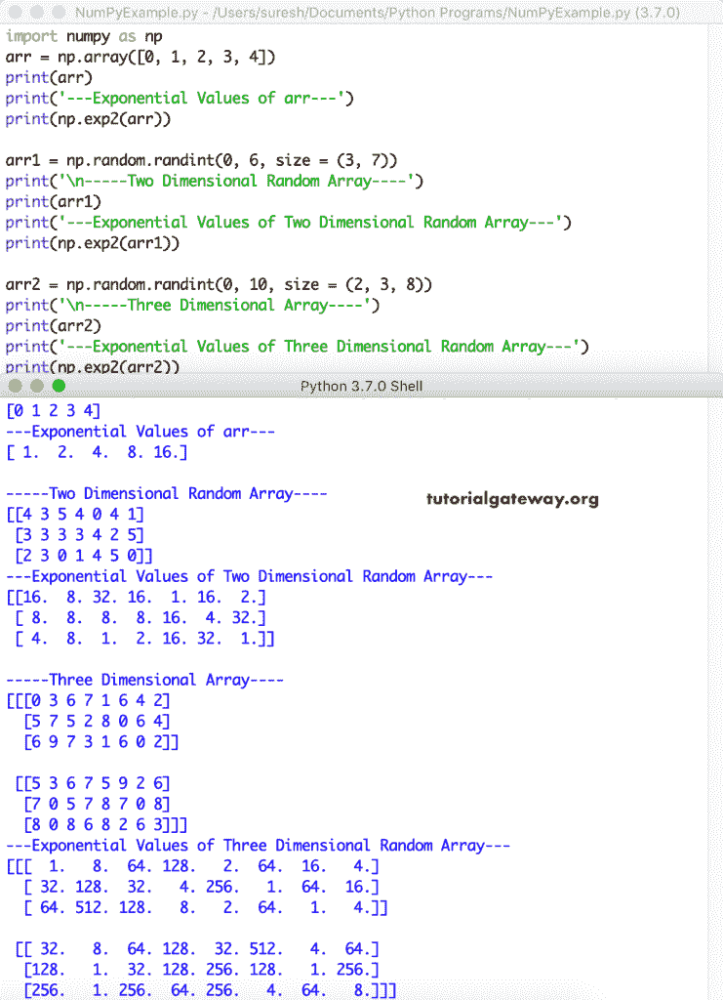
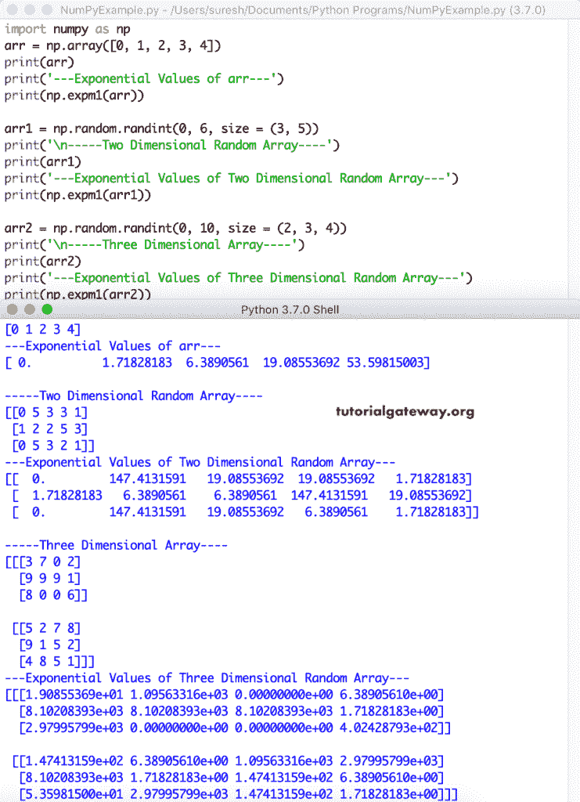
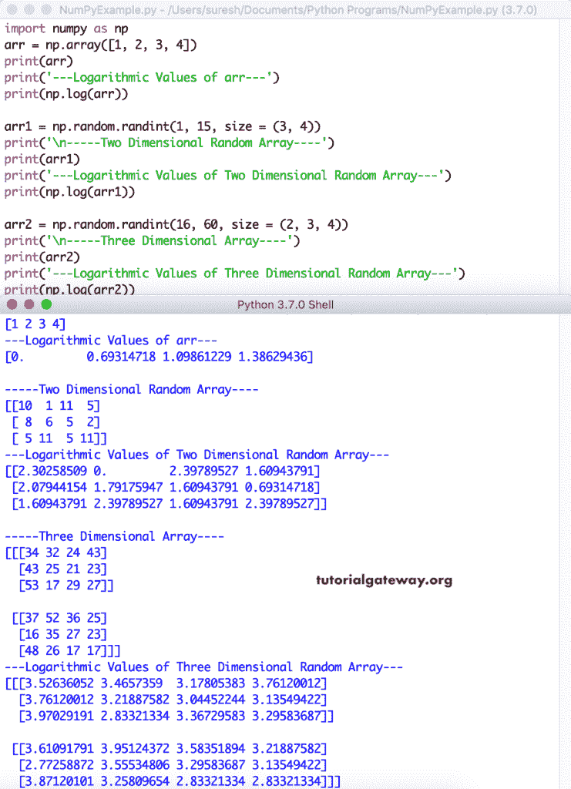
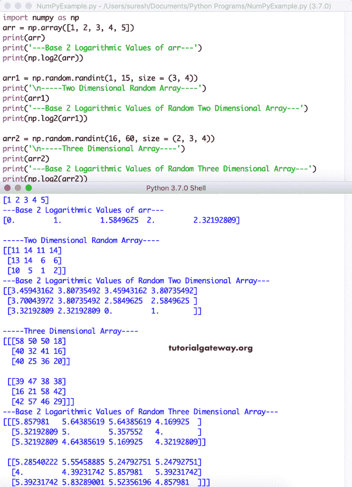
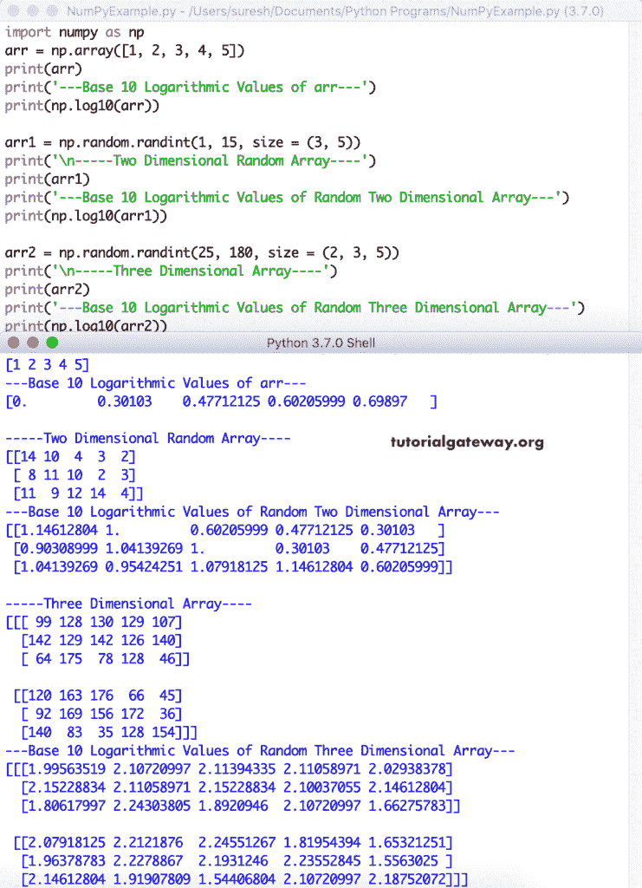
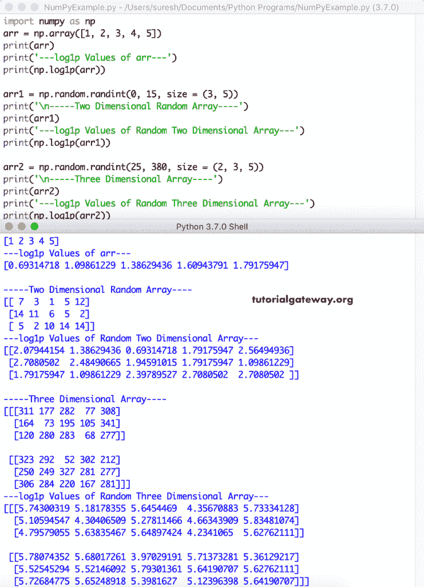

# Python 数字指数函数

> 原文：<https://www.tutorialgateway.org/python-numpy-exponential-functions/>

Python numpy 模块具有指数函数，用于计算单个、两个和三个三维数组的指数值和对数值。它们是 exp、exp2、expm1、log、log2、log10 和 log1p。您可以使用 Python numpy 指数函数(如 exp、exp2 和 expm1)来查找指数值。Python numpy 模块中的以下四个函数 log、log2、log10 和 log1p 计算对数值。

## Python 数字指数函数

下面的例子列表有助于理解指数函数

### Python numpy exp

Python numpy`exp()`函数计算并返回给定数组中每个项目的指数值。首先，我们声明了一维数组，二维和三维不同大小的随机数组。接下来，我们在这些数组上使用 Python numpy`exp()`函数来计算指数值。

```
import numpy as np

arr = np.array([0, 1, 2, 3, 4])
print(arr)
print('---Exponential Values of arr---')
print(np.exp(arr))

arr1 = np.random.randint(0, 6, size = (3, 4))
print('\n-----Two Dimensional Random Array----')
print(arr1)
print('---Exponential Values of Two Dimensional Random Array---')
print(np.exp(arr1))

arr2 = np.random.randint(0, 10, size = (2, 3, 4))
print('\n-----Three Dimensional Array----')
print(arr2)
print('---Exponential Values of Three Dimensional Random Array---')
print(np.exp(arr2))
```



### Python numpy exp2

[Python](https://www.tutorialgateway.org/python-tutorial/) numpy exp2 函数计算 2**p，其中 p 表示给定 [numpy](https://www.tutorialgateway.org/python-numpy-array/) 数组中的每个项目。这里，我们在这些数组上使用 numpy exp2 函数来计算指数值。例如，exp2(3) = 2 **3 = > 2 * 2 * 2 = 8。

```
import numpy as np

arr = np.array([0, 1, 2, 3, 4])
print(arr)
print('---Exponential Values of arr---')
print(np.exp2(arr))

arr1 = np.random.randint(0, 6, size = (3, 7))
print('\n-----Two Dimensional Random Array----')
print(arr1)
print('---Exponential Values of Two Dimensional Random Array---')
print(np.exp2(arr1))

arr2 = np.random.randint(0, 10, size = (2, 3, 8))
print('\n-----Three Dimensional Array----')
print(arr2)
print('---Exponential Values of Three Dimensional Random Array---')
print(np.exp2(arr2))
```



### Python numpy expm1

Python numpy expm1 函数计算给定数组中所有项目的指数值–1。意思是，expm 1(array _ name)= exp(array _ name)–1。这里，我们使用 Python numpy expm1 函数来计算指数值。

```
import numpy as np

arr = np.array([0, 1, 2, 3, 4])
print(arr)
print('---Exponential Values of arr---')
print(np.expm1(arr))

arr1 = np.random.randint(0, 6, size = (3, 5))
print('\n-----Two Dimensional Random Array----')
print(arr1)
print('---Exponential Values of Two Dimensional Random Array---')
print(np.expm1(arr1))

arr2 = np.random.randint(0, 10, size = (2, 3, 4))
print('\n-----Three Dimensional Array----')
print(arr2)
print('---Exponential Values of Three Dimensional Random Array---')
print(np.expm1(arr2))
```



## Python 数字`log()`函数

以下示例有助于理解`log()`函数

### python num py log(python num py 日志)

Python numpy`log()`函数计算给定数组中每个项目的自然对数值。我们声明了 1D、2D 和不同大小的 3D [随机](https://www.tutorialgateway.org/python-random-array/)阵列。接下来，我们在这些数组上使用 Python numpy`log()`函数来计算对数值。

```
import numpy as np

arr = np.array([1, 2, 3, 4])
print(arr)
print('---Logarithmic Values of arr---')
print(np.log(arr))

arr1 = np.random.randint(1, 15, size = (3, 4))
print('\n-----Two Dimensional Random Array----')
print(arr1)
print('---Logarithmic Values of Two Dimensional Random Array---')
print(np.log(arr1))

arr2 = np.random.randint(16, 60, size = (2, 3, 4))
print('\n-----Three Dimensional Array----')
print(arr2)
print('---Logarithmic Values of Three Dimensional Random Array---')
print(np.log(arr2))
```



### Python Numpy log2

Python Numpy log2 函数计算给定数组中所有项的基数为 2 的对数值。在 1D、2D 和三维数组上使用 Python Numpy log2 函数计算基数为 2 的对数值。

```
import numpy as np

arr = np.array([1, 2, 3, 4, 5])
print(arr)
print('---Base 2 Logarithmic Values of arr---')
print(np.log2(arr))

arr1 = np.random.randint(1, 15, size = (3, 4))
print('\n-----Two Dimensional Random Array----')
print(arr1)
print('---Base 2 Logarithmic Values of Random Two Dimensional Array---')
print(np.log2(arr1))

arr2 = np.random.randint(16, 60, size = (2, 3, 4))
print('\n-----Three Dimensional Array----')
print(arr2)
print('---Base 2 Logarithmic Values of Random Three Dimensional Array---')
print(np.log2(arr2))
```



### python num py log 10(python num py 日志 10)

Python numpy`log10()`函数计算给定数组中所有数组项的底 10 对数值。我们在 1D、2D 和 3D 数组上使用 Python numpy`log10()`函数来计算基数为 10 的对数值。

```
import numpy as np

arr = np.array([1, 2, 3, 4, 5])
print(arr)
print('---Base 10 Logarithmic Values of arr---')
print(np.log10(arr))

arr1 = np.random.randint(1, 15, size = (3, 5))
print('\n-----Two Dimensional Random Array----')
print(arr1)
print('---Base 10 Logarithmic Values of Random Two Dimensional Array---')
print(np.log10(arr1))

arr2 = np.random.randint(25, 180, size = (2, 3, 5))
print('\n-----Three Dimensional Array----')
print(arr2)
print('---Base 10 Logarithmic Values of Random Three Dimensional Array---')
print(np.log10(arr2))
```



### Python numpy log1p

Python numpy log1p 函数计算 1 加上给定数组中所有数组项的自然对数值。我是说 log1p 也叫 log(1 + array_name)。在这个例子中，我们在 1D、2D 和三维随机阵列上使用 Python numpy log1p 函数来计算自然对数值。

```
import numpy as np

arr = np.array([1, 2, 3, 4, 5])
print(arr)
print('---log1p Values of arr---')
print(np.log1p(arr))

arr1 = np.random.randint(0, 15, size = (3, 5))
print('\n-----Two Dimensional Random Array----')
print(arr1)
print('---log1p Values of Random Two Dimensional Array---')
print(np.log1p(arr1))

arr2 = np.random.randint(25, 380, size = (2, 3, 5))
print('\n-----Three Dimensional Array----')
print(arr2)
print('---log1p Values of Random Three Dimensional Array---')
print(np.log1p(arr2))
```

