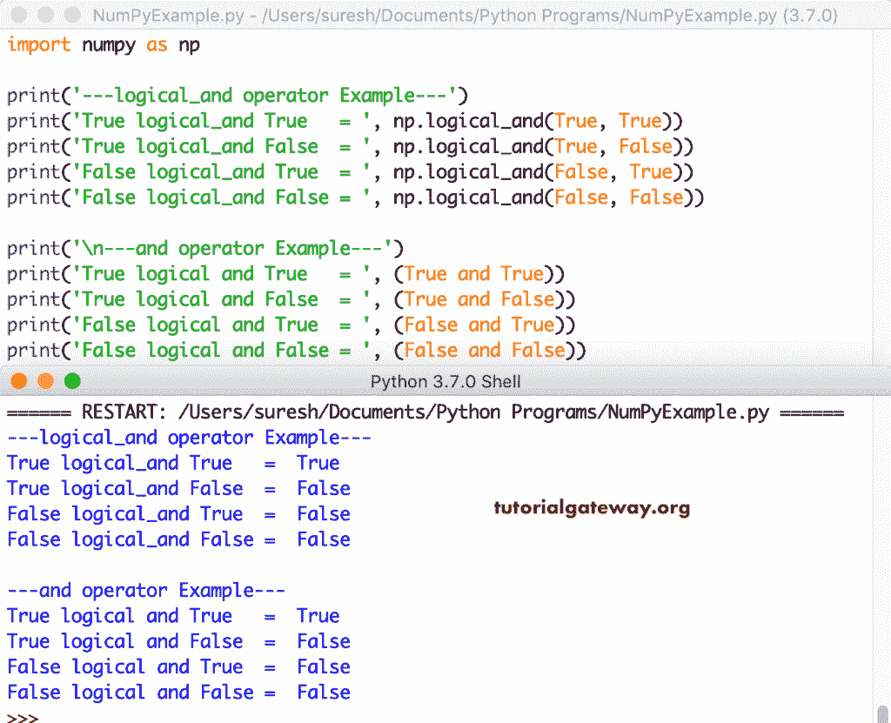
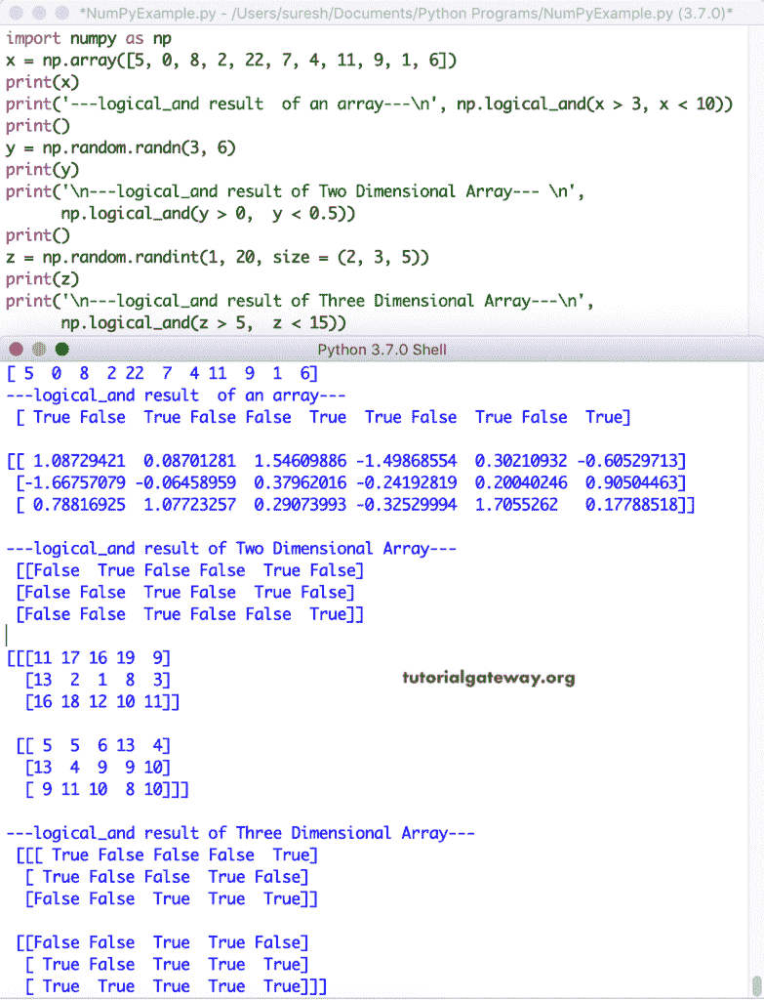
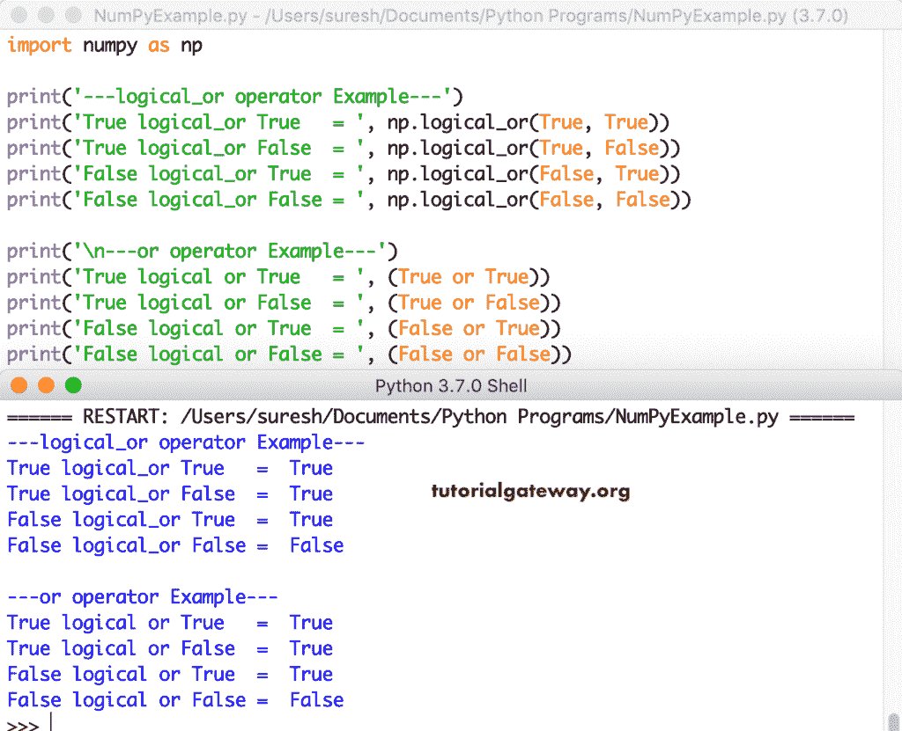
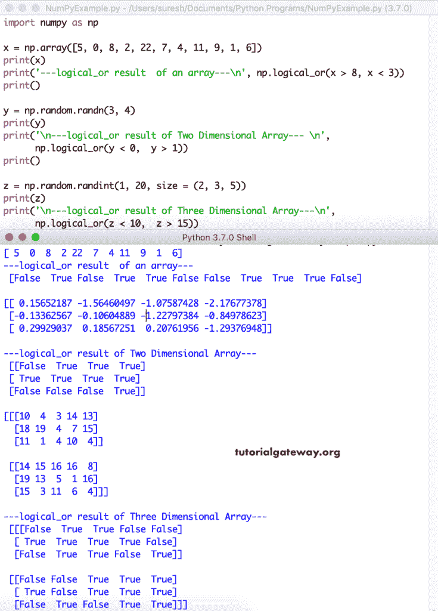
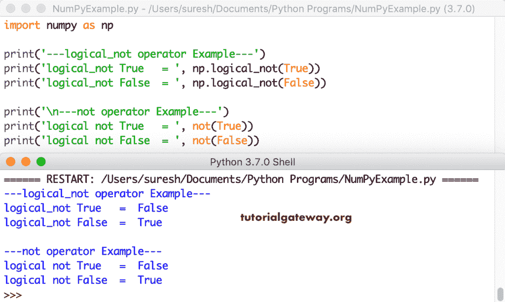
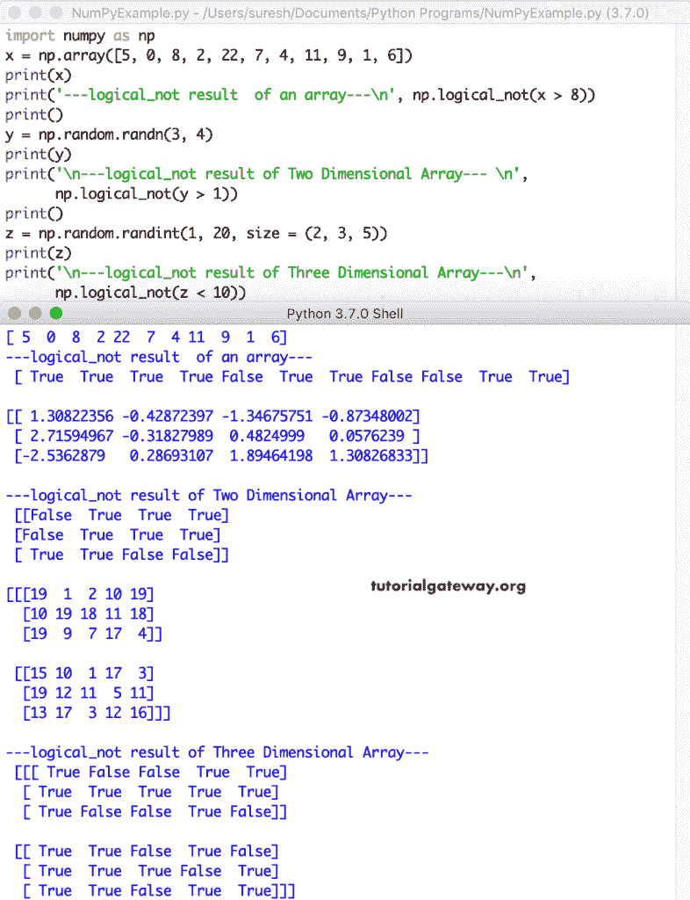
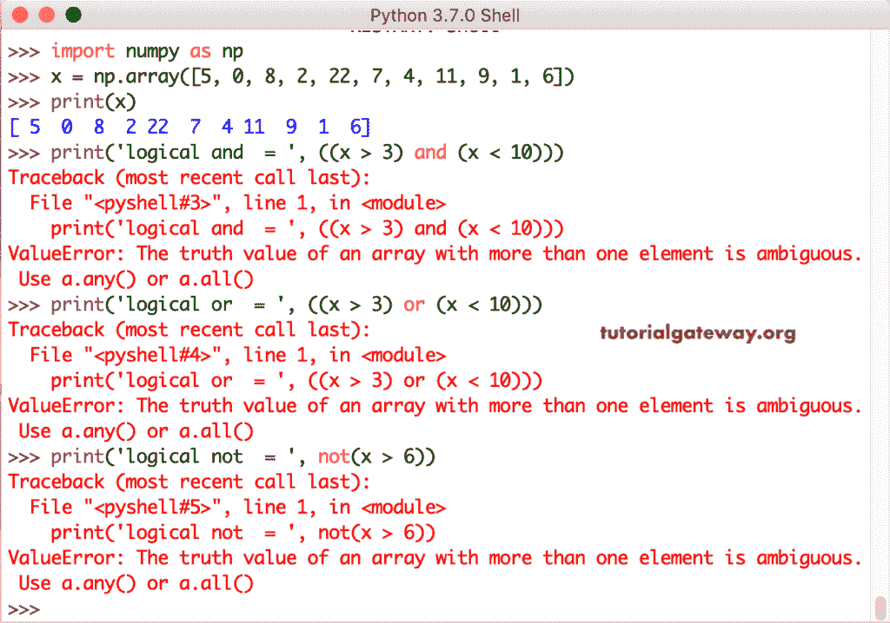
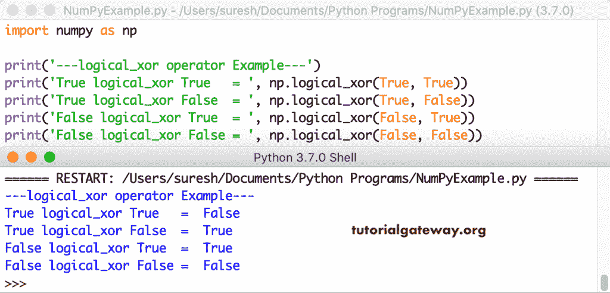
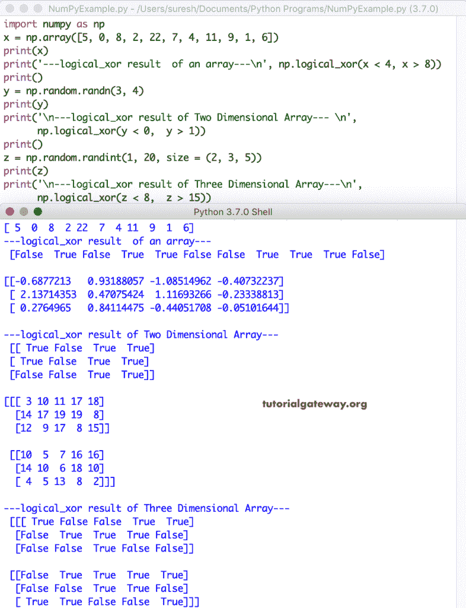

# NumPy 逻辑运算符

> 原文：<https://www.tutorialgateway.org/python-numpy-logical-operators/>

NumPy 逻辑运算符和逻辑函数是使用真值表计算真值，即布尔真或假。NumPy 逻辑函数是 logical _ and、logical _ or、logical _ not 和 logical _ xor。像任何其他编程一样，numpy 有常规的逻辑运算符，如 and、or、not 和 xor。以下示例有助于您理解这些 NumPy 逻辑函数和逻辑运算符。

## NumPy 逻辑 and 和运算符

下面显示的示例显示了 NumPy 逻辑`and()`函数和 numpy 逻辑 `AND`运算符真值表。

```py
import numpy as np

print('---logical_and operator Example---')
print('True logical_and True   = ', np.logical_and(True, True))
print('True logical_and False  = ', np.logical_and(True, False))
print('False logical_and True  = ', np.logical_and(False, True))
print('False logical_and False = ', np.logical_and(False, False))

print('\n---and operator Example---')
print('True logical and True   = ', (True and True))
print('True logical and False  = ', (True and False))
print('False logical and True  = ', (False and True))
print('False logical and False = ', (False and False))
```



在本例中，我们声明了随机值的一维、二维和三维数组。为了生成[随机数组](https://www.tutorialgateway.org/python-random-array/)，我们使用了 [Python](https://www.tutorialgateway.org/python-tutorial/) randn 和 randint。接下来，根据给定的条件测试每个数组元素，使用 NumPy 逻辑`and()`函数计算真值。

*   NP . logic _ and(x > 3，x < 10)–如果 x 中的值大于 3 且小于 10，则返回 True，否则返回 False。
*   NP . logic _ and(y > 0，y < 0.5)–如果 y 中的值大于 0 且小于 0.5，则为真，否则为假。
*   逻辑与(z > 5，z < 15)–如果 z 大于 5 且小于 15，则为真

```py
import numpy as np

x = np.array([5, 0, 8, 2, 22, 7, 4, 11, 9, 1, 6])
print(x)
print('---logical_and result  of an array---\n', np.logical_and(x > 3, x < 10))
print()

y = np.random.randn(3, 6)
print(y)
print('\n---logical_and result of Two Dimensional Array--- \n',
      np.logical_and(y > 0,  y < 0.5))
print()

z = np.random.randint(1, 20, size = (2, 3, 5))
print(z)
print('\n---logical_and result of Three Dimensional Array---\n',
      np.logical_and(z > 5,  z < 15))
```



## NumPy 逻辑 or 或运算符

让我们看看 NumPy 逻辑或函数和逻辑或运算符真值表。

```py
import numpy as np

print('---logical_or operator Example---')
print('True logical_or True   = ', np.logical_or(True, True))
print('True logical_or False  = ', np.logical_or(True, False))
print('False logical_or True  = ', np.logical_or(False, True))
print('False logical_or False = ', np.logical_or(False, False))

print('\n---or operator Example---')
print('True logical or True   = ', (True or True))
print('True logical or False  = ', (True or False))
print('False logical or True  = ', (False or True))
print('False logical or False = ', (False or False))
```



我们在 1D、2D 和三维数组上使用 NumPy 逻辑`or()`函数。

*   NP . logic _ or(x > 8，x < 3) – returns True, if elements in [Numpy](https://www.tutorialgateway.org/python-numpy-array/) x 大于 8 或小于 3，否则为 False。
*   NP . logic _ or(y< 0,  y >1)–如果 y 中的元素小于 0 或大于 1，则为真，否则为假。
*   如果 z 元素小于 10 或大于 15，则为真

```py
import numpy as np

x = np.array([5, 0, 8, 2, 22, 7, 4, 11, 9, 1, 6])
print(x)
print('---logical_or result  of an array---\n', np.logical_or(x > 8, x < 3))
print()

y = np.random.randn(3, 4)
print(y)
print('\n---logical_or result of Two Dimensional Array--- \n',
      np.logical_or(y < 0,  y > 1))
print()

z = np.random.randint(1, 20, size = (2, 3, 5))
print(z)
print('\n---logical_or result of Three Dimensional Array---\n',
      np.logical_or(z < 10,  z > 15))
```



## NumPy 逻辑非与`NOT`运算符

以下示例显示了 NumPy 逻辑非函数和 Python 逻辑`NOT`运算符真值表。

```py
import numpy as np

print('---logical_not operator Example---')
print('logical_not True   = ', np.logical_not(True))
print('logical_not False  = ', np.logical_not(False))

print('\n---not operator Example---')
print('logical not True   = ', not(True))
print('logical not False  = ', not(False))
```



在这里，我们在 1D、2D 和三维数组上使用 NumPy`logical_not()`函数。

*   NP . logic _ not(x > 8)–如果 x 中的元素不大于 8，则返回 True，否则返回 False。
*   如果 y 中的元素不大于 1，则为真，否则为假。
*   NP . logic _ not(z < 10)–如果 z 三维数组中的每个元素都不小于 10，则为 True

```py
import numpy as np

x = np.array([5, 0, 8, 2, 22, 7, 4, 11, 9, 1, 6])
print(x)
print('---logical_not result  of an array---\n', np.logical_not(x > 8))
print()

y = np.random.randn(3, 4)
print(y)
print('\n---logical_not result of Two Dimensional Array--- \n',
      np.logical_not(y > 1))
print()

z = np.random.randint(1, 20, size = (2, 3, 5))
print(z)
print('\n---logical_not result of Three Dimensional Array---\n',
      np.logical_not(z < 10))
```



NumPy 逻辑 and、or 和 not 运算符必须在单个值上使用。如果试图对多个值使用 numpy 逻辑运算符，则会引发 ValueError。

```py
import numpy as np

x = np.array([5, 0, 8, 2, 22, 7, 4, 11, 9, 1, 6])
print(x)
print('\nlogical and  = ', ((x > 3) and (x < 10)))
print('\nlogical or  = ', ((x > 3) or (x < 10)))
print('\nlogical not  = ', not(x > 6))
```



## NumPy 逻辑`XOR`运算符

它显示了 NumPy 逻辑异或函数真值表。

```py
import numpy as np

print('---logical_xor operator Example---')
print('True logical_xor True   = ', np.logical_xor(True, True))
print('True logical_xor False  = ', np.logical_xor(True, False))
print('False logical_xor True  = ', np.logical_xor(False, True))
print('False logical_xor False = ', np.logical_xor(False, False))
```



这是 NumPy 逻辑`_xor()`函数的另一个例子。这里，我们在多维数组上使用了这个 NumPy 逻辑`xor()`函数。

```py
import numpy as np

x = np.array([5, 0, 8, 2, 22, 7, 4, 11, 9, 1, 6])
print(x)
print('---logical_xor result  of an array---\n', np.logical_xor(x < 4, x > 8))
print()

y = np.random.randn(3, 4)
print(y)
print('\n---logical_xor result of Two Dimensional Array--- \n',
      np.logical_xor(y < 0,  y > 1))
print()

z = np.random.randint(1, 20, size = (2, 3, 5))
print(z)
print('\n---logical_xor result of Three Dimensional Array---\n',
      np.logical_xor(z < 8,  z > 15))
```

