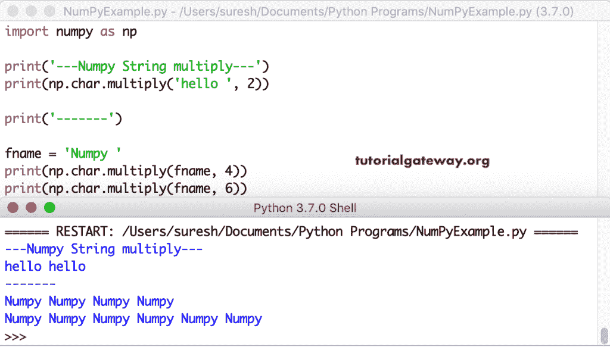
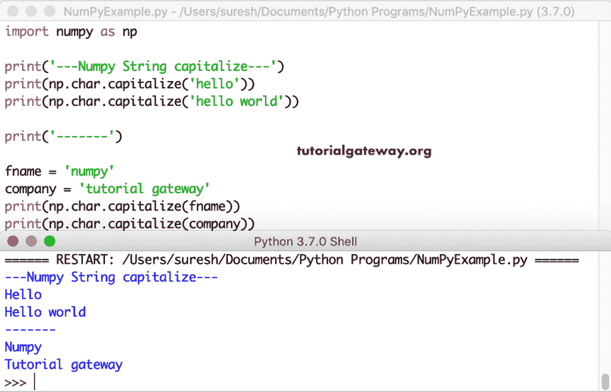
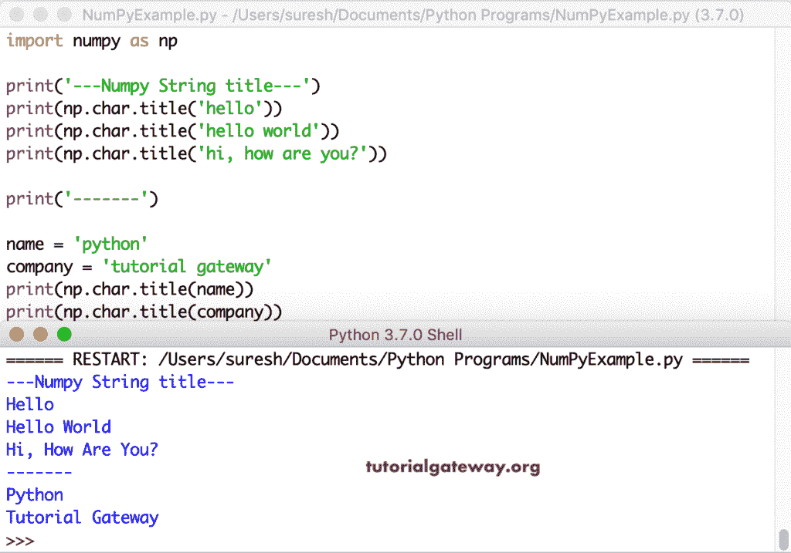
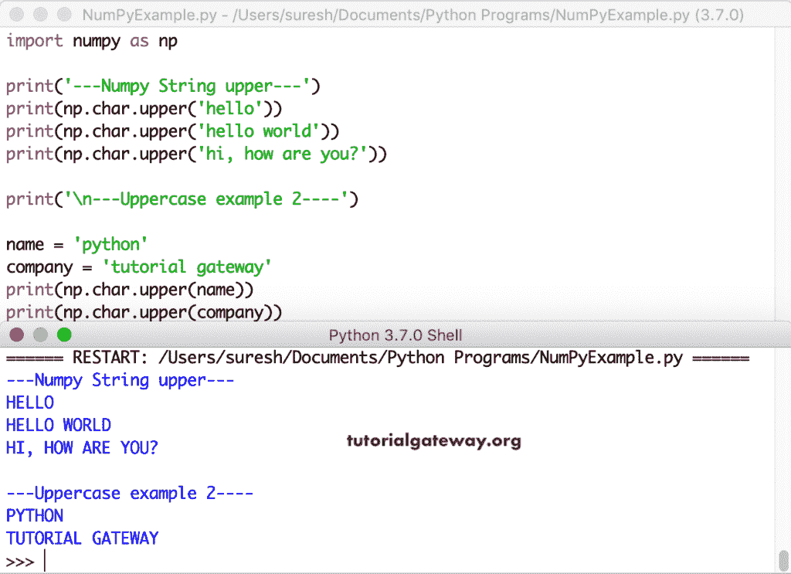
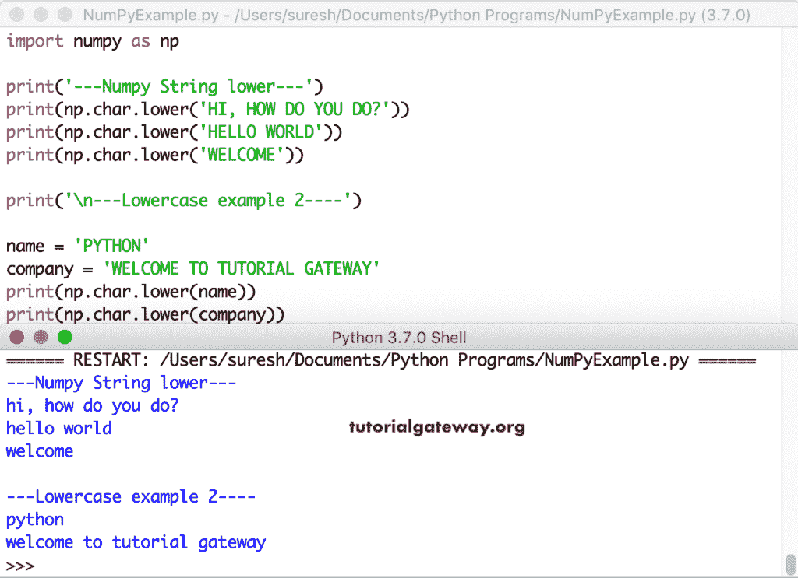

# NumPy 字符串函数

> 原文：<https://www.tutorialgateway.org/python-numpy-string-functions/>

NumPy 字符串函数用于根据您的要求更改给定的字符串。numpy 字符串函数有:加法、乘法、大写、标题、上、下、居中、拆分、分割线、剥离、连接、替换、编码和解码。例如，numpy 字符串上部函数转换为大写。这些示例帮助您理解 NumPy 字符串函数。

## python num py add-python num py add-python num py add-python num py add-python num py add-python num py add-python num py add-python num py add

用于字符串连接的 NumPy`add()`函数。在这个例子中，我们使用这个 numpy`add()`函数来添加两个字符串

```
import numpy as np

print('Numpy String concatenation')
print(np.char.add(['Tutorial'], ['Gateway']))
```

numpy`add()`函数执行字符串串联输出

```
Numpy String concatenation
['TutorialGateway']
```

这次我们声明了两个不同的字符串。接下来，我们使用这个 numpy char`add()`函数

```
import numpy as np

fname = 'Suresh'
company = ' Tutorial Gateway'

print('Numpy String concatenation')
print(np.char.add([fname], [company]))
```

char`add()`函数输出

```
Numpy String concatenation
['Suresh Tutorial Gateway']
```

在这里，我们将字符串变量和示例文本连接起来

```
import numpy as np

fname = 'Suresh'

print('concatenation')
print(np.char.add([fname], [' Working at Tutorial Gateway']))
```

char add 输出

```
concatenation
['Suresh Working at Tutorial Gateway']
```

## NumPy 多重

NumPy 乘法函数用于将给定的字符串相乘或重复指定的次数。在这个例子中，p.char.multiply('hello '，2)重复 hello 两次。

```
import numpy as np

print('---Numpy String multiply---')
print(np.char.multiply('hello ', 2))

print('-------')

fname = 'Numpy '
print(np.char.multiply(fname, 4))
print(np.char.multiply(fname, 6))
```



## NumPy 大写

NumPy 大写函数用于大写完整字符串中的第一个字母。

```
import numpy as np

print('---Numpy String capitalize---')
print(np.char.capitalize('hello'))
print(np.char.capitalize('hello world'))

print('-------')

fname = 'numpy'
company = 'tutorial gateway'
print(np.char.capitalize(fname))
print(np.char.capitalize(company))
```



## python num py title(python num py 标题)

NumPy`title()`函数是将每个单词的第一个字母转换成大写

```
import numpy as np

print('---Numpy String title---')
print(np.char.title('hello'))
print(np.char.title('hello world'))
print(np.char.title('hi, how are you?'))

print('-------')

name = 'python'
company = 'tutorial gateway'
print(np.char.title(name))
print(np.char.title(company))
```



## NumPy 上部

NumPy upper 将字符串中的所有字母都转换为大写

```
import numpy as np

print('---Numpy String upper---')
print(np.char.upper('hello'))
print(np.char.upper('hello world'))
print(np.char.upper('hi, how are you?'))
print('\n---Uppercase example 2----')

name = 'python'
company = 'tutorial gateway'
print(np.char.upper(name))
print(np.char.upper(company))
```



## NumPy 下部

这个 Python 数字小程序将字符串中的所有字符都转换成小写

```
import numpy as np

print('---Numpy String lower---')
print(np.char.lower('HI, HOW DO YOU DO?'))
print(np.char.lower('HELLO WORLD'))
print(np.char.lower('WELCOME'))

print('\n---Lowercase example 2----')

name = 'PYTHON'
company = 'WELCOME TO TUTORIAL GATEWAY'
print(np.char.lower(name))
print(np.char.lower(company))
```



## NumPy 中心

NumPy 中心用于填充字符串。 [Numpy](https://www.tutorialgateway.org/python-numpy-array/) 中心的语法

```
np.char.center(‘string’, length, ‘char’)
```

如果给定长度小于原始长度，则 [Python](https://www.tutorialgateway.org/python-tutorial/) 从原始字符串中移除多余的字符(修剪)

如果长度大于原始长度，那么那些额外的空格就用给定的字符填充。顾名思义，原始字符串在中心位置。

```
import numpy as np

print('---center---')
print(np.char.center('Hello', 11, '*'))
print(np.char.center('Welcome', 20, '#'))
print(np.char.center('Hello', 4, '*'))

print('\n--char center example----')

name = 'Python'
company = 'TutorialGateway'
print(np.char.center(name, 30, '@'))
print(np.char.center(company, 50, '$'))
print(np.char.center(company, 10, '$'))
```

中心功能输出

```
---center---
***Hello***
###### Welcome#######
Hell

---char center example----
@@@@@@@@@@@@[[email protected]](/cdn-cgi/l/email-protection)@@@@@@@@@@@
$$$$$$$$$$$$$$$$$TutorialGateway$$$$$$$$$$$$$$$$$$
TutorialGa
```

## NumPy strip

NumPy 条从给定字符串的右侧和左侧移除空格。

```
import numpy as np

msg1 = '   Hello'
msg2 = 'Python        '
msg3 = '         Hello World           '

print('Original Message = ', msg1)
print('Strip Left       = ', np.char.strip(msg1))

print('\nOriginal Message  = ', msg2)
print('Strip Right         = ', np.char.strip(msg2))

print('\nOriginal Message   = ', msg3)
print('Strip Left & Right = ', np.char.strip(msg3))
```

带状函数输出

```
Original Message =     Hello
Strip Left       =  Hello

Original Message  =  Python        
Strip Right         =  Python

Original Message   =           Hello World           
Strip Left & Right =  Hello World
```

## NumPy split

NumPy 分割函数根据指定的分隔符分割给定的字符串

```
import numpy as np

print('---split---')
print(np.char.split('Hello World', sep = ' '))
print(np.char.split('hi,how are you?', sep = ' '))
print(np.char.split('hi,Python,Program', sep = ','))

print('\n----char split---')

msg = 'Welcome to Tutorial Gateway'
print(np.char.split(msg, sep = ' '))

msg2 = '[email protected]@[email protected]@Gateway'
print(np.char.split(msg2, sep = '@'))
```

分离功能输出

```
---split---
['Hello', 'World']
['hi,how', 'are', 'you?']
['hi', 'Python', 'Program']

----char split---
['Welcome', 'to', 'Tutorial', 'Gateway']
['Welcome', 'Python', 'From', 'Tutorial', 'Gateway']
```

## NumPy 拆分线

这个 NumPy splitlines 返回给定字符串中的行列表。numpy 分隔线考虑了换行符\n 和\r。

```
import numpy as np

msg = 'Hello\nWorld'
print(msg)
print('\n-- splitlines output----')
print(np.char.splitlines(msg))
print()

msg1 = 'Hi\rHow are you?'
print(msg1)
print('\n-- splitlines output----')
print(np.char.splitlines(msg1))
print()

msg2 = 'Hi\rHow are \nyou?'
print(msg2)
print('\n-- splitlines output----')
print(np.char.splitlines(msg2))

print('\n--- splitlines---')
print(np.char.splitlines('Hello\nWorld'))
```

分割线功能输出

```
Hello
World

-- splitlines output----
['Hello', 'World']

Hi
How are you?

-- splitlines output----
['Hi', 'How are you?']

Hi
How are 
you?

-- splitlines output----
['Hi', 'How are ', 'you?']

---splitlines---
['Hello', 'World']
```

## python num py join(python num py 连接)

NumPy`join()`函数在给定字符串的每个字符后连接指定的字符(第一个参数)。

```
import numpy as np

print('--- join---')
print(np.char.join(':', 'HMS'))
print(np.char.join('/', 'dmy'))
print(np.char.join('-', 'dmy'))
print(np.char.join(' ', 'HelloWorld'))

print('\n----char join---')
print(np.char.join(['-', ':'], ['dmy', 'mdy']))
print(np.char.join(['@', '$', ':'], ['Hi', 'Hello', 'HMS']))
```

连接函数输出

```
---join---
H:M:S
d/m/y
d-m-y
H e l l o W o r l d

----char join---
['d-m-y' 'm:d:y']
['[[email protected]](/cdn-cgi/l/email-protection)' 'H$e$l$l$o' 'H:M:S']
```

## NumPy 替换

NumPy 替换函数用于用新字符串替换子字符串

```
np.char.replace(original_string, old_string, new_string)
```

Numpy 替换函数搜索原始字符串中的旧字符串。如果找到，numpy`replace()`函数将替换为 new_string。

```
import numpy as np

print(np.char.replace('Hello', 'l', 'K'))
print(np.char.replace('tutorial', 't', 'M'))

print(np.char.replace('oh boy! welcome to you', 'o', 'X'))
print(np.char.replace('oh boy! welcome to you', 'o', 'SSh'))
```

替换功能输出

```
HeKKo
MuMorial
Xh bXy! welcXme tX yXu
SShh bSShy! welcSShme tSSh ySShu
```

这是 numpy 字符串替换函数的另一个例子。

```
import numpy as np

msg1 = 'Hello World'
msg2 = 'xyz working in xyz position at xyz company'

print('Original Message   = ', msg1)
print('Repalce l with T   = ', np.char.replace(msg1, 'l', 'T'))
print('Repalce o with HMS = ', np.char.replace(msg1, 'o', 'HMS'))

print('\nOriginal Message   = ', msg2)
print('Repalce o with T     = ', np.char.replace(msg2, 'o', 'T'))
print('Repalce xyz with abc = ', np.char.replace(msg2, 'xyz', 'abc'))
```

替换功能输出

```
Original Message   =  Hello World
Repalce l with T   =  HeTTo WorTd
Repalce o with HMS =  HellHMS WHMSrld

Original Message   =  xyz working in xyz position at xyz company
Repalce o with T     =  xyz wTrking in xyz pTsitiTn at xyz cTmpany
Repalce xyz with abc =  abc working in abc position at abc company
```

## NumPy 编码器

NumPy 编码用于使用指定的编码器对字符串进行编码。这里，np.char.encode('Hello '，' cp500 ')使用 cp500 对 Hello 字符串进行编码

```
import numpy as np

print('---String encode---')
print(np.char.encode('Hello', 'cp500'))
print(np.char.encode('Hello', 'utf_16'))
print(np.char.encode('How are You?', 'cp500'))
print(np.char.encode('Welcome again!', 'utf_16'))

print('\n---char encode----')
name = 'Python'
company = 'Tutorial Gateway'
print(np.char.encode(name, 'cp500'))
print(np.char.encode(name, 'utf_16'))
print(np.char.encode(name, 'utf_16_le'))

print(np.char.encode(company, 'cp500'))
print(np.char.encode(company, 'utf_16'))
print(np.char.encode(company, 'utf_16_be'))
```

编码功能输出

```
---String encode---
b'\xc8\x85\x93\x93\x96'
b'\xff\xfeH\x00e\x00l\x00l\x00o'
b'\xc8\x96\[[email protected]](/cdn-cgi/l/email-protection)\x81\x99\[[email protected]](/cdn-cgi/l/email-protection)\xe8\x96\xa4o'
b'\xff\xfeW\x00e\x00l\x00c\x00o\x00m\x00e\x00 \x00a\x00g\x00a\x00i\x00n\x00!'

---char encode----
b'\xd7\xa8\xa3\x88\x96\x95'
b'\xff\xfeP\x00y\x00t\x00h\x00o\x00n'
b'P\x00y\x00t\x00h\x00o\x00n'
b'\xe3\xa4\xa3\x96\x99\x89\x81\[[email protected]](/cdn-cgi/l/email-protection)\xc7\x81\xa3\x85\xa6\x81\xa8'
b'\xff\xfeT\x00u\x00t\x00o\x00r\x00i\x00a\x00l\x00 \x00G\x00a\x00t\x00e\x00w\x00a\x00y'
b'\x00T\x00u\x00t\x00o\x00r\x00i\x00a\x00l\x00 \x00G\x00a\x00t\x00e\x00w\x00a\x00y'
```

## NumPy string 解码

NumPy 解码用于解码已经编码的(numpy encode)字符串。在这里，您必须指定用于解码消息的代码。如果您使用了错误的代码，那么 numpy`decode()`函数会抛出一个错误。

```
import numpy as np

print('---String decode---')
print(np.char.decode(b'\xc8\x85\x93\x93\x96', 'cp500'))

print('\n---char decode----')
name = b'\xd7\xa8\xa3\x88\x96\x95'
company = b'\xe3\xa4\xa3\x96\x99\x89\x81\[email protected]\xc7\x81\xa3\x85\xa6\x81\xa8'
print(np.char.decode(name, 'cp500'))
print(np.char.decode(company, 'cp500'))

print('\n---char decode----')
name = 'NumPy'
ecode = np.char.encode(name, 'cp500')
dcode = np.char.decode(ecode, 'cp500')

print('Original Message = ', name)
print('Encoded Message  = ', ecode)
print('Decoded Message  = ', dcode)
```

解码输出

```
---String decode---
Hello

---char decode----
Python
Tutorial Gateway

---char decode----
Original Message =  NumPy
Encoded Message  =  b'\xd7\xa8\xa3\x88\x96\[[email protected]](/cdn-cgi/l/email-protection)\xd5\xa4\x94\x97\xa8'
Decoded Message  =  NumPy
```