# Python 数字三角函数

> 原文：<https://www.tutorialgateway.org/python-numpy-trigonometric-functions/>

Python numpy 模块有 sin、cos、tan、sinh、cosh、tanh、arcsin、arccos、arctan、arctan2、arcsinh、arccosh、arctanh、弧度、度数、海波、deg2rad、rad2deg、unwrap 等各种三角函数。在一维和多维数组上使用这些 Python numpy 三角函数。

我们使用下面的数组来演示 Python numpy 三角函数。

```
arr1 = np.array([0, 30, 45, 60, 90, 180])
arr1

arr2 = np.random.randint(0, 10, size = (10))
arr2

arr3 = np.random.randint(10, size = (5, 5))
arr3

arr4 = np.random.random((10))
arr4

arr5 = np.random.random((5, 5))
arr5

arr6 = np.linspace(-1, 1, 10)
arr6
```

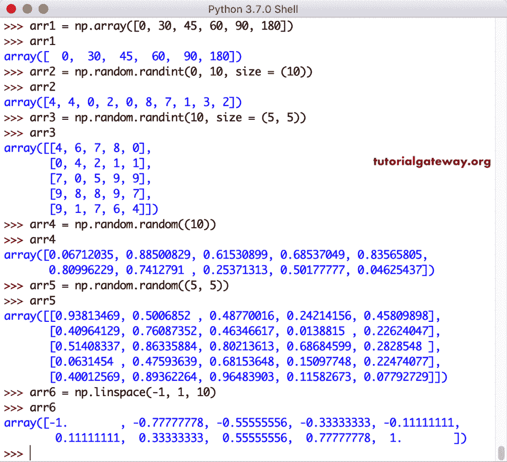

## Python 数字三角函数示例

可用 Python numpy 三角函数列表，每个函数都有一个示例。

Python numpy sin 函数返回给定数组的正弦值。

```
np.sin(arr1)
np.sin(arr2)
np.sin(arr3)
np.sin(arr6)
```

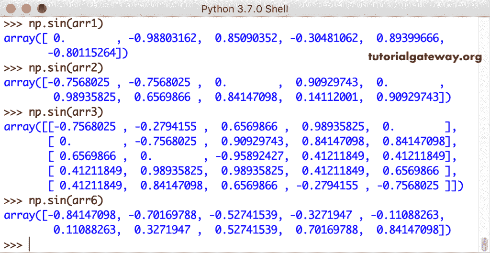

Python numpy cos 函数返回给定数组的余弦值。

```
np.cos(arr1)
np.cos(arr2)
np.cos(arr3)
np.cos(arr6)
```

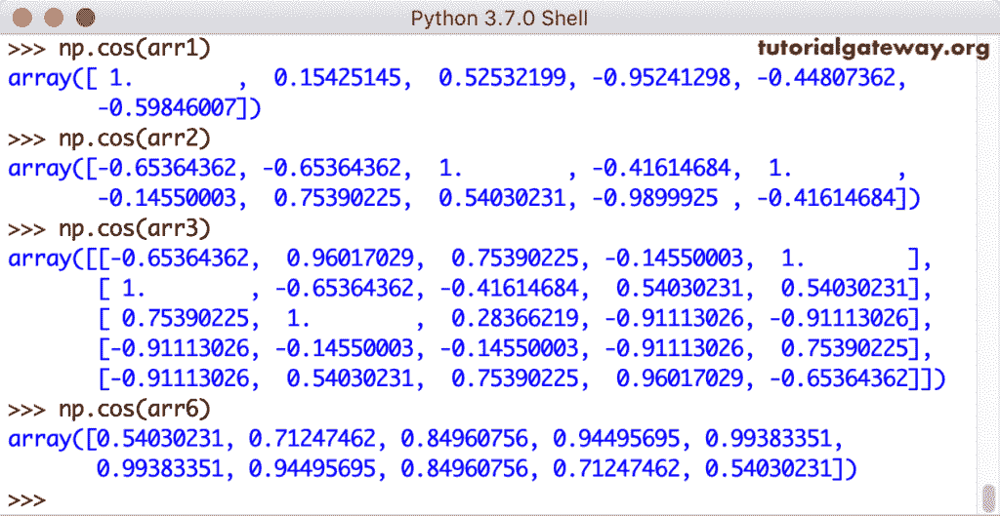

Python [numpy](https://www.tutorialgateway.org/python-numpy-array/) tan 函数返回给定数组的正切值。

```
np.tan(arr1)
np.tan(arr2)
np.tan(arr3)
np.tan(arr6)
```

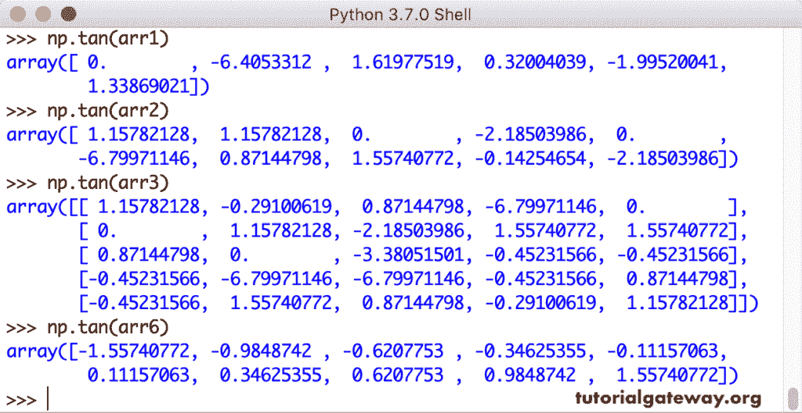

Python numpy sinh 函数返回给定数组的双曲正弦值。

```
np.sinh(arr1)
np.sinh(arr2)
np.sinh(arr3)
```

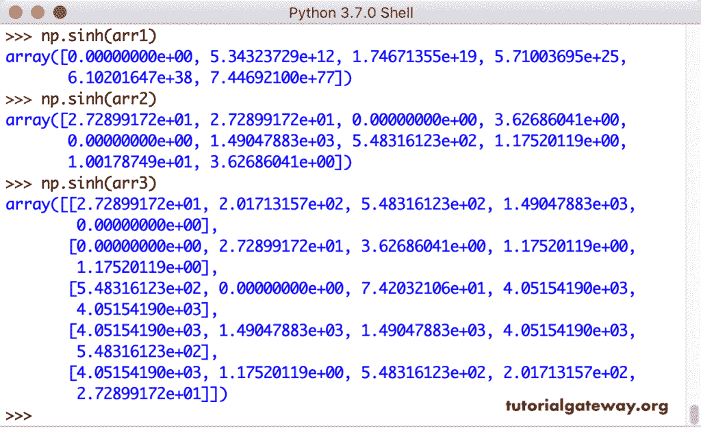

Python numpy cosh 函数打印给定的 [Python](https://www.tutorialgateway.org/python-tutorial/) 数组中所有元素的双曲余弦值。

```
np.cosh(arr1)
np.cosh(arr2)
np.cosh(arr3)
```

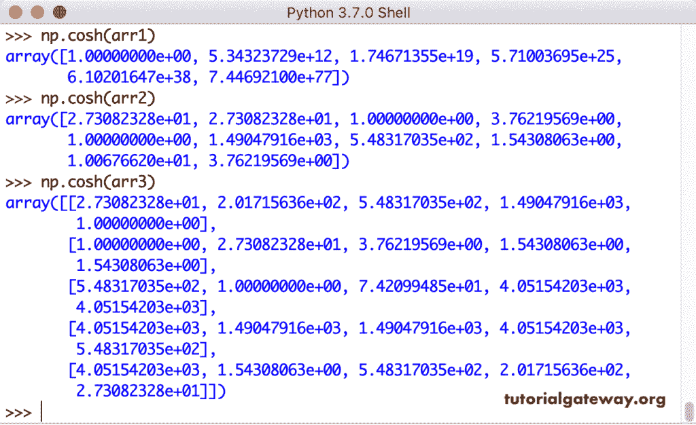

Python numpy tanh 函数显示给定数组的双曲正切值。

```
np.tanh(arr1)
np.tanh(arr2)
np.tanh(arr3)
```

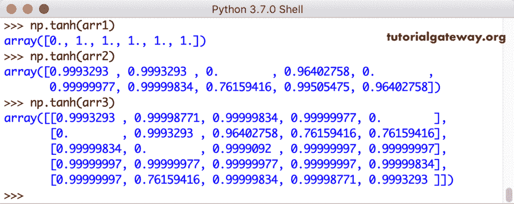

Python numpy arcsinh 函数返回给定数组的双曲反正弦值。

```
np.arcsinh(arr1)
np.arcsinh(arr2)
np.arcsinh(arr3)
```

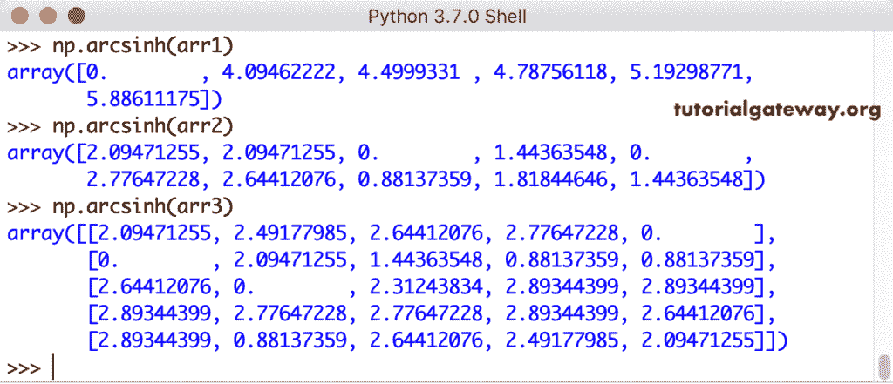

Python numpy arccosh 函数返回给定数组中所有元素的双曲弧余弦值。

```
np.arccosh(arr1)
np.arccosh(arr2)
np.arccosh(arr3)
```

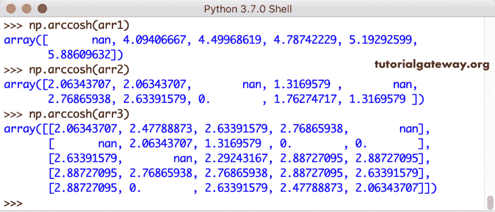

Python numpy arctanh 函数返回给定数组的双曲反正切值。

```
np.arctanh(arr4)
np.arctanh(arr5)
np.arctanh(arr6)
```

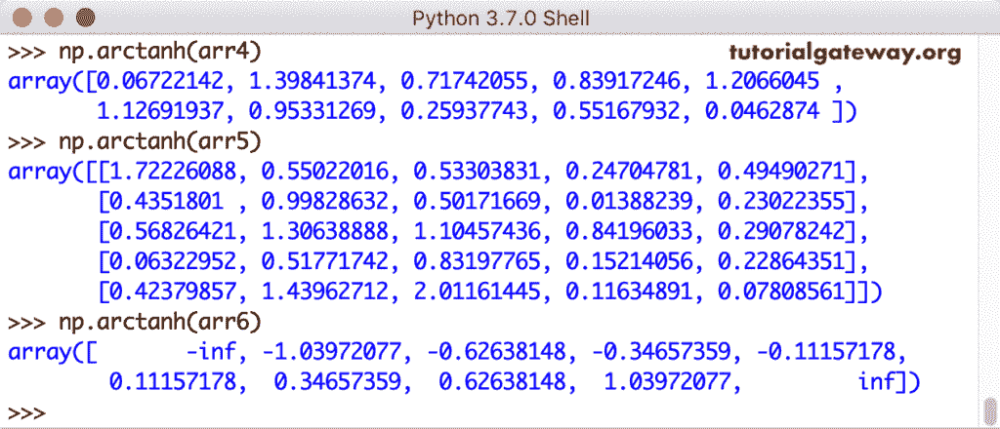

Python numpy 反正弦函数返回给定数组的反正弦值。

```
np.arcsin(arr4)
np.arcsin(arr5)
np.arcsin(arr6)
```

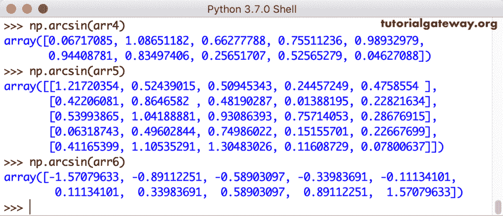

Python numpy arccos 函数返回给定的数组弧余弦值。

```
np.arccos(arr4)
np.arccos(arr5)
np.arccos(arr6)
```

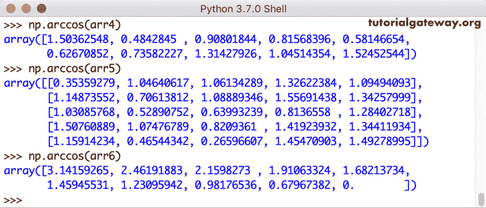

这个 Python numpy arctan 函数返回数组的反正切值。

```
np.arctan(arr1)
np.arctan(arr2)
np.arctan(arr3)
```

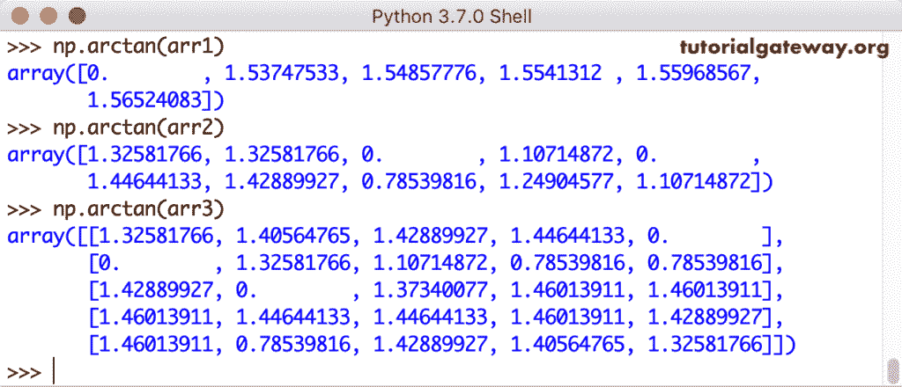

Python numpy arctan2 函数返回数组的元素式反正切值。它接受两个数组作为参数 x1 和 x2，并返回 x1/x2。

```
np.arctan2(arr2, arr6)
np.arctan2(arr6, arr2)
np.arctan2(arr3, arr5)
np.arctan2(arr5, arr3)
```

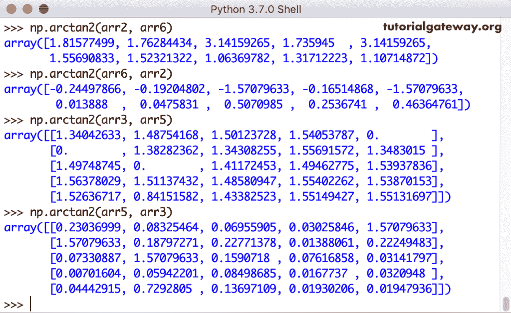

Python numpy hypot 函数返回参数 x1 和 x2 的斜边。

```
np.hypot(arr2, arr6)
np.hypot(arr3, arr5)
```

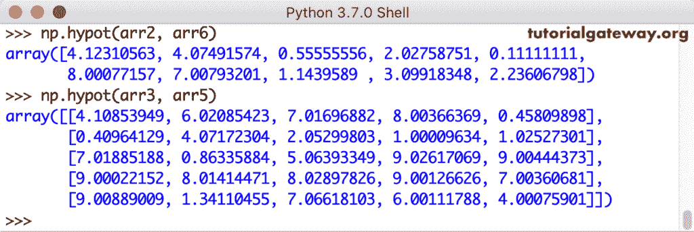

Python numpy 弧度函数在数组中将角度从度转换为弧度

```
np.radians(arr1)
np.radians(arr1 * 30)
np.radians(arr1 * 180)

np.radians(arr2 * 90)
np.radians(arr3 * 180)
np.radians(arr4)
np.radians(arr5 * 180)
```

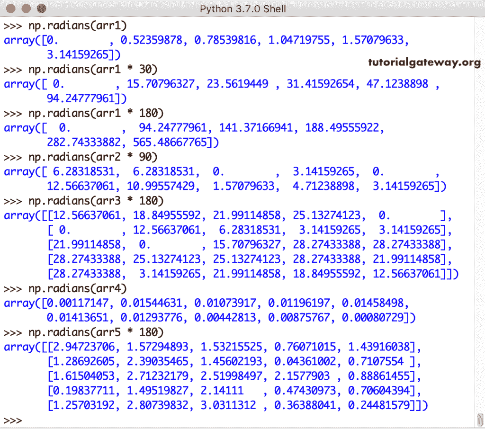

Python numpy degrees 函数在数组中将角度从弧度转换为度数

```
np.degrees(arr1)
np.degrees(arr1/30)
np.degrees(arr1/60)

np.degrees(arr2)
np.degrees(arr3/30)
np.degrees(arr4)
np.degrees(arr5)
```

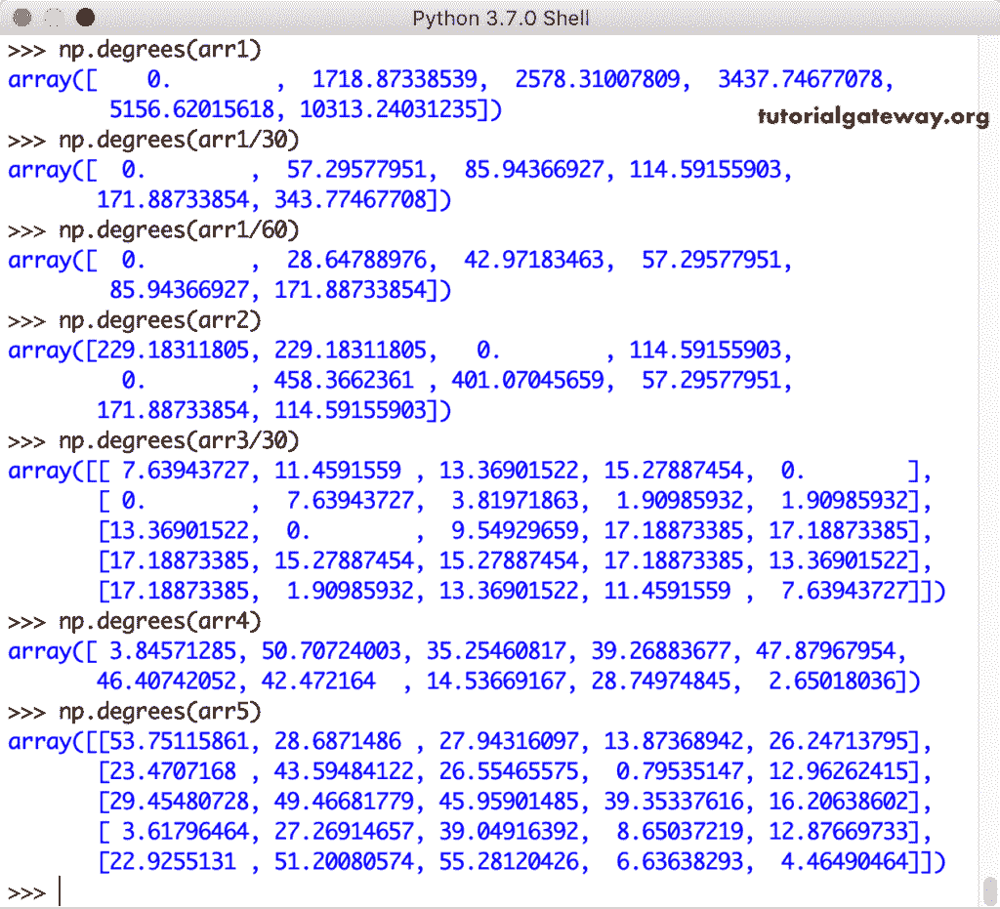

Python numpy deg2rad 函数将度数转换为弧度。deg2rad(n)类似或等于 n * pi / 180 (pi 或 np.pi 保持值 3.14)

```
np.deg2rad(180)

np.deg2rad(arr1)

x = np.array([0, 30, 60, 90, 120, 180, 360])
np.deg2rad(x)
```

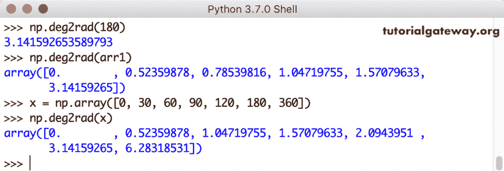

Python numpy rad2deg 函数将弧度转换为度数。rad2deg(n)类似或等于 180 * n / pi (pi = 3.14)

```
np.rad2deg(5)

np.rad2deg(arr2)
np.rad2deg(arr5)
np.rad2deg(arr6)
```

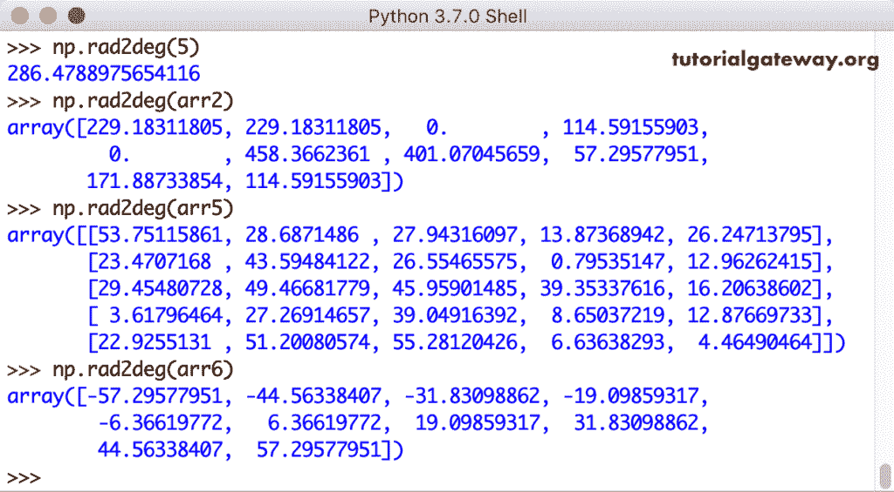

Python numpy unwrap 函数通过更改值之间的增量来打开值。

```
np.unwrap(arr2)
np.unwrap(arr3)
np.unwrap(arr4)
np.unwrap(arr5)
np.unwrap(arr6)
```

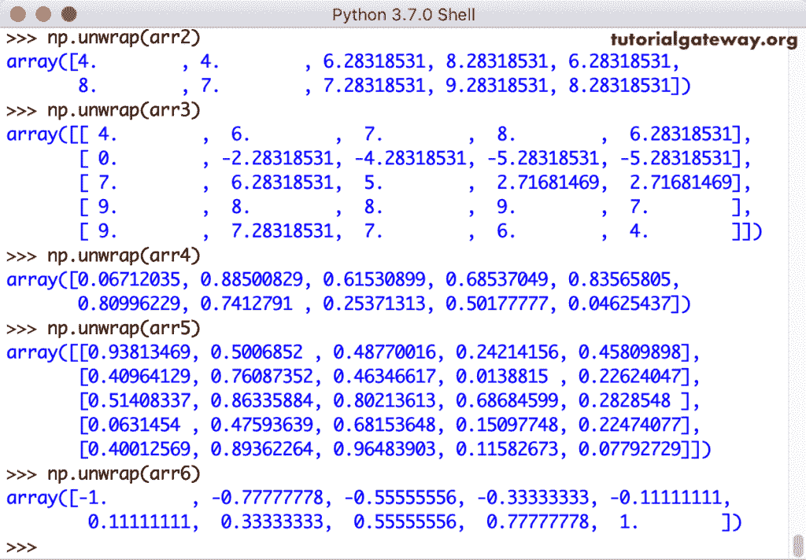