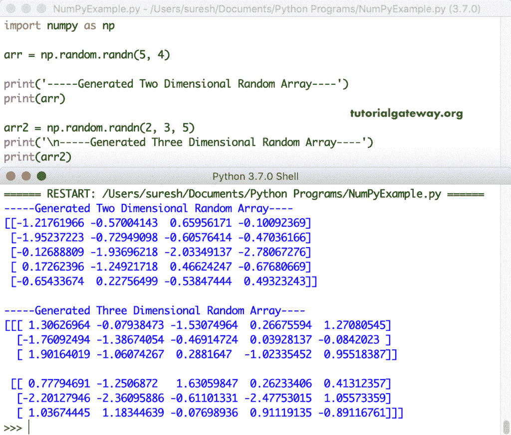

# NumPy 随机数组

> 原文：<https://www.tutorialgateway.org/python-random-array/>

在 Python 中，我们有随机模块，用于使用 PRNG 算法生成给定类型的随机数。在这里，我们将讨论在 Python 中生成随机数组的可用函数列表。

## 使用 rand 的 Python 随机数组

Numpy`random()`函数创建一个从 0 到 1 的随机数数组。在这里，您必须指定数组的形状。

```py
import numpy as np

arr = np.random.rand(7)

print('-----Generated Random Array----')
print(arr)

arr2 = np.random.rand(10)
print('\n-----Generated Random Array----')
print(arr2)
```

用 numpy`rand()`函数生成随机数组

```py
-----Generated Random Array----
[0.72324285 0.902257 0.19086646 0.9848013 0.30726131 0.75984849
0.11788513]

-----Generated Random Array----
[0.14238328 0.76333895 0.00358847 0.98198312 0.5848289 0.56392288
0.35347529 0.18018618 0.01869014 0.77321169]
```

### 2D 随机数组

这里，我们使用这个随机`rand()`函数来生成一个随机的二维数组。

```py
import numpy as np

arr = np.random.rand(2, 2)

print('-----Generated Two Dimensional Random Array----')
print(arr)

arr2 = np.random.rand(4, 5)
print('\n-----Generated Two Dimensional Random Array----')
print(arr2)
```

2D 随机数字数组

```py
-----Generated Two Dimensional Random Array----
[[0.05429576 0.8120831 ]
[0.36443455 0.46820556]]

-----Generated Two Dimensional Random Array----
[[0.53800077 0.70044703 0.25007049 0.24959807 0.05361196]
[0.47492029 0.52460608 0.52157766 0.82260612 0.69135087]
[0.05602937 0.97118117 0.10938115 0.05648402 0.05137225]
[0.8724333 0.10477049 0.39284046 0.6794777 0.05015464]]
```

### NumPy 3D 随机数组

让我们使用 Python 随机`rand()`函数创建一个随机的三维数组。

```py
import numpy as np

arr = np.random.rand(2, 2, 2)

print('-----Generated Three Dimensional Random Array----')
print(arr)

arr2 = np.random.rand(2, 4, 5)
print('\n-----Generated Three Dimensional Random Array----')
print(arr2)
```

3D 随机数组输出

```py
-----Generated Three Dimensional Random Array----
[[[0.47091454 0.00534269]
  [0.31374026 0.72377206]]

 [[0.35134082 0.81840205]
  [0.43662241 0.74013157]]]

-----Generated Three Dimensional Random Array----
[[[0.1361512  0.7146421  0.19965805 0.9579547  0.53017549]
  [0.85335786 0.78601753 0.92519525 0.28573707 0.82727768]
  [0.13179852 0.31101528 0.39261411 0.96552699 0.41586368]
  [0.00234082 0.94735564 0.04102073 0.79654052 0.21729369]]

 [[0.45856543 0.34984498 0.49087227 0.18287609 0.99288025]
  [0.27352962 0.81479204 0.53724292 0.58885669 0.73794929]
  [0.51417471 0.81165201 0.91994261 0.02474345 0.80619796]
  [0.96855789 0.91635793 0.00951753 0.08579405 0.58610143]]]
```

## NumPy random randn

NumPy`randn()`函数生成一个、2D 和三维数组的随机数组。

```py
import numpy as np

arr = np.random.randn(5)

print('-----Generated Random Array----')
print(arr)

arr2 = np.random.randn(8)
print('\n-----Generated Random Array----')
print(arr2)
```

Python 随机随机数函数输出

```py
-----Generated Random Array----
[ 0.83523213 -1.01096736 -0.7414885 2.09988314 0.91615544]

-----Generated Random Array----
[-1.38702799 1.38481935 -2.72106855 -0.36215012 -2.37834684 2.03501968
-0.47954383 -1.32138939]
```

这一次，我们使用 Numpy 随机`randn()`函数生成二维和三维随机数组。

```py
import numpy as np

arr = np.random.randn(5, 4)

print('-----Generated Two Dimensional Random Array----')
print(arr)

arr2 = np.random.randn(2, 3, 5)
print('\n-----Generated Three Dimensional Random Array----')
print(arr2)
```



## 使用随机函数的 Python 数字随机数组

我们使用随机模块中可用的 Numpy 随机函数来生成长度为 6 和 8 的随机数数组

```py
import numpy as np

arr = np.random.random(5)

print('-----Generated Random Array----')
print(arr)

arr2 = np.random.random((4, 5)) # Array size 4 * 5
print('\n-----Generated Two Dimensional Random Array----')
print(arr2)

arr3 = np.random.random((2, 3, 5)) # Array size 2 * 3 * 5
print('\n-----Generated Three Dimensional Random Array----')
print(arr3)
```

Python 数字随机函数输出

```py
-----Generated Random Array----
[0.64137581 0.52893567 0.97619638 0.58440911 0.02690007]

-----Generated Two Dimensional Random Array----
[[0.80152396 0.57538786 0.66899029 0.38246115 0.33088933]
[0.4770973 0.50341904 0.37849585 0.23645669 0.27725212]
[0.80437494 0.21056882 0.30182026 0.05074108 0.45707601]
[0.01345951 0.67492805 0.58910196 0.50513836 0.74921775]]

-----Generated Three Dimensional Random Array----
[[[0.97499028 0.65040763 0.40997138 0.8118288 0.81487291]
[0.49658275 0.09282607 0.83938535 0.45125944 0.3039278 ]
[0.73293826 0.78006654 0.5849649 0.87548218 0.83538677]]

[[0.85536797 0.45816044 0.78535175 0.94308075 0.10670098]
[0.70658212 0.13714645 0.0630409 0.93133062 0.30178682]
[0.60449303 0.02822692 0.71913424 0.99570444 0.61137136]]]
```

## NumPy random randint

Numpy`randint()`函数返回给定大小的从低值到高值的整数数组。 [Python](https://www.tutorialgateway.org/python-tutorial/) 中这个 [Numpy](https://www.tutorialgateway.org/python-numpy-array/) 函数的语法是。

```py
numpy.random.randint(low, high = None, size = None, type = ‘l’)
```

让我们看看 NumPy 随机随机整数函数的例子

```py
import numpy as np

arr = np.random.randint(0, 5, size = 4)

print('-----Generated Random Array----')
print(arr)

arr2 = np.random.randint(10, 50, size = (5, 10))
print('\n-----Generated Two Dimensional Random Array----')
print(arr2)

arr3 = np.random.randint(1, 40, size = (2, 3, 7))
print('\n-----Generated Three Dimensional Random Array----')
print(arr3)
```

NumPy 随机随机`int()`函数输出

```py
-----Generated Random Array----
[2 4 1 2]

-----Generated Two Dimensional Random Array----
[[19 39 22 48 21 34 46 39 12 15]
[43 21 20 28 48 29 28 15 29 17]
[36 28 30 35 17 44 33 38 11 18]
[17 15 28 33 20 33 24 33 10 11]
[25 33 37 44 42 20 24 39 24 14]]

-----Generated Three Dimensional Random Array----
[[[19 21 23 9 15 15 16]
[21 26 4 13 2 28 23]
[29 23 31 19 38 10 2]]

[[22 8 39 22 8 3 34]
[30 2 37 37 3 24 11]
[13 32 15 20 24 13 3]]]
```

## NumPy 随机正常

NumPy 随机正态函数根据正态分布生成随机数。这个 Numpy 标准接受数组的大小，然后用正态分布的值填充该数组。

```py
import numpy as np

arr = np.random.normal(size = 4)

print('-----Generated Random Array----')
print(arr)

arr2 = np.random.normal(size = (5, 5))
print('\n-----Generated Two Dimensional Random Array----')
print(arr2)

arr3 = np.random.normal(size = (2, 3, 4))
print('\n-----Generated Three Dimensional Random Array----')
print(arr3)
```

NumPy 随机正常函数输出

```py
-----Generated Random Array----
[-1.66160437 0.43505717 -0.74522529 0.34173931]

-----Generated Two Dimensional Random Array----
[[ 0.72445103 1.36516852 -1.59542701 -0.10782248 -0.59504893]
[-1.19228485 -0.6238485 1.46698494 -0.38137906 0.59017025]
[ 0.51707764 1.49834983 -0.54709123 -0.15535543 -0.87678266]
[ 1.346151 0.25772929 -0.00213373 0.58543647 -0.35374876]
[-0.39468152 0.96079429 -1.17187586 0.16560043 0.4487743 ]]

-----Generated Three Dimensional Random Array----
[[[ 0.99622715 -1.0571159 -0.11373001 1.19205186]
[ 1.39198314 -0.50049901 -1.42638241 -0.14458897]
[-1.5632502 0.41946535 1.11285195 0.90216863]]

[[ 0.45639877 0.34153265 1.63991247 0.49005306]
[-0.00269497 0.71291156 -0.17187131 -0.05854396]
[-0.23710731 -2.21511024 0.31094798 -1.01123501]]]
```

## NumPy 随机均匀

NumPy 随机均匀函数生成随机数的均匀分布。这个 Numpy 随机均匀接受数组大小，并用均匀分布的值填充该数组。

```py
import numpy as np

arr = np.random.uniform(size = 5)

print('-----Generated Random Array----')
print(arr)

arr2 = np.random.uniform(size = (5, 5))
print('\n-----Generated Two Dimensional Random Array----')
print(arr2)

arr3 = np.random.uniform(size = (2, 3, 4))
print('\n-----Generated Three Dimensional Random Array----')
print(arr3)
```

NumPy 随机均匀函数输出。

```py
-----Generated Random Array----
[0.86094927 0.63186883 0.39364783 0.32536411 0.52483433]

-----Generated Two Dimensional Random Array----
[[0.88119145 0.51605353 0.26713714 0.34346039 0.34707231]
[0.15778072 0.39243675 0.9420596 0.5071728 0.51497773]
[0.78287236 0.00228852 0.48127646 0.27556824 0.18581121]
[0.72273377 0.98540534 0.38654194 0.78345594 0.20423307]
[0.87925609 0.9183766 0.11937258 0.98181138 0.25497945]]

-----Generated Three Dimensional Random Array----
[[[0.74953189 0.16232027 0.51204284 0.45291307]
[0.37186809 0.03543589 0.9230671 0.35753014]
[0.41904844 0.82840975 0.7316515 0.29189283]]

[[0.94959779 0.54924972 0.15773098 0.38614272]
[0.2739566 0.70382872 0.10895882 0.20279987]
[0.48210976 0.87194087 0.50062708 0.03436968]]]
```