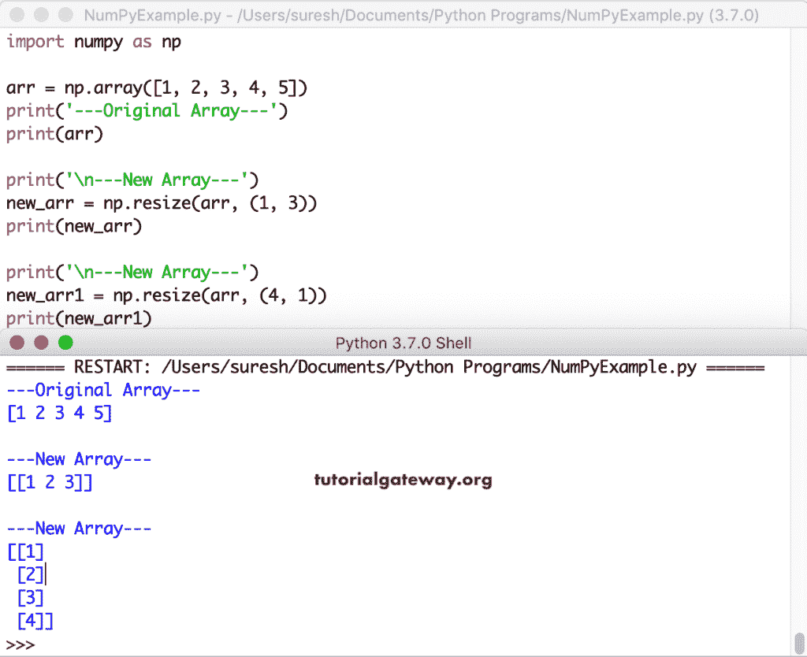

# Python numpy 数组形状

> 原文：<https://www.tutorialgateway.org/python-numpy-array-shape/>

Python numpy 模块有一个`shape()`函数，它可以帮助我们找到数组或矩阵的形状或大小。除了这个形状函数之外，Python numpy 模块还具有整形、调整大小、转置、交换、展平、散开和挤压功能，可以将数组的矩阵更改为所需的形状。

## Python numpy 数组形状

Python numpy 模块有一个重要的属性，叫做 shape。Python Numpy 数组形状属性是获取或查找它的形状。

```
import numpy as np

arr = np.array([10, 20, 30, 40, 50, 60, 70, 80])
print(arr)

print(np.shape(arr))
```

```
[10 20 30 40 50 60 70 80]
(8,)
```

让我再展示一个 Python numpy 数组形状的例子。这里，我们使用不同大小的数组，然后使用 Python shape 属性找到它们的形状。

```
import numpy as np

x = np.array([[10, 20, 30], [40, 50, 60]])
print(x)
print('x = ', np.shape(x))
print()

arr = np.array([[1, 2], [3, 4], [5, 6], [7, 8]])
print(arr)
print('arr = ', np.shape(arr))

arr1 = np.random.randint(5, 50, size = (5, 8))
print('\n-----Two Dimensional Random----')
print(arr1)
print('arr1 = ', np.shape(arr1))

arr2 = np.array([[[ 7, 24, 24, 22], [24, 10, 16,  2], [ 1, 16, 7, 16]],
                 [[22, 23, 12, 39], [16, 30, 37, 15],[16, 17,  3, 19]]])
print('\n-----Three Dimensional----')
print(arr2)
print('arr2 = ', np.shape(arr2))
```

```
[[10 20 30]
 [40 50 60]]
x =  (2, 3)

[[1 2]
 [3 4]
 [5 6]
 [7 8]]
arr =  (4, 2)

-----Two Dimensional Random----
[[15 41 15 28 34 39 29 38]
 [12 39 22 37 32 15 40 17]
 [48 18 23 41 43 21 10 12]
 [33 49  9 18 31 38 24 28]
 [10 46 46 10 41 37 40 21]]
arr1 =  (5, 8)

-----Three Dimensional----
[[[ 7 24 24 22]
  [24 10 16  2]
  [ 1 16  7 16]]

 [[22 23 12 39]
  [16 30 37 15]
  [16 17  3 19]]]
arr2 =  (2, 3, 4)
```

## Python numpy 阵列 reshape

Python Numpy 整形函数接受数组作为第一个参数，接受形状或矩阵大小作为第二个参数。

```
import numpy as np

arr = np.array([[10, 20, 30], [40, 50, 60]])
print(arr)
print('arr = ', np.shape(arr))

print('\n---New---')
new_arr = np.reshape(arr, (6,))
print(new_arr)
print('new_arr = ', np.shape(new_arr))
```

Python 重塑函数输出

```
[[10 20 30]
 [40 50 60]]
arr =  (2, 3)

---New---
[10 20 30 40 50 60]
new_arr =  (6,)
```

这是重塑功能的另一个例子。在这里，我们使用了一维数组，并将其重塑为不同的维度。供您参考，我们正在使用 Python Numpy 数组形状函数来返回整形后的形状。

```
import numpy as np

arr = np.array([10, 20, 30, 40, 50, 60, 70, 80])
print(arr)
print(np.shape(arr))

print('\n---New ---')
new_arr = np.reshape(arr, (2,4))
print(new_arr)
print(np.shape(new_arr))

print('\n---New ---')
new_arr1 = np.reshape(arr, (4, 2))
print(new_arr1)
print(np.shape(new_arr1))

print('\n---New ---')
new_arr2 = np.reshape(arr, (8,1))
print(new_arr2)
print(np.shape(new_arr2))
```

```
[10 20 30 40 50 60 70 80]
(8,)

---New ---
[[10 20 30 40]
 [50 60 70 80]]
(2, 4)

---New ---
[[10 20]
 [30 40]
 [50 60]
 [70 80]]
(4, 2)

---New ---
[[10]
 [20]
 [30]
 [40]
 [50]
 [60]
 [70]
 [80]]
(8, 1)
```

如果不知道或不想使用形状的第二个值，则可以指定-1。numpy 数组整形函数自动选择大小并用-1 替换它。

```
import numpy as np

arr = np.array([[10, 20, 30, 40, 50, 60, 70, 80]])
print(arr)
print('Array Shape = ', np.shape(arr))

print('\n---New ---')
new_arr = np.reshape(arr, (2,-1))
print(new_arr)
print(np.shape(new_arr))

print('\n---New ---')
new_arr1 = np.reshape(arr, (4, -1))
print(new_arr1)
print(np.shape(new_arr1))
```

```
[[10 20 30 40 50 60 70 80]]
Array Shape =  (1, 8)

---New ---
[[10 20 30 40]
 [50 60 70 80]]
(2, 4)

---New ---
[[10 20]
 [30 40]
 [50 60]
 [70 80]]
(4, 2)
```

## Python 数组大小调整

Python 的调整大小功能对于将现有数组调整到所需的形状非常有用。此函数接受数组作为第一个参数，接受所需的形状大小作为第二个参数。如果指定的所需形状大于原始形状， [Numpy](https://www.tutorialgateway.org/python-numpy-array/) 数组大小调整功能会复制基本数组中的值，以创建一个大数组。

```
import numpy as np

arr = np.array([1, 2, 3])
print(arr)

print('\n---New ---')
new_arr = np.resize(arr, (4, 3))
print(new_arr)

print('\n---New ---')
new_arr1 = np.resize(arr, (9, 8))
print(new_arr1)
```

调整大小功能来改变形状输出

```
[1 2 3]

---New ---
[[1 2 3]
 [1 2 3]
 [1 2 3]
 [1 2 3]]

---New ---
[[1 2 3 1 2 3 1 2]
 [3 1 2 3 1 2 3 1]
 [2 3 1 2 3 1 2 3]
 [1 2 3 1 2 3 1 2]
 [3 1 2 3 1 2 3 1]
 [2 3 1 2 3 1 2 3]
 [1 2 3 1 2 3 1 2]
 [3 1 2 3 1 2 3 1]
 [2 3 1 2 3 1 2 3]]
```

让我们看看当我们将 [Python](https://www.tutorialgateway.org/python-tutorial/) 数组的大小调整到更小时会发生什么。

```
import numpy as np

arr = np.array([1, 2, 3, 4, 5])
print('---Original Array---')
print(arr)

print('\n---New Array---')
new_arr = np.resize(arr, (1, 3))
print(new_arr)

print('\n---New Array---')
new_arr1 = np.resize(arr, (4, 1))
print(new_arr1)
```



## Python numpy 阵列转置

Python 转置函数帮助您转置给定的矩阵或 2D 数组。

```
import numpy as np

arr = np.random.randint(5, 50, size = (5, 8))
print('\n-----Two Dimensional Random ----')
print(arr)

print('\n-----Transposed Two Dimensional ----')
print(np.transpose(arr))
```

使用转置函数输出更改 numpy 形状

```
 -----Two Dimensional Random----
[[11 28 30 26  8 39 26 46]
 [16 22 27  9 25 16 17 10]
 [20 42 14 36 31 22 43 10]
 [41 35 25 13 36 33 18 23]
 [21 46 42 39 48  9 21 44]]

-----Transposed Two Dimensional----
[[11 16 20 41 21]
 [28 22 42 35 46]
 [30 27 14 25 42]
 [26  9 36 13 39]
 [ 8 25 31 36 48]
 [39 16 22 33  9]
 [26 17 43 18 21]
 [46 10 10 23 44]]
```

### Python 转置三维数组

让我用这个 Python 转置函数来转置一个 3D 数组

```
import numpy as np

arr2 = np.random.randint(1, 20, size = (2, 3, 4))
print('\n-----Three Dimensional Random ----')
print(arr2)

print('\n-----Transposed Three Dimensional ----')
print(np.transpose(arr2))
```

通过变换三维输出改变形状

```
 -----Three Dimensional Random ----
[[[ 5 11  8  7]
  [17 14 12 14]
  [19 16  1 17]]

 [[ 1 13 12 10]
  [18  3  5 18]
  [ 6  1 12 10]]]

-----Transposed Three Dimensional ----
[[[ 5  1]
  [17 18]
  [19  6]]

 [[11 13]
  [14  3]
  [16  1]]

 [[ 8 12]
  [12  5]
  [ 1 12]]

 [[ 7 10]
  [14 18]
  [17 10]]]
```

## python num py array swap axes(python num py 阵列交换轴)

Python 的交换函数是交换给定的数组的两个轴。它接受三个参数——名称、第一轴和第二轴。接下来，Python numpy 数组交换函数交换第一轴和第二轴。

```
import numpy as np

arr1 = np.array([[10, 20, 30, 40]])
print(arr1)
print('swapaxes Result of arr1')
print(np.swapaxes(arr1, 0, 1))

arr2 = np.array([[10, 20, 30], [40, 50, 60]])
print(arr2)
print('swapaxes Result of arr2')
print(np.swapaxes(arr2, 0, 1))

arr3 = np.array([[[10, 20], [30, 40], [50, 60]]])
print('swapaxes Result of arr3')
print(np.swapaxes(arr3, 0, 1))

print('swapaxes Result of arr3 - 0, 2')
print(np.swapaxes(arr3, 0, 2))

print('swapaxes Result of arr3 - 2, 1')
print(np.swapaxes(arr3, 2, 1))
```

numpy swapaxes 形状输出

```
[[10 20 30 40]]
swapaxes Result of arr1
[[10]
 [20]
 [30]
 [40]]
[[10 20 30]
 [40 50 60]]
swapaxes Result of arr2
[[10 40]
 [20 50]
 [30 60]]
swapaxes Result of arr3
[[[10 20]]

 [[30 40]]

 [[50 60]]]
swapaxes Result of arr3 - 0, 2
[[[10]
  [30]
  [50]]

 [[20]
  [40]
  [60]]]
swapaxes Result of arr3 - 2, 1
[[[10 30 50]
  [20 40 60]]]
```

这次，我们在由`randint()`函数生成的三维随机数组上使用这个 Python `swapaxes()`函数。

```
import numpy as np

arr3 = np.random.randint(1, 40, size = (2, 3, 4))
print(arr3)
print('swapaxes Result of arr3, 0, 1')
print(np.swapaxes(arr3, 0, 1))

print('swapaxes Result of arr3, 0, 2')
print(np.swapaxes(arr3, 0, 2))

print('swapaxes Result of arr3, 2, 1')
print(np.swapaxes(arr3, 2, 1))
```

Python Numpy 交换函数用于整形输出

```
[[[22 38 11 37]
  [33 33 37 30]
  [37 29 17 13]]

 [[26 17  8 35]
  [38 28 28 32]
  [ 7 38 15 26]]]
swapaxes Result of arr3, 0, 1
[[[22 38 11 37]
  [26 17  8 35]]

 [[33 33 37 30]
  [38 28 28 32]]

 [[37 29 17 13]
  [ 7 38 15 26]]]
swapaxes Result of arr3, 0, 2
[[[22 26]
  [33 38]
  [37  7]]

 [[38 17]
  [33 28]
  [29 38]]

 [[11  8]
  [37 28]
  [17 15]]

 [[37 35]
  [30 32]
  [13 26]]]
swapaxes Result of arr3, 2, 1
[[[22 33 37]
  [38 33 29]
  [11 37 17]
  [37 30 13]]

 [[26 38  7]
  [17 28 38]
  [ 8 28 15]
  [35 32 26]]]
```

## Python numpy 数组展平

Python 扁平化函数将给定的数组折叠成一维数组。这个 Python Numpy 数组展平函数接受顺序参数来决定展平项目的顺序。

order = {C，F，A，K }–您可以使用其中一个，或者它会考虑 C，因为它是默认的。c 表示项目将按主要行顺序变平。f 表示 Fortran 风格或列主顺序。如果数组是 Fortran 连续的，A 按列主顺序变平，否则按行主顺序变平。k 按照记忆中出现的元素的顺序变平。

```
import numpy as np

arr = np.array([[1, 2, 3], [4, 5, 6]])
print('flatten Result of arr Order C = ', arr.flatten())
print('flatten Result of arr Order F = ', arr.flatten('F'))
print('flatten Result of arr Order A = ', arr.flatten('A'))
print('flatten Result of arr Order K = ', arr.flatten('K'))

arr1 = np.array([[10, 20], [30, 40], [50, 60], [70, 80]])
print('\nflatten Result of arr1 Order C')
print(arr1.flatten())

print('\nflatten Result of arr1 = F')
print(arr1.flatten('F'))

print('\nflatten Result of arr1 = A')
print(arr1.flatten('A'))

print('\nflatten Result of arr1  = K')
print(arr1.flatten('K'))
```

使用 numpy 展平函数输出

```
flatten Result of arr Order C =  [1 2 3 4 5 6]
flatten Result of arr Order F =  [1 4 2 5 3 6]
flatten Result of arr Order A =  [1 2 3 4 5 6]
flatten Result of arr Order K =  [1 2 3 4 5 6]

flatten Result of arr1 Order C
[10 20 30 40 50 60 70 80]

flatten Result of arr1 = F
[10 30 50 70 20 40 60 80]

flatten Result of arr1 = A
[10 20 30 40 50 60 70 80]

flatten Result of arr1 = K
[10 20 30 40 50 60 70 80]
```

这次，我们使用`randint()`函数生成了一个[随机](https://www.tutorialgateway.org/python-random-array/)三维整数数组。接下来，我们使用这个 Python Numpy 展平函数将数组展平为一维。

```
import numpy as np

arr2 = np.random.randint(1, 40, size = (2, 3, 4))
print(arr2)
print('flatten Result of arr2')
print(arr2.flatten())

print('\nflatten Result of arr2 = F')
print(arr2.flatten('F'))

print('\nflatten Result of arr2 = A')
print(arr2.flatten('A'))

print('\nflatten Result of arr2 = K')
print(arr2.flatten('K'))
```

Numpy 展平功能，用于展平或更改形状输出

```
[[[38 14 31 31]
  [14 16 34 21]
  [ 6 11 37 33]]

 [[11 17  7 33]
  [31 34 30 28]
  [36 14 39  8]]]
flatten Result of arr2
[38 14 31 31 14 16 34 21  6 11 37 33 11 17  7 33 31 34 30 28 36 14 39  8]

flatten Result of arr2 = F
[38 11 14 31  6 36 14 17 16 34 11 14 31  7 34 30 37 39 31 33 21 28 33  8]

flatten Result of arr2 = A
[38 14 31 31 14 16 34 21  6 11 37 33 11 17  7 33 31 34 30 28 36 14 39  8]

flatten Result of arr2 = K
[38 14 31 31 14 16 34 21  6 11 37 33 11 17  7 33 31 34 30 28 36 14 39  8]
```

## Python Numpy 阵列 ravel

Python `ravel()`函数返回一个连续的扁平一维数组。这个 Python Numpy`ravel()`函数的语法是

```
numpy.ravel(name, order = {C, F, A, K})
```

这个 Python 数组`ravel()`函数接受顺序参数来决定展平项目的顺序。c 表示行主顺序中项目的索引。f 表示 Fortran 风格或列主顺序的索引项。如果一个数组是 Fortran 连续的，A 按列主顺序读取索引，否则按行主顺序读取。k 按照内存中出现的元素顺序读取索引。

```
import numpy as np

arr = np.array([[1, 2, 3], [4, 5, 6]])
print('arr ravel Result of Order C = ', np.ravel(arr))
print('arr ravel Result of Order F = ', np.ravel(arr, order = 'F'))
print('arr ravel Result of Order A = ', np.ravel(arr, order = 'A'))
print('arr ravel Result of Order K = ', np.ravel(arr, order = 'K'))

arr1 = np.array([[11, 20], [33, 40], [55, 60], [77, 80]])
print('\narr1 ravel Result of Order C = ', np.ravel(arr1))
print('arr1 ravel Result of Order F = ', np.ravel(arr1, order = 'F'))
print('arr1 ravel Result of Order A = ', np.ravel(arr1, order = 'A'))
print('arr1 ravel Result of Order K = ', np.ravel(arr1, order = 'K'))
```

Numpy`ravel()`函数对数组输出进行整形

```
arr ravel Result of Order C =  [1 2 3 4 5 6]
arr ravel Result of Order F =  [1 4 2 5 3 6]
arr ravel Result of Order A =  [1 2 3 4 5 6]
arr ravel Result of Order K =  [1 2 3 4 5 6]

arr1 ravel Result of Order C =  [11 20 33 40 55 60 77 80]
arr1 ravel Result of Order F =  [11 33 55 77 20 40 60 80]
arr1 ravel Result of Order A =  [11 20 33 40 55 60 77 80]
arr1 ravel Result of Order K =  [11 20 33 40 55 60 77 80]
```

在这个例子中，我们使用 Python `randint()`函数声明了一个随机数的三维整数数组。接下来，我们使用 Python Numpy`ravel()`函数将这个随机数组展平为连续的一维数组。

```
import numpy as np

arr = np.random.randint(1, 40, size = (2, 3, 4))
print(arr)

print('\narr ravel Result of Order C')
print(np.ravel(arr))

print('arr ravel Result of Order F')
print(np.ravel(arr, order = 'F'))

print('arr ravel Result of Order A')
print(np.ravel(arr, order = 'A'))

print('arr ravel Result of Order K')
print(np.ravel(arr, order = 'K'))

print('\nTransposed arr ravel Result of Order C')
print(np.ravel(arr.T))
```

Python Numpy`ravel()`函数输出

```
[[[ 7  9 22 11]
  [ 4  8 11 35]
  [ 3 34 28  5]]

 [[28 18 18 15]
  [14 37  8 23]
  [35 35 13 23]]]

arr ravel Result of Order C
[ 7  9 22 11  4  8 11 35  3 34 28  5 28 18 18 15 14 37  8 23 35 35 13 23]
arr ravel Result of Order F
[ 7 28  4 14  3 35  9 18  8 37 34 35 22 18 11  8 28 13 11 15 35 23  5 23]
arr ravel Result of Order A
[ 7  9 22 11  4  8 11 35  3 34 28  5 28 18 18 15 14 37  8 23 35 35 13 23]
arr ravel Result of Order K
[ 7  9 22 11  4  8 11 35  3 34 28  5 28 18 18 15 14 37  8 23 35 35 13 23]

Transposed arr ravel Result of Order C
[ 7 28  4 14  3 35  9 18  8 37 34 35 22 18 11  8 28 13 11 15 35 23  5 23]
```

## Python 数组挤压

Python 数组挤压函数从给定的形状中移除一维条目。这个 Python Numpy 挤压函数的语法是

```
numpy.squeeze(array_name, axis = {None, 0, 1, 2 ..}).
```

```
import numpy as np

arr = np.arange(12).reshape(1, 3, 4)
print(arr)
print('\narr squeeze Result')

a = np.squeeze(arr)
print(a)
print('a = ', arr.shape, a.shape)

b = np.squeeze(arr, axis = 0)
print(b)
print('b = ', arr.shape, b.shape)

arr1 = np.array([[[[11, 20], [33, 40], [55, 60], [77, 80]]]])
x = np.squeeze(arr1)
print(x)
print('x = ', arr1.shape, x.shape)

y = np.squeeze(arr1, axis = 1)
print(y)
print('y = ', arr1.shape, y.shape)
```

Python Numpy 挤压函数输出

```
[[[ 0  1  2  3]
  [ 4  5  6  7]
  [ 8  9 10 11]]]

arr squeeze Result
[[ 0  1  2  3]
 [ 4  5  6  7]
 [ 8  9 10 11]]
a =  (1, 3, 4) (3, 4)
[[ 0  1  2  3]
 [ 4  5  6  7]
 [ 8  9 10 11]]
b =  (1, 3, 4) (3, 4)
[[11 20]
 [33 40]
 [55 60]
 [77 80]]
x =  (1, 1, 4, 2) (4, 2)
[[[11 20]
  [33 40]
  [55 60]
  [77 80]]]
y =  (1, 1, 4, 2) (1, 4, 2)
```