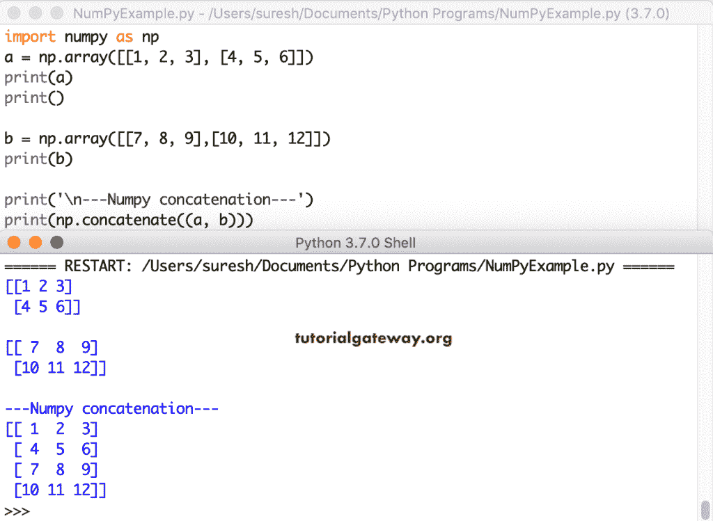

# Python numpy 连接

> 原文：<https://www.tutorialgateway.org/python-numpy-concatenate/>

Python numpy 连接函数用于将两个或多个数组连接在一起。它返回一个串联的数组作为输出。Python numpy 连接函数的语法是

```
numpy.concatenate((array1, array2,....), axis = 0)
```

*   array1、array2、…是要连接的数组。传递给此连接函数的数组必须具有相同的形状。但是，您可以选择不同维度的数组。
*   axis–这是一个可选参数，默认值为 0。用它来指定应该以哪种方式(水平或垂直)进行连接。

## Python numpy 连接数组

在这个例子中，我们声明了两个 numpy ndarrays。接下来，我们使用这个 Python numpy`concatenate()`函数来连接这两个数组。

```
import numpy as np

a = np.array([1, 2, 3])
print(a)

b = np.array([4, 5, 6])
print(b)

print('\n---concatenation---')
print(np.concatenate((a, b)))
```

Python numpy 连接数组输出

```
[1 2 3]
[4 5 6]

---concatenation---
[1 2 3 4 5 6]
```

Python Numpy 连接函数不限于连接两个数组。您可以使用此函数连接两个以上的。这里，我们使用这个函数连接四个不同的数组。

```
import numpy as np
a = np.array([1, 2, 3])
print(a)

b = np.array([4, 5, 6])
print(b)

c = np.array([7, 8, 9])
print(c)

d = np.array([10, 11, 12])
print(d)

print('\n------')
print(np.concatenate((a, b, c, d)))
```

数组输出上的 Numpy 连接函数

```
[1 2 3]
[4 5 6]
[7 8 9]
[10 11 12]

------
[ 1  2  3  4  5  6  7  8  9 10 11 12]
```

## Python numpy 链接 2D 数组

我们使用 Python Numpy 连接函数来连接二维数组。

```
import numpy as np
a = np.array([[1, 2, 3], [4, 5, 6]])
print(a)
print()

b = np.array([[7, 8, 9],[10, 11, 12]])
print(b)

print('\n---Numpy concatenation---')
print(np.concatenate((a, b)))
```



这是另一个连接 2D 数组的 numpy 示例。

```
import numpy as np
a = np.array([[10, 20, 30, 40]])
print(a)

b = np.array([[50 ,60, 70, 80], [90 ,100, 110, 120]])
print(b)

print('\n------')
print(np.concatenate((a, b)))

print('\n------')
print(np.concatenate((b, a)))
```

```
[[10 20 30 40]]
[[ 50  60  70  80]
 [ 90 100 110 120]]

------
[[ 10  20  30  40]
 [ 50  60  70  80]
 [ 90 100 110 120]]

------
[[ 50  60  70  80]
 [ 90 100 110 120]
 [ 10  20  30  40]]
```

### Python numpy 将 2D 数组与轴连接起来

到目前为止，我们使用的是没有轴参数的连接函数。这一次，我们在连接二维数组时使用这个参数值。请记住，如果 axis = 0，则数组 b 中的项垂直追加到 a 中。而 axis = 1 则水平追加数组 b 中的项到 a 中

```
import numpy as np
a = np.array([[1, 2, 3], [4, 5, 6]])
print(a)
print()

b = np.array([[7, 8, 9],[10, 11, 12]])
print(b)

print('\n---2D---')
print(np.concatenate((a, b), axis = 0))

print('\n---2D---')
print(np.concatenate((a, b), axis = 1))
```

```
[[1 2 3]
 [4 5 6]]

[[ 7  8  9]
 [10 11 12]]

---2D---
[[ 1  2  3]
 [ 4  5  6]
 [ 7  8  9]
 [10 11 12]]

---2D---
[[ 1  2  3  7  8  9]
 [ 4  5  6 10 11 12]]
```

在 [Python](https://www.tutorialgateway.org/python-tutorial/) 中，不需要指定轴。我的意思是，你可以直接使用这个值。

```
import numpy as np
a = np.array([[10, 20, 30], [40, 50, 60]])
print(a)
print()

b = np.array([[70, 80, 90],[100, 110, 120]])
print(b)

print('\n------')
print(np.concatenate((a, b), 0))

print('\n------')
print(np.concatenate((a, b), 1))
```

```
[[10 20 30]
 [40 50 60]]

[[ 70  80  90]
 [100 110 120]]

------
[[ 10  20  30]
 [ 40  50  60]
 [ 70  80  90]
 [100 110 120]]

------
[[ 10  20  30  70  80  90]
 [ 40  50  60 100 110 120]]
```

## python numpy 数组

在这个例子中，我们在三维数组上使用 [Numpy](https://www.tutorialgateway.org/python-numpy-array/) 连接函数。首先，我们使用随机点创建了两个 3D [随机数组](https://www.tutorialgateway.org/python-random-array/)。接下来，我们使用不同轴值的连接函数。

```
import numpy as np
a = np.array(np.random.randint(0, 10, size = (2, 3, 4)))
print(a)
print()

b = np.array(np.random.randint(11, 20, size = (2, 3, 4)))
print(b)

print('\n---Three Dimensional---')
print(np.concatenate((a, b), axis = -1))
```

数字连接三维数组输出

```
[[[5 3 6 4]
  [1 8 1 1]
  [1 9 7 2]]

 [[4 2 6 0]
  [4 3 6 8]
  [4 8 8 9]]]

[[[12 13 17 16]
  [17 14 16 13]
  [17 16 17 19]]

 [[16 18 18 16]
  [19 16 18 12]
  [18 19 18 14]]]

---Three Dimensional---
[[[ 5  3  6  4 12 13 17 16]
  [ 1  8  1  1 17 14 16 13]
  [ 1  9  7  2 17 16 17 19]]

 [[ 4  2  6  0 16 18 18 16]
  [ 4  3  6  8 19 16 18 12]
  [ 4  8  8  9 18 19 18 14]]]
>>> 
```

另一个连接三维 Numpy 数组的例子。

```
import numpy as np
a = np.array(np.random.randint(0, 10, size = (2, 3, 4)))
print(a)
print()

b = np.array(np.random.randint(11, 20, size = (2, 3, 4)))
print(b)

print('\n---Three Dimensional---')
print(np.concatenate((a, b), axis = -1))
```

```
[[[9 4 1 6]
  [1 9 4 5]
  [8 5 1 3]]

 [[9 3 3 3]
  [5 0 6 6]
  [5 9 7 4]]]

[[[16 17 12 12]
  [12 19 19 14]
  [11 11 11 14]]

 [[15 17 13 17]
  [17 13 17 19]
  [18 12 15 11]]]

---Three Dimensional---
[[[ 9  4  1  6 16 17 12 12]
  [ 1  9  4  5 12 19 19 14]
  [ 8  5  1  3 11 11 11 14]]

 [[ 9  3  3  3 15 17 13 17]
  [ 5  0  6  6 17 13 17 19]
  [ 5  9  7  4 18 12 15 11]]]
```

## Python numpy 连接不同的大小

到目前为止，我们一直在使用相同大小的数组(加入相同大小的数组)。让我使用这个连接函数连接不同大小的数组。

```
import numpy as np
x = np.array([1, 2, 3])
print(x)

y = np.array([4, 5])
print(y)

print('\n---concatenation---')
print(np.concatenate((x, y)))
print()

a = np.array([[1, 2, 3], [4, 5, 6]])
print(a)
print()

b = np.array([[7, 8, 9],[10, 11, 12], [13, 14, 15]])
print(b)

print('\n---Two Dimensional---')
print(np.concatenate((a, b), axis = 0))

print('\n---Two Dimensional---')
print(np.concatenate((b, a.T), axis = 1))
```

```
[1 2 3]
[4 5]

---concatenation---
[1 2 3 4 5]

[[1 2 3]
 [4 5 6]]

[[ 7  8  9]
 [10 11 12]
 [13 14 15]]

---Two Dimensional---
[[ 1  2  3]
 [ 4  5  6]
 [ 7  8  9]
 [10 11 12]
 [13 14 15]]

---Two Dimensional---
[[ 7  8  9  1  4]
 [10 11 12  2  5]
 [13 14 15  3  6]]
```

## Python numpy 哈萨克斯坦

Python numpy`hstack()`函数水平追加数组项，类似于 axis = 1。

```
import numpy as np
a = np.array([10, 20, 30, 40])
print(a)

b = np.array([50 ,60, 70, 80])
print(b)

print('\n--- hstack on one Dimensional ---')
print(np.hstack((a, b)))
```

```
[10 20 30 40]
[50 60 70 80]

--- hstack on one Dimensional ---
[10 20 30 40 50 60 70 80]
```

让我使用这个 Python numpy`hstack()`函数来连接二维数组。

```
import numpy as np
a = np.array(np.random.randint(0, 10, size = (3, 3)))
print(a)
print()

b = np.array(np.random.randint(11, 20, size = (3, 3)))
print(b)

print('\n---hstack on Two Dimensional ---')
print(np.hstack((a, b)))
```

```
[[3 6 0]
 [4 3 5]
 [3 8 7]]

[[11 12 11]
 [12 13 17]
 [19 11 17]]

--- hstack on Two Dimensional ---
[[ 3  6  0 11 12 11]
 [ 4  3  5 12 13 17]
 [ 3  8  7 19 11 17]]
```

## python numpy 链接

Python numpy`vstack()`函数垂直追加数组项，类似于 axis = 0。

```
import numpy as np
a = np.array([10, 20, 30, 40])
print(a)

b = np.array([50 ,60, 70, 80])
print(b)

print('\n--- vstack on one Dimensional ---')
print(np.vstack((a, b)))
```

```
[10 20 30 40]
[50 60 70 80]

--- vstack on one Dimensional ---
[[10 20 30 40]
 [50 60 70 80]]
```

我们使用`vstack()`函数来连接两个维度。

```
import numpy as np
a = np.array(np.random.randint(0, 10, size = (3, 3)))
print(a)
print()

b = np.array(np.random.randint(11, 20, size = (3, 3)))
print(b)

print('\n--- vstack on Two Dimensional ---')
print(np.vstack((a, b)))
```

连接二维输出的`vstack()`函数

```
[[8 7 1]
 [3 4 5]
 [8 7 6]]

[[11 17 13]
 [14 12 14]
 [18 17 18]]

--- vstack on Two Dimensional ---
[[ 8  7  1]
 [ 3  4  5]
 [ 8  7  6]
 [11 17 13]
 [14 12 14]
 [18 17 18]]
```