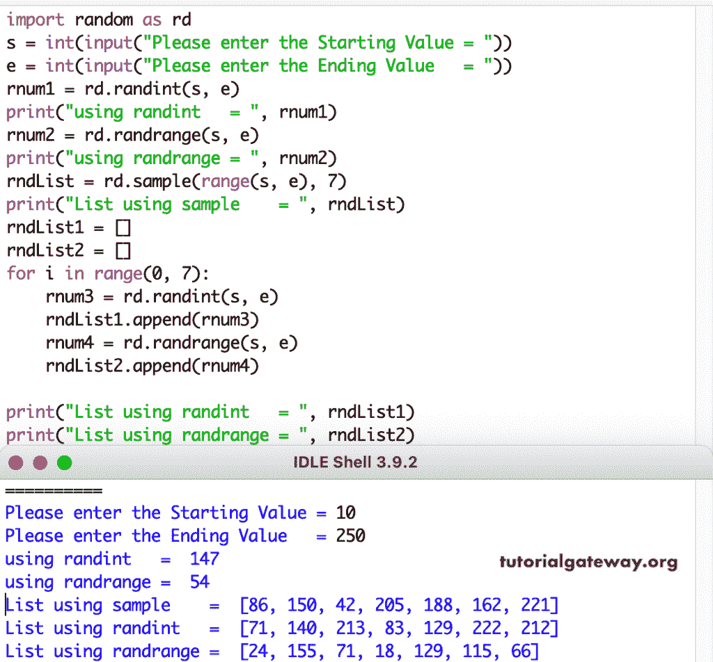

# Python 随机数生成器

> 原文:[https://www . tutorialgateway . org/python-随机数生成器/](https://www.tutorialgateway.org/python-random-number-generator/)

编写一个 Python 程序，生成一个 0 到 n 之间的随机数(float)，要使用以下函数，我们必须导入随机模块。

请记住，下面显示的输出可能与您得到的不同。因为这些 python 数字函数每次调用都会生成随机数。

## 0 到 1 之间的 Python 随机数

random()函数生成一个介于 0 和 1 之间的数字，数据类型为 float。下面的 python 数字生成器示例返回一个从 0 到 1 的随机浮点数。

```
import random

rnum = random.random()

print(rnum)
```

```
0.9625965525945374
```

## Python 范围内的随机整数

randint()函数接受两个参数。第一个参数是起始值，第二个参数是终止值。这里，起点是 0，终点是 n。

如果你想在一个起始值和其他非终止值之间生成一个数，那么使用下面的代码。例如，下面的代码返回 10 到 100 之间的数字。

```
import random as rnd

rnum = rnd.randint(10, 100)

print(rnum)
```

```
70
```

randrange()函数在需要从一系列整数中进行选择时非常有用。如果传入一个步长值，它只会跳过这么多数字，从整数集中选取一个值。在最后一条语句中，我们在 step val 之后传入一个整数。

```
import random as rd

rnum1 = rd.randrange(10)
print(rnum1)

rnum2 = rd.randrange(5, 95)
print(rnum2)

rnum3 = rd.randrange(10, 200, 2)
print(rnum3)
```

```
2
61
186
```

如果将上述函数与 for 循环结合使用，则有利于用假数据进行测试或模拟。默认情况下，range 函数在每一步跳过一个数字。因此，我们可以看到范围不需要步长参数。如果你想跳过其他的。

因为，这告诉 for 循环为每次迭代生成一个整数。下面生成 100 到 200 之间的数字。

我们还添加了一个额外的 print 语句来打印每次循环迭代生成的数字。通过这个 python 随机数生成器的例子，您可以更好地理解它。

```
import random as rd

rndList = []

for i in range(1, 11):
    rnum = rd.randint(10, 100)
    rndList.append(rnum)
    print(rnum)

print(rndList)
```

```
16
23
72
51
63
78
39
47
80
46
[16, 23, 72, 51, 63, 78, 39, 47, 80, 46]
```

下面两个例子，我们没有使用导入包行。为了显示第二个和第三个示例，添加上面的导入行。

在第二个例子中，我们使用了 [Python](https://www.tutorialgateway.org/python-tutorial/) randrange 函数和 for 循环。

```
rndList = []

for i in range(0, 8):
    rnum = rd.randrange(5, 95)
    rndList.append(rnum)
    print(rnum)

print(rndList)
```

```
70
62
58
53
44
60
79
73
[70, 62, 58, 53, 44, 60, 79, 73]
```

在第三个例子中，我们在 for 循环中使用它来打印 5 个介于 0 和 1 之间的浮点数。

```
rndList = []

for i in range(1, 11):
    rnum = rd.randint(10, 100)
    rndList.append(rnum)
    print(i, " = ", rnum)

print(rndList)
```

```
1 =  46
2 =  28
3 =  95
4 =  53
5 =  55
6 =  68
7 =  70
8 =  94
9 =  65
10 =  95
[46, 28, 95, 53, 55, 68, 70, 94, 65, 95]
```

## 1 到 10 之间的 Python 随机数

Python 随机模块包含一个示例()，允许您从列表或元组中选择一个或多个元素。您可以使用 choice 函数从序列中选择一个元素。要使用它，传入一个序列，以及样本大小(要采样多少元素)。

它将从序列中返回一部分元素。例如，下面的程序返回 8 个 1 到 10 之间的数字。

```
import random as rnd

rndList = rnd.sample(range(1, 10), 8)

print(rndList)
```

```
[2, 4, 1, 5, 7, 8, 6, 3]
```

在这里，我们允许用户输入开始和停止值，并使用不同的函数生成这些值之间的数字。这里，代码可能与图像略有不同，因为我们删除了其中的额外文本以保持代码简单。

```
import random as rd

s = int(input("Please enter the Starting Value = "))
e = int(input("Please enter the Ending Value   = "))

rnum1 = rd.randint(s, e)
print("using randint   = ", rnum1)

rnum2 = rd.randrange(s, e)
print("using randrange = ", rnum2)

rndList = rd.sample(range(s, e), 7)
print("List using sample    = ", rndList)

rndList1 = []
rndList2 = []

for i in range(0, 7):
    rnum3 = rd.randint(s, e)
    rndList1.append(rnum3)
    rnum4 = rd.randrange(s, e)
    rndList2.append(rnum4)

print("List using randint   = ", rndList1)
print("List using randrange = ", rndList2)
```

