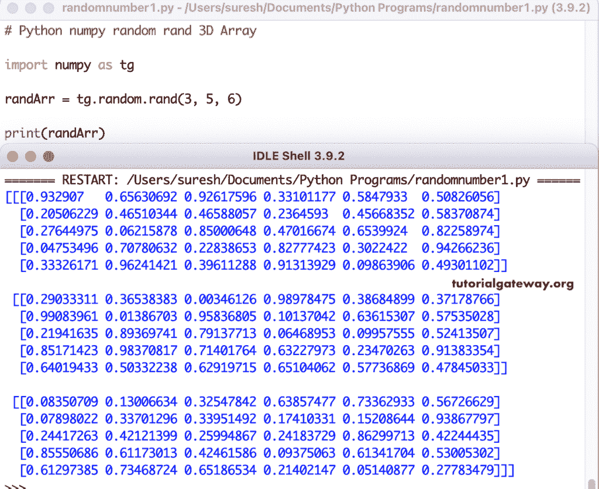

# python num py random rand(python num py 随机边界)

> 原文：<https://www.tutorialgateway.org/python-numpy-random-rand/>

Python numpy`random()`函数生成均匀分布的随机数，并创建给定形状的数组。为了使用这个随机`rand()`函数，我们必须导入 numpy 模块。这个 numpy 随机`rand()`函数的语法是

```
numpy.random.rand(d0, d1, d2,…., dn)
```

d0，d1，d2，…、dn 值是可选的，它们指定了数组维度。例如，numpy . rand . rand(3)表示具有随机样本的大小为 3 的一维数组。

## Python 随机数字示例

如前所述，Python`rand()`函数的参数值是可选的，因此我们使用这个函数时没有任何参数。

```
import numpy as tg

randArr = tg.random.rand()

print(randArr)
```

```
0.7278473630715507
```

### 使用 Python 随机数字创建一个 1D 数组

numpy`random()`函数创建一个给定维数的数组。这里，我们使用 numpy`random()`函数生成一个大小为 8 的一维随机数组。

```
import numpy as tg

randArr = tg.random.rand(8)

print(randArr)
```

```
[0.51529486 0.70732475 0.13123041 0.08868923 0.91606594 0.94329656
 0.73875145 0.85248642]
```

### 2D 边界阵列

在本例中，numpy`rand()`函数返回三行五列的二维数组。

```
import numpy as tg

randArr = tg.random.rand(3, 5)

print(randArr)
```

```
[[0.82700324 0.78752106 0.91874764 0.71277277 0.41604479]
 [0.7745265  0.88292852 0.56248594 0.09944867 0.5522274 ]
 [0.70205439 0.90095325 0.20693606 0.74183462 0.38383534]]
```

### 3D 边界阵列

```
import numpy as tg

randArr = tg.random.rand(3, 5, 6)

print(randArr)
```



Python 中的多维随机数组

```
import numpy as tg

randArr = tg.random.rand(2, 2, 2, 3, 4)

print(randArr)
```

[Python](https://www.tutorialgateway.org/python-tutorial/) 输出

```
[[[[[2.22991745e-01 4.82875578e-01 4.02098798e-01 9.82463072e-01]
    [1.27502476e-02 3.78317995e-01 1.31346574e-01 3.58953956e-01]
    [6.31334854e-01 1.80433343e-02 7.73429470e-01 8.47566829e-01]]

   [[7.46991797e-01 9.49487163e-01 6.74764732e-01 8.73915802e-01]
    [1.66405826e-01 6.96463970e-01 2.18829056e-01 6.75685704e-01]
    [1.46913928e-02 2.66258908e-01 3.49072489e-02 7.51997693e-01]]]

  [[[3.15566931e-01 6.77939362e-01 5.68240002e-02 3.78304965e-02]
    [6.26829456e-01 1.64778430e-01 5.80110973e-01 9.45645604e-01]
    [4.52814994e-01 6.12752904e-02 3.98656682e-01 6.12022902e-01]]

   [[8.48650860e-01 9.58124465e-01 6.36882147e-02 5.82332018e-01]
    [4.78369858e-02 5.63250308e-01 6.18235746e-01 4.06755385e-01]
    [9.24566606e-02 8.76239936e-01 2.94192746e-02 1.79601830e-01]]]]

 [[[[2.31480056e-01 8.54221882e-01 6.02771565e-02 1.31022006e-02]
    [6.22401057e-03 3.08509460e-01 3.83590441e-01 8.70963661e-01]
    [9.10762417e-01 4.53411875e-01 5.39746576e-01 8.12068034e-01]]

   [[4.88355065e-01 9.90180989e-01 1.70643645e-01 9.42585049e-01]
    [5.10431032e-01 6.86724036e-01 8.80602910e-01 9.28994548e-01]
    [6.96880899e-04 8.14746646e-01 9.55883374e-02 2.45433858e-01]]]

  [[[9.05425064e-02 3.76958137e-01 4.04775524e-01 6.72941808e-01]
    [5.44979157e-01 4.18175802e-01 5.35779225e-01 1.90175407e-02]
    [2.70055421e-01 6.20119362e-01 6.02102212e-01 5.89668883e-01]]

   [[5.29601610e-01 8.34906099e-01 1.71963671e-01 7.76704873e-01]
    [4.85148164e-02 3.33561971e-01 9.33291412e-01 2.81507135e-01]
    [9.14183251e-01 1.89159336e-02 1.11227617e-01 2.97916564e-01]]]]]
```