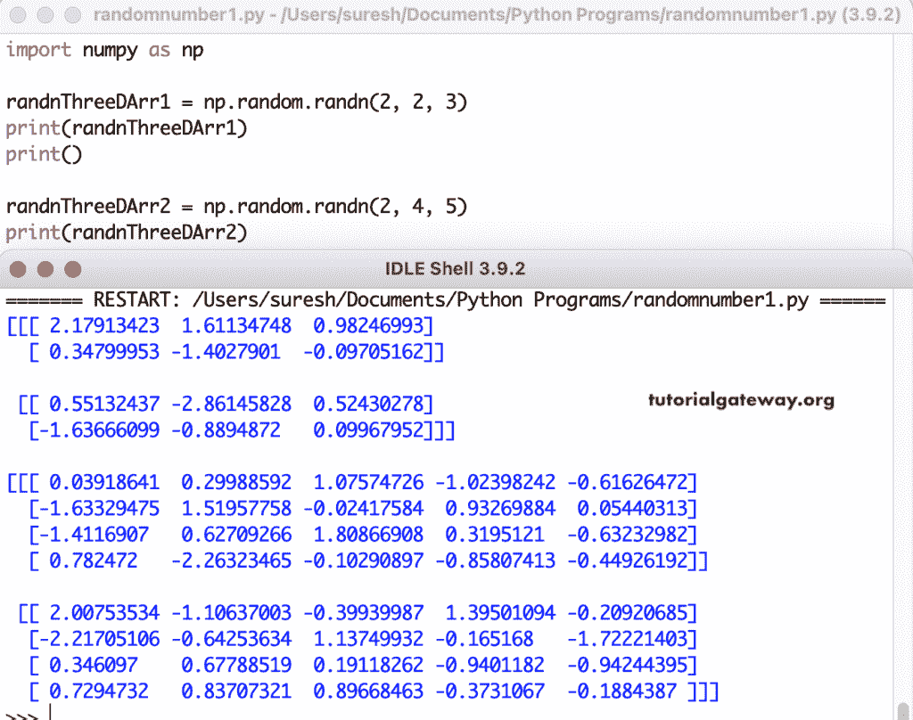

# python numpy random randn

> 原文：<https://www.tutorialgateway.org/python-numpy-random-randn/>

Python numpy random 函数从标准正态分布返回随机数数组。numpy 随机随机数的语法是

```
numpy.random.randn(d0, d1, d2, d3,……, dn)
```

d0、d1、d2、d3、……、dn 参数值是可选的，它们指定数组维度。如果我们提供正参数，随机 randn 函数会生成一个填充了随机浮点值的给定形状。

## Python 随机随机数示例

如果您没有提供任何参数值，那么 Python numpy random 将返回一个浮点值。否则，numpy random 函数返回一个 ndarray。在这个例子中，我们在没有任何参数的情况下使用这个函数。

```
import numpy as np

randnArr1 = np.random.randn()
print(randnArr1)
print()

randnArr2 = np.random.randn()
print(randnArr2)
```

```
-0.1190630720571025

0.13108588886851796
```

### Python numpy 随机随机 1D 数组

这里，np.random.randn(5)创建了一个一维数组，并用随机数填充它们。

```
import numpy as np

randnOneDArr1 = np.random.randn(5)
print(randnOneDArr1)
print()

randnOneDArr2 = np.random.randn(8)
print(randnOneDArr2)
```

```
[-0.15532315  1.48066508  0.02134949  1.42327666  0.35529594]

[-1.08493387 -0.33618251  1.6513366  -0.76712552  0.20014333 -0.09537157
  0.12968054 -1.06886917]
```

### 2D 随机阵列

```
import numpy as np

randnTwoDArr1 = np.random.randn(2, 3)
print(randnTwoDArr1)
print()

randnTwoDArr2 = np.random.randn(4, 5)
print(randnTwoDArr2)
```

```
[[ 1.16499735 -0.29089086 -0.61637367]
 [-1.33852303 -1.55360179 -0.57502968]]

[[-1.19540849 -1.26507447  0.42922849 -0.99128182 -0.56647817]
 [-0.18800185 -1.3729178  -0.06733882  0.21002692  0.97676689]
 [-0.07614783  1.66854604  1.43727936  1.10420558 -0.47618305]
 [-0.84303037  0.80345969  0.43075844 -0.52133616  0.39946079]]
```

### 随机三维阵列

```
import numpy as np

randnThreeDArr1 = np.random.randn(2, 2, 3)
print(randnThreeDArr1)
print()

randnThreeDArr2 = np.random.randn(2, 4, 5)
print(randnThreeDArr2)
```



### Python 多维随机随机数组

```
import numpy as np

randnThreeDArr1 = np.random.randn(2, 2, 2, 3)
print(randnThreeDArr1)
print()

randnThreeDArr2 = np.random.randn(2, 2, 2, 2, 4)
print(randnThreeDArr2)
```

```
[[[[-0.49003723  0.10538309  1.00878589]
   [-1.04090049 -0.12316203 -2.71174546]]

  [[ 0.64973719  0.7905445  -2.21885022]
   [-0.42551294  0.07225683  0.06877539]]]

 [[[-1.31479185 -0.02534445  0.40838083]
   [-1.41941676  1.4174154   1.00272178]]

  [[ 1.67533883 -0.73425059  0.4134018 ]
   [ 1.0205856   0.81890094  0.70149338]]]]

[[[[[-0.21434075 -0.34164547 -0.00858992 -0.49217858]
    [ 1.0692015  -0.45626313 -0.74388692  0.04669171]]

   [[ 0.5586004   0.4855915  -1.01220602  1.19120821]
    [-0.16605316  1.14090238  0.03363894 -1.11966274]]]

  [[[ 1.74147131 -0.59825137 -1.10534603 -0.62323573]
    [ 0.38333497  0.24989126 -0.43793776  0.38728504]]

   [[-0.9094845   0.50144625 -0.03183788  1.51701865]
    [ 0.72316509 -0.3764924  -0.79577108 -0.1124155 ]]]]

 [[[[-0.06678042 -0.71614296 -0.56540373 -0.23460517]
    [-1.43545586  0.19400586 -0.46936663  0.22060458]]

   [[-1.63621087 -1.04987423 -0.92225825 -0.10737135]
    [-1.31863337  1.39154389 -0.56283176  1.20248983]]]

  [[[ 1.88742062  0.69761658  0.01897559  0.46728448]
    [ 0.75501117  1.08072768  0.66426271  0.13344399]]

   [[-1.36858917  1.48854343  0.4055712  -0.52813708]
    [-0.45967513 -0.64985973 -0.42966048 -0.56245859]]]]]
```

除此之外，我们还可以对 Python numpy 随机 randn 数组执行计算或算术运算。

```
import numpy as np

randnThreeDArr1 = np.random.randn(2, 3)
print(randnThreeDArr1)

print("\nrandn random array multiplies with 12 = \n", randnThreeDArr1 * 12)

print("\n2D random randn array multiplies with 15 and added 4 to it")
print(np.random.randn(2, 3) * 15 + 4)

print("\n3D random randn array multiplies with 9 and added 11 to it")
print(np.random.randn(2, 2, 3) * 9 + 11)
```

```
[[-0.37226814  1.45008532  1.23092693]
 [ 0.56230156 -0.47328258 -0.36321147]]

randn random array multiplies with 12 = 
 [[-4.46721768 17.4010238  14.77112321]
 [ 6.74761877 -5.67939092 -4.35853763]]

2D random randn array multiplies with 15 and added 4 to it
[[  3.69442594  -2.0569281   10.45519936]
 [ 22.77077114 -12.65088561 -14.92586724]]

3D random randn array multiplies with 9 and added 11 to it
[[[-1.22722572  8.52319722  1.47347351]
  [ 0.40692321  7.12153801  3.69733377]]

 [[21.83366764 11.02923414  7.50767092]
  [ 6.0678307  -2.95467098 23.18938078]]]
```