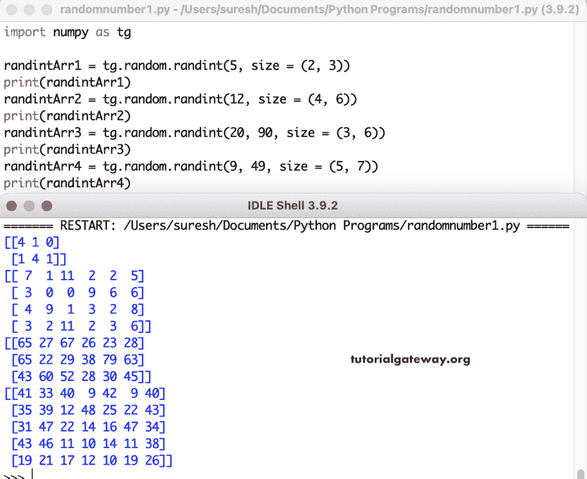

# NumPy `randint()`

> 原文：<https://www.tutorialgateway.org/python-numpy-random-randint/>

NumPy random`int()`函数从开始(低)到结束(高)返回或生成随机整数值。NumPy 随机随机整数函数的语法是

```py
numpy.random.randint(low, high = None, size  = None, dtype = int)
```

*   低:从分布中抽取的最低整数。如果高值不是“无”，则它作为起始值，高值是“无”，则它作为最高值。
*   high:可选，这是从分布中提取的最高整数。
*   大小:它可以是整数或整数元组。这里，我们必须指定数组大小或维度。例如，size = (2，3)用随机整数值填充两行三列数组。
*   数据类型:输出的数据类型。

## NumPy 随机随机整数示例

NumPy`randint()`函数返回低(包括)和高(不包括)之间的离散均匀分布随机整数。如果我们不指定大小，那么它会返回一个值。下面的示例打印 0 到 3 之间的随机数。

```py
import numpy as tg

randintArr = tg.random.randint(3)

print(randintArr)
```

```py
1
```

### NumPy 随机随机整数 1D 数组

在本例中，我们使用 low 和 size 参数返回一维随机整数数组。这意味着在没有高参数的情况下，低值变成了高值。这里，tg.random.randint(3，size = 5)返回一个由五个随机值小于三的项组成的数组。接下来，tg.random.randint(7，size = 10)返回一个由 10 个小于 7 的随机值组成的数组。

```py
import numpy as tg

randintArr1 = tg.random.randint(3, size = 5)

print(randintArr1)

randintArr2 = tg.random.randint(7, size = 10)

print(randintArr2)
```

```py
[1 0 2 2 2]
[6 0 0 4 2 5 1 1 5 2]
```

在本例中，我们指定了低值和高值。这意味着第一条语句返回 3 到 10 之间的八个随机数的数组。

```py
import numpy as tg

randintArr1 = tg.random.randint(3, 10, size = 8)

print(randintArr1)

randintArr2 = tg.random.randint(10, 50, size = 10)

print(randintArr2)
```

```py
[7 8 6 9 5 8 4 5]
[38 14 25 23 17 26 37 12 47 20]
```

### 随机随机 2D 数组

在本例中，前两个随机 randint 语句打印具有默认下限和给定上限的二维数组。另外两个语句从给定的低值到高值返回一个 2D 随机数数组。tg.random.randint(20，90，size = (3，6))返回一个由 20 到 90 之间的随机整数组成的 3 * 6 矩阵。

```py
import numpy as tg

randintArr1 = tg.random.randint(5, size = (2, 3))
print(randintArr1)

randintArr2 = tg.random.randint(12, size = (4, 6))
print(randintArr2)

randintArr3 = tg.random.randint(20, 90, size = (3, 6))
print(randintArr3)

randintArr4 = tg.random.randint(9, 49, size = (5, 7))
print(randintArr4)
```



### num py random edge 3D array(数字随机边缘 3d 数组)

它将使用 NumPy 随机随机数生成随机数的三维数组。

```py
import numpy as tg

drandintArr1 = tg.random.randint(8, size = (2, 2, 3))
print(drandintArr1)

drandintArr2 = tg.random.randint(22, size = (2, 3, 5))
print(drandintArr2)

drandintArr3 = tg.random.randint(129, 430, size = (3, 3, 5))
print(drandintArr3)

drandintArr4 = tg.random.randint(111, 149, size = (2, 4, 7))
print(drandintArr4)
```

```py
[[[3 5 0]
  [7 4 4]]

 [[6 6 6]
  [2 5 7]]]
[[[14  2  0  1 12]
  [11 20 17 17 19]
  [14 18  4  4 17]]

 [[ 0 19  8  6  0]
  [ 4  7  2 11 17]
  [18  3 18 12  6]]]
[[[142 178 428 360 192]
  [327 232 198 309 175]
  [272 181 370 223 380]]

 [[360 402 282 377 213]
  [164 250 146 212 243]
  [151 255 406 184 172]]

 [[153 360 324 285 200]
  [359 220 298 214 411]
  [245 409 228 400 282]]]
[[[137 145 144 133 135 114 141]
  [126 144 147 141 115 134 133]
  [131 121 115 122 130 146 124]
  [148 120 131 120 125 136 136]]

 [[131 129 141 129 116 132 126]
  [145 124 120 139 141 139 123]
  [140 148 145 119 113 134 116]
  [111 126 135 122 144 137 114]]]
```

### 所有参数的随机随机数

```py
import numpy as tg

randintArr1 = tg.random.randint(5, high = 20, size = (2, 3), dtype = tg.int16)
print(randintArr1)

randintArr2 = tg.random.randint(99, 159, size = (2, 3, 5), dtype = tg.int16)
print(randintArr2)
```

```py
[[ 6  9 10]
 [19  5 18]]
[[[139 149 101 148 150]
  [153 147 158 106 126]
  [152 112 102 134 150]]

 [[138 130 108 153 133]
  [106 107 136 119 124]
  [125 110 142 103 118]]]
```

numpy`randint()`函数还允许使用多个值作为较低和较高的分布值。这里，tg.random.randint([1，3，9]，22)返回一个介于 1 和 22，3 和 22，9 和 22 之间的随机值。接下来，tg.random.randint(7，[22，44，99])返回一个介于 7 和 22，7 和 44，7 和 99 之间的随机值。

```py
import numpy as tg

randintArr1 = tg.random.randint([1, 3, 9], 22)
print(randintArr1)

randintArr2 = tg.random.randint([11, 3, 99, 9], 122)
print(randintArr2)

randintArr3 = tg.random.randint(7, [22, 44, 99])
print(randintArr3)

randintArr4 = tg.random.randint(99, [122, 233, 999, 333, 194])
print(randintArr4)
```

```py
[14 11 21]
[ 89 113 100  38]
[11 14 62]
[120 156 937 260 125]
```

除此之外，我们还可以使用嵌套值来创建一个高低随机整数值的多维数组。

```py
import numpy as tg

randintArr1 = tg.random.randint([4, 3, 7], [[10], [20]])
print(randintArr1)

print("====Second Array====")
randintArr2 = tg.random.randint([99, 3, 99, 9], [[189], [222]])
print(randintArr2)

print("====Third Array====")
randintArr3 = tg.random.randint([[56], [75]], [129, 264, 199])
print(randintArr3)

print("====Fourth Array====")
randintArr4 = tg.random.randint([[99], [122], [233]], [999, 443, 394])
print(randintArr4)
```

```py
[[ 8  7  9]
 [ 8 14 12]]
====Second Array====
[[130  21 167  69]
 [189 155 201  56]]
====Third Array====
[[ 93 230  70]
 [ 86 212 147]]
====Fourth Array====
[[981 342 380]
 [903 176 325]
 [862 252 271]]
```