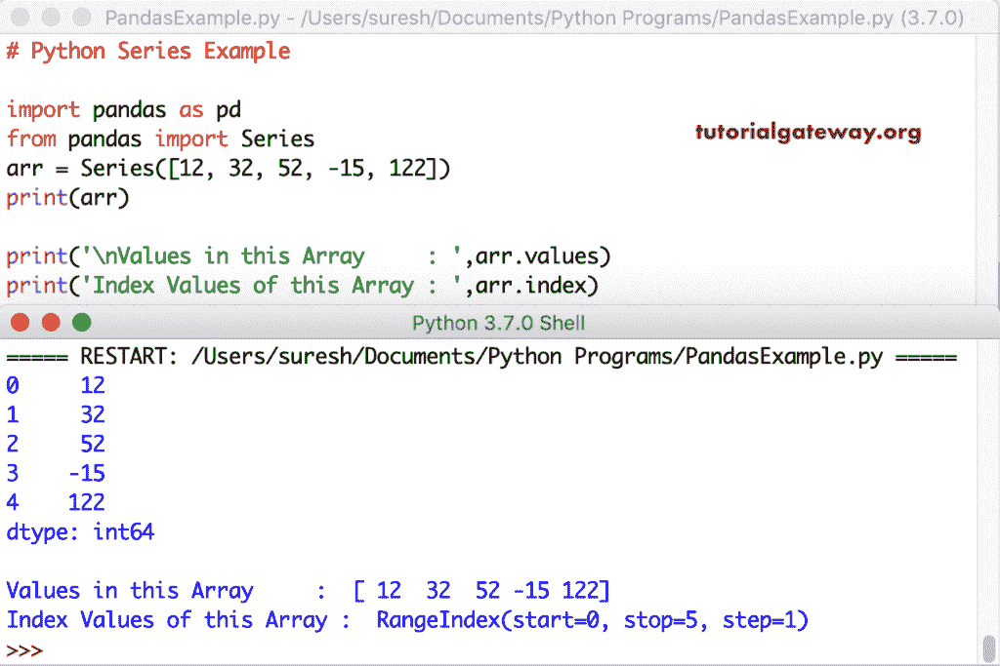

# Python Pandas 序列

> 原文：<https://www.tutorialgateway.org/python-series/>

Python 中的序列是我们在 pandas 模块中指定的任何数据类型的一维数组。你能找到的唯一区别是，Python Pandas 序列中的每个值都与索引相关联。Python Pandas 序列的默认索引值是从 0 到 number–1，或者您可以指定自己的索引值。

下面一长串例子帮助你理解这个 Python Pandas 序列，如何访问它们，改变项目，索引，列等等。

## PythonPandas 序列示例

这是一个简单的 Python Pandas 序列示例。如您所见，它分配了从 0 到 3(4–1)的默认索引值。

```
import pandas as pd
from pandas import Series

arr = Series([15, 35, 55, 75])
print(arr)
```

```
0    15
1    35
2    55
3    75
dtype: int64
```

### Python 序列值和索引

Python 序列有两个属性，如值和索引。你可以使用这些属性来获得 Pandas 序列的信息。

*   values:返回实际数据或其中元素的数组。
*   索引:顾名思义，这个对象返回索引值。

```
arr = Series([12, 32, 52, -15, 122])
print(arr)

print('\nValues in this Array     : ',arr.values)
print('Index Values of this Array : ',arr.index)
```



### PythonPandas 序列索引

您可以使用 index 属性创建自己的索引，或者为数据分配自己的索引。这是识别 Pandas 序列数据以供未来分析的简便且最佳的方法。

```
arr = Series([25, 50, 75, 100, 125], index = [2, 4, 6, 8, 10])
print(arr)

print('\nValues in this Array     : ',arr.values)
print('Index Values of this Array : ',arr.index)
```

Python 序列索引输出

```
2      25
4      50
6      75
8     100
10    125
dtype: int64

Values in this Array     :  [ 25  50  75 100 125]
Index Values of this Array :  Int64Index([2, 4, 6, 8, 10], dtype='int64')
```

让我使用字母作为索引值

```
import pandas as pd
from pandas import Series
arr = Series([2, 33, 66, 70, 15], index = ['a', 'e', 'i', 'o', 'u'])
arr
arr.index
```

如果使用外部文件保存 Python 序列代码，请使用下面的代码。

```
import pandas as pd
from pandas import Series

arr = Series([2, 33, 66, 70, 15], index = ['a', 'e', 'i', 'o', 'u'])
print(arr)

print('\nValues in this Array     : ',arr.values)
print('Index Values of this Array : ',arr.index)
```

```
a     2
e    33
i    66
o    70
u    15
dtype: int64

Values in this Array     :  [ 2 33 66 70 15]
Index Values of this Array :  Index(['a', 'e', 'i', 'o', 'u'], dtype='object')
```

### 使用范围创建 python 序列

您也可以使用 Numpy 模块中的`arange()`函数来创建一个从 0 到 n-1 的 Pandas 序列连续数字。

```
import pandas as pd
import numpy as np
from pandas import Series

arr = Series(np.arange(6))
print(arr) # arr

# Here, we are assigning the index names.
arr1 = Series(np.arange(6), index = ['a', 'b', 'c', 'd', 'e', 'f'])
print(arr1) # arr1 
```

```
0    0
1    1
2    2
3    3
4    4
5    5
dtype: int64
a    0
b    1
c    2
d    3
e    4
f    5
dtype: int64
```

### 改变 Pandas 序列索引

序列索引功能不仅允许您显示索引项，还可以对其进行修改。本示例更改实际索引项，并将整数值作为索引。

```
import pandas as pd
from pandas import Series

new_arr = Series([2, 33, 66, 70, 15], index = ['a', 'e', 'i', 'o', 'u'])
print(new_arr)
print('\nValues in this Array     : ',new_arr.values)
print('Index Values of this Array : ',new_arr.index)
print(' ')

# Assigning New Index Values
new_arr.index = [1, 2, 3, 4, 5]
print(new_arr)
print('\nValues in this Array     : ',new_arr.values)
print('Index Values of this Array : ',new_arr.index)
```

改变 Pandas 序列指数输出

```
a     2
e    33
i    66
o    70
u    15
dtype: int64

Values in this Array     :  [ 2 33 66 70 15]
Index Values of this Array :  Index(['a', 'e', 'i', 'o', 'u'], dtype='object')

1     2
2    33
3    66
4    70
5    15
dtype: int64

Values in this Array     :  [ 2 33 66 70 15]
Index Values of this Array :  Int64Index([1, 2, 3, 4, 5], dtype='int64')
```

### 从字典创建 Python 序列

[Python](https://www.tutorialgateway.org/python-tutorial/) 还允许您为[字典创建序列。](https://www.tutorialgateway.org/python-dictionary/)使用字典时，值变成序列数据，字典键充当索引。

```
import pandas as pd
from pandas import Series

f_dict = {'apples': 500, 'kiwi': 20, 'oranges': 100, 'cherries': 6000}
print('Dictionary Items')
print(f_dict)

arr = Series(f_dict)
print('\nArray Items')
print(arr)
```

Pandas 字典序列输出

```
Dictionary Items
{'apples': 500, 'kiwi': 20, 'oranges': 100, 'cherries': 6000}

Array Items
apples       500
kiwi          20
oranges      100
cherries    6000
dtype: int64
```

我们还可以在将字典转换为序列时更改索引值的顺序。

```
import pandas as pd
from pandas import Series

f_dict = {'apples': 500, 'kiwi': 20, 'oranges': 100, 'cherries': 6000}
new_list = ['apples', 'cherries', 'kiwi', 'oranges']

arr = Series(f_dict, index = new_list)
print('Array Items')
print(arr)
```

将字典转换为 Pandas 序列并更改输出顺序

```
Array Items
apples       500
cherries    6000
kiwi          20
oranges      100
dtype: int64
```

如果我们添加一个不存在于实际字典关键字中的索引，并且很明显，它不会有任何相关联的值，会怎么样。

```
import pandas as pd
from pandas import Series

f_dict = {'apples': 500, 'kiwi': 20, 'oranges': 100, 'cherries': 6000}
new_list = ['apples', 'banana', 'cherries', 'kiwi', 'oranges']

arr = Series(f_dict, index = new_list)
print('Array Items')
print(arr)
```

从下面的对象截图中，您可以看到它返回 NaN 作为该索引或键的值

```
Array Items
apples       500.0
banana         NaN
cherries    6000.0
kiwi          20.0
oranges      100.0
dtype: float64
```

### Python 序列属性

序列对象有一个重要的属性，称为名称。您可以使用此属性为数据和索引分配名称。

```
import pandas as pd
from pandas import Series

f_dict = {'apples': 500, 'kiwi': 20, 'oranges': 100, 'cherries': 6000}

arr = Series(f_dict)
print(arr)

print('\nAssigning Names')
arr.name = 'No of Items'
arr.index.name = 'Fruits'
print(arr)
```

属性输出

```
apples       500
kiwi          20
oranges      100
cherries    6000
dtype: int64

Assigning Names
Fruits
apples       500
kiwi          20
oranges      100
cherries    6000
Name: No of Items, dtype: int64
```

### 访问 Python 序列项目

像 numpy Arrays 一样，我们可以使用索引位置或索引号来访问序列中的项目。

```
import pandas as pd
from pandas import Series
arr = Series([22, 44, 66, 88, 108])
arr
```

在索引位置 0、2 和 4 访问项目。

```
arr[0]
arr[2]
arr[4]
```

创建新值或从现有值中选择一组值。

```
arr[[1, 3, 0, 4]]
```

访问项目输出

```
>>> import pandas as pd
>>> from pandas import Series
>>> arr = Series([22, 44, 66, 88, 108])
>>> arr
0     22
1     44
2     66
3     88
4    108
dtype: int64
>>> arr[0]
22
>>> arr[2]
66
>>> arr[4]
108
>>> arr[[1, 3, 0, 4]]
1     44
3     88
0     22
4    108
dtype: int64
>>> 
```

我们用自定义索引值访问其中的数据。为此，我们使用字母字符作为索引项。

```
import pandas as pd
from pandas import Series
arr = Series([2, 4, -6, 8, -10, 12], index = ['a', 'e', 'i', 'o', 'u', 'z'])
arr
arr['a']
arr['u']
arr[['a', 'o', 'z', 'e']]
```

```
>>> import pandas as pd
>>> from pandas import Series
>>> arr = Series([2, 4, -6, 8, -10, 12], index = ['a', 'e', 'i', 'o', 'u', 'z'])
>>> arr
a     2
e     4
i    -6
o     8
u   -10
z    12
dtype: int64
>>> arr['a']
2
>>> arr['u']
-10
>>> arr[['a', 'o', 'z', 'e']]
a     2
o     8
z    12
e     4
dtype: int64
>>> 
```

### 运算符中的 Python Pandas 序列

在我们对 Pandas 序列进行任何表演之前，如果我们知道我们正在寻找的索引是否存在，那就太好了。在运算符演示中，我们有一个可以检查并返回真的运算符，如果不存在，则返回假。

```
import pandas as pd
from pandas import Series
arr1 = Series([22, 33, 44, 55], index = ['a', 'b', 'c', 'd'])
arr1 

'b' in arr1
'c' in arr1
'f' in arr1
```

```
>>> import pandas as pd
>>> from pandas import Series
>>> arr1 = Series([22, 33, 44, 55], index = ['a', 'b', 'c', 'd'])
>>> arr1
a    22
b    33
c    44
d    55
dtype: int64
>>> 'b' in arr1
True
>>> 'c' in arr1
True
>>> 'f' in arr1
False
>>> 
```

让我使用[字典](https://www.tutorialgateway.org/python-dictionary/)作为数组输入，并使用 `IN`运算符。

```
import pandas as pd
from pandas import Series
f_dict = {'apples': 500, 'kiwi': 20, 'oranges': 100, 'cherries':6000}
arr2 = Series(f_dict)
arr2

'kiwi' in arr2
'banana' in arr2
'oranges' in arr2
```

在运算符对 Pandas 序列输出

```
>>> import pandas as pd
>>> from pandas import Series
>>> f_dict = {'apples': 500, 'kiwi': 20, 'oranges': 100, 'cherries':6000}
>>> arr2 = Series(f_dict)
>>> arr2
apples       500
kiwi          20
oranges      100
cherries    6000
dtype: int64
>>> 'kiwi' in arr2
True
>>> 'banana' in arr2
False
>>> 'oranges' in arr2
True
>>> 
```

### Python 序列空值

Python pandas 模块具有 isnull 和`notnull()`函数，用于识别 null 并返回布尔值 True 或 False。为了证明 pandas 序列是 null 和非`null()`函数，我们使用了与上面相同的字典。

```
import pandas as pd
from pandas import Series
dict_items = {'apples': 500, 'kiwi': 20, 'oranges': 100, 'cherries': 6000}
f_list = ['apples', 'banana', 'cherries', 'kiwi', 'oranges']
arr = Series(dict_items, index = f_list)
arr
```

如果为空，则返回真；否则返回假。

```
pd.isnull(arr)
arr.isnull()
```

如果该值为“无”、“空”或“无”，则返回“假”，否则返回“真”。

```
pd.notnull(arr)
arr.notnull()
```

Pandas isnull，notnull 输出

```
>>> import pandas as pd
>>> from pandas import Series
>>> dict_items = {'apples': 500, 'kiwi': 20, 'oranges': 100, 'cherries': 6000}
>>> f_list = ['apples', 'banana', 'cherries', 'kiwi', 'oranges']
>>> arr = Series(dict_items, index = f_list)
>>> arr
apples       500.0
banana         NaN
cherries    6000.0
kiwi          20.0
oranges      100.0
dtype: float64
>>> pd.isnull(arr)
apples      False
banana       True
cherries    False
kiwi        False
oranges     False
dtype: bool
>>> arr.isnull()
apples      False
banana       True
cherries    False
kiwi        False
oranges     False
dtype: bool
>>> pd.notnull(arr)
apples       True
banana      False
cherries     True
kiwi         True
oranges      True
dtype: bool
>>> arr.notnull()
apples       True
banana      False
cherries     True
kiwi         True
oranges      True
dtype: bool
```

### Python 序列上的算术运算

Pandas 序列允许你对它的数据进行算术运算。您可以使用任何运算符对所有项目执行操作。这个例子向你展示 Pandas 序列的算术运算。

```
import pandas as pd
from pandas import Series
arr = Series([2, 4, -6, 8, -7], index = ['a', 'e', 'i', 'o', 'u'])
arr
```

每个项目加 3。

```
arr + 3
```

从项目中减去 2。

```
arr - 2
```

我们将每个项目乘以 10。

```
arr * 10
```

返回其值大于 0 的子集。

```
arr[arr > 0]
```

算术运算输出

```
>>> import pandas as pd
>>> from pandas import Series
>>> arr = Series([2, 4, -6, 8, -7], index = ['a', 'e', 'i', 'o', 'u'])
>>> arr
a    2
e    4
i   -6
o    8
u   -7
dtype: int64
>>> arr + 3
a     5
e     7
i    -3
o    11
u    -4
dtype: int64
>>> arr - 2
a    0
e    2
i   -8
o    6
u   -9
dtype: int64
>>> arr * 10
a    20
e    40
i   -60
o    80
u   -70
dtype: int64
>>> arr[arr > 0]
a    2
e    4
o    8
dtype: int64
```

### Python 序列数学函数

您可以使用 numpy 模块支持的数学函数。

```
from pandas import Series
import numpy as np
arr = Series([2, 4, -6, 8, -7], index = ['a', 'e', 'i', 'o', 'u'])
arr
```

计算 E 的幂

```
np.exp(arr)
```

绝对正值

```
np.fabs(arr)
```

其中每个项目的平方根

```
np.sqrt(arr)
```

Pandas 的数学函数

```
>>> import pandas as pd
>>> from pandas import Series
>>> import numpy as np
>>> arr = Series([2, 4, -6, 8, -7], index = ['a', 'e', 'i', 'o', 'u'])
>>> arr
a    2
e    4
i   -6
o    8
u   -7
dtype: int64
>>> np.exp(arr)
a       7.389056
e      54.598150
i       0.002479
o    2980.957987
u       0.000912
dtype: float64
>>> np.fabs(arr)
a    2.0
e    4.0
i    6.0
o    8.0
u    7.0
dtype: float64
>>> np.sqrt(arr)
a    1.414214
e    2.000000
i         NaN
o    2.828427
u         NaN
dtype: float64
```