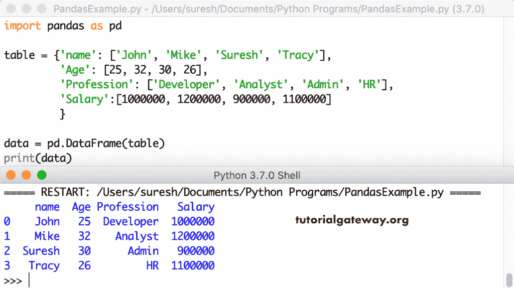
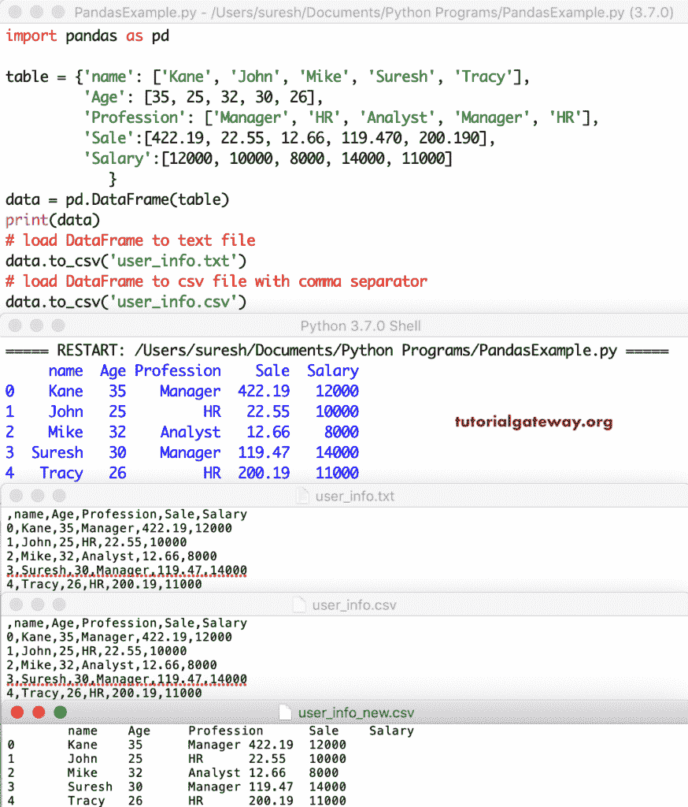

# Python 熊猫 DataFrame

> 原文：<https://www.tutorialgateway.org/python-pandas-dataframe/>

Python 中的熊猫数据框架是一种二维数据结构。这意味着，python pandas dataframe 以表格格式存储数据，即行和列。在本文中，我们展示了如何创建 Python Pandas 数据框架、访问、更改行和列。接下来，我们将讨论 Python 中的数据帧转换、行迭代等等。

## 如何用 Python 创建数据框架？

实时地，我们使用这个熊猫数据框架从 Sql Server、文本文件、Excel 文件或任何 CSV 文件中加载数据。接下来，我们按照我们的要求对数据进行切片和切割。一旦数据达到我们要求的格式，我们就使用 matplotlib 模块使用这些数据创建报告或图表。

### 在熊猫中创建一个空的数据帧

这是一个用 Python 创建空数据框的简单示例。这里，我们正在创建一个空的

```
import pandas as pd

data = pd.DataFrame()
print(data)
```

在 Python 输出中创建空数据帧

```
Columns: []
Index: []
```

#### 从列表中创建熊猫数据框

这里，我们创建一个 Python 整数值列表。接下来，我们用熊猫。`DataFrame()`函数从列表创建我们的 df 或转换列表。

```
import pandas as pd

table = [1, 2, 3, 4, 5]

data = pd.DataFrame(table)
print(data)
```

```
 0
0  1
1  2
2  3
3  4
4  5
```

从混合列表创建或将混合列表转换为熊猫数据框。这里，我们还使用了多行多列。

```
import pandas as pd

table = [[1, 'Suresh'], [2, 'Python'], [3, 'Hello']]

data = pd.DataFrame(table)
print(data)
```

```
 0       1
0  1  Suresh
1  2  Python
2  3   Hello
```

为列值指定名称。

```
import pandas as pd

table = [[1, 'Suresh'], [2, 'Python'], [3, 'Hello']]
data = pd.DataFrame(table, columns = ['S.No', 'Name'])
print(data)
```

```
 S.No    Name
0     1  Suresh
1     2  Python
2     3   Hello
```

### 随机数的 Python 数据帧

为了使用随机数创建熊猫数据帧，我们使用 [numpy](https://www.tutorialgateway.org/python-numpy-array/) 随机函数生成大小为 8 * 4 的[随机](https://www.tutorialgateway.org/python-random-array/)数。接下来，我们使用 [Python](https://www.tutorialgateway.org/python-tutorial/) 函数将这些序列转换成数据帧

```
import numpy as np
import pandas as pd

d_frame = pd.DataFrame(np.random.randn(8, 4))
print(d_frame)
```

```
 0         1         2         3
0 -0.492116 -0.824771 -0.869890 -1.753722
1 -0.733930  0.947616  0.089861  0.888474
2 -0.948483 -1.002449 -0.283761 -0.207897
3  0.013346  2.059951  1.064830  0.830474
4  0.289157 -0.418271 -0.770464  0.223895
5 -0.781827 -0.396441  0.123848 -0.824002
6  0.667090  0.183589  1.212163  0.231251
7  1.067570 -0.615639  0.461147 -1.365541
```

### 巨蟒熊猫数据框来自 dict

Python 熊猫允许你从字典或字典中创建数据框架。它非常直接。您所要做的就是声明一个不同值的字典，然后使用 Python`DataFrame()`函数将该字典转换为 DataFrame

```
import pandas as pd

table = {'name': ['John', 'Mike', 'Suresh', 'Tracy'],
         'Salary':[1000000, 1200000, 900000, 1100000]
         }

data = pd.DataFrame(table)
print(data)
```

要从字典创建熊猫数据帧，所有键的字典值的长度应该相同，否则会引发错误。接下来，如果您传递的是索引值，那么它们应该与键值或数组的长度相匹配，否则会引发错误。如果您没有传递任何索引值，那么它将自动为您创建一个索引，并从 0 到 n-1 开始。

```
 name   Salary
0    John  1000000
1    Mike  1200000
2  Suresh   900000
3   Tracy  1100000
```

让我再举一个 Python 熊猫数据框的例子。这次，我们转换四列数据的字典键。

```
import pandas as pd
table = {'name': ['John', 'Mike', 'Suresh', 'Tracy'],
         'Age': [25, 32, 30, 26],
         'Profession': ['Developer', 'Analyst', 'Admin', 'HR'],
         'Salary':[1000000, 1200000, 900000, 1100000]
         }

data = pd.DataFrame(table)
print(data)
```



#### 如何从列表中创建熊猫数据框

如果你困惑于把所有东西放在一个地方，把它们分成几部分。在这里，我们声明了四个项目列表，然后为每个列分配它们。

```
import pandas as pd

names = ['John', 'Mike', 'Suresh', 'Tracy']
ages =  [25, 32, 30, 26]
Professions = ['Developer', 'Analyst', 'Admin', 'HR']
Salaries = [1000000, 1200000, 900000, 1100000]

table = {'name': names,
         'Age': ages,
         'Profession': Professions,
         'Salary': Salaries
         }

data = pd.DataFrame(table)
print(data)
```

```
 name  Age Profession   Salary
0    John   25  Developer  1000000
1    Mike   32    Analyst  1200000
2  Suresh   30      Admin   900000
3   Tracy   26         HR  1100000
```

### 蟒蛇熊猫日期数据框

使用 Python 熊猫模块，您还可以创建一个包含一系列日期的数据框。让我创建一个从 2019-01-01 到 2019-01-08 的日期。通过更改期间值，您可以生成更多数量的日期序列。

```
import numpy as np
import pandas as pd

dates = pd.date_range('20190101', periods = 8)
print(dates)
print()

d_frame = pd.DataFrame(np.random.randn(8, 4), index = dates,
                       columns = {'apples', 'oranges', 'kiwis', 'bananas'})
print(d_frame)
```

```
DatetimeIndex(['2019-01-01', '2019-01-02', '2019-01-03', '2019-01-04',
               '2019-01-05', '2019-01-06', '2019-01-07', '2019-01-08'],
              dtype='datetime64[ns]', freq='D')

               kiwis    apples   oranges   bananas
2019-01-01 -0.393538 -0.406943  1.612431  1.089230
2019-01-02  1.070080 -1.565538  0.727056  1.677534
2019-01-03 -1.324169  0.256827  1.332544 -2.952971
2019-01-04  0.419778 -0.562119  0.507846 -0.223730
2019-01-05  0.175785  1.566511 -1.832633  2.035536
2019-01-06  0.541516 -0.113477  0.444046  0.387718
2019-01-07  0.247760 -1.143530  0.615681  0.400743
2019-01-08 -0.242328  0.913758 -0.088591 -0.533690
```

## 熊猫数据框列

此示例显示了如何对列重新排序。默认情况下，数据框将使用我们在实际数据中使用的列顺序。但是，您可以使用 this 参数来更改任何列的位置。让我把年龄从第二位改为第四位。

```
import pandas as pd

table = {'name': ['John', 'Mike', 'Suresh', 'Tracy'],
         'Age': [25, 32, 30, 26],
         'Profession': ['Developer', 'Analyst', 'Admin', 'HR'],
         'Salary':[1000000, 1200000, 900000, 1100000]
         }

data1 = pd.DataFrame(table)
print(data1)

print('\n---- After Changing the Order-----')
data2 = pd.DataFrame(table, columns = ['name', 'Profession', 'Salary', 'Age'])
print(data2)
```

使用此列参数时请小心。如果我们指定了任何不存在的列名或输入错误，将返回 NaN。让我使用资格列名(它不存在)

```
print('\n---- Using Wrong Col -----')
data3 = pd.DataFrame(table, columns = ['name', 'Qualification', 'Salary', 'Age'])
print(data3)
```

```
 name  Age Profession   Salary
0    John   25  Developer  1000000
1    Mike   32    Analyst  1200000
2  Suresh   30      Admin   900000
3   Tracy   26         HR  1100000

---- After Changing the Order-----
     name Profession   Salary  Age
0    John  Developer  1000000   25
1    Mike    Analyst  1200000   32
2  Suresh      Admin   900000   30
3   Tracy         HR  1100000   26

---- Using Wrong Col -----
     name Qualification   Salary  Age
0    John           NaN  1000000   25
1    Mike           NaN  1200000   32
2  Suresh           NaN   900000   30
3   Tracy           NaN  1100000   26
```

columns 属性以相同的顺序返回数据框中可用列的列表以及数据类型。

```
import pandas as pd

table = {'name': ['John', 'Mike', 'Suresh', 'Tracy'],
         'Age': [25, 32, 30, 26],
         'Profession': ['Developer', 'Analyst', 'Admin', 'HR'],
         'Salary':[1000000, 1200000, 900000, 1100000]
         }

data1 = pd.DataFrame(table)
print(data1)

data2 = pd.DataFrame(table, columns = ['name', 'Profession', 'Salary', 'Age'])

data3 = pd.DataFrame(table, columns = ['name', 'Qualification', 'Salary', 'Age'])

print(data1.columns)
print(data2.columns)
print(data3.columns)
```

```
 name  Age Profession   Salary
0    John   25  Developer  1000000
1    Mike   32    Analyst  1200000
2  Suresh   30      Admin   900000
3   Tracy   26         HR  1100000
Index(['name', 'Age', 'Profession', 'Salary'], dtype='object')
Index(['name', 'Profession', 'Salary', 'Age'], dtype='object')
Index(['name', 'Qualification', 'Salary', 'Age'], dtype='object')
```

## 熊猫数据框架索引

默认情况下，Python 将从 0 到 n-1 分配索引值，其中 n 是最大值。但是，您可以选择使用 index 属性更改这些默认索引值。这里，我们使用相同的方法，将字母从 a 到 d 指定为索引值。

```
import pandas as pd

table = {'name': ['John', 'Mike', 'Suresh', 'Tracy'],
         'Age': [25, 32, 30, 26],
         'Profession': ['Developer', 'Analyst', 'Admin', 'HR'],
         'Salary':[1000000, 1200000, 900000, 1100000]
         }

# Without Index Values - Uses Default Values
data1 = pd.DataFrame(table)
print(data1)

# Index Values are a, b, c, d
data2 = pd.DataFrame(table, index = ['a', 'b', 'c', 'd'])
print('\n----After Setting Index Values----')
print(data2)
```

```
 name  Age Profession   Salary
0    John   25  Developer  1000000
1    Mike   32    Analyst  1200000
2  Suresh   30      Admin   900000
3   Tracy   26         HR  1100000

----After Setting Index Values----
     name  Age Profession   Salary
a    John   25  Developer  1000000
b    Mike   32    Analyst  1200000
c  Suresh   30      Admin   900000
d   Tracy   26         HR  1100000
```

在 Python 中，可以使用 DataFrame`set_index()`函数来更改或设置列作为索引值。这里，我们使用`set_index()`函数而不是 set name 作为索引。接下来，`loc()`函数来说明，我们可以使用索引名来获取额外的信息。

```
import pandas as pd

table = {'name': ['John', 'Mike', 'Suresh', 'Tracy'],
         'Age': [25, 32, 30, 26],
         'Profession': ['Developer', 'Analyst', 'Admin', 'HR'],
         'Salary':[1000000, 1200000, 900000, 1100000]
         }
data = pd.DataFrame(table)

print('\n---Setting name as an index---')
new_data = data.set_index('name')
print(new_data)

print('\n---Return Index John Details---')
print(new_data.loc['John'])
```

```
 ---Setting name as an index---
        Age Profession   Salary
name                           
John     25  Developer  1000000
Mike     32    Analyst  1200000
Suresh   30      Admin   900000
Tracy    26         HR  1100000

---Return Index John Details---
Age                  25
Profession    Developer
Salary          1000000
Name: John, dtype: object
```

## 熊猫数据帧属性

Python 数据框的可用熊猫属性列表

### Python 数据框形状属性

熊猫形状属性返回其中行数和列数的形状或元组。

```
import pandas as pd

table = {'name': ['John', 'Mike', 'Suresh', 'Tracy'],
         'Age': [25, 32, 30, 26],
         'Salary':[1000000, 1200000, 900000, 1100000]
	    }

data = pd.DataFrame(table)

print('\n---Shape or Size ---')
print(data.shape)
```

```
 ---Shape or Size ---
(4, 3)
```

### Python 数据框值属性

values 属性以二维数组格式返回数据(没有列名)。

```
import pandas as pd
table = {'name': ['John', 'Mike', 'Suresh', 'Tracy'],
         'Age': [25, 32, 30, 26],
         'Profession': ['Developer', 'Analyst', 'Admin', 'HR'],
         'Salary':[1000000, 1200000, 900000, 1100000]
         }

data2 = pd.DataFrame(table, columns = ['name', 'Profession', 'Salary', 'Age'])

data3 = pd.DataFrame(table, columns = ['name', 'Qualification', 'Salary', 'Age'])

print('---Data2 Values--- ')
print(data2.values)

print('\n---Data3 Values--- ')
print(data3.values)
```

```
---Data2 Values--- 
[['John' 'Developer' 1000000 25]
 ['Mike' 'Analyst' 1200000 32]
 ['Suresh' 'Admin' 900000 30]
 ['Tracy' 'HR' 1100000 26]]

---Data3 Values--- 
[['John' nan 1000000 25]
 ['Mike' nan 1200000 32]
 ['Suresh' nan 900000 30]
 ['Tracy' nan 1100000 26]]
```

以上熊猫的例子是返回一个对象类型的数组。这是因为，这两个数据框都有混合内容(int、string)。如果不是这样，那么它就不会在数组中显示任何数据类型。为此，我们使用了一个整数数据帧

```
import pandas as pd

table = {'Age': [25, 32, 30, 26],
         'Salary':[1000000, 1200000, 900000, 1100000]
         }

data4 = pd.DataFrame(table)
print(data4.values)
```

```
[[     25 1000000]
 [     32 1200000]
 [     30  900000]
 [     26 1100000]]
```

### 熊猫数据帧名称属性

Python 数据框索引和列具有名称属性，允许为索引或列分配名称。

```
import pandas as pd
table = {'name': ['John', 'Mike', 'Suresh', 'Tracy'],
         'Age': [25, 32, 30, 26],
         'Profession': ['Developer', 'Analyst', 'Admin', 'HR'],
         'Salary':[1000000, 1200000, 900000, 1100000]
         }

data1 = pd.DataFrame(table)

table = {'Age': [25, 32, 30, 26],
         'Salary':[1000000, 1200000, 900000, 1100000]
         }
data4 = pd.DataFrame(table)

data1.index.name = 'Emp No'
print(data1)
print()

data4.index.name = 'Cust No'
print(data4)
```

```
 name  Age Profession   Salary
Emp No                                 
0         John   25  Developer  1000000
1         Mike   32    Analyst  1200000
2       Suresh   30      Admin   900000
3        Tracy   26         HR  1100000

         Age   Salary
Cust No              
0         25  1000000
1         32  1200000
2         30   900000
3         26  1100000
```

同样，我们可以使用 Python pandas dataframe 的列名属性来为列标题分配名称。

```
import pandas as pd
table = {'name': ['John', 'Mike', 'Suresh', 'Tracy'],
         'Age': [25, 32, 30, 26],
         'Profession': ['Developer', 'Analyst', 'Admin', 'HR'],
         'Salary':[1000000, 1200000, 900000, 1100000]
         }

data1 = pd.DataFrame(table)

table = {'Age': [25, 32, 30, 26],
         'Salary':[1000000, 1200000, 900000, 1100000]
         }

data4 = pd.DataFrame(table)

data1.columns.name = 'Employee Details'
print(data1)

data4.columns.name = 'Customers Information'
print(data4)
```

```
Employee Details    name  Age Profession   Salary
0                   John   25  Developer  1000000
1                   Mike   32    Analyst  1200000
2                 Suresh   30      Admin   900000
3                  Tracy   26         HR  1100000
Customers Information  Age   Salary
0                       25  1000000
1                       32  1200000
2                       30   900000
3                       26  1100000
```

### Python 数据框数据类型属性

dt type 属性返回每列的数据类型。

```
import pandas as pd

table = {'name': ['John', 'Mike', 'Suresh', 'Tracy'],
         'Age': [25, 32, 30, 26],
         'Profession': ['Developer', 'Analyst', 'Admin', 'HR'],
         'Sale':[22.55, 12.66, 119.470, 200.190],
         'Salary':[10000, 12000, 9000, 11000]
         }

data = pd.DataFrame(table)

print('\n---dtype attribute result---')
print(data.dtypes)
```

数据类型属性输出

```
 ---dtype attribute result---
name           object
Age             int64
Profession     object
Sale          float64
Salary          int64
dtype: object
```

### Python 数据框描述函数

使用这个 python data frame`description()`函数可以快速获得关于它的统计信息。

```
import pandas as pd

table = {'name': ['John', 'Mike', 'Suresh', 'Tracy'],
         'Age': [25, 32, 30, 26],
         'Profession': ['Developer', 'Analyst', 'Admin', 'HR'],
         'Salary':[10000, 12000, 9000, 11000]
         }

data1 = pd.DataFrame(table)

print('\n---describe function result---')
print(data1.describe())
```

描述功能输出

```
 ---describe function result---
             Age        Salary
count   4.000000      4.000000
mean   28.250000  10500.000000
std     3.304038   1290.994449
min    25.000000   9000.000000
25%    25.750000   9750.000000
50%    28.000000  10500.000000
75%    30.500000  11250.000000
max    32.000000  12000.000000
```

## 如何访问 Python 数据框架数据？

Python 数据框中的数据以行和列的表格格式存储。这意味着，您可以使用列和行来访问项目。

### 访问熊猫数据框列

可以通过两种方式访问列，要么在[]中指定列名，要么在点符号后指定列名。这两种方法都将指定的列作为[系列](https://www.tutorialgateway.org/python-series/)返回。

```
import pandas as pd

table = {'name': ['John', 'Mike', 'Suresh', 'Tracy'],
         'Age': [25, 32, 30, 26],
         'Profession': ['Developer', 'Analyst', 'Admin', 'HR'],
         'Salary':[10000, 12000, 9000, 11000]
         }

data1 = pd.DataFrame(table)
data2 = pd.DataFrame(table, columns = ['name', 'Profession', 'Salary', 'Age'])

print('-----Accessing Columns-----')
print(data1.Age)
print(data1['name'])
print(data2.Salary)

# We can also access multiple columns 
print('-----Accessing Multiple Columns-----')
print(data1[['Age', 'Profession']])
print(data2[['name', 'Salary']])
```

```
-----Accessing Columns-----
0    25
1    32
2    30
3    26
Name: Age, dtype: int64
0      John
1      Mike
2    Suresh
3     Tracy
Name: name, dtype: object
0    10000
1    12000
2     9000
3    11000
Name: Salary, dtype: int64
-----Accessing Multiple Columns-----
   Age Profession
0   25  Developer
1   32    Analyst
2   30      Admin
3   26         HR
     name  Salary
0    John   10000
1    Mike   12000
2  Suresh    9000
3   Tracy   11000
```

这是访问熊猫数据框列的另一个例子

```
import pandas as pd
table = {'name': ['Kane', 'John', 'Suresh', 'Tracy', 'Steve'],
         'Age': [35, 25, 32, 30, 29],
         'Profession': ['Manager', 'Developer', 'Analyst', 'Admin', 'HR'],
         'Sale':[422.19, 22.55, 119.470, 200.190, 44.55],
         'Salary':[12000, 10000, 14000, 11000, 14000]
	    }
data = pd.DataFrame(table)

print('\n---Select name column ---')
print(data['name'])

print('\n---Select Profession and Sale column ---')
print(data[['Profession', 'Sale']])

print('\n---Select Profession column ---')
print(data.Profession)
```

```
 ---Select name column ---
0      Kane
1      John
2    Suresh
3     Tracy
4     Steve
Name: name, dtype: object

---Select Profession and Sale column ---
  Profession    Sale
0    Manager  422.19
1  Developer   22.55
2    Analyst  119.47
3      Admin  200.19
4         HR   44.55

---Select Profession column ---
0      Manager
1    Developer
2      Analyst
3        Admin
4           HR
Name: Profession, dtype: object
```

### 访问熊猫数据框行

Python 中的熊猫数据框也可以使用行来访问。这里，我们使用索引切片技术从中返回所需的行。这里，data[1:]返回从索引 1 到 n-1 的所有行，data[1:3]返回从索引 1 到 3 的行。

```
import pandas as pd
table = {'Fullname': ['Kane', 'John', 'Suresh', 'Tracy', 'Steve'],
         'Age': [35, 25, 32, 30, 29],
         'Designation': ['Manager', 'Developer', 'Analyst', 'Admin', 'HR'],
         'SaleAmount':[422.19, 22.55, 119.470, 200.190, 44.55],
         'Income':[12000, 10000, 14000, 11000, 14000]
	    }
data = pd.DataFrame(table)
# print(data)

print('\n---Select all rows from 1 to N ---')
print(data[1:])

print('\n---Select rows from 1 to 2 ---')
print(data[1:3])

print('\n---Select rows from 0 to 3 ---')
print(data[0:4])

print('\n---Select last row ---')
print(data[-1:])
```

```
 ---Select all rows from 1 to N ---
  Fullname  Age Designation  SaleAmount  Income
1     John   25   Developer       22.55   10000
2   Suresh   32     Analyst      119.47   14000
3    Tracy   30       Admin      200.19   11000
4    Steve   29          HR       44.55   14000

---Select rows from 1 to 2 ---
  Fullname  Age Designation  SaleAmount  Income
1     John   25   Developer       22.55   10000
2   Suresh   32     Analyst      119.47   14000

---Select rows from 0 to 3 ---
  Fullname  Age Designation  SaleAmount  Income
0     Kane   35     Manager      422.19   12000
1     John   25   Developer       22.55   10000
2   Suresh   32     Analyst      119.47   14000
3    Tracy   30       Admin      200.19   11000

---Select last row ---
  Fullname  Age Designation  SaleAmount  Income
4    Steve   29          HR       44.55   14000
```

### 熊猫数据帧锁定示例

熊猫 loc 是需要理解的重要事情之一。您可以使用 loc[]一次选择多列和多行。或者，使用熊猫锁定[]选择一部分。使用此锁定选择行。

```
import pandas as pd

table = {'name': ['John', 'Mike', 'Suresh', 'Tracy'],
         'Age': [25, 32, 30, 26],
         'Profession': ['Developer', 'Analyst', 'Admin', 'HR'],
         'Salary':[1000000, 1200000, 900000, 1100000]
         }
data = pd.DataFrame(table, index = ['a', 'b', 'c', 'd'])
# print(data)

print('\n---Select b row ---')
print(data.loc['b'])

print('\n---Select c row ---')
print(data.loc['c'])

print('\n---Select b and d rows ---')
print(data.loc[['b', 'd']])
```

```
 ---Select b row ---
name             Mike
Age                32
Profession    Analyst
Salary        1200000
Name: b, dtype: object

---Select c row ---
name          Suresh
Age               30
Profession     Admin
Salary        900000
Name: c, dtype: object

---Select b and d rows ---
    name  Age Profession   Salary
b   Mike   32    Analyst  1200000
d  Tracy   26         HR  1100000
```

第一个语句 data.loc[:，['name '，' Sale']]返回 name 和 Sale 列的所有行。在最后一条语句中，data.loc[1:3，['姓名'，'职业'，'薪金']为姓名，职业和薪金列返回从索引值 1 到 3 的行。

```
import pandas as pd
table = {'name': ['Kane', 'John', 'Suresh', 'Tracy', 'Steve'],
         'Age': [35, 25, 32, 30, 29],
         'Profession': ['Manager', 'Developer', 'Analyst', 'Admin', 'HR'],
         'Sale':[422.19, 22.55, 119.470, 200.190, 44.55],
         'Salary':[12000, 10000, 14000, 11000, 14000]
	    }
data = pd.DataFrame(table)
# print(data)

print('\n---Select name, Sale column ---')
print(data.loc[:, ['name', 'Sale']])

print('\n---Select name, Profession, Salary ---')
print(data.loc[:, ['name', 'Profession', 'Salary']])

print('\n---Select rows from 1 to 2 ---')
print(data.loc[1:3, ['name', 'Profession', 'Salary']])
```

```
 ---Select name, Sale column ---
     name    Sale
0    Kane  422.19
1    John   22.55
2  Suresh  119.47
3   Tracy  200.19
4   Steve   44.55

---Select name, Profession, Salary ---
     name Profession  Salary
0    Kane    Manager   12000
1    John  Developer   10000
2  Suresh    Analyst   14000
3   Tracy      Admin   11000
4   Steve         HR   14000

---Select rows from 1 to 2 ---
     name Profession  Salary
1    John  Developer   10000
2  Suresh    Analyst   14000
3   Tracy      Admin   11000
```

### iloc 示例

类似于 loc[]，Python Pandas DataFrame 有 iloc[]。但是，这将只接受整数值或索引来返回数据。

```
import pandas as pd

table = {'name': ['John', 'Mike', 'Suresh', 'Tracy'],
         'Age': [25, 32, 30, 26],
         'Profession': ['Developer', 'Analyst', 'Admin', 'HR'],
         'Salary':[1000000, 1200000, 900000, 1100000]
         }
data = pd.DataFrame(table, index = ['a', 'b', 'c', 'd'])
# print(data)

print('\n---Select 1st row ---')
print(data.iloc[1])

print('\n---Select 3rd row ---')
print(data.iloc[3])

print('\n---Select 1 and 3 rows ---')
print(data.iloc[[1, 3]])
```

```
 ---Select 1st row ---
name             Mike
Age                32
Profession    Analyst
Salary        1200000
Name: b, dtype: object

---Select 3rd row ---
name            Tracy
Age                26
Profession         HR
Salary        1100000
Name: d, dtype: object

---Select 1 and 3 rows ---
    name  Age Profession   Salary
b   Mike   32    Analyst  1200000
d  Tracy   26         HR  1100000
```

您可以使用 loc、iloc、at 和 iat 来提取或访问单个值。以下示例将向您展示相同的内容。

```
import pandas as pd

table = {'name': ['John', 'Mike', 'Suresh', 'Tracy'],
   import pandas as pd

table = {'name': ['John', 'Mike', 'Suresh', 'Tracy'],
         'Age': [25, 32, 30, 26],
         'Profession': ['Developer', 'Analyst', 'Admin', 'HR'],
         'Salary':[1000000, 1200000, 900000, 1100000]
         }
data = pd.DataFrame(table)
# print(data)

print('\nitem at 0, 0         = ', data.iloc[0][0])

print('item at 0, 1           = ', data.loc[0][1])

print('item at 1, Profession  = ', data.loc[1]['Profession'])

print('item at 2, 3           = ', data.iat[2, 3])

print('item at 0, Salary      = ', data.at[0, 'Salary'])
```

```
 item at 0, 0           =  John
item at 0, 1           =  25
item at 1, Profession  =  Analyst
item at 2, 3           =  900000
item at 0, Salary      =  1000000
```

## 如何在熊猫数据框中添加新列？

在本例中，我们将向您展示如何向现有数据框添加新列。数据['Sale'] = [422.19，200.190，44.55]添加了一个名为 Sale 的全新列。数据['收入'] =数据['薪金'] +数据['基本']通过在薪金列和基本列中添加值来添加新列收入。

```
import pandas as pd

table = {'name': ['Kane', 'Suresh', 'Tracy'],
         'Age': [35, 25, 29],
         'Profession': ['Manager', 'Developer', 'HR'],
         'Salary': [10000, 14000, 11000],
         'basic': [4000, 6000, 4500]
        }

data = pd.DataFrame(table)

# Add New Column
data['Sale'] = [422.19, 200.190, 44.55]
print('\n---After adding New Column ---')
print(data)

# Add New Column using existing
data['Income'] = data['Salary'] + data['basic']
print('\n---Total Salary ---')
print(data)

# Add New Calculated Column
data['New_Salary'] = data['Salary'] + data['Salary'] * 0.25
print('\n---After adding New Column ---')
print(data)
```

```
 ---After adding New Column ---
     name  Age Profession  Salary  basic    Sale
0    Kane   35    Manager   10000   4000  422.19
1  Suresh   25  Developer   14000   6000  200.19
2   Tracy   29         HR   11000   4500   44.55

---Total Salary ---
     name  Age Profession  Salary  basic    Sale  Income
0    Kane   35    Manager   10000   4000  422.19   14000
1  Suresh   25  Developer   14000   6000  200.19   20000
2   Tracy   29         HR   11000   4500   44.55   15500

---After adding New Column ---
     name  Age Profession  Salary  basic    Sale  Income  New_Salary
0    Kane   35    Manager   10000   4000  422.19   14000     12500.0
1  Suresh   25  Developer   14000   6000  200.19   20000     17500.0
2   Tracy   29         HR   11000   4500   44.55   15500     13750.0
```

## 在 Python 中从数据框中删除列

在 Python 中，有两种方法可以从熊猫数据框中删除一列。您可以使用`del()`函数或`pop()`函数。在本例中，我们将使用这两个函数来删除其中的列。

这里，del(data['basic'])删除基本列(完整的行属于基本列)。x = data.pop('Age ')删除或弹出 Age 列，我们也正在打印弹出的列。接下来，我们使用`drop()`函数删除 Sale 列。

```
import pandas as pd

table = {'name': ['Kane', 'Suresh', 'Tracy'],
         'Age': [35, 25, 29],
         'Profession': ['Manager', 'Developer', 'HR'],
         'Salary': [10000, 14000, 11000],
         'basic': [4000, 6000, 4500],
         'Sale': [422.19, 200.190, 44.55]
        }

data = pd.DataFrame(table)
# print(data)

# Delete existing Columns
del(data['basic'])
print('\n---After Deleting basic Column ---')
print(data)

x = data.pop('Age')
print('\n---After Deleting Age Column ---')
print(data)
print('\n---pop Column ---')
print(x)

y = data.drop(columns = 'Sale')
print('\n---After Deleting Sale Column ---')
print(y)
```

```
 ---After Deleting basic Column ---
     name  Age Profession  Salary    Sale
0    Kane   35    Manager   10000  422.19
1  Suresh   25  Developer   14000  200.19
2   Tracy   29         HR   11000   44.55

---After Deleting Age Column ---
     name Profession  Salary    Sale
0    Kane    Manager   10000  422.19
1  Suresh  Developer   14000  200.19
2   Tracy         HR   11000   44.55

---pop Column ---
0    35
1    25
2    29
Name: Age, dtype: int64

---After Deleting Sale Column ---
     name Profession  Salary
0    Kane    Manager   10000
1  Suresh  Developer   14000
2   Tracy         HR   11000
```

## 如何在 Python 中删除数据框行？

在这个 Python 示例中，我们使用 Pandas`drop()`函数来删除行。

```
import pandas as pd

table = {'name': ['Kane', 'Suresh', 'Tracy'],
         'Profession': ['Manager', 'Developer', 'HR'],
         'Salary': [10000, 14000, 11000],
         'Sale': [422.19, 200.190, 44.55]
        }

data = pd.DataFrame(table, index = ['a', 'b', 'c'])
# print(data)

x = data.drop('b')
print('\n---After Deleting b row---')
print(x)

y = data.drop('a')
print('\n---After Deleting a row---')
print(y)
```

```
 ---After Deleting b row---
    name Profession  Salary    Sale
a   Kane    Manager   10000  422.19
c  Tracy         HR   11000   44.55

---After Deleting a row---
     name Profession  Salary    Sale
b  Suresh  Developer   14000  200.19
c   Tracy         HR   11000   44.55
```

## 熊猫数据框栏怎么改名？

在 Python 中，使用 Pandas 重命名功能来重命名一列或多列。在这里，我们使用熊猫重命名功能将职业列重命名为资格，将工资重命名为收入。

```
import pandas as pd

table = {'name': ['John', 'Mike', 'Suresh', 'Tracy'],
         'Age': [25, 32, 30, 26],
         'Profession': ['Developer', 'Analyst', 'Admin', 'HR'],
         'Salary':[1000000, 1200000, 900000, 1100000]
         }
data = pd.DataFrame(table)

# data = data.rename(columns = {'Profession': 'Qualification'})
data.rename(columns = {'Profession': 'Qualification'}, inplace = True)
print('\n---After Renaming Column ---')
print(data)

data.rename(columns =
                {'Profession': 'Qualification',
                'Salary': 'Income'},
            inplace = True)
print('\n---After Renaming two Column ---')
print(data)
```

```
 ---After Renaming Column ---
     name  Age Qualification   Salary
0    John   25     Developer  1000000
1    Mike   32       Analyst  1200000
2  Suresh   30         Admin   900000
3   Tracy   26            HR  1100000

---After Renaming two Column ---
     name  Age Qualification   Income
0    John   25     Developer  1000000
1    Mike   32       Analyst  1200000
2  Suresh   30         Admin   900000
3   Tracy   26            HR  1100000
```

## 蟒蛇熊猫头尾

如果你是从 [R 编程](https://www.tutorialgateway.org/r-programming/)过来的，可能对头尾功能比较熟悉。`head()`函数接受整数值作为参数，并返回 Top 或第一个给定的记录数。

例如，head(5)返回前 5 条记录。同样，Python DataFrame 尾部函数返回底部或最后一条记录。例如，tail(5)返回最后 5 条记录或最后 5 条记录。

```
import pandas as pd
table = {'name': ['Kane', 'John', 'Mike', 'Suresh', 'Tracy', 'Steve'],
         'Age': [35, 25, 32, 30, 26, 29],
         'Profession': ['Manager', 'Developer', 'Analyst', 'Admin', 'HR', 'HOD'],
         'Sale':[422.19, 22.55, 12.66, 119.470, 200.190, 44.55],
         'Salary':[12000, 10000, 8000, 14000, 11000, 14000]
	    }
data = pd.DataFrame(table)

print('\n---First Five records head()---')
print(data.head())

print('\n---First two records head(2)---')
print(data.head(2))

print('\n---Bottom Five records tail()---')
print(data.tail())

print('\n---last two records tail(2)---')
print(data.tail(2))
```

```
 ---First Five records head()---
     name  Age Profession    Sale  Salary
0    Kane   35    Manager  422.19   12000
1    John   25  Developer   22.55   10000
2    Mike   32    Analyst   12.66    8000
3  Suresh   30      Admin  119.47   14000
4   Tracy   26         HR  200.19   11000

---First two records head(2)---
   name  Age Profession    Sale  Salary
0  Kane   35    Manager  422.19   12000
1  John   25  Developer   22.55   10000

---Bottom Five records tail()---
     name  Age Profession    Sale  Salary
1    John   25  Developer   22.55   10000
2    Mike   32    Analyst   12.66    8000
3  Suresh   30      Admin  119.47   14000
4   Tracy   26         HR  200.19   11000
5   Steve   29        HOD   44.55   14000

---last two records tail(2)---
    name  Age Profession    Sale  Salary
4  Tracy   26         HR  200.19   11000
5  Steve   29        HOD   44.55   14000
```

## 用 Python 转置熊猫数据帧

Python 数据框具有转置矩阵的内置功能。为此，您必须使用 df。T

```
import pandas as pd
table = {'name': ['Kane', 'John', 'Mike', 'Suresh', 'Tracy'],
         'Age': [35, 25, 32, 30, 26],
         'Profession': ['Manager', 'Developer', 'Analyst', 'Admin', 'HR'],
         'Sale':[422.19, 22.55, 12.66, 119.470, 200.190],
         'Salary':[12000, 10000, 8000, 14000, 11000]
	    }
data = pd.DataFrame(table)
print(data)

print('\n---Transposed ---')
print(data.T)
```

```
 name  Age Profession    Sale  Salary
0    Kane   35    Manager  422.19   12000
1    John   25  Developer   22.55   10000
2    Mike   32    Analyst   12.66    8000
3  Suresh   30      Admin  119.47   14000
4   Tracy   26         HR  200.19   11000

---Transposed ---
                  0          1        2       3       4
name           Kane       John     Mike  Suresh   Tracy
Age              35         25       32      30      26
Profession  Manager  Developer  Analyst   Admin      HR
Sale         422.19      22.55    12.66  119.47  200.19
Salary        12000      10000     8000   14000   11000
```

## Python 数据框架组

Python 数据框分组依据函数类似于 [Sql Server](https://www.tutorialgateway.org/sql/) 中的[分组依据](https://www.tutorialgateway.org/sql-group-by-clause/)子句。我的意思是，您可以使用 Pandas`groupby()`函数按一些列对数据进行分组，并找到其他列的聚合结果。这是处理实时数据时的重要概念或功能之一。

在本例中，我们创建了一个不同列和数据类型的表。接下来，我们使用这个`groupby()`函数。第一个语句 data . group by(' professional ')。sum()按职业对数据框列进行分组，并计算销售、薪资和年龄的总和。

第二种说法，data . group by([' professional '，' Age'])。sum()按职业和年龄列对数据框进行分组，并计算销售额和工资的总和。请记住，任何字符串列(无法聚合)都将被连接或组合。

```
import pandas as pd
table = {'name': ['Kane', 'Dave', 'Ram', 'John', 'Mike', 'Suresh', 'Tracy'],
         'Age': [35, 25, 25, 35, 25, 35, 35],
         'Profession': ['Analyst', 'HR', 'Analyst', 'Admin', 'HR', 'Admin', 'HR'],
         'Sale':[422, 22, 55, 12, 119, 470, 200],
         'Salary':[12000, 9000, 10000, 8000, 14000, 20000, 11000]
	    }
data = pd.DataFrame(table)
# print(data)

print('\n--- groupby Profession---')
print(data.groupby('Profession').sum())

print('\n--- groupby Profession and Age---')
print(data.groupby(['Profession', 'Age']).sum())
```

```
 --- groupby Profession---
            Age  Sale  Salary
Profession                   
Admin        70   482   28000
Analyst      60   477   22000
HR           85   341   34000

--- groupby Profession and Age---
                Sale  Salary
Profession Age              
Admin      35    482   28000
Analyst    25     55   10000
           35    422   12000
HR         25    141   23000
           35    200   11000
```

## Python 数据帧堆栈

Python 熊猫堆栈函数用于压缩数据帧对象的一个级别。为了使用这个堆栈函数，您可以简单地调用 data_to_stack.stack()。在这个例子中，我们对分组数据(`groupby()`函数结果)使用这个 Python DataFrame 堆栈函数来进一步压缩它。

```
import pandas as pd
table = {'name': ['Kane', 'Dave', 'Ram', 'John', 'Mike', 'Suresh', 'Tracy'],
         'Age': [35, 25, 25, 35, 25, 35, 35],
         'Profession': ['Analyst', 'HR', 'Analyst', 'Admin', 'HR', 'Admin', 'HR'],
         'Sale':[422, 22, 55, 12, 119, 470, 200],
         'Salary':[12000, 9000, 10000, 8000, 14000, 20000, 11000]
	    }
data = pd.DataFrame(table)

grouped_data1 = data.groupby('Profession').sum()
stacked_data1 = grouped_data1.stack()
print('\n---Stacked groupby Profession---')
print(stacked_data1)

grouped_data2 = data.groupby(['Profession', 'Age']).sum()
stacked_data2 = grouped_data2.stack()
print('\n---Stacked groupby Profession and Age---')
print(stacked_data2)
```

```
 ---Stacked groupby Profession---
Profession        
Admin       Age          70
            Sale        482
            Salary    28000
Analyst     Age          60
            Sale        477
            Salary    22000
HR          Age          85
            Sale        341
            Salary    34000
dtype: int64

---Stacked groupby Profession and Age---
Profession  Age        
Admin       35   Sale        482
                 Salary    28000
Analyst     25   Sale         55
                 Salary    10000
            35   Sale        422
                 Salary    12000
HR          25   Sale        141
                 Salary    23000
            35   Sale        200
                 Salary    11000
dtype: int64
```

## Python 数据框取消堆叠

`unstack()`函数撤销由`stack()`函数完成的操作，或者说，与`stack()`函数相反。这个 Python 数据帧卸载函数解压缩堆叠数据帧的最后一列。stack()函数)。为了使用这个函数，您可以简单地调用 stacked_data.unstack()

```
import pandas as pd
table = {'name': ['Kane', 'Dave', 'Ram', 'John', 'Mike', 'Suresh', 'Tracy'],
         'Age': [35, 25, 25, 35, 25, 35, 35],
         'Profession': ['Analyst', 'HR', 'Analyst', 'Admin', 'HR', 'Admin', 'HR'],
         'Sale':[422, 22, 55, 12, 119, 470, 200],
         'Salary':[12000, 9000, 10000, 8000, 14000, 20000, 11000]
	    }
data = pd.DataFrame(table)

grouped_data1 = data.groupby('Profession').sum()
stacked_data1 = grouped_data1.stack()
unstacked_data1 = stacked_data1.unstack()
# print('\n---Stacked groupby Profession---')
# print(stacked_data1)
print('\n---Unstacked groupby Profession---')
print(unstacked_data1)

grouped_data2 = data.groupby(['Profession', 'Age']).sum()
stacked_data2 = grouped_data2.stack()
unstacked_data2 = stacked_data2.unstack()
# print('\n---Stacked groupby Profession and Age---')
# print(stacked_data2)
print('\n---Unstacked groupby Profession and Age---')
print(unstacked_data2)
```

```
 ---Unstacked groupby Profession---
            Age  Sale  Salary
Profession                   
Admin        70   482   28000
Analyst      60   477   22000
HR           85   341   34000

---Unstacked groupby Profession and Age---
                Sale  Salary
Profession Age              
Admin      35    482   28000
Analyst    25     55   10000
           35    422   12000
HR         25    141   23000
           35    200   11000
```

## Python 数据帧连接

熊猫数据帧连接函数用于组合或连接对象。首先，我们声明了两个大小为 4 * 6 的随机值的数据帧。接下来，我们使用`concat()`函数来连接数据帧

```
import pandas as pd
import numpy as np

df1 = pd.DataFrame(np.random.randn(4, 6))
print(df1)

df2 = pd.DataFrame(np.random.randn(4, 6))
print(df2)

print('\n--- concatenation---')
print(pd.concat([df1, df2]))
```

```
 0         1         2         3         4         5
0  0.170510 -0.549890 -0.076595 -1.666645 -0.500168 -0.837365
1 -1.056680 -0.296667 -1.418145 -0.357668 -0.319350  2.131726
2  1.359241  0.913525 -0.590698 -0.460282  1.198779 -0.900188
3  0.550750 -0.186552  0.543404  1.520353  0.288910  0.563674
          0         1         2         3         4         5
0  0.748928 -0.095618 -0.490589  0.950306 -0.786737  0.968456
1 -0.561079  0.204682  1.356939 -1.907207 -0.625462  0.163865
2  0.391494  0.881150  0.871912 -0.448490  0.589685  0.271900
3  0.179141 -0.589593 -0.335848 -0.348342  0.516758  0.691327

--- concatenation---
          0         1         2         3         4         5
0  0.170510 -0.549890 -0.076595 -1.666645 -0.500168 -0.837365
1 -1.056680 -0.296667 -1.418145 -0.357668 -0.319350  2.131726
2  1.359241  0.913525 -0.590698 -0.460282  1.198779 -0.900188
3  0.550750 -0.186552  0.543404  1.520353  0.288910  0.563674
0  0.748928 -0.095618 -0.490589  0.950306 -0.786737  0.968456
1 -0.561079  0.204682  1.356939 -1.907207 -0.625462  0.163865
2  0.391494  0.881150  0.871912 -0.448490  0.589685  0.271900
3  0.179141 -0.589593 -0.335848 -0.348342  0.516758  0.691327
```

在上面的例子中，我们连接了两个相同大小的 df 对象。但是，您可以使用这个 Python Pandas DataFrame`concat()`函数来连接或组合两个以上不同大小的对象。

为此，我们使用了随机生成的三个不同大小的数据帧。接下来，我们使用`concat()`函数来连接这三个对象。

```
import numpy as np
import pandas as pd

dfA = pd.DataFrame(np.random.randn(4, 6))
print(dfA)

dfB = pd.DataFrame(np.random.randn(4, 5))
print(dfB)

dfC = pd.DataFrame(np.random.randn(3, 4))
print(dfC)

print('\n-----concatenation-----')
print(pd.concat([dfA, dfB, dfC]))
```

```
 0         1         2         3         4         5
0 -0.071220  0.286829  0.726730 -1.046570  1.114306 -0.622870
1 -0.137455 -1.237104 -2.567032 -0.773737  0.446680  1.241036
2  0.417368 -0.544948 -1.368237 -0.409373 -1.757377  1.481192
3 -0.958583  0.116646  0.491579  1.018028  0.591651  1.072710
          0         1         2         3         4
0  2.525100 -0.172472 -2.364648 -2.312990  0.264522
1  0.041258  0.688158  1.192806  1.590377 -0.549352
2  0.723508 -1.246208 -0.497221  0.174042 -0.634088
3 -0.394750  1.186304  0.575888 -1.201602  0.851508
          0         1         2         3
0  0.038201 -0.987624 -1.347281  0.968429
1 -0.268102 -0.981864  0.378091  0.193392
2  2.287503  0.834575 -0.774165  1.244232

-----concatenation-----
          0         1         2         3         4         5
0 -0.071220  0.286829  0.726730 -1.046570  1.114306 -0.622870
1 -0.137455 -1.237104 -2.567032 -0.773737  0.446680  1.241036
2  0.417368 -0.544948 -1.368237 -0.409373 -1.757377  1.481192
3 -0.958583  0.116646  0.491579  1.018028  0.591651  1.072710
0  2.525100 -0.172472 -2.364648 -2.312990  0.264522       NaN
1  0.041258  0.688158  1.192806  1.590377 -0.549352       NaN
2  0.723508 -1.246208 -0.497221  0.174042 -0.634088       NaN
3 -0.394750  1.186304  0.575888 -1.201602  0.851508       NaN
0  0.038201 -0.987624 -1.347281  0.968429       NaN       NaN
1 -0.268102 -0.981864  0.378091  0.193392       NaN       NaN
2  2.287503  0.834575 -0.774165  1.244232       NaN       NaN
```

## 数据框上的 Python 数学运算

在这个例子中，我们使用了一些 Python 熊猫数据框数学函数。为了这个数学运算演示的目的，我们正在寻找每一列和每一行的平均值和中值。要获得每行的平均值或中值，必须在函数中放置整数 1。

```
import pandas as pd
table = {'name': ['Kane', 'John', 'Mike', 'Suresh', 'Tracy'],
         'Age': [35, 25, 32, 30, 26],
         'Profession': ['Manager', 'Developer', 'Analyst', 'Admin', 'HR'],
         'Sale':[422.19, 22.55, 12.66, 119.470, 200.190],
         'Salary':[12000, 10000, 8000, 14000, 11000]
	    }
data = pd.DataFrame(table)
# print(data)

print('\n--- Mean of Columns---')
print(data.mean())

print('\n---Mean of Rows---')
print(data.mean(1))

print('\n--- Median of Columns---')
print(data.median())

print('\n--- Median of Rows---')
print(data.median(1))
```

```
 --- Mean of Columns---
Age          29.600
Sale        155.412
Salary    11000.000
dtype: float64

--- Mean of Rows---
0    4152.396667
1    3349.183333
2    2681.553333
3    4716.490000
4    3742.063333
dtype: float64

--- Median of Columns---
Age          30.00
Sale        119.47
Salary    11000.00
dtype: float64

--- Median of Rows---
0    422.19
1     25.00
2     32.00
3    119.47
4    200.19
dtype: float64
```

我们正在计算每列所有行的总和，每行所有列的总和。同样，使用 sum()、min()和 max()函数，列中的最小值、每列中的最大值、每行中的最大值。

```
import pandas as pd
table = {'name': ['Kane', 'John', 'Mike', 'Suresh', 'Tracy'],
         'Age': [35, 25, 32, 30, 26],
         'Profession': ['Manager', 'Developer', 'Analyst', 'Admin', 'HR'],
         'Sale':[422.19, 22.55, 12.66, 119.470, 200.190],
         'Salary':[12000, 10000, 8000, 14000, 11000]
	    }
data = pd.DataFrame(table)
# print(data)

print('\n--- sum of Columns---')
print(data.sum())

print('\n--- sum of Rows---')
print(data.sum(1))

print('\n--- Minimum of Columns---')
print(data.min())

print('\n--- Maximum of Columns---')
print(data.max())

print('\n--- Maximum of Rows---')
print(data.max(1))
```

您可以看到对象的数据类型和数据类型 float64

```
 --- sum of Columns---
name                 KaneJohnMikeSureshTracy
Age                                      148
Profession    ManagerDeveloperAnalystAdminHR
Sale                                  777.06
Salary                                 55000
dtype: object

--- sum of Rows---
0    12457.19
1    10047.55
2     8044.66
3    14149.47
4    11226.19
dtype: float64

--- Minimum of Columns---
name           John
Age              25
Profession    Admin
Sale          12.66
Salary         8000
dtype: object

--- Maximum of Columns---
name            Tracy
Age                35
Profession    Manager
Sale           422.19
Salary          14000
dtype: object

--- Maximum of Rows---
0    12000.0
1    10000.0
2     8000.0
3    14000.0
4    11000.0
dtype: float64
```

## Python 熊猫数据帧的算术运算

我们将进行算术运算

```
import pandas as pd
table = {'Age': [25, 32, 30],
         'Sale':[422.19, 119.470, 200.190],
         'Salary':[12000, 14000, 11000]
	    }
data = pd.DataFrame(table)
print(data)

print('\n---Add 20 ---')
print(data + 20)

print('\n---Subtract 10 ---')
print(data - 10)

print('\n---Multiply by 2---')
print(data * 2)
```

```
 Age    Sale  Salary
0   25  422.19   12000
1   32  119.47   14000
2   30  200.19   11000

---Add 20 ---
   Age    Sale  Salary
0   45  442.19   12020
1   52  139.47   14020
2   50  220.19   11020

---Subtract 10 ---
   Age    Sale  Salary
0   15  412.19   11990
1   22  109.47   13990
2   20  190.19   10990

---Multiply by 2---
   Age    Sale  Salary
0   50  844.38   24000
1   64  238.94   28000
2   60  400.38   22000
```

## Python 熊猫数据框空值

如果数据框中的值为空，则为空，否则为假。如果值不为空，熊猫`notnull()`函数返回 True，否则返回 False。

```
import pandas as pd
import numpy as np

table = {'name': ['Kane', 'Suresh', np.nan],
         'Profession': ['Manager', np.nan, 'HR'],
         'Salary': [np.nan, 14000, 11000],
         'Sale': [422.19, np.nan, 44.55]
        }

data = pd.DataFrame(table)

print('\n---Checking Nulls ---')
print(data.isnull())

print('\n---Checking Not Nulls ---')
print(data.notnull())
```

```
 ---Checking Nulls ---
    name  Profession  Salary   Sale
0  False       False    True  False
1  False        True   False   True
2   True       False   False  False

---Checking Not Nulls ---
    name  Profession  Salary   Sale
0   True        True   False   True
1   True       False    True  False
2  False        True    True   True
```

#### 替换空值

我们也可以用有意义的数字替换那些空值。所以，要替换熊猫中的空值，可以使用 Python DataFrame`fillna()`函数或`replace()`函数。

```
import pandas as pd
import numpy as np

table = {'Age': [20, 35, np.nan],
         'Salary': [np.nan, 14000, 11000],
         'Sale': [422.19, np.nan, 44.55]
        }

data = pd.DataFrame(table)

print('\n---Fill Missing Values ---')
print(data.fillna(30))

print('\n---Replace Missing Values ---')
print(data.replace({np.nan:66}))
```

```
 ---Fill Missing Values ---
    Age   Salary    Sale
0  20.0     30.0  422.19
1  35.0  14000.0   30.00
2  30.0  11000.0   44.55

---Replace Missing Values ---
    Age   Salary    Sale
0  20.0     66.0  422.19
1  35.0  14000.0   66.00
2  66.0  11000.0   44.55
```

## 熊猫数据框枢轴

数据框具有透视功能，这对于透视现有数据框非常有用。

```
import pandas as pd

table = {'name': ['Kane', 'John', 'Mike', 'Suresh', 'Tracy'],
         'Age': [35, 25, 32, 30, 26],
         'Profession': ['Manager', 'HR', 'Analyst', 'Manager', 'HR'],
         'Sale':[422.19, 22.55, 12.66, 119.470, 200.190],
         'Salary':[12000, 10000, 8000, 14000, 11000]
	    }
data = pd.DataFrame(table)

print('\n--- After Pivot---')
data2 = data.pivot(index = 'name', columns = 'Profession', values = 'Salary')
print(data2)

print('\n--- After Pivot---')
data3 = data.pivot(index = 'name', columns = 'Profession')
print(data3)
```

```
 --- After Pivot---
Profession  Analyst       HR  Manager
name                                 
John            NaN  10000.0      NaN
Kane            NaN      NaN  12000.0
Mike         8000.0      NaN      NaN
Suresh          NaN      NaN  14000.0
Tracy           NaN  11000.0      NaN

--- After Pivot---
               Age                  Sale  ...          Salary                  
Profession Analyst    HR Manager Analyst  ... Manager Analyst       HR  Manager
name                                      ...                                  
John           NaN  25.0     NaN     NaN  ...     NaN     NaN  10000.0      NaN
Kane           NaN   NaN    35.0     NaN  ...  422.19     NaN      NaN  12000.0
Mike          32.0   NaN     NaN   12.66  ...     NaN  8000.0      NaN      NaN
Suresh         NaN   NaN    30.0     NaN  ...  119.47     NaN      NaN  14000.0
Tracy          NaN  26.0     NaN     NaN  ...     NaN     NaN  11000.0      NaN

[5 rows x 9 columns]
```

## 如何将数据帧保存到 CSV 和文本文件？

要将熊猫数据框中的数据加载到 csv 文件或文本文件中，必须使用熊猫`to_csv()`函数。

```
import pandas as pd

table = {'name': ['Kane', 'John', 'Mike', 'Suresh', 'Tracy'],
         'Age': [35, 25, 32, 30, 26],
         'Profession': ['Manager', 'HR', 'Analyst', 'Manager', 'HR'],
         'Sale':[422.19, 22.55, 12.66, 119.470, 200.190],
         'Salary':[12000, 10000, 8000, 14000, 11000]
	    }
data = pd.DataFrame(table)
print(data)
# load to text file
data.to_csv('user_info.txt') 
# load  to csv file with comma separator
data.to_csv('user_info.csv')
# load data to csv file with Tab separator
data.to_csv('user_info_new.csv', sep = '\t')
```



## 迭代 Python 数据框行

在 Python 中，使用 iteritems、iterrows 和 itertuple 三个函数中的任何一个来遍历行并返回每一行。更多信息请参考[熊猫](https://pandas.pydata.org/pandas-docs/stable/reference/api/pandas.DataFrame.html)模块。

```
import pandas as pd

table = {'name': ['Kane', 'John', 'Mike'],
         'Age': [35, 25, 32],
         'Profession': ['Manager', 'HR', 'Analyst'],
         'Sale':[422.19, 119.470, 200.190],
         'Salary':[12000, 14000, 11000]
	    }
data = pd.DataFrame(table)

print('\n---Iterating Rows---')
for rows, columns in data.iterrows():
    print(rows, columns)
    print()
```

```
 ---Iterating Rows---
0 name             Kane
Age                35
Profession    Manager
Sale           422.19
Salary          12000
Name: 0, dtype: object

1 name            John
Age               25
Profession        HR
Sale          119.47
Salary         14000
Name: 1, dtype: object

2 name             Mike
Age                32
Profession    Analyst
Sale           200.19
Salary          11000
Name: 2, dtype: object

>>>
```