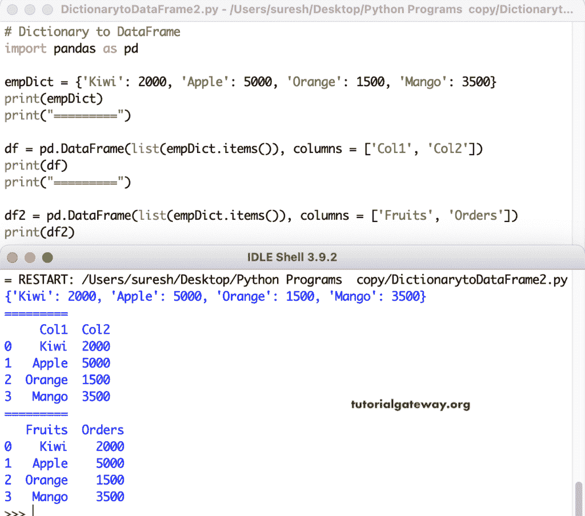

# 将 Python 字典转换为熊猫数据帧

> 原文：<https://www.tutorialgateway.org/convert-python-dictionary-to-pandas-dataframe/>

写一个 Python 程序，用例子把 Python 字典转换成熊猫数据帧。有多种方法可以将字典转换成熊猫数据帧，我们已经介绍了所有的方法。在这个例子中，首先，我们声明了一个员工字典，并使用了 pandas`DataFrame()`函数。其中，我们正在访问字典条目。其次，我们将字典项目转换为列表，然后将列表转换为数据帧。

```
import pandas as pd

empDict = {'name': 'Jhon Miller', 'Age': 32, 'Job': 'Developer'}

print(empDict)

df1 = pd.DataFrame(empDict.items())

print(df1)

df2 = pd.DataFrame(list(empDict.items()))

print(df2)
```

将 Python 字典转换为熊猫数据帧输出

```
{'name': 'Jhon Miller', 'Age': 32, 'Job': 'Developer'}
      0            1
0  name  Jhon Miller
1   Age           32
2   Job    Developer
      0            1
0  name  Jhon Miller
1   Age           32
2   Job    Developer
```

pandas DataFrame 有列属性来为列分配名称，我们使用该列表来分配多个列名。

```
import pandas as pd

empDict = {'Kiwi': 2000, 'Apple': 5000, 'Orange': 1500, 'Mango': 3500}

print(empDict)
print("=========")

df = pd.DataFrame(list(empDict.items()), columns = ['Col1', 'Col2'])

print(df)
print("=========")

df2 = pd.DataFrame(list(empDict.items()), columns = ['Fruits', 'Orders'])

print(df2)
```



## 用 Python 将字典转换为熊猫数据帧

虽然上面的例子很有用，但是你不需要那么多工作就可以把字典转换成数据帧。熊猫数据框有一个 from_dict()函数来转换字典，或者你可以直接在数据框函数中使用字典。Coll 部分是它自动分配列名。

```
import pandas as pd

empDict = {'name': ['Jhon', 'Mike', 'Dave', 'Kane', 'Rose'],
           'Age': [32, 37, 25, 29, 23]}

df1 = pd.DataFrame.from_dict(empDict)
print(df1)

print("== === == == == === == == == ")

df2 = pd.DataFrame(empDict)
print(df2)
```

```
 name  Age
0  Jhon   32
1  Mike   37
2  Dave   25
3  Kane   29
4  Rose   23
== === == == == === == == == 
   name  Age
0  Jhon   32
1  Mike   37
2  Dave   25
3  Kane   29
4  Rose   23
```

pandas DataFrame from_dict()函数有一个 orient 属性，它的默认值是 columns，用于从 Dictionary 中分配列名。如果您将方向更改为索引，字典将旋转或转置并传递给熊猫数据帧。

```
import pandas as pd

empDict = {'name': ['Jhon', 'Mike', 'Dave', 'Kane', 'Rose'],
           'Age': [32, 37, 25, 29, 23]}

df1 = pd.DataFrame.from_dict(empDict, orient = 'columns')
print(df1)

print("== == == == == ==")

df2 = pd.DataFrame.from_dict(empDict, orient = 'index')
print(df2)

print("== == == == == ==")

df3 = pd.DataFrame.from_dict(empDict, orient = 'index',
                             columns = ['a', 'b', 'c', 'd', 'e'])

print(df3)
```

```
 name  Age
0  Jhon   32
1  Mike   37
2  Dave   25
3  Kane   29
4  Rose   23
== == == == == ==
         0     1     2     3     4
name  Jhon  Mike  Dave  Kane  Rose
Age     32    37    25    29    23
== == == == == ==
         a     b     c     d     e
name  Jhon  Mike  Dave  Kane  Rose
Age     32    37    25    29    23
```

这个 Python 示例展示了将嵌套字典转换为熊猫数据帧的多种方法。

```
import pandas as pd

empDict = [{'name': 'Jhon', 'Age': 32, 'Job': 'Developer'},
           {'name': 'Dave', 'Age': 29, 'Job': 'Designer'},
           {'name': 'Rose', 'Age': 23, 'Job': 'HR'},
           {'name': 'Mike', 'Age': 41, 'Job': 'Manager'},
           {'name': 'Kane', 'Age': 37, 'Job': 'Admin'} ]

df1 = pd.DataFrame.from_dict(empDict)
print(df1)

print("== == == === == == ==")

df2 = pd.DataFrame(empDict)
print(df2)
```

```
 name  Age        Job
0  Jhon   32  Developer
1  Dave   29   Designer
2  Rose   23         HR
3  Mike   41    Manager
4  Kane   37      Admin
== == == === == == ==
   name  Age        Job
0  Jhon   32  Developer
1  Dave   29   Designer
2  Rose   23         HR
3  Mike   41    Manager
4  Kane   37      Admin
```

在 pandas DataFrame 中，我们可以使用 columns 参数根据我们的需求移除或重新排序字典列。首先，我们对“年龄”和“职务”列重新排序。接下来，删除年龄列并添加性别列。这就是为什么它返回带有 NaN 行的 Sex 列。

```
import pandas as pd

empDict = [{'name': 'Jhon', 'Age': 32, 'Job': 'Developer'},
           {'name': 'Dave', 'Age': 29, 'Job': 'Designer'},
           {'name': 'Rose', 'Age': 23, 'Job': 'HR'},
           {'name': 'Mike', 'Age': 41, 'Job': 'Manager'},
           {'name': 'Kane', 'Age': 37, 'Job': 'Admin'} ]

df1 = pd.DataFrame(empDict, columns = ['name', 'Job', 'Age'])
print(df1)
print("== == == === == == ==")

df2 = pd.DataFrame(empDict, columns = ['name', 'Job'])
print(df2)
print("== == == === == == ==")

df3 = pd.DataFrame(empDict, columns = ['name', 'Job', 'Age', 'Sex'])
print(df3)
```

```
 name        Job  Age
0  Jhon  Developer   32
1  Dave   Designer   29
2  Rose         HR   23
3  Mike    Manager   41
4  Kane      Admin   37
== == == === == == ==
   name        Job
0  Jhon  Developer
1  Dave   Designer
2  Rose         HR
3  Mike    Manager
4  Kane      Admin
== == == === == == ==
   name        Job  Age  Sex
0  Jhon  Developer   32  NaN
1  Dave   Designer   29  NaN
2  Rose         HR   23  NaN
3  Mike    Manager   41  NaN
4  Kane      Admin   37  NaN
```

这是你可能看到的字典的实时场景。在这里，我们展示了多种方法将这类词典转换成熊猫数据框。我建议你再试试嵌套词典。

```
import pandas as pd

empDict = {'Employee': {'Q1': 'Jhon', 'Q2': 'Dave', 'Q3': 'Mike', 'Q4': 'Rose'},
           '2018':{'Q1': 1200, 'Q2': 1000, 'Q3': 2500, 'Q4': 600},
           '2019':{'Q1': 2500, 'Q2': 3200, 'Q3': 1800, 'Q4': 4500},
           '2020':{'Q1': 1700, 'Q2': 3200, 'Q3': 5000, 'Q4': 8000}
           }

df1 = pd.DataFrame(empDict)
print(df1)
print("== == == === == == ==")

df2 = pd.DataFrame.from_dict(empDict)
print(df2)
```

```
 Employee  2018  2019  2020
Q1     Jhon  1200  2500  1700
Q2     Dave  1000  3200  3200
Q3     Mike  2500  1800  5000
Q4     Rose   600  4500  8000
== == == === == == ==
   Employee  2018  2019  2020
Q1     Jhon  1200  2500  1700
Q2     Dave  1000  3200  3200
Q3     Mike  2500  1800  5000
Q4     Rose   600  4500  8000
```

这是将字典转换成熊猫数据帧的另一个例子。

```
import pandas as pd

empDict = {'Employee': {2018: 'Jhon', 2019: 'Dave', 2020: 'Mike'},
           'Q1':{2018: 1200, 2019: 1000, 2020: 2500},
           'Q2':{2018: 2500, 2019: 3200, 2020: 1800},
           'Q3':{2018: 1700, 2019: 3200, 2020: 5000},
           'Q4':{2018: 1600, 2019: 4500, 2020: 8000}
           }

df1 = pd.DataFrame(empDict)
print(df1)

print("== == == === == == ==")

df2 = pd.DataFrame.from_dict(empDict)
print(df2)
```

```
 Employee    Q1    Q2    Q3    Q4
2018     Jhon  1200  2500  1700  1600
2019     Dave  1000  3200  3200  4500
2020     Mike  2500  1800  5000  8000
== == == === == == ==
     Employee    Q1    Q2    Q3    Q4
2018     Jhon  1200  2500  1700  1600
2019     Dave  1000  3200  3200  4500
2020     Mike  2500  1800  5000  8000
```