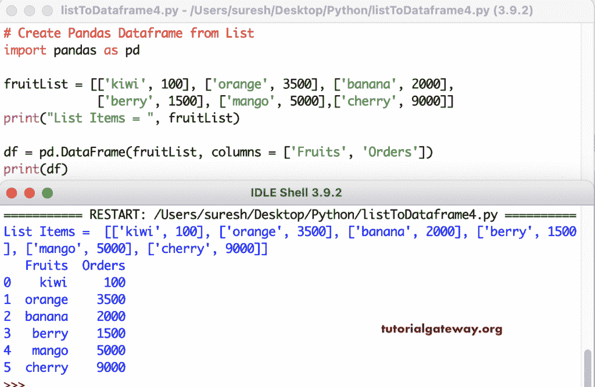

# 将 Python 列表转换为Pandas数据帧

> 原文：<https://www.tutorialgateway.org/convert-python-list-to-pandas-dataframe/>

写一个 Python 程序，用一个例子把列表转换成Pandas数据帧。在这个例子中，首先，我们声明了一个水果串列表。接下来，我们使用 pandas`DataFrame()`函数将列表转换为 DataFrame。

```
import pandas as pd

fruitList = ['kiwi', 'orange', 'banana', 'berry', 'mango', 'cherry']
print("List Items = ", fruitList)

df = pd.DataFrame(fruitList)
print(df)
```

```
List Items =  ['kiwi', 'orange', 'banana', 'berry', 'mango', 'cherry']
        0
0    kiwi
1  orange
2  banana
3   berry
4   mango
5  cherry
```

Python 数据帧有一个帮助分配列名和索引的列来分配索引值。这里，我们将列名设置为水果，并将索引值设置为六个整数的列表。

```
import pandas as pd

fruitList = ['kiwi', 'orange', 'banana', 'berry', 'mango', 'cherry']

print("List Items = ", fruitList)

df = pd.DataFrame(fruitList, columns = ['Fruits'],
                  index = [1, 2, 3, 4, 5, 6])

print(df)
```

```
List Items =  ['kiwi', 'orange', 'banana', 'berry', 'mango', 'cherry']
   Fruits
1    kiwi
2  orange
3  banana
4   berry
5   mango
6  cherry
```

## 用 Python 从列表中创建Pandas数据帧

我们申报了两份水果和订单清单。接下来，我们使用[`zip()`函数](https://www.tutorialgateway.org/python-zip-function/)来压缩这两个列表，然后Pandas数据帧函数将它们转换成数据帧。

```
import pandas as pd

fruitList = ['kiwi', 'orange', 'banana', 'berry', 'mango', 'cherry']

print("List Items = ", fruitList)

ordersList = [100, 2000, 5000, 400, 8000, 12000]

print("List Items = ", ordersList)

df = pd.DataFrame(list(zip(fruitList, ordersList)),
                  columns = ['Fruits', 'Orders'],
                  index = ['a', 'b', 'c', 'd', 'e', 'f'])

print(df)
```

```
List Items =  ['kiwi', 'orange', 'banana', 'berry', 'mango', 'cherry']
List Items =  [100, 2000, 5000, 400, 8000, 12000]
   Fruits  Orders
a    kiwi     100
b  orange    2000
c  banana    5000
d   berry     400
e   mango    8000
f  cherry   12000
```

Pandas数据帧函数还将嵌套列表转换成数据帧。

```
import pandas as pd

fruitList = [['kiwi', 100], ['orange', 3500], ['banana', 2000],
             ['berry', 1500], ['mango', 5000],['cherry', 9000]]

print("List Items = ", fruitList)

df = pd.DataFrame(fruitList, columns = ['Fruits', 'Orders'])

print(df)
```



这个嵌套列表与其他嵌套列表不同，如果您将这个嵌套列表转换为Pandas数据帧，您会得到以下结果。

```
import pandas as pd

emplist = [['Jhon', 'Xi', 'Ram', 'Dave', 'Nancy'],
           ['Miller', 'Jing', 'KK', 'Williams', 'Cook'],
           [40, 52, 25, 37, 29]]

df = pd.DataFrame(emplist)
print(df)

print('\n========')
df1 = pd.DataFrame(emplist, index = ['First_Name', 'Last_Name', 'Age'])
print(df1)
```

```
 0     1    2         3      4
0    Jhon    Xi  Ram      Dave  Nancy
1  Miller  Jing   KK  Williams   Cook
2      40    52   25        37     29

========
                 0     1    2         3      4
First_Name    Jhon    Xi  Ram      Dave  Nancy
Last_Name   Miller  Jing   KK  Williams   Cook
Age             40    52   25        37     29
```

然而，Pandas数据帧中有一个转置函数，可以将上面嵌套的 Python 列表转换成有意义的列表。

```
import pandas as pd

emplist = [['Jhon', 'Xi', 'Ram', 'Dave', 'Nancy'],
           ['Miller', 'Jing', 'KK', 'Williams', 'Cook'],
           [40, 52, 25, 37, 29]]

print("List Items = ", emplist)

df = pd.DataFrame(emplist).transpose()

df.columns = ['First Name', 'Last Name', 'Age']

print(df)

df1 = pd.DataFrame(emplist)

print(df1)
```

```
List Items =  [['Jhon', 'Xi', 'Ram', 'Dave', 'Nancy'], ['Miller', 'Jing', 'KK', 'Williams', 'Cook'], [40, 52, 25, 37, 29]]
  First Name Last Name Age
0       Jhon    Miller  40
1         Xi      Jing  52
2        Ram        KK  25
3       Dave  Williams  37
4      Nancy      Cook  29
        0     1    2         3      4
0    Jhon    Xi  Ram      Dave  Nancy
1  Miller  Jing   KK  Williams   Cook
2      40    52   25        37     29
```