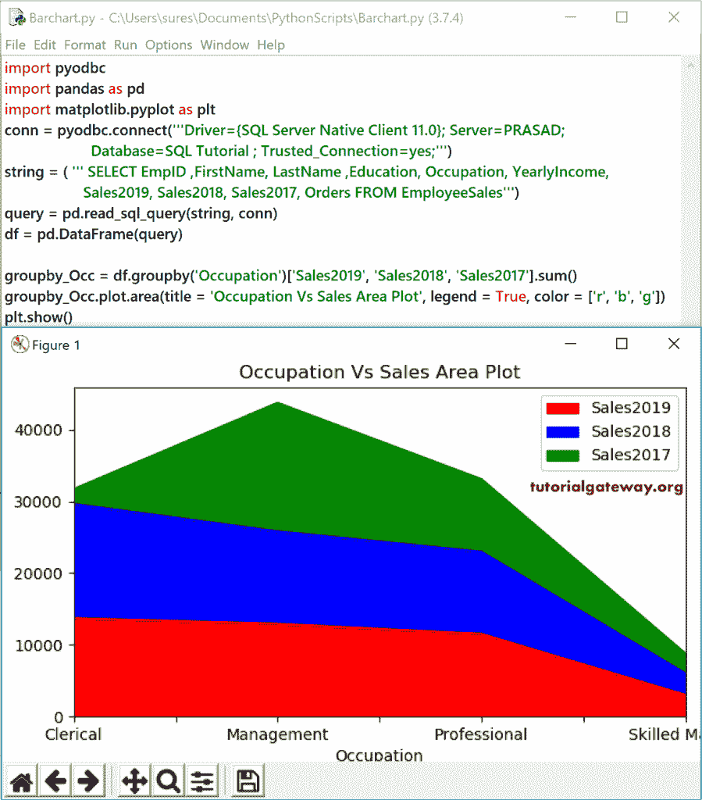
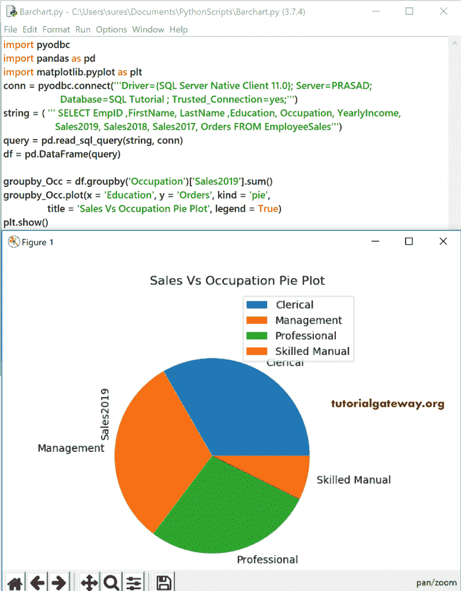

# Pandas 数据帧绘图

> 原文：<https://www.tutorialgateway.org/pandas-dataframe-plot/>

Python 中的 pandas DataFrame 绘图函数用于绘制我们在 matplotlib 中生成的图表。您可以在系列和数据帧上使用 Pandas 绘图功能。使用 pandas DataFrame 绘图功能，您可以绘制的 Python 图表列表包括面积、条形图、条形图、方框图、密度图、六边形图、hist 图、kde 图、折线图、饼图和散点图。Pandas 数据帧绘图功能接受的可用参数列表。

*   x:默认值为无。如果数据是一个数据帧，请指定 x 值。
*   y(默认值=无):它允许绘制一列与另一列。
*   Kind:它接受指定所需图表的字符串值。它们是面积、条、条、框、密度、密度、历史、KDE、线、饼图、散点。
*   figsize:以英寸为单位的(宽度、高度)元组。
*   use_index(默认值= True):它接受布尔值。使用索引作为 x 轴的标签。
*   标题:为图表分配标题。
*   网格:轴的网格线，默认值为无
*   传说:它接受真、假或“反向”。
*   样式:接受列表或字典。每列的线条样式。
*   logx、logy、loglog:使用 logx 在 x 轴上缩放，使用 logy 在 y 轴上缩放，使用 loglog 在 x 轴和 y 轴上缩放
*   XT picks:XT picks 的顺序值。
*   yticks:yticks 的序列值。
*   xlim，ylim: 2- [元组](https://www.tutorialgateway.org/python-tuple/)或 [List](https://www.tutorialgateway.org/python-list/) 。
*   rot:XT picks 和 yticks 的旋转。垂直图形的 x 线和水平图形的 y 线。
*   字体大小:指定整数值来决定 xticks 和 yticks 的字体大小。
*   colormap: matplotlib 或 str colormap 对象。使用此选项选择颜色。
*   颜色条:通过将其设置为“真”，将其用于散点图和六边形图。
*   位置:指定条形图布局的对齐方式。您可以指定 0 到 1 之间的任何值，默认值为 0.5。这里，0 表示左底端，1 表示右顶端。
*   表:这接受布尔值，默认值为假。如果设置为“真”，它将使用 matplotlib 默认布局绘制表格。
*   yerr: Series、DataFrame、[字典](https://www.tutorialgateway.org/python-dictionary/)、类似数组和 str。
*   xerr: [系列](https://www.tutorialgateway.org/python-series/)、[数据帧](https://www.tutorialgateway.org/python-pandas-dataframe/)、字典、类似数组的和字符串。
*   mark_right:默认情况下，它设置为 True。当我们使用辅助 y 轴时，它会自动将列标签标记到右侧。
*   **kwds:关键字。

## Pandas 数据帧绘图功能示例

下面的示例列表帮助您使用 Pandas DataFrame 绘图功能来创建或生成面积图、条形图、条形图、折线图、密度图、六边形图、hist 图、KDE 图、折线图、饼图和散点图。

让我向您展示我们在这些示例中使用的 [Sql Server](https://www.tutorialgateway.org/sql/) 数据。请参考 [Python](https://www.tutorialgateway.org/python-tutorial/) 中的[图表数据](https://www.tutorialgateway.org/python-charts-data/)文章。

```
import pyodbc
import pandas as pd
import matplotlib.pyplot as plt

conn = pyodbc.connect('''Driver={SQL Server Native Client 11.0}; Server=PRASAD;
                      Database=SQL Tutorial ; Trusted_Connection=yes;''')

string = ( ''' SELECT EmpID ,FirstName, LastName ,Education, Occupation, YearlyIncome, Sales2019, 
                    Sales2018, Sales2017, Orders FROM EmployeeSales''')

query = pd.read_sql_query(string, conn)
df = pd.DataFrame(query)
print(df)
```


我们将在 Pandas 绘图函数中使用上面指定的数据帧。如您所见，我们使用职业作为 X 轴值，Sale2019 作为 Y 轴值，但我们没有指定任何种类。在这种情况下，dataframe 绘图功能自行决定，并根据数据绘制图表。

```
conn = pyodbc.connect('''Driver={SQL Server Native Client 11.0}; Server=PRASAD;
                      Database=SQL Tutorial ; Trusted_Connection=yes;''')

string = ( ''' SELECT EmpID ,FirstName, LastName ,Education, Occupation, YearlyIncome, Sales2019, 
                    Sales2018, Sales2017, Orders FROM EmployeeSales''')

query = pd.read_sql_query(string, conn)
df = pd.DataFrame(query)

df.plot(x = 'Occupation', y = 'Sales2019')
plt.show()
```


在接下来的 Pandas DataFrame 绘图函数示例中，我们只提到我们更改的代码(这为我们节省了一些空间)。但是，您可以在输出图像中看到完整的代码。希望你不介意:)

### PythonPandas 数据帧条形图

Pandas 条图是使用矩形条可视化分类数据。您也可以用它来比较一个小节和另一个小节。为了生成数据帧条形图，我们将种类参数值指定为“条”。为了演示条形图，我们将职业指定为 X 轴值，将销售 2019 指定为 Y 轴。

```
conn = pyodbc.connect('''Driver={SQL Server Native Client 11.0}; Server=PRASAD;
                      Database=SQL Tutorial ; Trusted_Connection=yes;''')ac

string = ( ''' SELECT EmpID ,FirstName, LastName ,Education, Occupation, YearlyIncome,
                    Sales2019, Sales2018, Sales2017, Orders FROM EmployeeSales''')

query = pd.read_sql_query(string, conn)
df = pd.DataFrame(query)

df.plot(x = 'Occupation', y = 'Sales2019', kind = 'bar')
plt.show()
```


如果我们正在生成一个在 X 轴上有唯一名称的 Pandas DataFrame 条形图(类似于 Sales2019 对 Full Name，这是唯一的)，那么上面的代码可能对您有用。在这里，我们希望根据员工职业显示销售额，因此我们需要对这些职业进行分组。为此，我们必须使用 DataFrame`groupby()`函数。

```
groupby_Occupation = df.groupby('Occupation')['Sales2019'].sum()
groupby_Occupation.plot(kind = 'bar')
plt.show()
```


如果您想使用多种衡量标准或比较今年和去年的销售额，那么您可以尝试下面显示的方法。

```
groupby_Occupation = df.groupby('Occupation')['Sales2019', 'Sales2018'].sum()
groupby_Occupation.plot(kind = 'bar')
plt.show()
```


通过使用子图参数，您可以将条形图分为两个子图。为此，您必须指定子情节=真。这里，我们使用了 haven，使用了 kind = 'bar '，因为它们都返回相同的结果。

```
groupby_Occupation = df.groupby('Occupation')['Sales2019', 'Sales2018'].sum()
groupby_Occupation.plot.bar(subplots = True)
plt.show()
```


让我用上面指定的参数做一些快速格式化

```
groupby_Occupation = df.groupby('Occupation')['Sales2019', 'Sales2018'].sum()
groupby_Occupation.plot.bar(title = 'Bar Plot', grid = True, fontsize = 7, position = 1)
plt.show()
```


### PythonPandas 数据帧水平图

Pandas 数据帧绘制条形图功能允许您绘制水平条形图。您可以使用这些类型的数据帧水平条形图来可视化矩形条中的定量数据。

```
import pyodbc
import pandas as pd
import matplotlib.pyplot as plt

conn = pyodbc.connect('''Driver={SQL Server Native Client 11.0}; Server=PRASAD;
                      Database=SQL Tutorial ; Trusted_Connection=yes;''')

string = ( ''' SELECT EmpID ,FirstName, LastName ,Education, Occupation, YearlyIncome,
                    Sales2019, Sales2018, Sales2017, Orders FROM EmployeeSales''')

query = pd.read_sql_query(string, conn)
df = pd.DataFrame(query)

groupby_Occ = df.groupby('Occupation')['Sales2019'].sum()
groupby_Occ.plot.barh(x = 'Occupation', y = 'Sale2019' )
plt.show()
```


让我使用多个数值作为横条列。在这里，我们还使用子场景来分隔列。

```
groupby_Occ = df.groupby('Occupation')['Sales2019', 'Sales2018'].sum()
groupby_Occ.plot.barh(title = ['Sales 2019 Bar Plot', 'Sales 2018 Bar Plot'], subplots = True, legend = False)
plt.show()
```


### PythonPandas 数据帧区域图

Pandas 区图是为了可视化定量数据。这是一种折线图。但是，它会填充空白区域。

```
conn = pyodbc.connect('''Driver={SQL Server Native Client 11.0}; Server=PRASAD;
                      Database=SQL Tutorial ; Trusted_Connection=yes;''')
string = ( ''' SELECT EmpID ,FirstName, LastName ,Education, Occupation, YearlyIncome,
                    Sales2019, Sales2018, Sales2017, Orders FROM EmployeeSales''')
query = pd.read_sql_query(string, conn)
df = pd.DataFrame(query)

groupby_Occ = df.groupby('Occupation')['Orders'].sum()
groupby_Occ.plot(x = 'Occupation', y = 'Sale2019', kind = 'area' )
plt.show()
```


这一次，我们按照 2019 年、2018 年和 2017 年的销售额对职业进行分组。接下来，我们将使用数据帧绘图区域功能绘制 Pandas 面积图。

```
groupby_Occ = df.groupby('Occupation')['Sales2019', 'Sales2018', 'Sales2017'].sum()
groupby_Occ.plot.area(title = 'Occupation Vs Sales Area Plot', legend = True, color = ['r', 'b', 'g'])
plt.show()
```



### PythonPandas 数据帧图

Pandas 盒子图是从给定的数据帧创建一个盒子图。使用此数据帧图，使用四分位数可视化数据。在这个例子中，我们创建了一个随机的 50 行 5 列的数据帧，并分配了从 A 到 e 的列名。通过使用这些值，我们在 plot 方法和 kind = 'box '的帮助下生成了一个 Pandas boxplot。

```
table = np.random.randn(50, 5)
data = pd.DataFrame(table, columns = ['A', 'B', 'C', 'D', 'E'])

data.plot(kind = 'box')
plt.show()
```


在这里，我们使用“员工”表中的“名字”、“销售 2019”、“销售 2018”和“销售 2017”列绘制了一个方框图。为此，我们使用了 Pandas 盒子功能。

```
import pyodbc
import pandas as pd
import matplotlib.pyplot as plt
conn = pyodbc.connect('''Driver={SQL Server Native Client 11.0}; Server=PRASAD;
                      Database=SQL Tutorial ; Trusted_Connection=yes;''')
string = ( ''' SELECT FirstName, Sales2019, Sales2018, Sales2017 FROM EmployeeSales''')
query = pd.read_sql_query(string, conn)
df = pd.DataFrame(query)

df.plot.box(title = 'Box Plot')
plt.show()
```


### Pandas DataFrame hexbin 绘图

Pandas 六边形图将生成一个六边形的宁滨图。

首先，我们使用 [Numpy](https://www.tutorialgateway.org/python-numpy-array/) 随机`randn()`函数生成大小为 1000 * 2 的[随机](https://www.tutorialgateway.org/python-random-array/)数。接下来，我们使用`DataFrame()`函数将其转换为列名为 A 和 B 的 data frame。data . plot(x = ' A '，y = 'B '，kind = 'hexbin '，gridsize = 20)使用这些随机值创建一个 hexbin 或十六进制 bin 图。

```
import numpy as np
import pandas as pd
import matplotlib.pyplot as plt

table = np.random.randn(1000, 2)
data = pd.DataFrame(table, columns = ['A', 'B'])

data.plot(x = 'A', y = 'B', kind = 'hexbin', gridsize = 20)
plt.show()
```


目前，我们没有更好的数据来显示 Pandas 十六进制 bin 图。因此，我们使用了网格大小= 25 的 2018 年销售额与 2017 年销售额的对比。

```
import pyodbc
import pandas as pd
import matplotlib.pyplot as plt

conn = pyodbc.connect('''Driver={SQL Server Native Client 11.0}; Server=PRASAD; Database=SQL Tutorial ; Trusted_Connection=yes;''')

string = ( ''' SELECT Sales2018, Sales2017, Orders FROM EmployeeSales''')
query = pd.read_sql_query(string, conn)
df = pd.DataFrame(query)

df.plot.hexbin(y = 'Sales2018', x = 'Sales2017',gridsize = 25,  title = 'Hexbin Plot')
plt.show()
```


### Pandas DataFrame 组稿

Pandas 历史图是绘制或生成分布式数据的直方图。在本例中，我们使用随机`randn()`函数为 x 和 y 列生成了随机值。接下来，我们使用 Pandas`hist()`函数在 Python 中不生成直方图。

```
import numpy as np
import pandas as pd
import matplotlib.pyplot as plt

A= np.random.randn(1000)
B= np.random.randn(1000) + 1
data = pd.DataFrame({'x':A, 'y': B}, columns = ['x', 'y'])

data.plot.hist()
plt.show()
```


这一次，我们将箱的总数更改为 10，并在数据帧中增加了一列。

```
A= np.random.randn(1000)
B= np.random.randn(1000) + 1
C= np.random.randn(1000) - 2
data = pd.DataFrame({'x':A, 'y': B, 'z': C}, columns = ['x', 'y', 'z'])

data.plot.hist(bins = 10)
plt.show()
```


### Pandas DataFrame kde 绘图

Pandas kde 图使用高斯核生成或绘制核密度估计图(简称 kde)。首先，我们使用 Numpy 随机函数生成大小为 10 的随机数。接下来，我们使用 Pandas 系列函数来创建使用这些数字的系列。最后，data.plot(kind = 'kde ')使用这些数字生成一个 kde 或密度图。

```
table = np.random.randn(10)
data = pd.Series(table)
print(data)

data.plot(kind = 'kde')
plt.show()
```


让我在员工表数据帧中画出过去三年销售额的 Pandas 密度图。

```
conn = pyodbc.connect('''Driver={SQL Server Native Client 11.0}; Server=PRASAD;
                      Database=SQL Tutorial ; Trusted_Connection=yes;''')

string = ( ''' SELECT Sales2019, Sales2018, Sales2017 FROM EmployeeSales''')
query = pd.read_sql_query(string, conn)

df = pd.DataFrame(query)
df.plot.kde(title = 'Density Plot')
plt.show()
```


### PythonPandas 数据帧折线图

Pandas 线图是根据给定的数据绘制线。您可以使用此线条数据帧针对单个度量或多个度量绘制一个维度。在这里，我们画了 Pandas 线，用于员工的教育，而不是订单。

```
import pyodbc
import pandas as pd
import matplotlib.pyplot as plt
conn = pyodbc.connect('''Driver={SQL Server Native Client 11.0}; Server=PRASAD;
                      Database=SQL Tutorial ; Trusted_Connection=yes;''')
string = ( ''' SELECT EmpID ,FirstName, LastName ,Education, Occupation, YearlyIncome,
                    Sales2019, Sales2018, Sales2017, Orders FROM EmployeeSales''')
query = pd.read_sql_query(string, conn)
df = pd.DataFrame(query)

groupby_Occ = df.groupby('Education')['Orders'].sum()
groupby_Occ.plot(x = 'Education', y = 'Orders', kind = 'line',
                 title = 'Orders Vs Education  Line Plot', legend = False)
plt.show()
```


我们按照 2019 年、2018 年和 2017 年的销售额对教育进行分组。接下来，我们使用直线函数绘制了一个折线图。您也可以在行函数中使用子情节=真来分隔这些销售行。

```
groupby_Occ = df.groupby('Education')['Sales2019', 'Sales2018', 'Sales2017'].sum()
groupby_Occ.plot.line(title = 'Sales Vs Education  Line Plot')
plt.show()
```


### Pandas 数据帧饼图

Pandas 派是画一个饼图。它根据传递给它的数字数据列来分割一个饼图。这里，我们使用绘图方法生成了 Pandas 饼图，其中 x =职业，y = 2019 年销售额。

```
import pyodbc
import pandas as pd
import matplotlib.pyplot as plt
conn = pyodbc.connect('''Driver={SQL Server Native Client 11.0}; Server=PRASAD;
                      Database=SQL Tutorial ; Trusted_Connection=yes;''')
string = ( ''' SELECT EmpID ,FirstName, LastName ,Education, Occupation, YearlyIncome,
                    Sales2019, Sales2018, Sales2017, Orders FROM EmployeeSales''')
query = pd.read_sql_query(string, conn)
df = pd.DataFrame(query)

groupby_Occ = df.groupby('Occupation')['Sales2019'].sum()
groupby_Occ.plot(x = 'Education', y = 'Orders', kind = 'pie',
                 title = 'Sales Vs Occupation Pie Plot', legend = True)
plt.show()
```



### PythonPandas 数据帧散点图

Pandas 数据帧散点图基于给定的数据创建或绘制标记。每个标记定义了数据帧中 X 轴和 Y 轴值的坐标。

```
conn = pyodbc.connect('''Driver={SQL Server Native Client 11.0}; Server=PRASAD;
                      Database=SQL Tutorial ; Trusted_Connection=yes;''')
string = ( ''' SELECT EmpID ,FirstName, LastName ,Education, Occupation, YearlyIncome,
                    Sales2019, Sales2018, Sales2017, Orders FROM EmployeeSales''')
query = pd.read_sql_query(string, conn)
df = pd.DataFrame(query)

df.plot(x = 'EmpID', y = 'Sales2017', kind = 'scatter')
plt.show()
```


这里，我们使用 X 轴值作为 EmpID，y 轴值作为 2019 年销售额。接下来，我们将圆点的颜色改为绿色，并调整大小。

```
df.plot.scatter(x = 'EmpID', y = 'Sales2019', title = 'Scatter Plot',c = 'green', s = 24)
plt.show()
```

