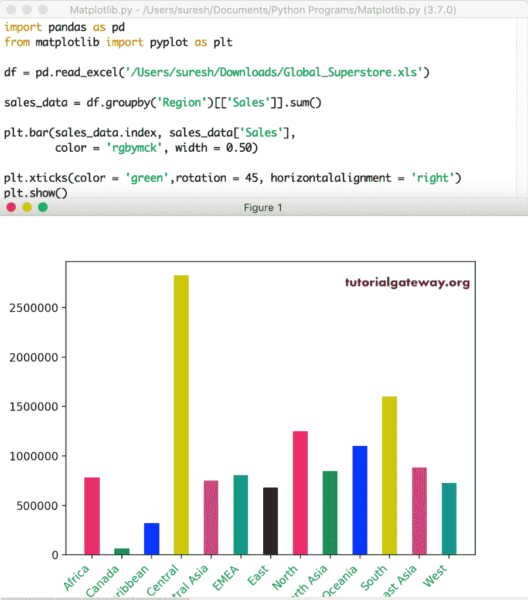

# python matplot lib bar chart(python matplot lib bar 图表)

> 原文：<https://www.tutorialgateway.org/python-matplotlib-bar-chart/>

matplotlib 库中的 Python 条形图、绘图或图形是以矩形条表示分类数据的图表。通过看这些条，人们可以了解哪个产品表现好或不好。这意味着酒吧越长，产品表现越好。在 Python 中，您可以使用这个 matplotlib 库和 pyplot 创建水平和垂直条形图。

Python matplotlib pyplot 有一个条形图函数，它可以帮助我们根据给定的 X 值、高度和宽度创建条形图或曲线图。Python matplotlib 条形图的基本语法如下所示。

```
bar(x, height, width=0.8, bottom=None, *, align='center', data=None, **kwargs)
```

除此之外，很少有其他可选参数来定义颜色、标题、线宽等。这里，我们用一个例子涵盖了 matplotlib 条形图的大部分参数。在我们进入 Python 示例之前，让我们看看用于此目的的 Excel 文件数据。

```
import pandas as pd
from matplotlib import pyplot as plt

df = pd.read_excel('/Users/suresh/Downloads/Global_Superstore.xls')
print(df)

sales_groupedby_region = df.groupby('Region')[['Sales']].sum()

print(sales_groupedby_region.sort_values(by = ['Sales']))
```


## 用 Python 创建一个基本 matplotlib 条形图

在这个 Python 示例中，我们使用 matplotlib 库中的 pyplot 创建了一个基本的条形图。首先，我们声明了宽度和高度的两个列表。接下来，我们使用 pyplot 中可用的 Python 条函数来绘制这个。

```
import matplotlib.pyplot as plt

x = ['A', 'B', 'C', 'D', 'E']
y = [22, 9, 40, 27, 55]

plt.bar(x, y)

plt.show()
```


### matplotlib 条形图名称

matplotlib 条形图具有 xlabel、ylabel 和 title 函数，这些函数可用于为 X 轴、Y 轴和图表名称提供名称。

*   xlabel:给 X 轴指定自己的名字。该函数接受分配给 X 轴名称的字符串。
*   依拉贝尔:使用此功能为 Y 轴指定一个名称
*   标题:请指定图表名称

```
import matplotlib.pyplot as plt

x = ['A', 'B', 'C', 'D', 'E']
y = [22, 9, 40, 27, 55]

plt.bar(x, y)

plt.title('Simple Bar Chart')
plt.xlabel('Width Names')
plt.ylabel('Height Values')

plt.show()
```


### Python 条形图网格线

如果要在 Python 条形图中显示网格线，请使用 pyplot 中可用的 grid()函数。

```
import matplotlib.pyplot as plt

x = ['A', 'B', 'C', 'D', 'E']
y = [22, 9, 40, 27, 55]

plt.bar(x, y)

plt.title('Simple Bar Chart')
plt.xlabel('Width Names')
plt.ylabel('Height Values')

plt.grid(color = 'red', alpha = 0.3, linestyle = '--', linewidth = 2)
plt.show()
```


## 来自 CSV 文件的 Python matplotlib 条形图

在本例中，我们使用本地目录中 CSV 文件的数据。从下面的 [Python](https://www.tutorialgateway.org/python-tutorial/) 代码中可以看到，首先，我们使用熊猫[数据框](https://www.tutorialgateway.org/python-pandas-dataframe/) groupby 函数对区域项目进行分组。接下来，我们找到销售金额的总和。接下来，我们将地区名称与销售额相比较。这意味着下面的 matplotlib 条形图将显示所有地区的销售额。

```
import pandas as pd
from matplotlib import pyplot as plt

df = pd.read_excel('/Users/suresh/Downloads/Global_Superstore.xls')
print(df)

sales_groupedby_region = df.groupby('Region')[['Sales']].sum()
print(sales_groupedby_region.sort_values(by = ['Sales']))

fig, ax = plt.subplots()

ax.bar(sales_groupedby_region.index, sales_groupedby_region['Sales'])

plt.title('Sales by Region Bar Chart')
plt.xlabel('Region Names')
plt.ylabel('Sales Amount')

plt.show()
```


从上面的 Python 条形图截图中，可以看到 x 轴值合并了，因此我们无法识别它们。让我把它们旋转 45 度。

```
import pandas as pd
from matplotlib import pyplot as plt

df = pd.read_excel('/Users/suresh/Downloads/Global_Superstore.xls')

sales_groupedby_region = df.groupby('Region')[['Sales']].sum()

fig, ax = plt.subplots()

ax.bar(sales_groupedby_region.index, sales_groupedby_region['Sales'])

labels = ax.get_xticklabels()
plt.setp(labels, rotation = 45, horizontalalignment = 'right')

plt.title('Sales by Region Bar Chart')
plt.xlabel('Region Names')
plt.ylabel('Sales Amount')

plt.show()
```


### 限制 Python 条形图的 Y 轴值

pyplot bar 函数中有一个 ylim 方法可以限制或更改 y 轴值。这里，我们将起始值从 0 更改为 50000，结束值从 2500000 更改为 3000000。

```
import pandas as pd
from matplotlib import pyplot as plt

df = pd.read_excel('/Users/suresh/Downloads/Global_Superstore.xls')

sales_data = df.groupby('Region')[['Sales']].sum()

fig, ax = plt.subplots()

ax.bar(sales_data.index, sales_data['Sales'])

labels = ax.get_xticklabels()
plt.setp(labels, rotation = 45, horizontalalignment = 'right')

plt.title('Sales by Region Bar Chart')
plt.xlabel('Region Names')
plt.ylabel('Sales Amount')
plt.ylim(50000, 3000000)
plt.show()
```


同样，您可以使用 xlim 方法限制 X 轴的轴值。要使用相同的，尝试 plt.xlim(0，10)或类似的东西。

### Python matplotlib 水平条形图

matplotlib 库提供了一个 barh 函数，用于在 Python 中绘制或绘制水平条形图。在这个例子中，我们用 barh 函数代替了实际的函数来绘制一个水平条形图。接下来，我们更改了 xlabel 和 ylabel 以更改轴名。

```
import pandas as pd
from matplotlib import pyplot as plt

df = pd.read_excel('/Users/suresh/Downloads/Global_Superstore.xls')

sales_data = df.groupby('Region')[['Sales']].sum()

fig, ax = plt.subplots()

ax.barh(sales_data.index, sales_data['Sales'])

plt.title('Horizontal Sales by Region Bar Chart')
plt.xlabel('Sales Amount')
plt.ylabel('Region Names')

plt.show()
```


### Python 条形图颜色

使用颜色参数更改条形的颜色，使用边缘颜色参数更改边缘的颜色。这里，我们使用了 6 种颜色的列表。这意味着，如果有 6 个，那么默认颜色将替换这些颜色。如果有 6 个以上，那么这些颜色将对其他颜色重复。接下来，我们使用 edgecolor 参数将 Python 条形图的边框颜色更改为绿色。

```
import pandas as pd
from matplotlib import pyplot as plt

df = pd.read_excel('/Users/suresh/Downloads/Global_Superstore.xls')

sales_data = df.groupby('Region')[['Sales']].sum()

colors = ['red', 'green', 'blue', 'yellow', 'black', 'cyan']

fig, ax = plt.subplots()

ax.bar(sales_data.index, sales_data['Sales'],
    color = colors, edgecolor = 'green')

labels = ax.get_xticklabels()
plt.setp(labels, rotation = 45, horizontalalignment = 'right')

plt.show()
```


这里，我们使用颜色名称作为列表项。但是，您可以使用十六进制颜色代码。例如，

```
ax.bar(sales_data.index, sales_data['Sales'],
    color = '#FFFF00', edgecolor = 'green')

# Or use the first letter of a color in the list items
colors = ['r', 'g', 'b', 'y', 'b', 'c']

# Or simply use the following method
plt.bar(sales_data.index, sales_data['Sales'],
    color = 'rgbycm', edgecolor = 'green')
```

### 格式化 matplotlib 条形图的轴标签

在本例中，我们将 y 轴表格的颜色更改为蓝色，将 x 轴表格的颜色更改为橙色，并将它们旋转了 45 度。接下来，我们添加了轴标签，并将它们的字体颜色、字体大小和字体粗细格式化为粗体。

```
import pandas as pd
from matplotlib import pyplot as plt

df = pd.read_excel('/Users/suresh/Downloads/Global_Superstore.xls')

sales_data = df.groupby('Region')[['Sales']].sum()

colors = ['red', 'green', 'blue', 'yellow', 'black', 'cyan']

plt.bar(sales_data.index, sales_data['Sales'],
    color = colors, edgecolor = 'green')

plt.xticks(color = 'orange',rotation = 45, horizontalalignment = 'right')
plt.yticks(color = 'blue')
plt.xlabel('Region', color = 'green', fontweight = 'bold', fontsize = '20')
plt.ylabel('Sales', color = 'red', fontweight = 'bold', fontsize = '20')

plt.show()
```


如果您看不到 X 轴标签和 Y 轴标签，则可以调整子剧情的顶部、左侧、右侧和底部的位置。为此，您必须使用 subtracts _ adjust 函数。

```
import pandas as pd
from matplotlib import pyplot as plt

df = pd.read_excel('/Users/suresh/Downloads/Global_Superstore.xls')

sales_data = df.groupby('Region')[['Sales']].sum()

plt.bar(sales_data.index, sales_data['Sales'],
    color = 'rgbykcm', edgecolor = 'green')

plt.xticks(color = 'orange',rotation = 45, horizontalalignment = 'right')
plt.yticks(color = 'blue')
plt.xlabel('Region', color = 'green', fontweight = 'bold', fontsize = '20')
plt.ylabel('Sales', color = 'red', fontweight = 'bold', fontsize = '20')

plt.subplots_adjust(bottom = 0.2, left = 0.2)
plt.show()
```


### 控制条的宽度和位置

使用 y_pos 参数控制图表中每个条形图的位置。pyplot 宽度参数帮助您控制它们的宽度。

```
import pandas as pd
from matplotlib import pyplot as plt

df = pd.read_excel('/Users/suresh/Downloads/Global_Superstore.xls')

sales_data = df.groupby('Region')[['Sales']].sum()

plt.bar(sales_data.index, sales_data['Sales'],
    color = 'rgbymck', width = 0.50)

plt.xticks(color = 'green',rotation = 45, horizontalalignment = 'right')

plt.show()
```



或者，您可以使用值列表来定义每个矩形宽度，并使用 y_pos 来更改轴刻度位置。如果您忘记使用 y_pos，那么条形会重叠。

### 设计 Python matplotlib Bar chart

使用下面的代码找出 pyplot 中可用样式的列表。

```
from matplotlib import pyplot as plt
plt.style.available
```


这里，我们使用 tableau-colorblind10。

```
import pandas as pd
from matplotlib import pyplot as plt

df = pd.read_excel('/Users/suresh/Downloads/Global_Superstore.xls')

sales_data = df.groupby('Region')[['Sales']].sum()

plt.bar(sales_data.index, sales_data['Sales'])

plt.xticks(color = 'green',rotation = 45, horizontalalignment = 'right')

plt.style.use('tableau-colorblind10')
plt.show()
```


如今，在数据科学领域，海底模块视觉效果变得非常流行。因此，我们在这个 Python matplotlib 条形图示例中使用了相同的内容。

```
import pandas as pd
from matplotlib import pyplot as plt
import seaborn as sns
sns.set()

df = pd.read_excel('/Users/suresh/Downloads/Global_Superstore.xls')

sales_data = df.groupby('Region')[['Sales', 'Profit']].sum()

plt.bar(sales_data.index, sales_data['Sales'], color = 'rgbymck')

plt.xticks(color = 'green',rotation = 45, horizontalalignment = 'right')

plt.show()
```


### 更改 matplotlib 条形图纹理

在 Python matplotlib 条形图中，有一个名为 hatch 的参数用于更改纹理。您可以用不同的图案或形状来填充它们，而不是填充空白空间。例如，在这里，我们将用*符号填充所有的圆柱体。

```
import pandas as pd
import numpy as np
from matplotlib import pyplot as plt
import seaborn as sns
sns.set()

df = pd.read_excel('/Users/suresh/Downloads/Global_Superstore.xls')

sales_data = df.groupby('Region')[['Sales']].sum()

plt.bar(sales_data.index, sales_data['Sales'],
    color = 'rgbymck', hatch = ("*"))

plt.xticks(color = 'green',
      rotation = 45, horizontalalignment = 'right')

plt.show()
```


这次，我们对 matplotlib 条形图中的每个矩形使用不同的模式。

```
import pandas as pd
import numpy as np
from matplotlib import pyplot as plt
import seaborn as sns
sns.set()

df = pd.read_excel('/Users/suresh/Downloads/Global_Superstore.xls')

sales_data = df.groupby('Region')[['Sales']].sum()

patterns = ("*", "\\", "+", "*", "|", "o", "/", "x", "O", "+", "o", "*", "-")

bars = plt.bar(sales_data.index, sales_data['Sales'],
    color = 'rgbmck')

for i, x in zip(bars,patterns):
  i.set_hatch(x)

plt.xticks(color = 'c', rotation = 45, horizontalalignment = 'right')

plt.show()
```


### 用 Python 绘制两个 matplotlib 条形图

Python matplotlib 允许您并排绘制两个条形图，以比较今年与去年的销售额或任何其他统计比较。这里，我们比较了区域销售和利润。这可能不是一个很好的比较，但你会想到我们如何实现同样的目标。

```
import numpy as np
import pandas as pd
from matplotlib import pyplot as plt
import seaborn as sns
sns.set()

df = pd.read_excel('/Users/suresh/Downloads/Global_Superstore.xls')

sales_data = df.groupby('Region')[['Sales', 'Profit']].sum()

index = np.arange(13)
bar_width = 0.45

r1 = plt.bar(index, sales_data['Sales'],
       bar_width, color = 'green', label = 'Sales')

r2 = plt.bar(index + bar_width, sales_data['Profit'],
       bar_width, color = 'blue', label = 'Profit')

plt.xticks(index + bar_width, sales_data.index,
      color = 'green',rotation = 45, horizontalalignment = 'right')

plt.legend()
plt.tight_layout()

plt.show()
```


同样，您可以再绘制一个图表来比较三个条形图。

Python 条形图图例

使用 pyplot 图例功能显示条形图的图例。分配图例值有多种方法。在上面的例子中，我们已经展示了一种显示图例项的方法。另一种方法是将 plt.legend()替换为 plt.legend([r1，r2]，['Sales '，'利润率'])，并从 r1 和 r2 中删除标签参数。

### Python matplotlib 堆叠条形图

您也可以将一个列数据堆叠在另一个列数据之上，这称为 Python 堆叠条形图。在本例中，我们将销售额叠加在利润之上。

```
import pandas as pd
from matplotlib import pyplot as plt
import seaborn as sns
sns.set()

df = pd.read_excel('/Users/suresh/Downloads/Global_Superstore.xls')

sales_data = df.groupby('Region')[['Sales', 'Profit']].sum()

plt.bar(sales_data.index, sales_data['Sales'], color = 'c', label = 'Sales')

plt.bar(sales_data.index, sales_data['Profit'], color = 'r', label = 'Profit')

plt.xticks(color = 'green',rotation = 45, horizontalalignment = 'right')

plt.legend()
plt.show()
```


您可以使用底部参数更改堆叠列的位置。例如，您可以将第二个条形图替换为下面的代码，将销售额放在底部，将利润放在顶部。

```
plt.bar(sales_data.index, sales_data['Profit'], color = 'r', label = 'Profit', bottom = sales_data['Sales'] )
```

### matplotlib 条形图子图

在 Python matplotlib 中，还可以创建条形图的子图。在本例中，我们为数据集中所有区域的销售额和利润创建了两个独立的条形图。

```
import numpy as np
import pandas as pd
from matplotlib import pyplot as plt
import seaborn as sns
sns.set()

df = pd.read_excel('/Users/suresh/Downloads/Global_Superstore.xls')

sales_data = df.groupby('Region')[['Sales', 'Profit']].sum()

plt.subplot(2, 1, 1)
plt.bar(sales_data.index, sales_data['Sales'], color = 'green', label = 'Sales')
plt.xticks([],[])
plt.ylabel('Sales Amount')
plt.legend()

plt.subplot(2, 1, 2)
plt.bar(sales_data.index, sales_data['Profit'],color = 'blue', label = 'Profit')

plt.xticks(rotation = 45, horizontalalignment = 'right')
plt.ylabel('Profit') 
plt.legend()

plt.show()
```


### 向 matplotlib 条形图添加数据标签

在这个 pyplot 图表示例中，我们将向您展示如何在每个条形图顶部添加数据标签。为此，使用 pyplot 中的文本函数。

```
import numpy as np
import pandas as pd
from matplotlib import pyplot as plt
import seaborn as sns
sns.set()

df = pd.read_excel('/Users/suresh/Downloads/Global_Superstore.xls')

sales_data = df.groupby('Region')[['Sales']].sum()

index = np.arange(13)

plt.bar( sales_data.index, sales_data['Sales'], color = 'rgbymck')

plt.xticks(color = 'green',rotation = 45, horizontalalignment = 'right')

label = sales_data['Sales'].round(2)

for i in range(13):
  plt.text(x = i, y = label[i], s = label[i],
       size = 9, rotation = 90, color = 'red')

plt.show()
```


如您所见，数据标签旋转了 90 度，颜色为红色。这是因为我们定义了旋转= 90°，颜色=红色，你可以根据你的要求改变它们。

### matplotlib 条形图错误线

通过使用 pyplot bar 函数 yerr 参数，您可以在图表顶部绘制误差线或置信线。

```
import matplotlib.pyplot as plt

x = ['A', 'B', 'C', 'D', 'E']
y = [22, 9, 40, 27, 55]
err_values = [3, 1, 5, 2, 4]

plt.bar(x, y, yerr = err_values, capsize = 5)

plt.title('Simple Bar Chart')
plt.xlabel('Width Names')
plt.ylabel('Height Values')

plt.show()
```


让我对我们从 CSV 文件中检索的数据帧执行相同的操作。

```
import pandas as pd
from matplotlib import pyplot as plt
import seaborn as sns
sns.set()

df = pd.read_excel('/Users/suresh/Downloads/Global_Superstore.xls')

sales_data = df.groupby('Region')[['Sales']].sum()

data = df.groupby('Region')[['Profit']].sum()

plt.bar(sales_data.index, sales_data['Sales'],
    color = 'rgbymck', yerr = data['Profit'], capsize = 5)

plt.xticks(color = 'green',rotation = 45, horizontalalignment = 'right')

plt.show()
```

