# Matplotlib 直方图

> 原文：<https://www.tutorialgateway.org/python-matplotlib-histogram/>

Matplotlib 直方图看起来类似于条形图。然而，数据将平均分配到箱中。每个面元代表数据间隔，matplotlib 直方图显示数值数据与面元频率的比较。

在 Python 中，可以借助 pyplot`hist()`函数，使用 Matplotlib 库绘制直方图。Python 中绘制 matplotlib pyplot 直方图的 hist 语法是

```py
matplotlib.pyplot.pie(x, bins)
```

在上面的 Python 直方图语法中，X 表示您想要在 Y 轴中使用的数字数据，而 bin 将在 X 轴中使用。

## 简单 matplotlib 直方图示例

在这个 pyplot 直方图示例中，我们生成了一个随机数组，并将其分配给 x。接下来，我们使用`hist()`函数绘制一个 python 直方图。请注意，我们没有使用 bins 参数。

```py
import matplotlib.pyplot as plt
import numpy as np

x = np.random.randn(1000)
print(x)

plt.hist(x)

plt.show()
```

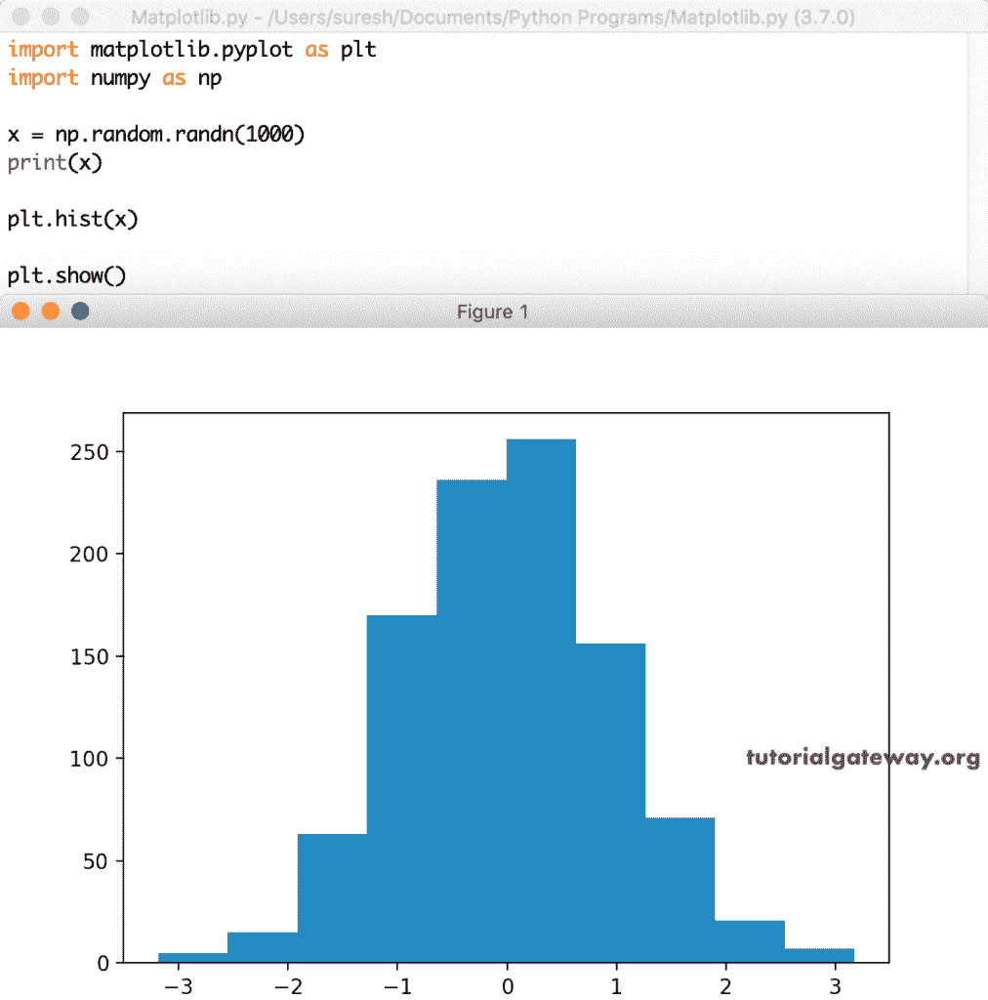

由于我们使用的是[随机数组](https://www.tutorialgateway.org/python-random-array/)，上面的图片或者截图可能对你来说不一样。

绘制直方图的第一步是使用一系列值创建面元。然而，在上面的 [Python](https://www.tutorialgateway.org/python-tutorial/) 示例中，我们没有使用这个参数，因此`hist()`函数将自动创建并使用默认的容器。在这个例子中，我们通过给它赋值 20 来明确地使用这个参数号。这意味着，下面的代码将绘制一个随机数历史，数据将平均分配到 20 个箱中。

```py
x = np.random.randn(1000)
print(x)

plt.hist(x, bins = 20)

plt.show()
```

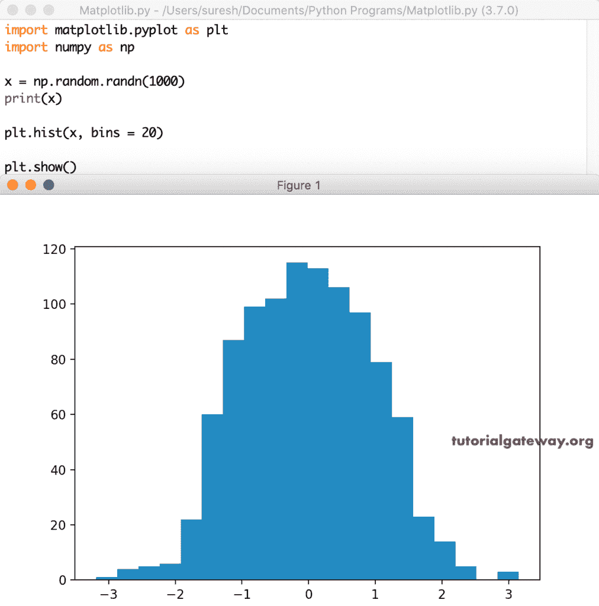

这是 pyplot 直方图的另一个例子。

```py
x = np.random.normal(0, 1, 1000)
print(x)

plt.hist(x, bins = 50)

plt.show()
```

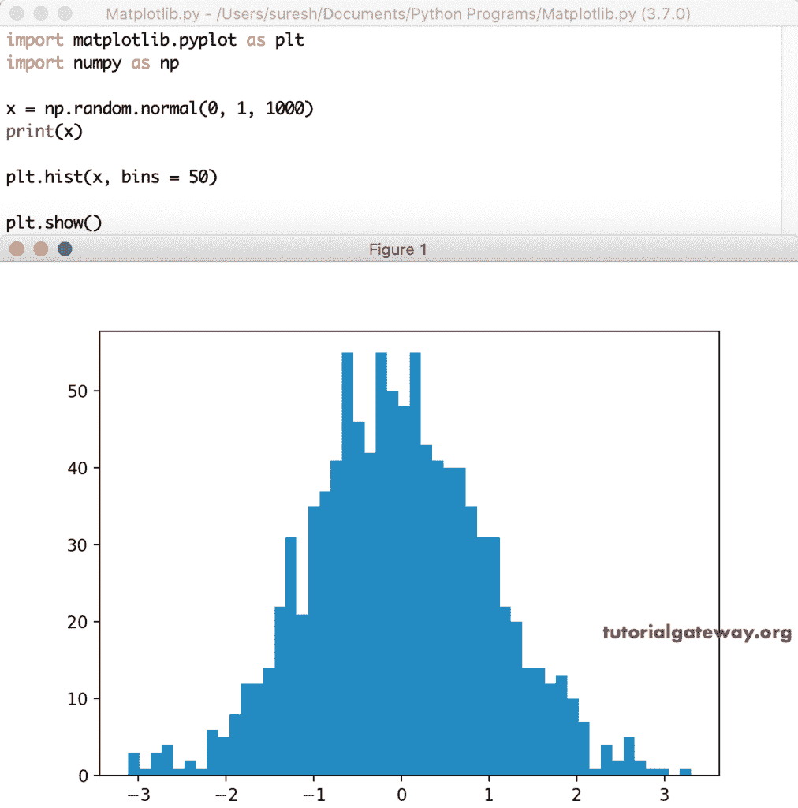

### 使用 CSV 文件的 Matplotlib 直方图

在这个 matplotlib 示例中，我们使用 CSV 文件绘制直方图。从下面的代码中可以看出，我们使用订单数量作为 Y 轴值。

```py
import numpy as np
import pandas as pd
from matplotlib import pyplot as plt

df = pd.read_excel('/Users/suresh/Downloads/Global_Superstore.xls')

data = df['Quantity']
bins=np.arange(min(data), max(data) + 1, 1)

print(df['Quantity'].count())
plt.hist(df['Quantity'], bins)

plt.show()
```

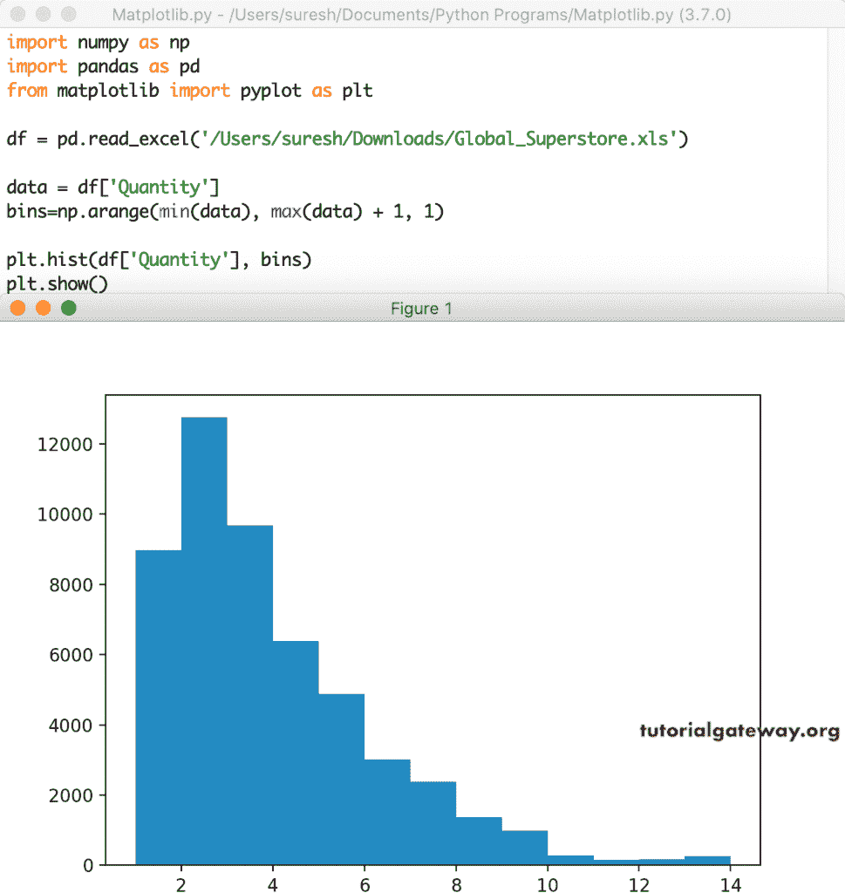

### Matplotlib 直方图标题

这个 pyplot 直方图示例显示了如何添加标题、X 轴和 Y 轴标签。

```py
import numpy as np
import pandas as pd
from matplotlib import pyplot as plt

df = pd.read_excel('/Users/suresh/Downloads/Global_Superstore.xls')

data = df['Quantity']
bins=np.arange(min(data), max(data) + 1, 1)

plt.hist(df['Quantity'], bins)

plt.title('Matplotlib Histogram Example')
plt.xlabel('Bins')
plt.ylabel('Order Quatity')
plt.show()
```

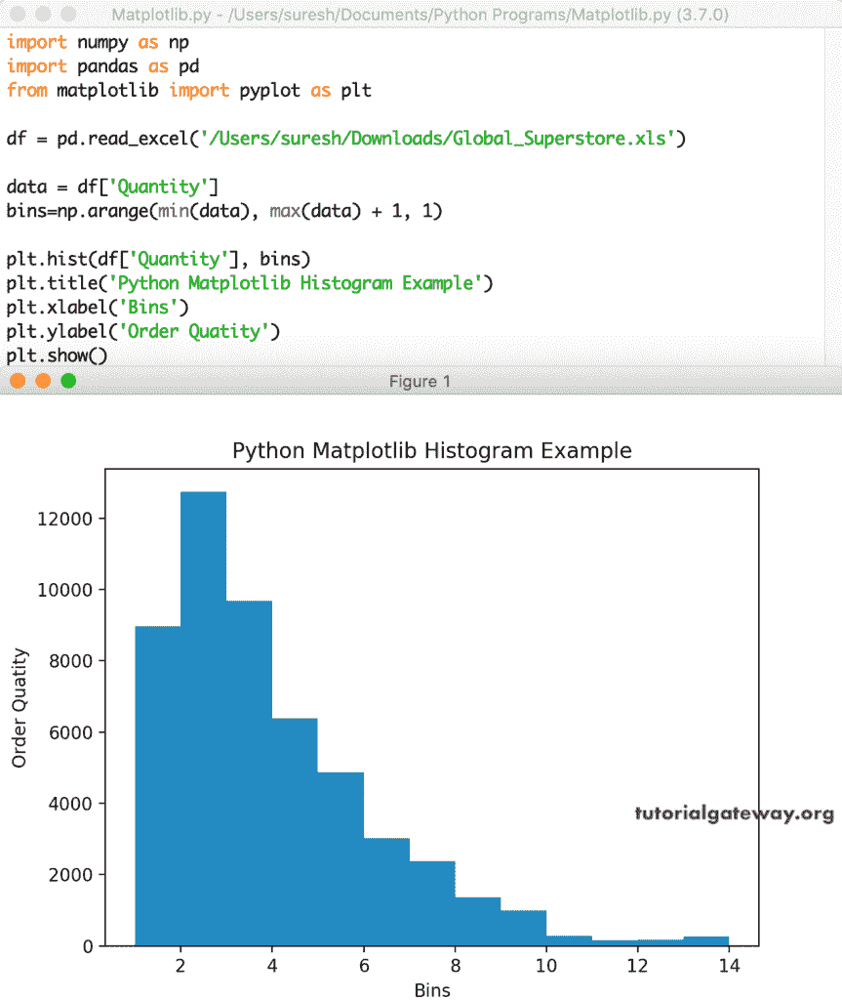

### 设置标签格式

在本例中，我们正在格式化 X 和 Y 标签、X 和 Y 刻度的字体大小和颜色。如果您注意到下面的代码，我们正在使用其细分等于消费者的数据。

```py
import numpy as np
import pandas as pd
from matplotlib import pyplot as plt

df = pd.read_excel('/Users/suresh/Downloads/Global_Superstore.xls')

x = df['Segment'] == 'Consumer'
df.where(x, inplace = True)
print(df)

data = df['Quantity']
bins=np.arange(min(data), max(data) + 1, 1)

print(df['Quantity'].count())
plt.hist(df['Quantity'], bins)

plt.title('Matplotlib Histogram Example')
plt.xlabel('Bins', fontsize = 15, color = 'b')
plt.ylabel('Order Quatity', fontsize = 15, color = 'b')
plt.xticks(fontsize = 12)
plt.yticks(fontsize = 12)

plt.show()
```

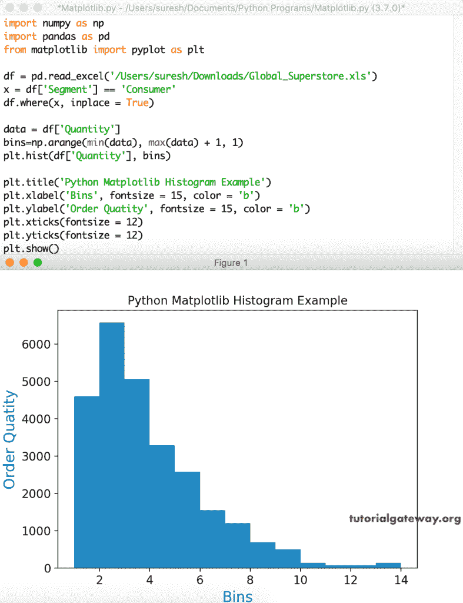

### Python 中的多个直方图

在这个例子中，我们试图使用 matplotlib 库绘制多个直方图。

```py
import numpy as np
import pandas as pd
from matplotlib import pyplot as plt

df = pd.read_excel('/Users/suresh/Downloads/Global_Superstore.xls')

data = df['Quantity']
bins = np.arange(min(data), max(data) + 1, 1)

x = df.loc[df['Segment'] == 'Consumer']
y = df.loc[df['Segment'] == 'Corporate']
z = df.loc[df['Segment'] == 'Home Office']

plt.hist(x['Quantity'], bins)
plt.hist(y['Quantity'], bins)
plt.hist(z['Quantity'], bins)

plt.show()
```

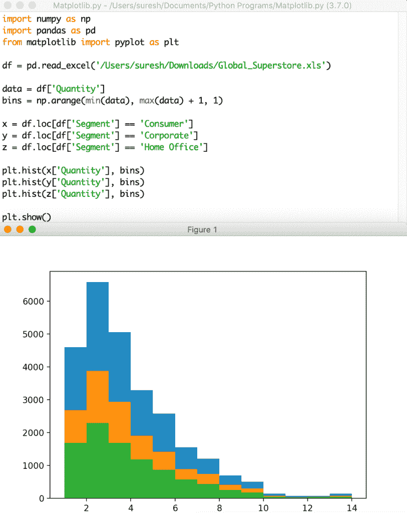

### 控制 pyplot 直方图面元大小

这是我们上面展示的同一个例子。但是，这一次，我们将容器的大小更改为静态值 5。这意味着整个数量数据分布在五个箱中。

```py
import numpy as np
import pandas as pd
from matplotlib import pyplot as plt

df = pd.read_excel('/Users/suresh/Downloads/Global_Superstore.xls')

data = df['Quantity']
bins = 5

x = df.loc[df.Segment == 'Consumer', 'Quantity']
y = df.loc[df.Segment == 'Corporate', 'Quantity']
z = df.loc[df.Segment == 'Home Office', 'Quantity']

plt.hist(x,bins)
plt.hist(y, bins)
plt.hist(z, bins)

plt.show()
```

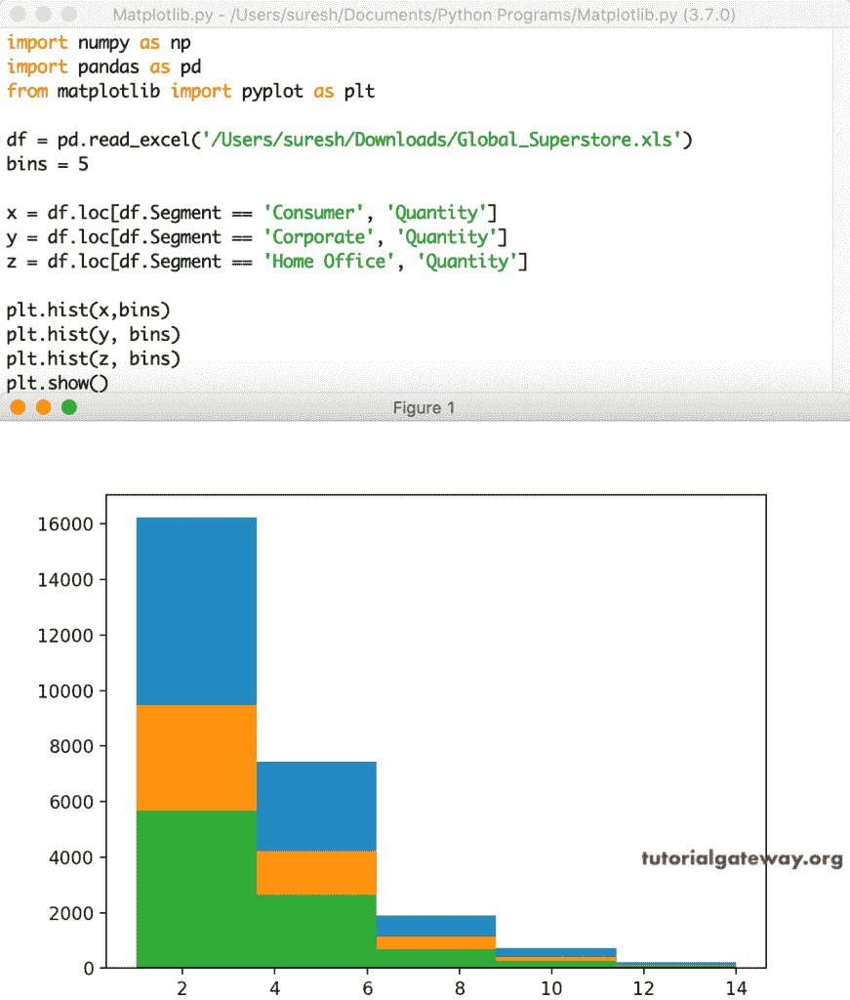

正如你所注意到的，两者是有区别的。这是因为它们在垃圾箱里的变化。

### Matplotlib 直方图图例

使用多个值时，有必要确定哪个值属于哪个类别。否则，用户会感到困惑。要解决这些问题，您必须使用 pyplot 图例功能启用图例。接下来，使用 Python `hist()`函数的标签参数为每个标签添加标签。

```py
import numpy as np
import pandas as pd
from matplotlib import pyplot as plt

df = pd.read_excel('/Users/suresh/Downloads/Global_Superstore.xls')

data = df['Quantity']
bins = np.arange(min(data), max(data) + 1, 1)

x = df.loc[df['Segment'] == 'Consumer']
y = df.loc[df['Segment'] == 'Corporate']
z = df.loc[df['Segment'] == 'Home Office']

plt.hist(x['Quantity'], bins, label = 'Consumer')
plt.hist(y['Quantity'], bins, label = 'Corporate')
plt.hist(z['Quantity'], bins, label = 'Home Office')

plt.legend()
plt.show()
```

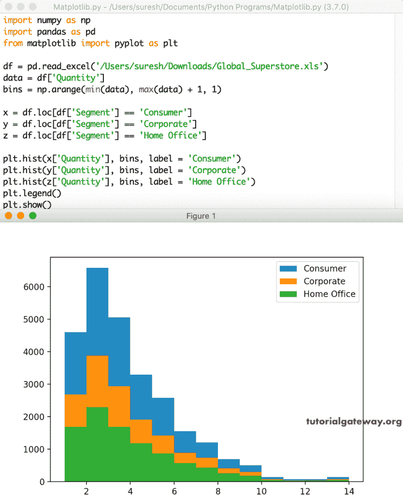

### 格式化 Matplotlib 直方图颜色

无论是一个还是多个，Matplotlib 都会自动为直方图分配默认颜色。但是，您可以使用 pyplot`hist()`函数的 color 参数来更改颜色。在本例中，我们将栗色分配给第一个，蓝色分配给第二个，绿色分配给第三个。

```py
df = pd.read_excel('/Users/suresh/Downloads/Global_Superstore.xls')

data = df['Quantity']
bins = np.arange(min(data), max(data) + 1, 1)

x = df.loc[df['Segment'] == 'Consumer']
y = df.loc[df['Segment'] == 'Corporate']
z = df.loc[df['Segment'] == 'Home Office']

plt.hist(x['Quantity'], bins, label = 'Consumer', color = 'maroon')
plt.hist(y['Quantity'], bins, label = 'Corporate', color = 'blue')
plt.hist(z['Quantity'], bins, label = 'Home Office', color = 'green')

plt.legend()
plt.show()
```

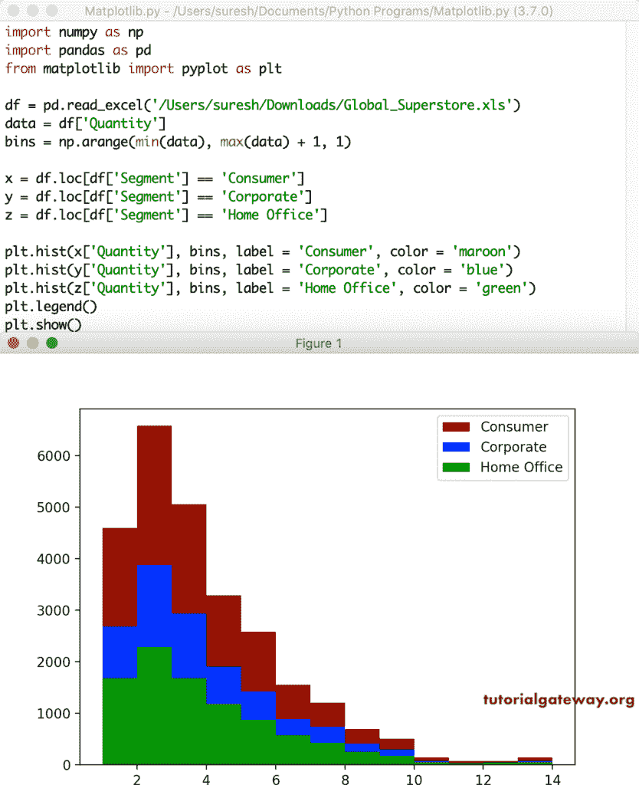

同样，您可以使用 alpha 和 edgecolor 参数更改边缘颜色和不透明度。

```py
df = pd.read_excel('/Users/suresh/Downloads/Global_Superstore.xls'

data = df['Quantity']
bins=np.arange(min(data), max(data) + 1, 1)

plt.hist(df['Quantity'], bins, color = 'red', alpha = 0.8, 
         edgecolor = 'g')

plt.title('Matplotlib Histogram Example')
plt.xlabel('Bins', fontsize = 15, color = 'b')
plt.ylabel('Order Quatity', fontsize = 15, color = 'b')
plt.xticks(fontsize = 12)
plt.yticks(fontsize = 12)

plt.show()
```

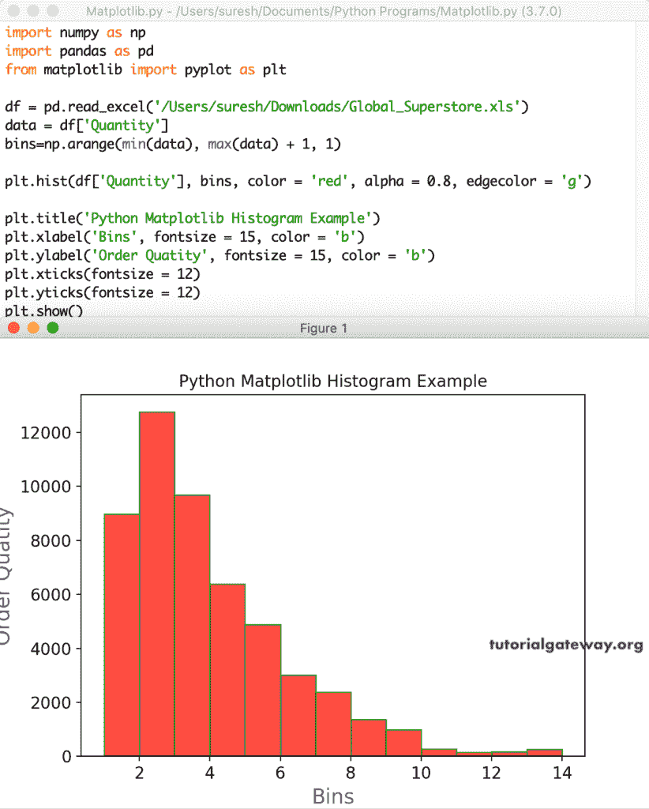

## Matplotlib 水平直方图

pyplot`hist()`函数有一个带有两个选项的方向参数，它们是水平的和垂直的(默认)。如果使用这个方向参数作为水平方向，那么 hist 将被水平绘制。

```py
import numpy as np
import pandas as pd
from matplotlib import pyplot as plt

df = pd.read_excel('/Users/suresh/Downloads/Global_Superstore.xls')

data = df['Quantity']
bins=np.arange(min(data), max(data) + 1, 1)

plt.hist(df['Quantity'], bins, color = 'red',
         alpha = 0.8, orientation = 'horizontal')

plt.title('Matplotlib Horizontal Histogram Example')
plt.show()
```

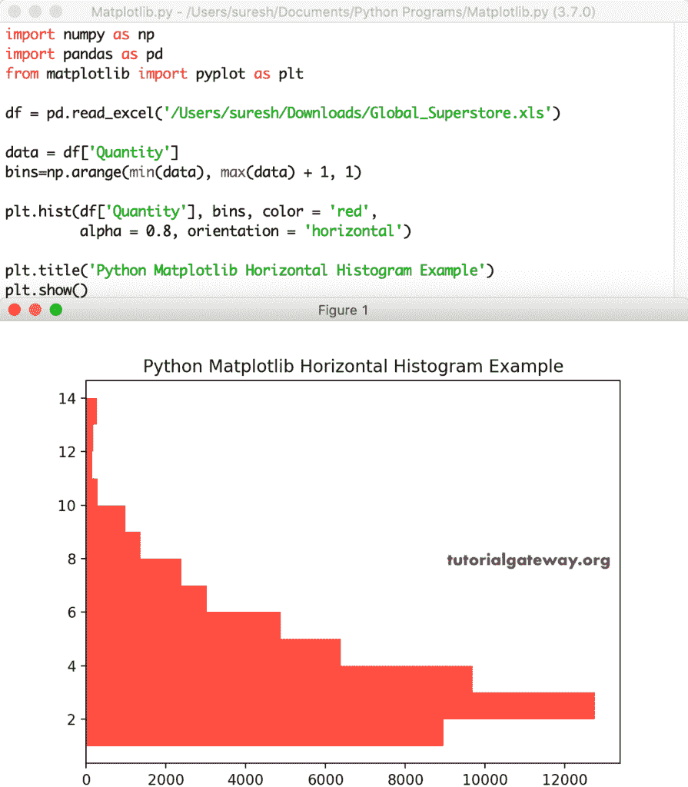

### matplotlib histogram hosttype

pyplot 直方图有一个 histtype 参数，用于将类型从一种类型更改为另一种类型。matplotlib 中有四种类型的 hists，它们是

*   酒吧:这是传统的酒吧类型。如果将多个数据和 histtype 一起用作条形图，那么这些值将并排排列。
*   条形图堆叠:当您使用多个数据时，这些值相互堆叠。
*   第二步:不填满酒吧。类似折线图或瀑布图的东西。
*   stepfilled:同上，但空白空间用默认颜色填充。

```py
df = pd.read_excel('/Users/suresh/Downloads/Global_Superstore.xls')

data = df['Quantity']
bins=np.arange(min(data), max(data) + 1, 1)

fix, (ax1, ax2, ax3) = plt.subplots(1, 3, figsize = (8, 4))

x = df.loc[df['Segment'] == 'Consumer']
y = df.loc[df['Segment'] == 'Corporate']
z = df.loc[df['Segment'] == 'Home Office']

ax1.hist(x['Quantity'], bins, histtype = 'bar',
         color = 'red', alpha = 0.8, edgecolor = 'g')
ax2.hist(y['Quantity'], bins, color = 'blue', histtype = 'step')
ax3.hist(z['Quantity'], bins, color = 'green',  histtype = 'stepfilled')

plt.show()
```

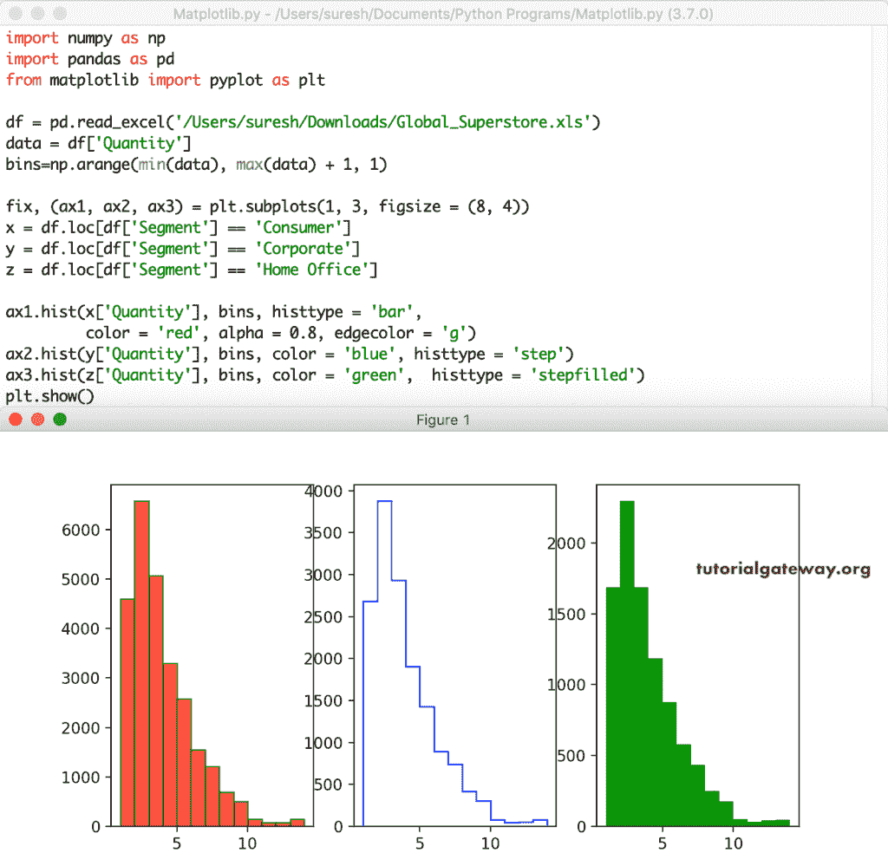

### matplotlib 累积直方图

日志参数值接受布尔值，其默认值为 False。如果设置为真，Matplotlib 轴将设置为对数刻度。除了日志之外，还有一个名为累积的参数，它有助于在 Python 中显示累积直方图。

```py
import numpy as np
import pandas as pd
from matplotlib import pyplot as plt

df = pd.read_excel('/Users/suresh/Downloads/Global_Superstore.xls')

data = df['Quantity']
bins=np.arange(min(data), max(data) + 1, 1)

plt.hist(df['Quantity'], bins, color = 'red', alpha = 0.8,
         cumulative = True, log = True)

plt.title('Matplotlib Horizontal Histogram Example')

plt.show()
```

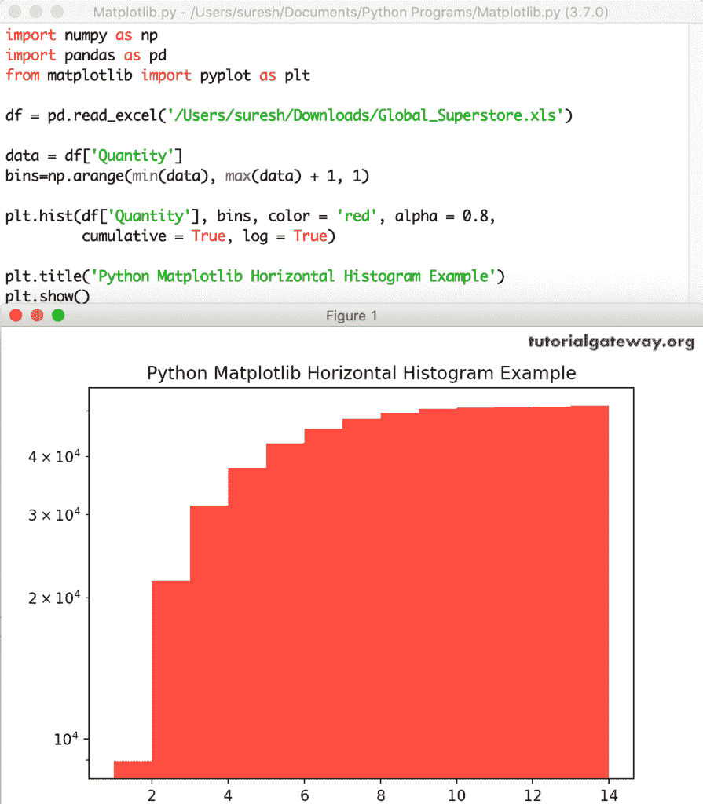

### Python 皮直方图

在 Python 中，我们有一个 seaborn 模块，它有助于绘制历史图和密度曲线。它非常简单明了。

```py
import matplotlib.pyplot as plt
import numpy as np
import seaborn as sns

x = np.random.randn(1000)
print(x)

sns.distplot(x)

plt.show()
```

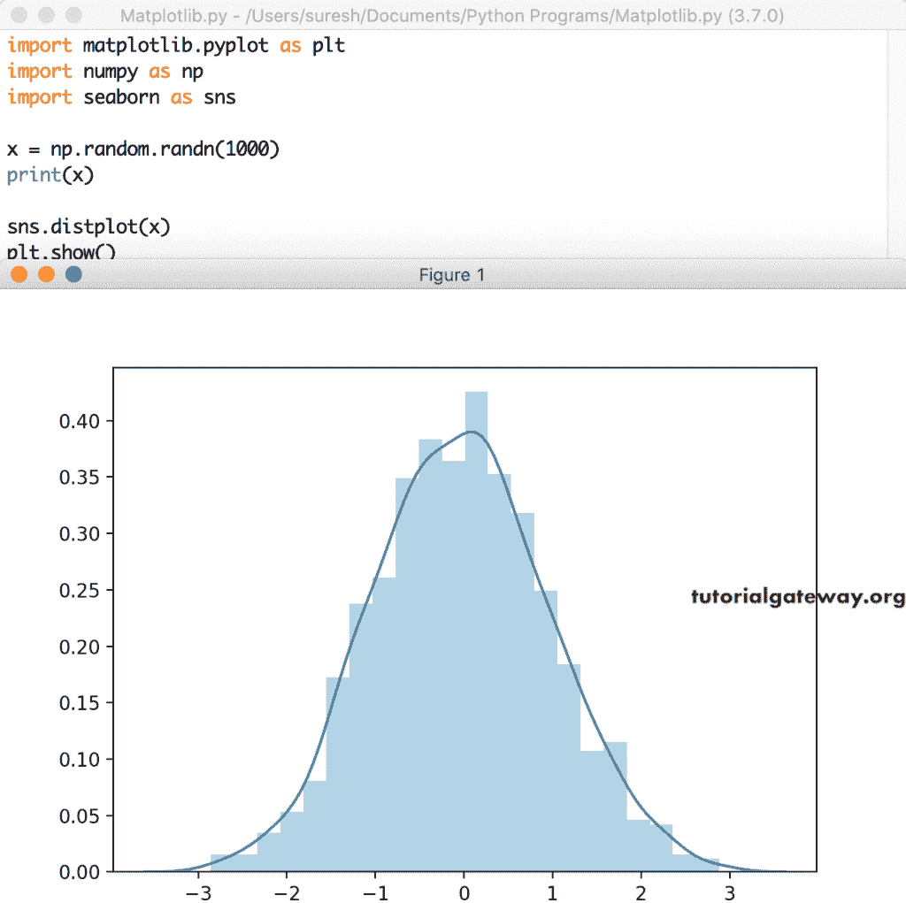

## Matplotlib 2d Histogram

Python pyplot 有一个`hist2d()`函数来绘制二维或 2d。要绘制 matplotlib 2D hist，您需要两个数字数组或类似数组的值。

```py
import matplotlib.pyplot as plt
import numpy as np

x = np.random.randn(100)
print(x)

y = 2 * np.random.randn(100)
print(y)

plt.hist2d(x, y)

plt.show()
```

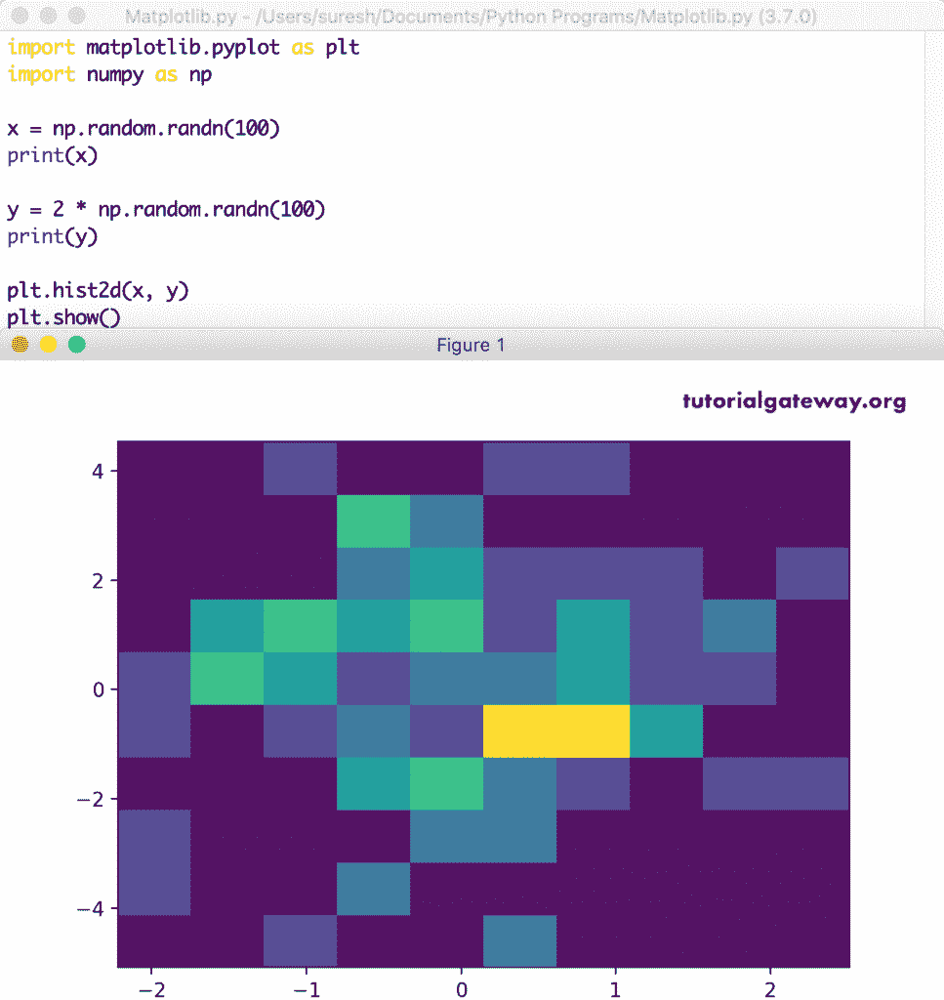

在这个例子中，我们使用了两个支线剧情并改变了大小。

```py
import matplotlib.pyplot as plt
import numpy as np

x = np.random.randn(100)
print(x)

y = 2 * np.random.randn(100)
print(y)

fig, (ax1, ax2) = plt.subplots(1, 2)

ax1.hist2d(x, y, bins = 5)

ax2.hist2d(x, y, bins = 10)
plt.show()
```

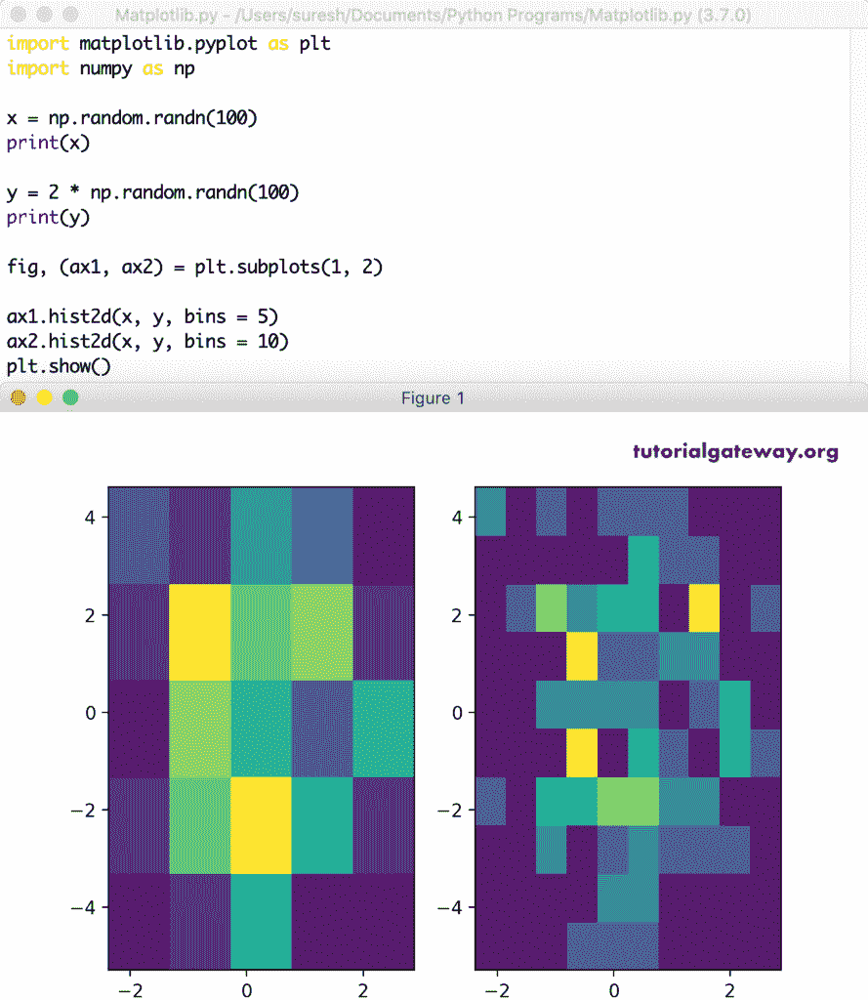

这是 Matplotlib 2D 直方图的另一个例子。

```py
x = np.random.randn(10000)
print(x)

y = 2 * np.random.randn(10000)
print(y)

fig, (ax1, ax2) = plt.subplots(1, 2)

ax1.hist2d(x, y, bins = (10, 10))

ax2.hist2d(x, y, bins = (200, 200))
plt.show()
```

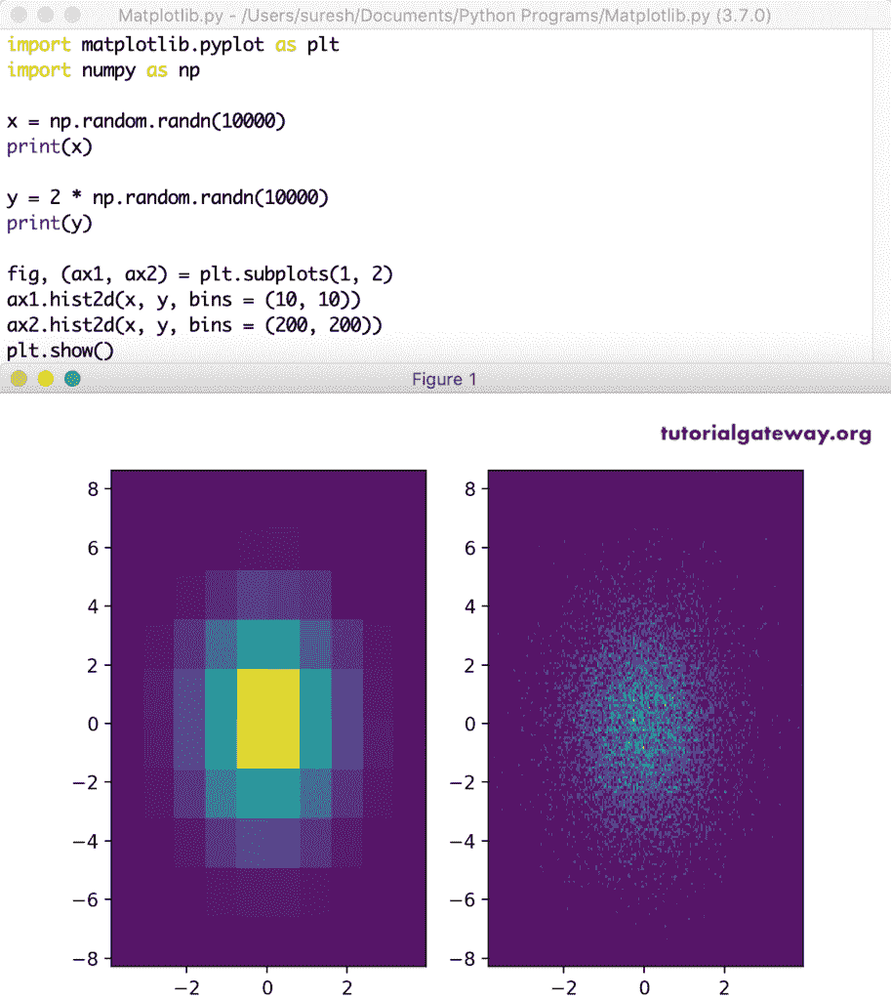

让我使用 cmap 参数更改 Python 直方图的颜色。

```py
x = np.random.randn(10000)
print(x)

y = 2 * np.random.randn(10000)
print(y)

fig, (ax1, ax2) = plt.subplots(1, 2)

ax1.hist2d(x, y, bins = (10, 10), cmap = 'cubehelix')

ax2.hist2d(x, y, bins = (200, 200), cmap = 'rainbow')
plt.show()
```

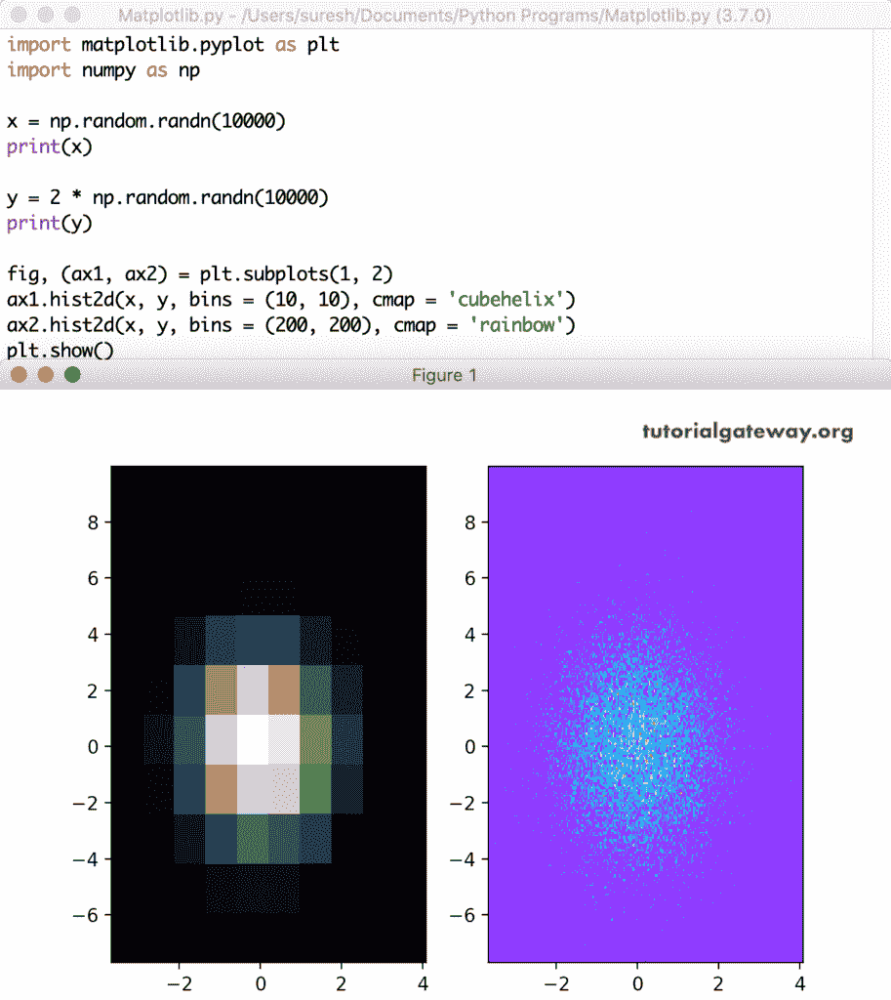

## 图像的 Matplotlib 直方图

除了上面指定的，您可以使用 Matplotlib 直方图来分析图像中的颜色。在这个例子中，我们使用显示图像中的 RGB 颜色。

```py
import cv2
from matplotlib import pyplot as plt

img = cv2.imread('/Users/suresh/Downloads/IMG_2065.JPG', 0)

plt.hist(img.ravel(), bins = 256, range = [0, 256])
plt.show()
```

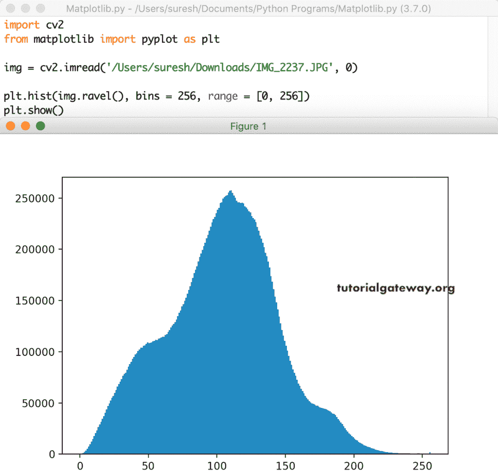