# Python Matplotlib 饼图

> 原文：<https://www.tutorialgateway.org/python-matplotlib-pie-chart/>

Python matplotlib 饼图以切片或楔形显示一系列数据，每个切片都是一个项目的大小。为了在 Python 中绘制 matplotlib 饼图，必须使用 pyplot 饼图函数。这个 Python matplotlib`pie()`函数的语法是

```
matplotlib.pyplot.pie(x, labels = None)
```

除了上面的内容，还有很多参数可以用来设计 Python matplotlib 饼图的样式。在这一章中，我们用一个实例来介绍 matplotlib`pie()`函数的大部分参数。

## Python matplotlib 饼图示例

在这个 Python 饼图示例中，我们声明了两个列表 X 和 Y，其中 X 代表几种编程语言，Y 代表一些随机值。接下来，我们使用 matplotlib 饼图函数绘制图表。

```
from matplotlib import pyplot as plt

x = [22, 9, 40, 27, 55]
y = ['C', 'C++', 'Java', 'Python', 'JavaScript']

plt.pie(x, labels = y)
plt.show()
```

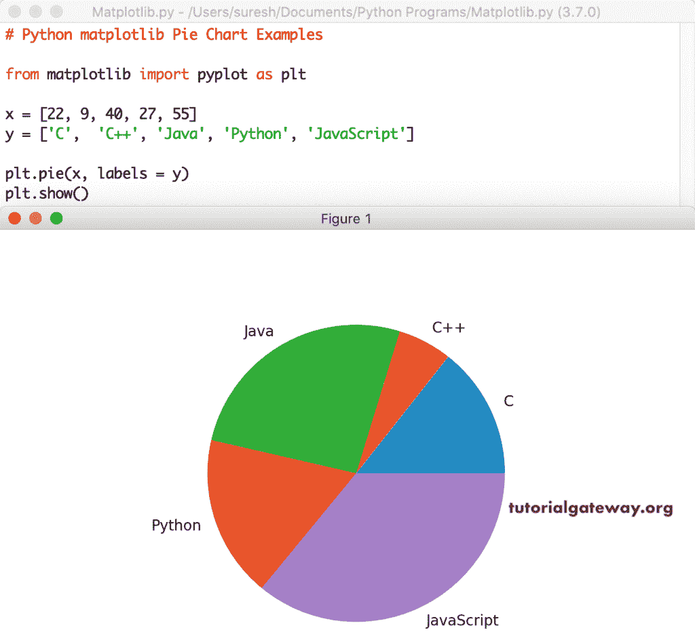

这是一个使用 CSV 文件的 Python 饼图示例。在这里，我们使用全球销售数据，并绘制图表，表示按订单优先级的销售。

```
import pandas as pd
from matplotlib import pyplot as plt

df = pd.read_excel('/Users/suresh/Downloads/Global_Superstore.xls')

sales_data = df.groupby('Order Priority')[['Sales']].sum()
print(sales_data)

plt.pie(sales_data['Sales'], labels = sales_data.index)

plt.show()
```

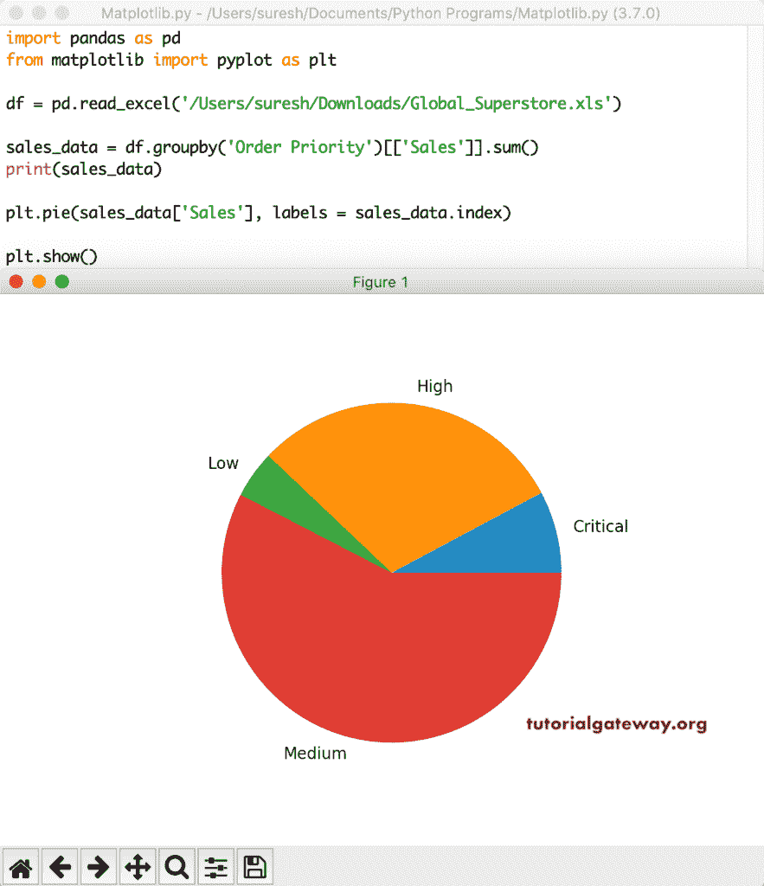

### Python 饼图标题

Python pyplot 有一个标题方法，有助于为饼图分配标题或标题。在这里，我们给这个 matplotlib 饼图分配了一个新标题，并格式化了标题的字体样式、颜色和粗细。

```
import pandas as pd
from matplotlib import pyplot as plt

df = pd.read_excel('/Users/suresh/Downloads/Global_Superstore.xls')

sales_data = df.groupby('Order Priority')[['Sales']].sum()

plt.pie(sales_data['Sales'], labels = sales_data.index)

plt.title("Sales Percentage by Order Priority",
     color = 'blue', fontweight = 'bold', fontsize = '20')

plt.show()
```

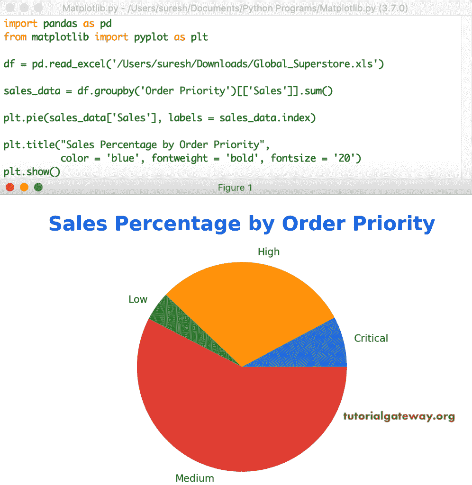

### 更改 matplotlib 饼图颜色

默认情况下，Python 饼图函数使用当前周期中的活动颜色绘制图表。但是，您可以使用 [Python](https://www.tutorialgateway.org/python-tutorial/) colors 参数为每个楔形指定您自己的颜色。例如，在这里，我们为这四个馅饼分配青色、绿色、黄色和栗色。

```
import pandas as pd
from matplotlib import pyplot as plt

df = pd.read_excel('/Users/suresh/Downloads/Global_Superstore.xls')

sales_data = df.groupby('Order Priority')[['Sales']].sum()
print(sales_data)

colors_list = ['cyan', 'green', 'yellow', 'Maroon']

plt.pie(sales_data['Sales'], labels = sales_data.index, colors = colors_list)

plt.show()
```

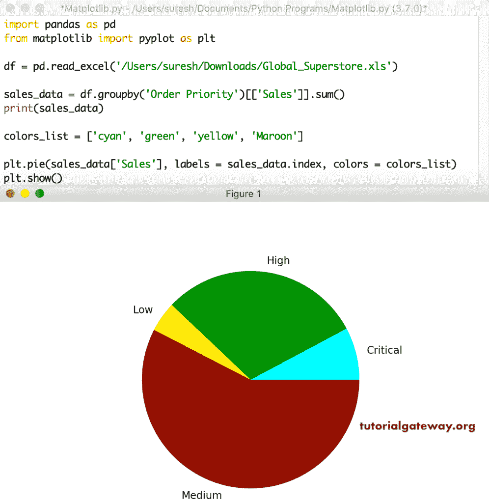

### matplotlib 饼图百分比

autopct 参数显示 matplotlib 饼图中每个切片的百分比。在这里，您可以使用字符串格式来改变百分比值的显示。例如，%1.2f%%返回值 25.34%，. 1f%返回值 25.3%。

```
import pandas as pd
from matplotlib import pyplot as plt

df = pd.read_excel('/Users/suresh/Downloads/Global_Superstore.xls')

sales_data = df.groupby('Order Priority')[['Sales']].sum()

colors_list = ['cyan', 'yellowgreen', 'orange', 'Maroon']

plt.pie(sales_data['Sales'], labels = sales_data.index,
    autopct = '%1.1f%%', colors = colors_list)

plt.show()
```

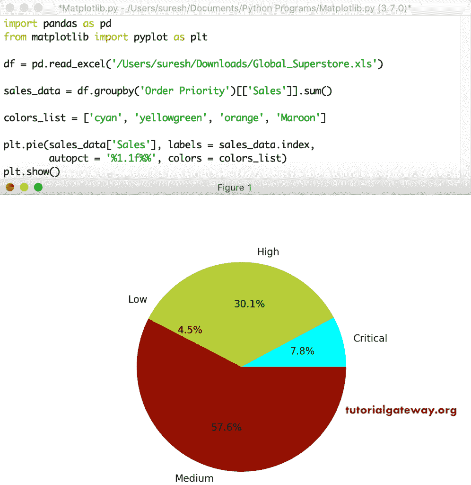

### matplotlib 饼图切片

pyplot 饼图中的 explot 参数决定哪个部分应该爆炸(从中心分开并移动一段距离)。此参数接受一组数值，每个非零值代表该切片与中心的距离。在这个 Python 饼图示例中，我们从中心开始分解中等优先级。

```
import pandas as pd
from matplotlib import pyplot as plt

df = pd.read_excel('/Users/suresh/Downloads/Global_Superstore.xls')

sales_data = df.groupby('Order Priority')[['Sales']].sum()

colors_list = ['cyan', 'yellowgreen', 'orange', 'Maroon']

explode_val = (0, 0, 0, 0.1)

plt.pie(sales_data['Sales'], labels = sales_data.index,
    autopct = '%1.1f%%', explode = explode_val, colors = colors_list)

plt.show()
```

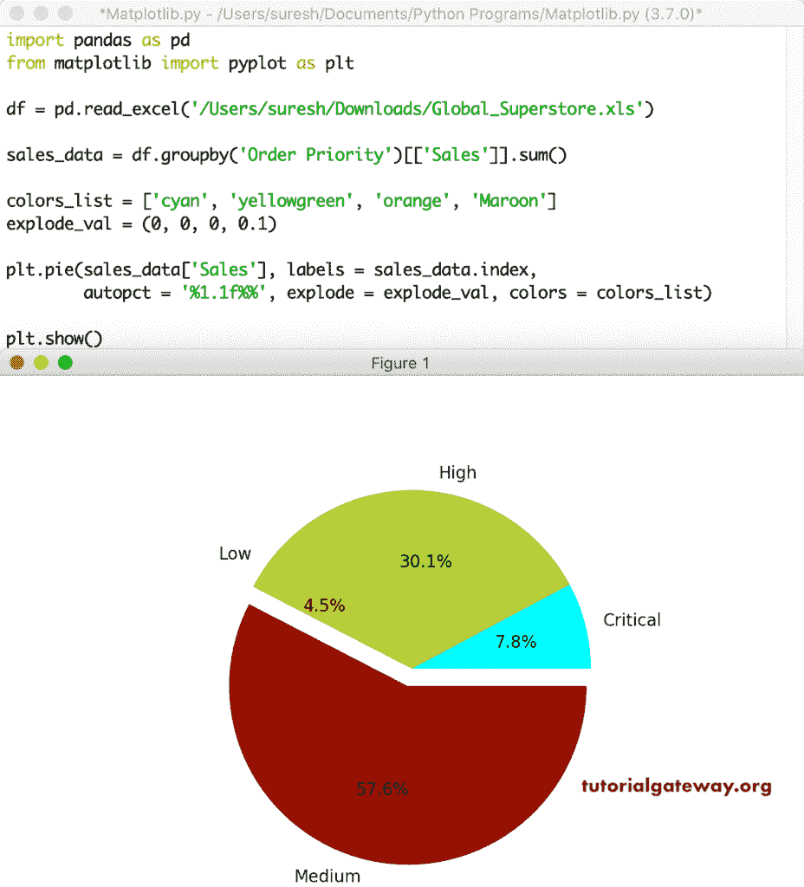

这是饼图爆炸的另一个例子。这里，我们正在爆炸多个楔形或切片。这可能看起来很奇怪，但你明白了。

```
import pandas as pd
from matplotlib import pyplot as plt

df = pd.read_excel('/Users/suresh/Downloads/Global_Superstore.xls')

sales_data = df.groupby('Order Priority')[['Sales']].sum()

colors_list = ['cyan', 'yellowgreen', 'orange', 'Maroon']

explode_val = (0, 0.4, 0, 0.1)

plt.pie(sales_data['Sales'], labels = sales_data.index,
    autopct = '%1.1f%%', explode = explode_val, colors = colors_list)

plt.show()
```

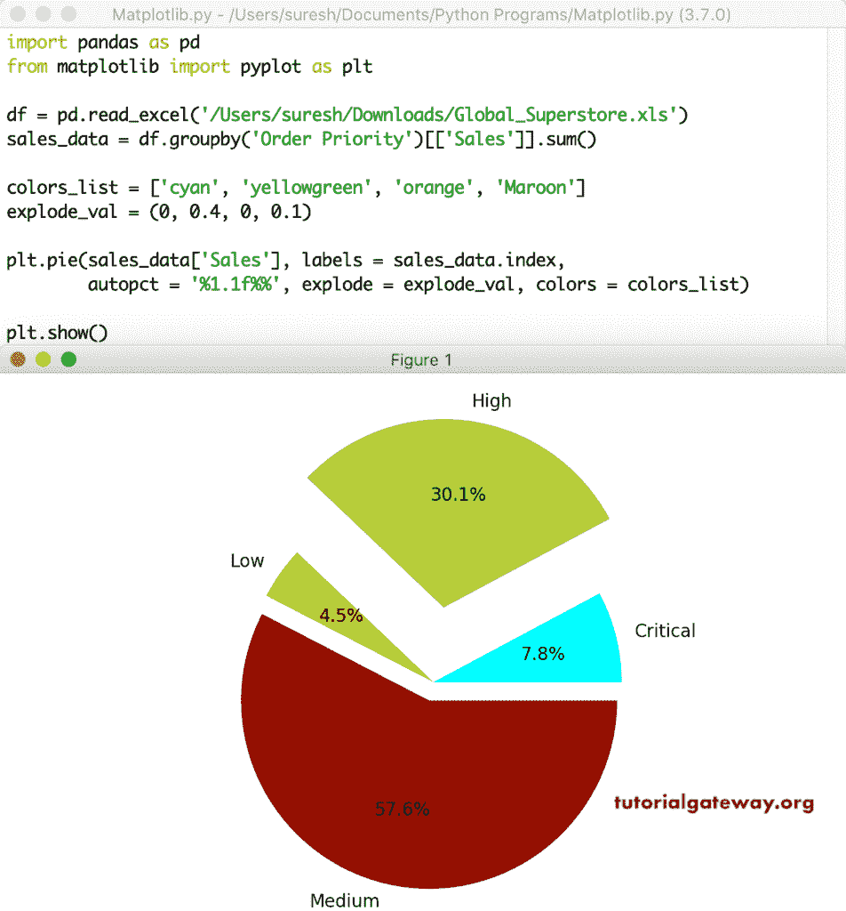

### 旋转 Python 饼图

饼图函数中的 startangle 参数允许选择图表的起始位置。这意味着您可以根据您提供的角度旋转饼图。在本例中，我们使用 90 度，因此图表开始位置将从 90 度开始。接下来，我们使用了 shadow 参数，并为它分配了 True 值(默认情况下，它是 false)。这意味着 matplotlib 将在图表下面画一个阴影。

还有一个参数叫做 counterclock，它的默认值是 True。这意味着饼图将逆时针绘制。但是，您可以通过将 False 赋给此参数 counterclock = False 来更改这一点。

```
import pandas as pd
from matplotlib import pyplot as plt

df = pd.read_excel('/Users/suresh/Downloads/Global_Superstore.xls')

sales_data = df.groupby('Order Priority')[['Sales']].sum()

colors_list = ['cyan', 'yellowgreen', 'orange', 'Maroon']

explode_val = (0, 0.4, 0, 0)

plt.pie(sales_data['Sales'], labels = sales_data.index,
    autopct = '%1.1f%%', explode = explode_val,
    colors = colors_list,
    shadow = True,
    startangle = 90,
    counterclock = False)

plt.show()
```

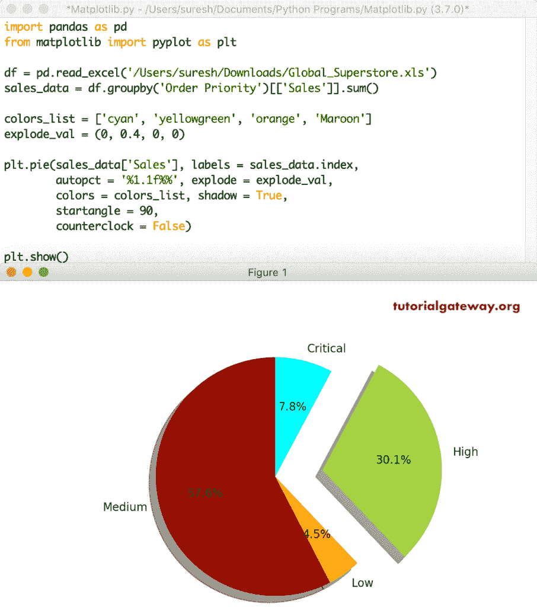

### 设置标签格式

rotatelabels 参数接受布尔值，其默认值为 False。如果指定“真”，饼图中的每个标签将旋转到相应的切片角度。接下来，labeldistance 参数接受浮点值。在这里，您可以指定标签到实际图表或切片的距离。在本例中，我们将 1.2 指定为距离，您可以在输出中注意到这一点。

```
import pandas as pd
from matplotlib import pyplot as plt

df = pd.read_excel('/Users/suresh/Downloads/Global_Superstore.xls')

sales_data = df.groupby('Order Priority')[['Sales']].sum()

colors_list = ['cyan', 'yellowgreen', 'orange', 'Maroon']

plt.pie(sales_data['Sales'], labels = sales_data.index,
    autopct = '%1.1f%%',
    colors = colors_list,
    labeldistance = 1.2,
    rotatelabels = True )

plt.show()
```

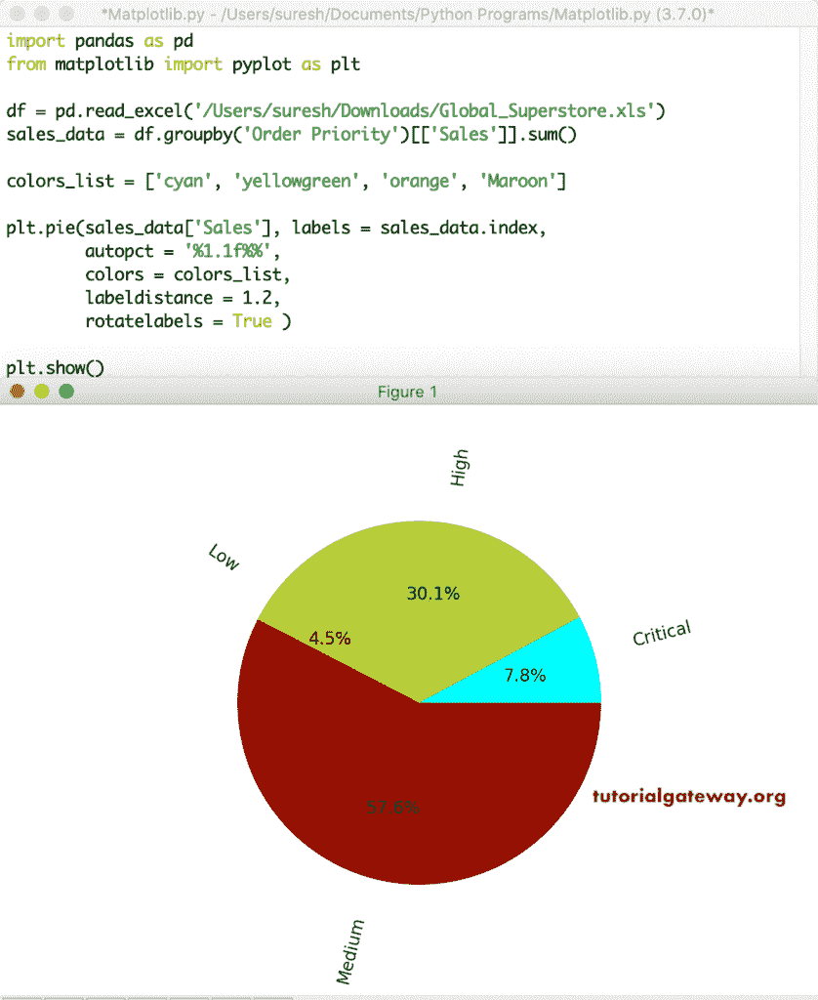

wedgeprops 参数是一个可选参数，它接受字典值，默认值为无。但是，您可以使用此参数来更改 Python 饼图的楔形或切片属性。接下来，框架参数将图表放在框架或坐标轴内。

```
import pandas as pd
from matplotlib import pyplot as plt

df = pd.read_excel('/Users/suresh/Downloads/Global_Superstore.xls')

sales_data = df.groupby('Order Priority')[['Sales']].sum()

colors_list = ['cyan', 'yellowgreen', 'orange', 'Maroon']

fg, ax = plt.subplots()

ax.pie(sales_data['Sales'], labels = sales_data.index,
    autopct = '%1.1f%%',
    colors = colors_list,
    frame = True,
    wedgeprops = {'linewidth' : 4,
           'edgecolor' :'blue'}
    )

ax.axis('equal')
plt.show()
```

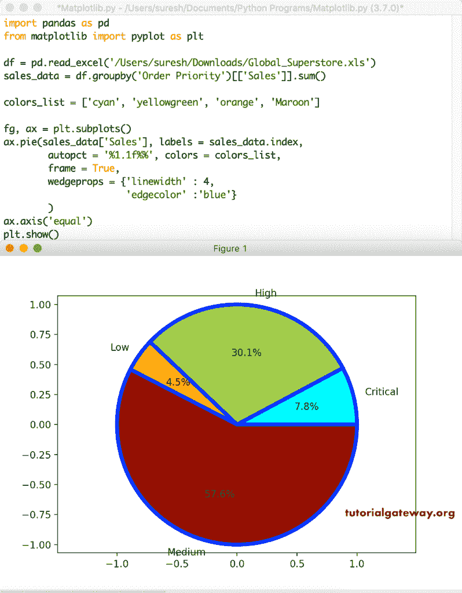

### matplotlib pie chart legend(图形式图例)

图例功能允许以图例形式提供标签。在函数中，使用 loc 参数将图例放置在所需位置。在这个 Python matplotlib 饼图示例中，我们将其放在右上角。

```
import pandas as pd
from matplotlib import pyplot as plt

df = pd.read_excel('/Users/suresh/Downloads/Global_Superstore.xls')

sales_data = df.groupby('Order Priority')[['Sales']].sum()

colors_list = ['cyan', 'yellowgreen', 'orange', 'Maroon']

fg, ax = plt.subplots()

ax.pie(sales_data['Sales'],
    autopct = '%1.1f%%',
    colors = colors_list,
    frame = True
    )

ax.legend(sales_data.index, loc = 'upper right')

ax.axis('equal')
plt.show()
```

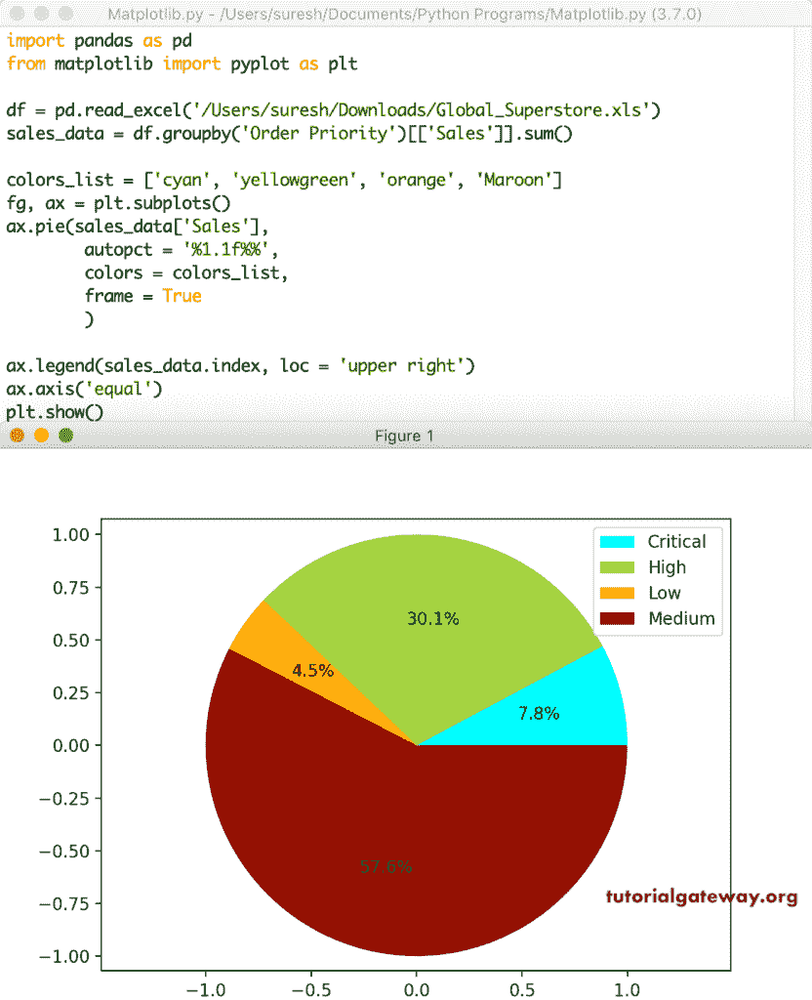

在前面的例子中，我们忘了提到 ax . axis(‘equal’)。它将确保 Python pyplot 饼图是圆形的。有时候，你的图表可能看起来是椭圆形的，可以克服你使用这个的问题。

```
import pandas as pd
from matplotlib import pyplot as plt

df = pd.read_excel('/Users/suresh/Downloads/Global_Superstore.xls')

sales_data = df.groupby('Order Priority')[['Sales']].sum()

colors_list = ['cyan', 'yellowgreen', 'orange', 'Maroon']

explode_val = (0, 0.4, 0, 0.1)

fg, ax = plt.subplots()

ax.pie(sales_data['Sales'],
    autopct = '%1.2f%%',
    explode = explode_val,
    colors = colors_list,
    frame = True,
    shadow = True,
    startangle = 90,
    counterclock = False,
    wedgeprops = {'linewidth' : 4,
           'edgecolor' :'blue'}
    )
ax.legend(sales_data.index, loc = 'upper left')
ax.axis('equal')

plt.title("Sales Percentage by Order Priority",
     color = 'green', fontweight = 'bold', fontsize = '20')
plt.show()
```

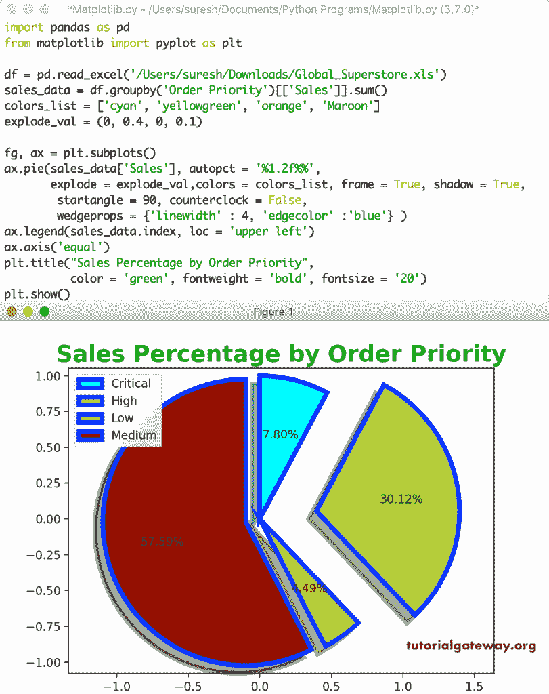