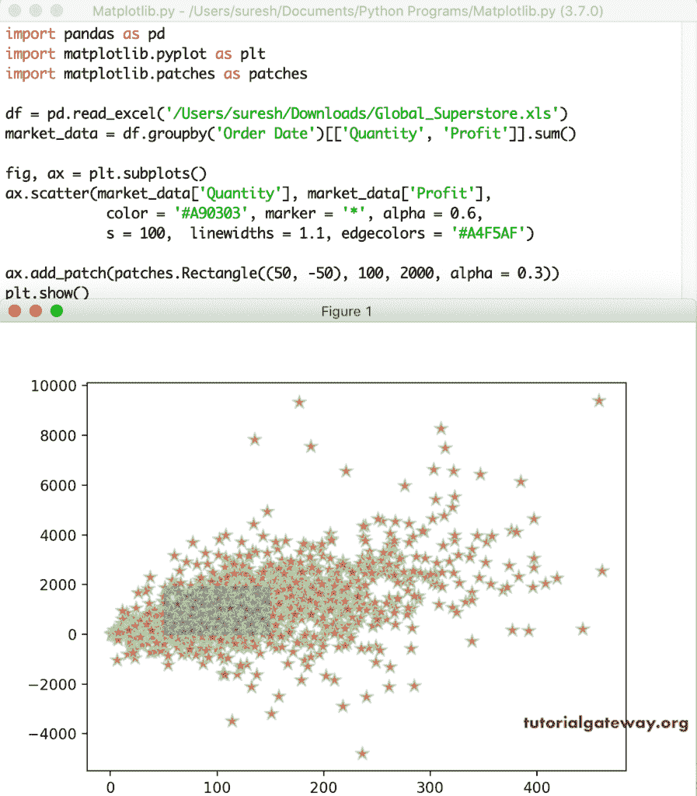
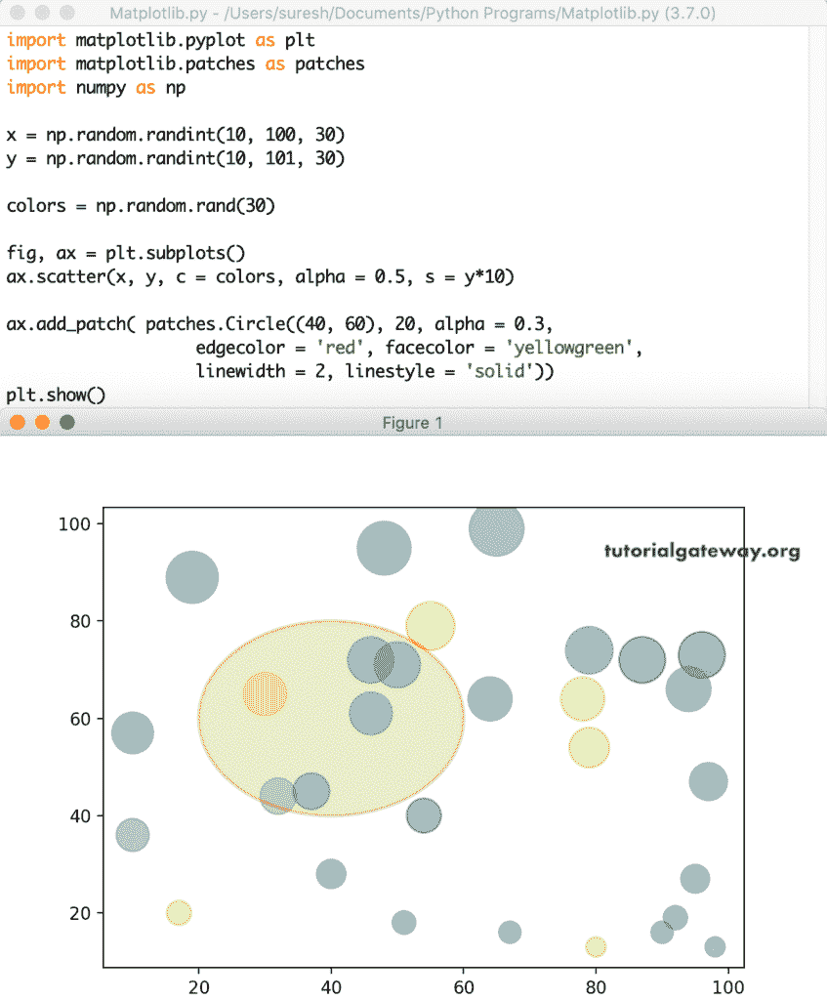

# Python matplotlib Scatter Plot

> 原文：<https://www.tutorialgateway.org/python-matplotlib-scatter-plot/>

Python matplotlib 散点图是数据的二维图形表示。Python 散点图对于显示两个数值数据值或两组数据之间的相关性非常有用。一般来说，我们使用这个 Python matplotlib 散点图，通过绘制回归线来分析两个数值数据点之间的关系。

matplotlib pyplot 模块有一个散点图功能，它会在 Python 中绘制或生成散点图。绘制 matplotlib pyplot 散点图的基本语法是

```
matplotlib.pyplot.scatter(x, y)
```

*   X:表示 X 轴的参数列表。
*   Y:参数列表代表 Y 轴。

## Python matplotlib 散点图示例

这是一个简单的 python 散点图示例，其中我们声明了两个随机数值列表。接下来，我们使用 pyplot 函数绘制 x 对 y 的散点图。

```
import matplotlib.pyplot as plt

x = [1, 9, 5, 3, 8, 6, 2, 4, 7]

y = [22, 4, 40, 27, 33, 15, 5, 20, 30]

plt.scatter(x, y)
plt.show()
```


这里，我们使用 [Python](https://www.tutorialgateway.org/python-tutorial/) randint 函数为 x 和 y 生成 50 个[随机](https://www.tutorialgateway.org/python-random-array/)整数值，从 5 到 50，从 100 到 1000。接下来，我们绘制 Python 散点图。

```
import matplotlib.pyplot as plt
import numpy as np

x = np.random.randint(5, 50, 50)

y = np.random.randint(100, 1000, 50)

print(x)
print(y)

plt.scatter(x, y)

plt.show()
```


### 使用 CSV 绘制散点图

在这个例子中，我们正在读取 CSV 文件，并将其转换为[数据框](https://www.tutorialgateway.org/python-pandas-dataframe/)。接下来，我们使用 X 轴的利润和 Y 轴的销售额绘制 Python matplotlib 散点图。

```
import pandas as pd
from matplotlib import pyplot as plt

df = pd.read_excel('/Users/suresh/Downloads/Global_Superstore.xls')

sales_data = df.groupby('Order Date')[['Sales', 'Profit']].sum()

print(sales_data.sort_values(by = ['Profit']))

plt.scatter(sales_data['Profit'], sales_data['Sales'])

plt.show()
```


### 标题

我们在之前的图表中已经提到过关于图表的标注。在这个 Python matplotlib 散点图示例中，我们使用了 xlable、ylabel 和 title 函数来显示 X 轴、Y 轴标签和图表标题。

```
import pandas as pd
from matplotlib import pyplot as plt

df = pd.read_excel('/Users/suresh/Downloads/Global_Superstore.xls')

sales_data = df.groupby('Order Date')[['Sales', 'Profit']].sum()

print(sales_data.sort_values(by = ['Profit']))

plt.scatter(sales_data['Profit'], sales_data['Sales'])

plt.title('Matplotlib Scatter Plot')
plt.xlabel('Profit')
plt.ylabel('Global Sales')
plt.show()
```


### Python 散点图颜色和标记

在我们前面的所有示例中，您可以看到默认的蓝色。但是，您可以使用颜色参数更改标记颜色，使用 alpha 参数更改不透明度。在这个 Python 散点图示例中，我们将标记颜色更改为红色，不透明度更改为 0.3 (bit lite)。

除此之外，您可以使用 markers 参数来更改默认的标记形状。这里，我们将标记的形状更改为*。我建议你参考 matplotlib 文章来了解可用标记的列表。

```
import pandas as pd
from matplotlib import pyplot as plt

df = pd.read_excel('/Users/suresh/Downloads/Global_Superstore.xls')

market_data = df.groupby('Order Date')[['Quantity', 'Profit']].sum()

plt.scatter(market_data['Quantity'], market_data['Profit'], 
            color = 'red',
            marker = '*', alpha = 0.3)

plt.title('Matplotlib Scatter Plot')
plt.show()
```


在这里，我们试图展示 Python 散点图中其他三种可用的标记。

```
import matplotlib.pyplot as plt
import numpy as np

x = np.random.randint(5, 50, 50)

y = np.random.randint(100, 1000, 50)

fix, (ax1, ax2, ax3) = plt.subplots(1, 3, figsize = (8, 4))

ax1.scatter(x, y, marker = '+', color = 'red')
ax2.scatter(x, y, marker = '^', color = 'blue')
ax3.scatter(x, y, marker = '$\clubsuit$', color = 'green',
            alpha = 0.5)

plt.show()
```


在前面的 Python 散点图示例中，我们对与轴值相关联的所有标记使用了单一颜色。但是，您可以使用颜色参数为每个标记使用多种颜色或单独的颜色。这里，我们定义了两个 Radom 整数数组和一个用于颜色的[随机数组](https://www.tutorialgateway.org/python-random-array/)。接下来，我们将该颜色数组分配给 c，以生成标记的随机颜色。

```
import matplotlib.pyplot as plt
import numpy as np

x = np.random.randint(10, 100, 30)

y = np.random.randint(100, 10000, 30)

colors = np.random.rand(30)

plt.scatter(x, y, c = colors, alpha = 0.5, s = y/10)

plt.show()
```


这是为标记指定不同颜色的另一种方式。除了上面的内容，您还可以使用 color 和 cmap 参数定义标记的渐变(例如 rainbow)。为此，首先，您必须将定义标记颜色的值列表指定为 c 参数。其次，您必须定义 cmap 颜色(您想要使用的渐变)，如下所述。

```
import pandas as pd
from matplotlib import pyplot as plt

df = pd.read_excel('/Users/suresh/Downloads/Global_Superstore.xls')

market_data = df.groupby('Order Date')[['Sales', 'Quantity', 'Profit']].sum()

plt.scatter(market_data['Quantity'], market_data['Profit'], 
            c = market_data['Quantity'],cmap = 'gist_rainbow_r',
            marker = '*')

plt.title('Matplotlib Scatter Plot')

plt.show()
```


### Python 散点图大小和边缘颜色

matplotlib 散点图函数有一个定义标记大小的 s 参数。它接受所有标记或类似数组的值的静态 1 值。这里，我们指定了 150 作为标记大小，这意味着所有标记都将根据该值调整大小。

```
import pandas as pd
from matplotlib import pyplot as plt

df = pd.read_excel('/Users/suresh/Downloads/Global_Superstore.xls')

market_data = df.groupby('Order Date')[['Quantity', 'Profit']].sum()

plt.scatter(market_data['Quantity'], market_data['Profit'], 
            color = 'green', marker = '*', alpha = 0.5,
            s = 150)

plt.title('Matplotlib Scatter Plot')

plt.show()
```


在这个 Python 散点图示例中，我们将 y/10 指定为 s 值。这意味着每个标记值都将不同，并且完全基于 y 值。

```
import matplotlib.pyplot as plt
import matplotlib.patches as patches
import numpy as np

x = np.random.randint(10, 100, 30)

y = np.random.randint(100, 10000, 30)

colors = np.random.rand(30)

plt.scatter(x, y, c = colors, alpha = 0.6, s = y/10)

plt.show()
```


我举一个 CSV 文件的例子。在这里，我们使用利润和销售额来绘制它。接下来，我们根据利润来定义标记的大小。这意味着当利润更多时，标记大小会增加。

```
import pandas as pd
from matplotlib import pyplot as plt

df = pd.read_excel('/Users/suresh/Downloads/Global_Superstore.xls')

sales_data = df.groupby('Region')[['Sales', 'Profit']].sum()

print(sales_data.sort_values(by = ['Profit']))

plt.scatter(sales_data['Profit'], sales_data['Sales'], marker = 'o',
            color = 'r', s = sales_data['Profit']/ 1000)

plt.show()
```


线宽参数接受标量值或数组，默认值为无。此线宽参数定义标记边缘的宽度。edgecolors 参数允许选择标记的线条边缘颜色。在这个例子中，我们指定线宽为 1.1，边缘颜色为绿色。

```
import pandas as pd
from matplotlib import pyplot as plt

df = pd.read_excel('/Users/suresh/Downloads/Global_Superstore.xls')

market_data = df.groupby('Order Date')[['Quantity', 'Profit']].sum()

plt.scatter(market_data['Quantity'], market_data['Profit'], 
            color = 'red', marker = '*', alpha = 0.6,
            s = 100,  linewidths = 1.1, edgecolors = 'g')

plt.title('Matplotlib Scatter Plot')

plt.show()
```


## Python 中的多个散点图

matplotlib 散点图功能还允许您绘制多个值。首先，我们绘制 y 对 x，然后我们绘制 z 对 x。它将在一个图表中显示 x 的 z 和 y 值，并区分它们。我们用红色和蓝色。

```
import matplotlib.pyplot as plt

x = [1, 9, 5, 3, 8, 6, 2, 4, 7]

y = [22, 4, 40, 27, 33, 15, 5, 20, 30]

z = [16, 35, 4, 19, 20, 40, 35, 7, 12]

plt.scatter(x, y, color = 'blue')
plt.scatter(x, z, color = 'red')
plt.show()
```


这是绘制多个图的另一个示例。但是，这一次，我们使用的是 CSV 文件，其中我们将地区和市场销售额与利润进行了比较。

```
df = pd.read_excel('/Users/suresh/Downloads/Global_Superstore.xls')

region_data = df.groupby('Region')[['Sales', 'Profit']].sum()

market_data = df.groupby('Market')[['Sales', 'Profit']].sum()

plt.scatter(region_data['Profit'], region_data['Sales'],
            s= 100, marker = '*', color = 'yellow',
             linewidths = 1.1, edgecolors = 'g')

plt.scatter(market_data['Profit'], market_data['Sales'],
            s =100, marker = 'o', color = 'r')

plt.title('Matplotlib Scatter Plot')

plt.show()
```


### Python matplotlib 散点图图例

从上面的截图可以看出，您可能不知道或不确定哪些标记代表区域销售和市场。要解决这个问题，您可以使用图例功能。

```
df = pd.read_excel('/Users/suresh/Downloads/Global_Superstore.xls')

region_data = df.groupby('Region')[['Sales', 'Profit']].sum()

market_data = df.groupby('Market')[['Sales', 'Profit']].sum()

plt.scatter(region_data['Profit'], region_data['Sales'],
            label = 'Region Sales',
            s= 100, marker = '$\heartsuit$', color = 'b',
             linewidths = 1.2, edgecolors = 'g')

plt.scatter(market_data['Profit'], market_data['Sales'],
            label = 'Market Sales',
            s =100, marker = '$\clubsuit$', color = 'r')

plt.legend()
plt.show()
```


### Python 散点图中的高亮区域

在某些情况下，您可能需要关注 Python 散点图中的特定位置或区域。所以，你需要突出那个特定的区域，以便更好地聚焦。为此，您所需要做的就是向现有的修补程序添加修补程序。在本例中，我们添加了一个矩形来突出显示该区域。

```
import pandas as pd
import matplotlib.pyplot as plt
import matplotlib.patches as patches

df = pd.read_excel('/Users/suresh/Downloads/Global_Superstore.xls')

market_data = df.groupby('Order Date')[['Quantity', 'Profit']].sum()

fig, ax = plt.subplots()

ax.scatter(market_data['Quantity'], market_data['Profit'], 
            color = '#A90303', marker = '*', alpha = 0.6,
            s = 100,  linewidths = 1.1, edgecolors = '#A4F5AF')

ax.add_patch(patches.Rectangle((50, -50), 100, 2000, alpha = 0.3))

plt.show()
```



同样，我们可以在该区域中添加一个圆。除此之外，我们可以格式化这个圆，以便更好地查看它。在这个例子中，我们在这个随机值的图表中添加一个圆，然后格式化颜色、线宽等。

```
import matplotlib.pyplot as plt
import matplotlib.patches as patches
import numpy as np

x = np.random.randint(10, 100, 30)

y = np.random.randint(10, 101, 30)

colors = np.random.rand(30)

fig, ax = plt.subplots()

ax.scatter(x, y, c = colors, alpha = 0.5, s = y*10)

ax.add_patch(
    patches.Circle((40, 60), 20, alpha = 0.3,
                   edgecolor = 'red', facecolor = 'yellowgreen',
                   linewidth = 2, linestyle = 'solid'))

plt.show()
```



通过使用 axvline 函数，可以在 Python matplotlib 散点图中添加垂直线。同样，使用 axhline 添加一条水平线。

```
import pandas as pd
import matplotlib.pyplot as plt
import matplotlib.patches as patches

df = pd.read_excel('/Users/suresh/Downloads/Global_Superstore.xls')

market_data = df.groupby('Order Date')[['Quantity', 'Profit']].sum()

plt.scatter(market_data['Quantity'], market_data['Profit'], 
            color = '#A90303', marker = '*', alpha = 0.6,
            s = 100,  linewidths = 1.1, edgecolors = '#A4F5AF')

plt.axvline(150, color = 'b')
plt.axhline(1000, color = 'red')
plt.show()
```

