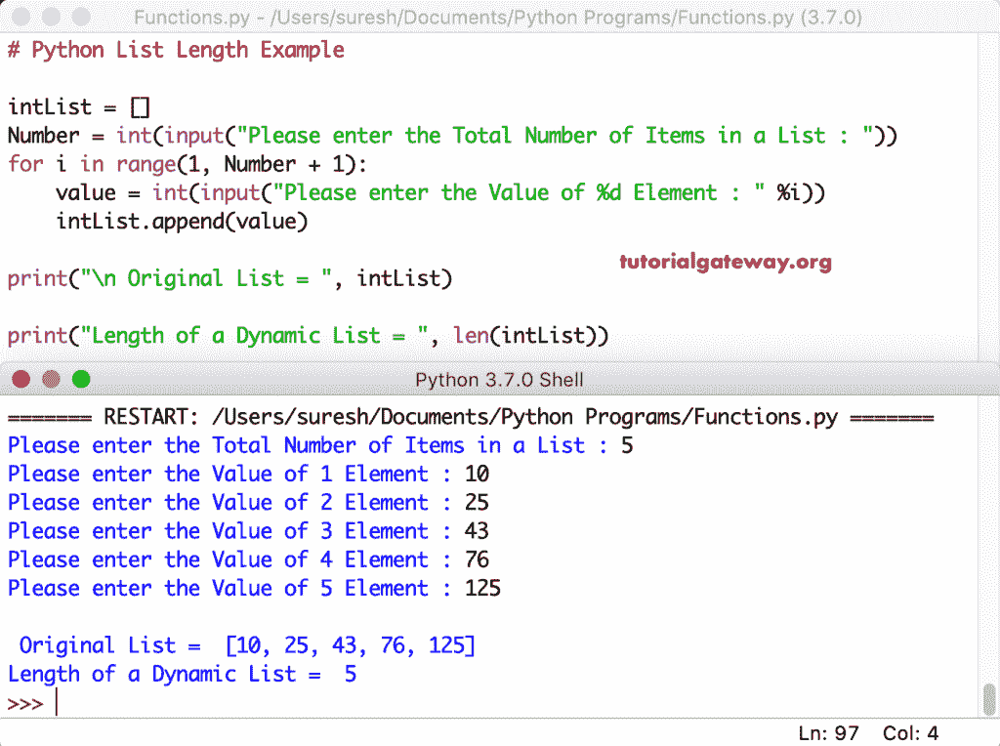

# Python 列表长度

> 原文：<https://www.tutorialgateway.org/python-list-length/>

如何用这个 len 内置函数，用很少的实例找到 Python 列表长度？。Python len 方法用于查找并返回任何集合的长度，如字典、元组等。

这个`len()`函数用于在 python 中查找列表长度或获取大小的语法是:

```py
len(list_name)
```

## Python 列表长度示例

我们可以用这个函数来计算 python 中元素的数量或列表的大小。在这个 Python 列表长度的例子中，我们声明了一个空的。我们用`len()`函数来计算一个空的。接下来，我们找到一个整数的大小，它返回元素的总数。

```py
emptyLi = []
print(len(emptyLi))

integerLi = [12, 22, 33, 44, 55, 66, 77]
print("integerLi)
print(len(integerLi))
```

```py
0
[12, 22, 33, 44, 55, 66, 77]
7
```

### Python 获取列表字符串的长度示例

当您在[字符串](https://www.tutorialgateway.org/python-string/)项目上使用此[镜头功能](https://www.tutorialgateway.org/python-len-function/)时，它会返回字符串中的总字数。或者，比方说，它找到字符串中的所有项目或单词。这个 [Python](https://www.tutorialgateway.org/python-tutorial/) 示例显示了字符串[列表](https://www.tutorialgateway.org/python-list/)中字符串项的总数或单词的总数。

```py
stringList = ['Krishna', 'John', 'Yung', 'Ram', 'Steve']
print(stringList)

print( len(stringList))
```

```py
['Krishna', 'John', 'Yung', 'Ram', 'Steve']
5
```

## Python 混合列表长度示例

除了常规的，你还可以得到混合列表的长度。在第五行代码中，我们在一个列表中声明了一个[元组](https://www.tutorialgateway.org/python-tuple/)。接下来，我们将找到大小(这包括元组)。记住，len 将完整的 Tuple 算作一个元素。

```py
mixedLi = ['Krishna', 20, 'John', 40.5, 'Yung', 11.98, 'Ram', 22]
print(len(mixedLi))
print()

mixedLi2 = ['Krishna', 20, 'John', (40, 50, 65), 'Yung', 11.98, 'Ram']
print(len(mixedLi2))
```

```py
8
7
```

## Python 嵌套列表长度示例

让我们看看如何找到输入嵌套列表的长度。为此，我们用其他几个项目的组合声明了一个嵌套的。如果您想要完整的长度，那么它会将嵌套对象视为一个元素。

但是，您可以使用索引值获得嵌套大小。例如，下面的代码正在查找嵌套列表的长度[20，40，50，65，22]。

```py
nestedLi = ['Krishna', 20, 'John', [20, 40, 50, 65, 22], 'Yung', 11.98]
print(nestedLi)

print(len(nestedLi[3]))
```

```py
['Krishna', 20, 'John', [20, 40, 50, 65, 22], 'Yung', 11.98]
5
```

## 动态 Python 列表长度示例

该程序允许用户输入元素的总数。接下来，使用 [For Loop](https://www.tutorialgateway.org/python-for-loop/) ，它迭代每个位置，并允许您输入单个元素。在循环中，我们使用[追加功能](https://www.tutorialgateway.org/python-append-list-function/)来添加项目。一旦我们得到了项目，我们就可以使用这个`len()`函数来计算长度。

```py
intList = []
Number = int(input("Please enter the Total Number of Items in a List : "))
for i in range(1, Number + 1):
    value = int(input("Please enter the Value of %d Element : " %i))
    intList.append(value)

print("\n Original List = ", intList)

print("Length of a Dynamic List = ", len(intList))
```

