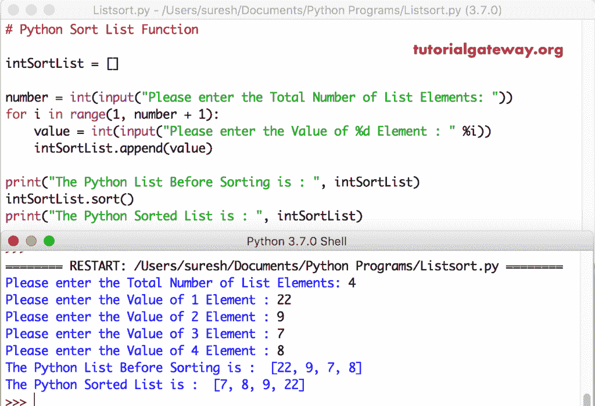

# Python 列表`sort()`函数

> 原文：<https://www.tutorialgateway.org/python-sort-list-function/>

如何用实例说明这个 Python List `sort()`函数？。这个 Python `List()`函数用于给定元素的升序排序。这个列表`sort()`函数背后的语法是

```
# Ascending Order
liName.sort()

# Descending or Reverse Order
liName.sort(reverse = True)

# Using Built-in or User defined Function
liName.sort(key = Function_Name)
```

在这个 Python 列表`sort()`函数语法中，函数名可以是任何用户定义的函数。或者您可以使用任何内置功能，如 len、min、max 等。，在这个 Python 排序列表函数中。

## Python 排序列表列表示例

下面的 Python 示例向您展示了如何按升序和降序对整数列表项进行排序。

这个Python 函数按照升序对给定的列表进行排序。下面的代码对整数列表中的元素进行排序。

```
a = [10, 190, 120, 180, 120, 105]

a.sort()

print(a)
```

```
10, 105, 120, 120, 180, 190]
```

`sort()`函数有一个名为 reverse = True 的参数。它允许我们按降序对列表项进行排序。下面的代码按降序或逆序对整数列表元素进行排序。

提示:请参考[列表](https://www.tutorialgateway.org/python-list/)文章和[方法](https://www.tutorialgateway.org/python-list-functions/)文章，了解 [Python](https://www.tutorialgateway.org/python-tutorial/) 中关于它们的一切。也参考[镜头](https://www.tutorialgateway.org/python-len-function/)、[最小](https://www.tutorialgateway.org/python-min-list-function/)和[最大](https://www.tutorialgateway.org/python-max-function/)。

```
lexm = [13, 98, 125, 191, 22, 9, 91, 78, 242]
print("\n Original = ", exm)

exm.sort()
print("Ascending = ", exm)

exm2 = [13, 98, 125, 191, 22, 9, 91, 78, 242]
print("\n Original exm2 = ", exm2)

exm2.sort(reverse = True)
print("Descending = ", exm2)
```

```
 Original =  [13, 98, 125, 191, 22, 9, 91, 78, 242]
Ascending =  [9, 13, 22, 78, 91, 98, 125, 191, 242]

 Original listexm2 =  [13, 98, 125, 191, 22, 9, 91, 78, 242]
Descending =  [242, 191, 125, 98, 91, 78, 22, 13, 9]
```

## Python 字符串排序列表示例

此列表排序部分显示如何按升序和降序对字符串列表项进行排序。

在这个例子中，首先，我们声明了一个字符串列表。接下来，我们使用 Python `list()`函数对它们进行升序排序。这里，它使用字母顺序对字符串列表进行排序。

```
Fruit = ['Orange', 'Banana', 'Watermelon', 'Kiwi', 'Grape', 'Blackberry']

Fruit.sort()

print(Fruit)
```

```
['Banana', 'Blackberry', 'Grape', 'Kiwi', 'Orange', 'Watermelon']
```

此示例方法按升序对字符串和整数列表项进行排序。

```
Fruits = ['Apple', 'Orange', 'Banana', 'Kiwi', 'Grape', 'Blackberry']
numbers = [9, 4, -5, 0, 22, -1, 2, 14]

print(Fruits)
print(numbers)

print("\n---Result---")
Fruits.sort()
print(Fruits)

numbers.sort()
print(numbers)
```

```
['Apple', 'Orange', 'Banana', 'Kiwi', 'Grape', 'Blackberry']
[9, 4, -5, 0, 22, -1, 2, 14]

---Result---
['Apple', 'Banana', 'Blackberry', 'Grape', 'Kiwi', 'Orange']
[-5, -1, 0, 2, 4, 9, 14, 22]
```

### Python 降序排序列表示例

在这个例子中，我们在 Python `sort()`函数中使用了 reverse = True 选项。这意味着本示例返回与上述示例相反的顺序。

```
fruitlist = ['orange', 'banana', 'apple', 'kiwi', 'grape']
print(fruitlist)

fruitlist.sort()
print("\nAscending = ", fruitlist)

# Descending Order
fruitlist.sort(reverse = True)
print(fruitlist)
```

按降序对列表项进行排序

```
 ['orange', 'banana', 'apple', 'kiwi', 'grape']

Ascending =  ['apple', 'banana', 'grape', 'kiwi', 'orange']
Descending =  ['orange', 'kiwi', 'grape', 'banana', 'apple']
```

列表项上的`sort()`函数有另一个名为 key 的参数。它接受任何函数来确定排序因子。在本例中，我们创建了一个名为 length 的用户定义函数。它查找给定字符串的长度。

接下来，我们使用这个函数作为键值。意思是，水果按长度升序排列。

在下一行中，我们使用了反向参数以及这个关键参数。它根据每个单词的长度降序排列水果。

```
def length(str):
    return len(str)

fruitlist = ['apple', 'oranges', 'blackberry', 'kiwi', 'cherry']
print("\nOriginal = ", fruitlist)

fruitlist.sort(key = length)
print("Asc  = ", fruitlist)

fruitlist.sort(reverse = True, key = length)
print("Desc = ", fruitlist)
```

```
 Original =  ['apple', 'oranges', 'blackberry', 'kiwi', 'cherry']
Asc  =  ['kiwi', 'apple', 'cherry', 'oranges', 'blackberry']
Desc =  ['blackberry', 'oranges', 'cherry', 'apple', 'kiwi']
```

要使用 key 参数，您不必创建自定义函数。Python 允许您使用任何内置函数。

这个 Python 列表排序方法示例与上面的示例相同。但是，我们使用的是内置的通用[镜头功能](https://www.tutorialgateway.org/python-len-function/)。这意味着第一个根据单词长度升序对列表进行排序，第二个根据单词长度降序排序。

```
fruitlist = ['oranges', 'blackberry', 'apple', 'kiwi', 'cherry']
print("\n Original = ", fruitlist)

fruitlist.sort(key = len)
print("\nAscending = ", fruitlist)

fruitlist.sort(reverse = True, key = len)
print("Descending= ", fruitlist)
```

```
 Original =  ['oranges', 'blackberry', 'apple', 'kiwi', 'cherry']

Ascending =  ['kiwi', 'apple', 'cherry', 'oranges', 'blackberry']
Descending=  ['blackberry', 'oranges', 'cherry', 'apple', 'kiwi']
```

## Python 排序混合列表示例

让我在混合列表上使用这个`sort()`函数。

```
MixedSortList = ['apple',  1, 5, 'Kiwi', 'Mango']

MixedSortList.sort()

print("The Python Sorted List Items are : \n", MixedSortList)
```

Python 列表`sort()`函数抛出了一个错误，因为它不能对字符串和 int 应用

```
Traceback (most recent call last):
  File "/Users/suresh/Desktop/simple.py", line 3, in <module>
    MixedSortList.sort()
TypeError: '<' not supported between instances of 'int' and 'str'
>>> 
```

## Python 排序嵌套列表示例

下面的示例帮助您理解嵌套列表项上的这个函数。

这一次，我们使用了嵌套列表上的函数。这里，该函数使用每个嵌套值中的第一个值来按升序对项目进行排序。

```
Mixed = [[71, 222], [222, 13], [14, 15], [99, 77]]

Mixed.sort()

print(Mixed)
```

```
[[14, 15], [71, 222], [99, 77], [222, 13]]
```

您不必通过用第一个值对嵌套列表进行排序来限制自己。通过创建用户定义的函数，可以使用任何值对嵌套列表进行排序。

在这个例子中，我们创建了一个函数来选择第二个值作为键。这意味着第一个代码片段根据嵌套列表中的第二个值对项目进行排序，第二行使用第二个项目按降序排序。

```
def second(value):
    return value[1]

mixed = [[17, 222], [222, 13], [14, 151], [99, 77]]
print("\n Original = ", mixed)

mixed.sort(key = second)
print("\nAscending = ", mixed)

mixed.sort(reverse = True, key = second)
print("Descending = ", mixed)
```

```
 Original =  [[17, 222], [222, 13], [14, 151], [99, 77]]

Ascending =  [[222, 13], [99, 77], [14, 151], [17, 222]]
Descending =  [[17, 222], [14, 151], [99, 77], [222, 13]]
```

### Python 排序嵌套列表示例

我们举了另一个例子来解释这个关键参数和自定义函数。这次我们也用了第二个值 a 作为关键字。但是，正如您所看到的，我们在嵌套列表中有三个值，它是按照第二个项目对项目进行排序的。

```
def second(value):
    return value[1]

mixed = [[17, 222, 15], [222, 13, 55], [14, 151, 31], [99, 77, 9]]
print("\nOriginal = ", mixed)

mixed.sort(key = second)
print("\nAscending = ", mixed)

# Descending Order
mixed.sort(reverse = True, key = second)
print("Descending = ", mixed)
```

```
 Original =  [[17, 222, 15], [222, 13, 55], [14, 151, 31], [99, 77, 9]]

Ascending =  [[222, 13, 55], [99, 77, 9], [14, 151, 31], [17, 222, 15]]
Descending =  [[17, 222, 15], [14, 151, 31], [99, 77, 9], [222, 13, 55]]
```

让我将这个键值更改为 3 个嵌套列表值。我们可以通过在用户定义的函数中将项目索引位置更改为 2 来实现。

```
def third(value):
    return value[2]

mixed = [[17, 222, 15], [222, 13, 55], [14, 151, 31], [99, 77, 9]]
print("\n Original = ", mixed)

mixed.sort(key = third)
print("\nAscending = ", mixed)

mixed.sort(reverse = True, key = third)
print("Descending = ", mixed)
```

```
 Original =  [[17, 222, 15], [222, 13, 55], [14, 151, 31], [99, 77, 9]]

Ascending =  [[99, 77, 9], [17, 222, 15], [14, 151, 31], [222, 13, 55]]
Descending =  [[222, 13, 55], [14, 151, 31], [17, 222, 15], [99, 77, 9]]
```

## 动态整数列表上的`sort()`函数示例

这个 [python 程序](https://www.tutorialgateway.org/python-programming-examples/)和第一个例子一样。但是，这次我们允许用户输入长度。接下来，我们使用[为循环](https://www.tutorialgateway.org/python-for-loop/)添加数字。最后，我们使用这个Python 函数对整数列表进行升序排序。

```
intSortList = []

number = int(input("Please enter the Total Number of List Elements: "))
for i in range(1, number + 1):
    value = int(input("Please enter the Value of %d Element : " %i))
    intSortList.append(value)

print("The Python List Before Sorting is : ", intSortList)
intSortList.sort()
print("The Python Sorted List is : ", intSortList)
```



在这个程序中，我们使用了相反的参数来按降序排列列表元素。

```
numLi = []

number = int(input("Please enter the Number of Elements: "))
for i in range(1, number + 1):
    item = int(input("%d Item : " %i))
    numLi.append(item)

print("\nBefore : ", numLi)
numLi.sort(reverse = True)
print("Descending : ", numLi)
```

```
Please enter the Number of Elements: 5
1 Item : 25
2 Item : 33
3 Item : 12
4 Item : 87
5 Item : 20

Before :  [25, 33, 12, 87, 20]
Descending :  [87, 33, 25, 20, 12]
```

它允许用户输入他们自己的字符串或单词。接下来，我们使用`list()`函数按升序对它们进行排序。

```
strSL = []

number = int(input("Please enter the Total Number of Elements: "))
for i in range(1, number + 1):
    item = input(" %d Element : " %i)
    strSL.append(item)

print("\nBefore : ", strSL)
strSL.sort()
print("After : ", strSL)
```

```
Please enter the Total Number of Elements: 4
1 Element : kiwi
2 Element : dragon
3 Element : apple
4 Element : banana

Before :  ['kiwi', 'dragon', 'apple', 'banana']
After :  ['apple', 'banana', 'dragon', 'kiwi']
```

在这个程序中，我们在一个函数中使用了反向参数来按降序对字符串项进行排序。接下来，我们使用键= len，使用字符串长度按升序和降序对列表项进行排序。

```
str1 = []

number = int(input("Please enter the Total Elements: "))
for i in range(1, number + 1):
    item = input("%d Element : " %i)
    str1.append(item)

print("\nBefore : ", str1)
str1.sort(reverse = True)
print("Descending : ", str1)

str1.sort(reverse = True, key = len)
print("Length : ", str1)
```

```
Please enter the Total Elements: 5
1 Element : cherry
2 Element : apple
3 Element : orange
4 Element : kiwi
5 Element : balckberry

Before :  ['cherry', 'apple', 'orange', 'kiwi', 'balckberry']
Descending :  ['orange', 'kiwi', 'cherry', 'balckberry', 'apple']
Length :  ['balckberry', 'orange', 'cherry', 'apple', 'kiwi']
```