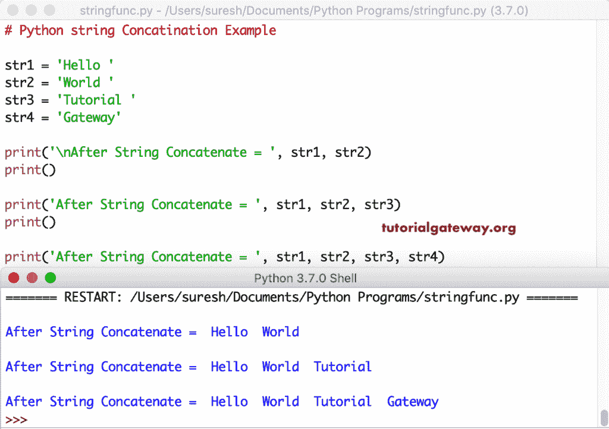

# Python 字符串连接

> 原文：<https://www.tutorialgateway.org/python-string-concatenation/>

Python 中有多种连接字符串的方法。您可以使用传统的+运算符，或者使用逗号连接或分隔字符串。在本节中，我们将通过示例讨论如何在 Python 编程中进行字符串连接。

## Python 字符串串联示例

这是 Python 字符串连接的基本示例。在这里，我们使用 Python +运算符来连接 a 和 b。如果您将*运算符与一个数值一起使用，那么该句子会被一个给定的数字重复。

```py
str1 = 'a' + 'b'
print(str1)

str2 = 'Hi' * 2
print(str2)

str3 = 'Hi' * 4
print(str3)
```

使用算术运算符+输出的 Python 字符串连接

```py
ab
HiHi
HiHiHiHi
```

在进行 Python 字符串连接时，应该注意两个字符串之间的分隔符。 [Python](https://www.tutorialgateway.org/python-tutorial/) 不提供任何分隔符，所以您必须手动连接这些额外的空格。在最后一条语句中，我们使用了+`=`运算符，该运算符将 str2 添加到 str1 中，并更新原始值。

```py
str1 = 'Tutorial'
str2 = 'Gateway'

str3 = str1 + str2
print(str3)
print()

str4 = str1 + ' ' + str2
print(str4)
print()

str5 = str1 + ', ' + str2
print(str5)

str1 += str2
print(str1)
```

```py
TutorialGateway

Tutorial Gateway

Tutorial, Gateway

Tutorial Gateway
```

### Python 字符串连接示例 2

通过将单词与用逗号分隔的[打印语句](https://www.tutorialgateway.org/python-print-function/)放在一起，将会合并句子——例如，第一个打印语句连接 str1 和 str2。

```py
str1 = 'Hello '
str2 = 'World '
str3 = 'Tutorial '
str4 = 'Gateway'

print('\nAfter String Concatenate = ', str1, str2)
print()

print('After String Concatenate = ', str1, str2, str3)
print()

print('After String Concatenate = ', str1, str2, str3, str4)
```



### Python 字符串连接示例 3

具有[格式功能](https://www.tutorialgateway.org/python-format/)。您可以使用这个带大括号的格式函数。这里，{}代表句子或单词。您可以在{} {}之间使用任何分隔符，如空格或逗号。

```py
str1 = 'Tutorial'
str2 = 'Gateway'

c1 = '{}{}'.format(str1, str2)
print(c1)
print()

c2 = '{} {}'.format(str1, str2)
print(c2)
print()

c3 = '{} - {}'.format(str1, str2)
print(c3)
print()

c4 = '{a} **+** {b}'.format(a = str1, b = str2)
print(c4)
```

```py
 TutorialGateway

Tutorial Gateway

Tutorial - Gateway

Tutorial **+** Gateway
```

在 Python 中，您可以使用%s 格式选项来连接字符串。这里，我们使用这个%符号来连接 Python 中两个或多个字符串。

```py
str1 = 'Tutorial'
str2 = 'Gateway'
str3 = 'Python'
year = 2018

c1 = '%s%s' %(str1, str2)
print(c1)
print()

c2 = '%s %s %s' %(str3, str1, str2)
print(c2)
print()

c3 = 'Learn %s at %s %s - Year %d' %(str3, str1, str2, year)
print(c3)
print()

c4 = '%s %s %s %s' %(str1, str2, str3, year)
print(c4)
```

使用%s 格式输出进行组合

```py
 TutorialGateway

Python Tutorial Gateway

Learn Python at Tutorial Gateway - Year 2018

Tutorial Gateway Python 2018
```

### Python 字符串和整型连接

与大多数编程语言不同，Python 不会隐式地将整数转换为字符串来执行 concat。如您所见，它抛出了一个错误类型错误:只能对字符串(而不是“int”)进行字符串

```py
text = 'Tutorial Gateway'
year = 2018

print(text + year)
```

```py
Traceback (most recent call last):
  File "/Users/suresh/Desktop/simple.py", line 4, in <module>
    print(text + year)
TypeError: can only concatenate str (not "int") to str
```

要解决这个问题，您必须使用`str()`函数将 int 值 year 转换为 string 文本。

```py
text = 'Tutorial Gateway '
year = 2018

print(text + str(year))
```

```py
Tutorial Gateway 2018
```

让我在一个程序中使用所有可用的选项。

```py
text = 'Hello World '
year = 2018

print(text + str(year))
print()

print('{}{}'.format(text, year))
print()

print('%s%s' %(text, year))
print()

print(text, year)
print()

print(f'{text}{year}')
```

```py
Hello World 2018

Hello World 2018

Hello World 2018

Hello World  2018

Hello World 2018
```

这个 Python 连接示例与上面的示例相同。但是，这一次我们允许用户输入自己的句子来执行此操作。

```py
str1 = input('Please enter the First : ')
str2 = input('Please enter the Second : ')

a = str1 + str2
print(a)
print()

b = str1 + ' ' + str2
print(b)
print()

print('{} {}'.format(str1, str2))
print()

print('%s %s' %(str1, str2))
print()

print(str1, str2)
```

```py
Please enter the First : Java
Please enter the Second : Tutorial

JavaTutorial

Java Tutorial

Java Tutorial

Java Tutorial

Java Tutorial
```

我们有连接函数来连接两个或多个字符串。您可以使用此功能来组合单词列表。' '.join(str_list)组合 str_list 中由空格分隔的所有单词。

```py
str_list = ['Apple', 'Orange', 'Mango', 'Kiwi', 'Cherry']

a = ' '.join(str_list)
print(a)
print()

b =  ', '.join(str_list)
print(b)
print()

c =  ' $ '.join(str_list)
print(c)
```

```py
 Apple Orange Mango Kiwi Cherry

Apple, Orange, Mango, Kiwi, Cherry

Apple $ Orange $ Mango $ Kiwi $ Cherry
```

您不必使用列表来使用此连接功能。在连接字符串之前，您可以将不同单词的列表转换为实际列表。

```py
s1 = 'Hello '
s2 = 'World '
s3 = 'Welcome '
s4 = 'Guys'

co1 = ' '.join([s1, s2])
print(co1)
print()

co2 = ', '.join([s1, s2, s3])
print(co2)
print()

co3 = ' *+* '.join([s1, s2, s3, s4])
print(co3)
```

```py
 Hello  World 

Hello , World , Welcome 

Hello  *+* World  *+* Welcome  *+* Guys 
```