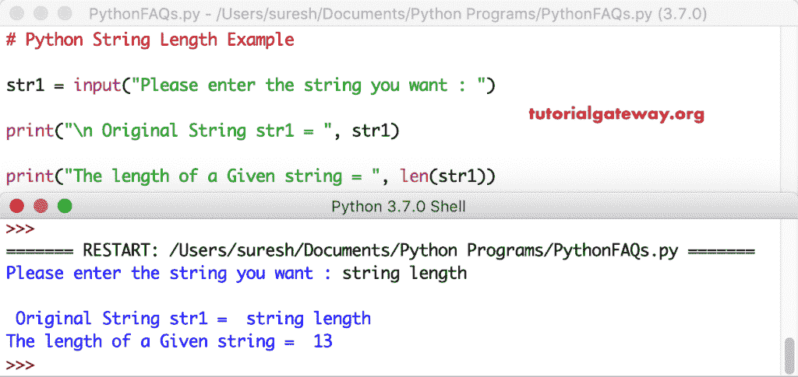

# Python 字符串长度

> 原文:[https://www.tutorialgateway.org/python-string-length/](https://www.tutorialgateway.org/python-string-length/)

写一个程序找到 Python 字符串长度。python 编程语言提供了一个名为 len 的内置标准函数。它可以帮助您找到字符串或任何其他对象类型的长度。

在这个程序中，我们声明了一个空字符串。接下来，我们使用 len 函数在 Python 中找到字符串的长度。接下来，我们将在教程网关中找到全部字符并学习编程。

请记住，此函数将空白空间计为 1。意思是《他将》中的人物总数是 5。

```
str1 = ''
print("\nstr1 = ", str1)
print(len(str1))

str2 = 'Tutorial Gateway'
print("\nstr2 = ", str2)
print(len(str2))

str3 = 'Learn Programming'
print("\nstr3 = ", str3)
print(len(str3))
```

```
 str1 =  
0

Tutorial Gateway
16

str3 =  Learn Programming
17
```

该程序与第一个 Python 字符串长度示例相同。然而，我们允许用户输入他们自己的单词，然后找到用户给定单词的长度。

```
str1 = input("Please enter the sentence you want : ")

print("\n Original str1 = ", str1)

print("The length of a Given sentence = ", len(str1))
```

```
Please enter the sentence you want : Python Programming Language

 Original str1 =  Python Programming Language
The length of a Given sentence =  27
```

让我用不同的句子试试



## Python 字符串长度示例

在上面指定的所有示例中，我们使用了内置函数 len。但是，您也可以在不使用任何内置函数的情况下找到长度。在面试中，这可以测试你的编码技能。

在这个 Python 字符串长度程序中，我们使用`for`循环来迭代用户给定句子中的每个字符。在循环中，我们增加 val 来计数字符串中的字符。接下来，在循环之外，我们打印最终输出。

请参考 [Python](https://www.tutorialgateway.org/python-tutorial/) 中的[字符串](https://www.tutorialgateway.org/python-string/)、[循环](https://www.tutorialgateway.org/python-for-loop/)和 [len](https://www.tutorialgateway.org/python-len-function/) 文章。

```
str1 = input("Please enter the text you want : ")
val = 0

print("\n str1 = ", str1)

for i in str1:
    val = val + 1

print("Total = ", val)
```

```
Please enter the text you want : Tutorial Gateway

 str1 =  Tutorial Gateway
Total =  16
```

在这个例子中，我们使用[函数](https://www.tutorialgateway.org/functions-in-python/)来分离逻辑以找到长度。接下来，我们调用该函数来查找用户输入句子中的字符。

```
def stringLength(string):
    length = 0
    for i in string:
        length = length + 1
    return length

str1 = input("Please enter the text you want : ")

print("\n Original str1 = ", str1)

strlength = stringLength(str1)

print("Characters  = ", strlength)
```

```
Please enter the text you want : hello

 Original str1 =  hello
Characters =  5
```

让我重新运行 len 程序并输入一个新单词。它可以帮助你更详细地理解它。

```
Please enter the text you want : Python Tutorial

 str1 =  Python Tutorial
Characters  =  15
```