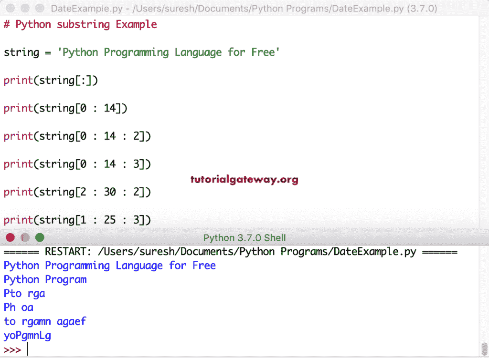

# Python 子字符串

> 原文:[https://www.tutorialgateway.org/python-substring/](https://www.tutorialgateway.org/python-substring/)

在 Python 中，我们没有专门的字符串函数来查找或返回子字符串。然而，在 Python 编程语言中，我们有多个选项来提取或返回子字符串。

在本节中，我们将通过示例向您解释返回子字符串的所有可能选项。为了在 Python 中获取或找到字符串子串，我们使用了一些内置的字符串函数和功能。

## Python 子字符串示例

以下是 Python 中提取或返回子字符串的示例列表

### Python 字符串切片获取子字符串

在这种编程语言中，您可以分割任何对象以返回该对象的一部分。在这个例子中，我们使用切片概念返回一个 Python 子串。切片接受三个参数，它们是起点和终点以及步骤。

```
s1 = 'Tutorial Gateway'

print(s1[:]) # returns complete characters

print(s1[: 5]) # From 0 to 5

print(s1[1 : 10])

print(s1[2 : 13])

print(s1[5 : 15]) # from 5 to 15
```

Python 字符串切片返回子字符串输出

```
Tutorial Gateway
Tutor
utorial G
torial Gate
ial Gatewa
```

Python 字符串切片也接受负数来获取子字符串。在这个例子中，我们使用负指数作为端点。负索引意味着，它从最右边的字符序列向左计数。意思是，print(s2[2 : -13])返回从 2 到 end -13 的子字符串(删除最右边的 13 个字符)。

```
s2 = 'Learning this Program'

print(s2[:])

print(s2[: -5]) #  from 0

print(s2[1 : -10])

print(s2[2 : -13])

print(s2[4 : -1])

print(s2[3 : -4])
```

```
Learning this Program
Learning this Pr
earning th
arning
ning this Progra
rning this Pro
```

在这个 Python 子字符串示例中，我们使用切片中的第三个值。它可以帮助你跳过字符。例如，[0: 14: 2]返回一个从 0 到 14 的子字符串，它跳过可选字符(每第二个字符)。建议大家参考[蟒](https://www.tutorialgateway.org/python-tutorial/)中的[弦](https://www.tutorialgateway.org/python-string/)和[功能](https://www.tutorialgateway.org/python-string-functions/)。

```
string = 'Python Programming Language for Free'

print(string[:])

print(string[0 : 14]) # is equal to print([0 : 14 : 1])

print(string[0 : 14 : 2]) 

print(string[0 : 14 : 3]) # skips every third character

print(string[2 : 30 : 2])

print(string[1 : 25 : 3])
```



### Python 子串函数

您可以创建一个对字符串进行切片并返回 Python 子字符串的函数，而不是每次都对对象进行切片。这样，您可以允许用户将此功能用作任何内置功能。

在这个例子中，我们定义了一个接受字符串、起点和终点的函数。接下来，它将第一个参数从起点切割到终点，并返回结果。请参考[功能](https://www.tutorialgateway.org/functions-in-python/)和[功能类型](https://www.tutorialgateway.org/types-of-functions-in-python/)了解功能创建和类型

```
def sbs(s3, start, end):
    return s3[start:end]

s3 = 'Python Programming'

print(sbs(s3, 1, 5))

print(sbs(s3, 2, 10))

print(sbs(s3, 3, 14))
```

```
ytho
thon Pro
hon Program
```

在 Python 子字符串示例中，我们使用的是起点和长度。这个函数接受一个字符串和可选的参数开始点和长度。

```
def substr(st, start = None, length = None):
    return st[start : ][: length]

st = 'Learning this Programming Language'

print(substr(st))

print(substr(st, 3))

print(substr(st, 2, 19))

print(substr(st, length = 10))
```

```
Learning this Programming Language
rning this Programming Language
arning this Program
Learning t
```

这是一种比上述 Python 子字符串示例更好的方法。

```
def substr(st1, start = None, length = None):
    return st1[start : length]

st1 = 'Learn Python Programming Language'

print(substr(st1))

print(substr(st1, 7))

print(substr(st1, 2, 19))

print(substr(st1, length = 15))
```

```
Learn Python Programming Language
ython Programming Language
arn Python Progra
Learn Python Pr
```

在本例中，我们使用另一个名为 steps 的参数来跳过字符。

```
def strsub(st2, start, end, steps = 1):
    return st2[start : end : steps]

st2 = 'Python Programming Language for Free'

print(strsub(st2, 1, 5))
print(strsub(st2, 1, 5, 2))

print(strsub(st2, 2, 30))
print(strsub(st2, 2, 30, 3))

print(strsub(st2, 0, 35, 3))
print(strsub(st2, 0, 35, 4))
```

```
ytho
yh
thon Programming Language fo
tnrrmgaueo
Ph oai na rr
PoranaafF
```

### 反向 Python 子字符串

通过使用负值，还可以以相反的顺序返回子字符串。

```
str1 = 'Learn Python Programming Language'

print(str1[:: -1])

print(str1[19:: -1])

print(str1[4 :: -1])

print(str1[9 :: -1])

print(str1[11 :: -1])
```

```
egaugnaL gnimmargorP nohtyP nraeL
margorP nohtyP nraeL
nraeL
htyP nraeL
nohtyP nraeL
```

### 使用`for`循环的子字符串

也可以使用[进行循环](https://www.tutorialgateway.org/python-for-loop/)配合[范围函数](https://www.tutorialgateway.org/python-range-function/)返回一个子串。为此，我们必须使用[打印功能](https://www.tutorialgateway.org/python-print-function/)以及 end 参数。本示例返回一个从 3 开始到 24 结束的句子。

```
str2 = 'Python Programming Language for Free'

for n in range(3, 25):
    print(str2[n], end = '')
```

```
hon Programming Langua
```

### Python 子串切片

Python 切片函数允许您对给定的一个进行切片，并返回一个子字符串。该函数接受起点和终点。通过使用这些值，您可以将句子从任何给定的起点返回到终点。例如，slice(3，13)从字符 4 到 13 返回一个句子。

```
str3 = 'Learn English Language for Free'

sub1 = slice(4)
print(str3[sub1])

sub2 = slice(3, 13)
print(str3[sub2])

sub3 = slice(1, 21)
print(str3[sub3])

sub4 = slice(1, 28)
print(str3[sub4])

sub5 = slice(7, 29)
print(str3[sub5])
```

```
Lear
rn English
earn English Languag
earn English Language for F
nglish Language for Fr
```

这里，我们使用负值从右向左进行切片。接下来，我们使用-1 作为第三个参数，以相反的顺序返回子字符串。

```
str4 = 'Learn Python Language for Free'

sub1 = slice(-1, -7, -1)
print(str4[sub1])

sub2 = slice(-7, 3, -1)
print(str4[sub2])
```

```
eerF r
of egaugnaL nohtyP n
```

### Python 子字符串匹配

使用 [Python If Else](https://www.tutorialgateway.org/python-if-else/) 而不是 in 运算符检查给定字符串中是否存在该单词。

```
a = 'Hello World'

substr = 'Hello'

if substr not in a:
    print('We haven\'t found what you are looking for = ', substr)
else:
    print('We found the Matching = ', substr)
```

```
We found the Matching = Hello
```

这一次，我们使用 if in 运算符来检查不存在的单词

```
b = 'We are abc working at abc company'

word = 'xyz'

if word in b:
    print('We found the Matching = ', word)
else:
    print('We haven\'t found what you are looking for = ', word)
```

```
We haven't found what you are looking for =  xyz
```

Not in 运算符不是检查匹配的唯一方法。可以使用 [Python 查找功能](https://www.tutorialgateway.org/python-find/)。

```
str5 = 'We are abc working at abc company'

subst = 'abc'

if str5.find(subst) == -1:
    print('We haven\'t found what you are looking for = ', subst)
else:
    print('We found the Matching = ', subst)
```

```
We found the Matching = abc
```

### 字符前的 Python 子字符串

在这个例子中，我们展示了如何在字符之前返回一个子字符串。为此，我们使用了名为[的内置函数拆分字符串](https://www.tutorialgateway.org/python-split/)。这里，我们使用 Python 拆分字符串函数，使用空格将给定的字符串拆分为两个字符串，并将这些拆分字符串分配给两个变量。

```
c = 'Tutorial Gateway'

first, second = c.split(' ')

print('Before Character space = ', first)
```

```
Before Character space = Tutorial
```

在本例中，我们使用这个 split 函数返回 before : character 和 before:character 的句子。

```
time = '22:30:55'

hour, minute, second = time.split(':')

print('Before First Character : = ', hour)
print('Before Second Character : = ', minute)
print('After Second Character : = ', second)

print('------------')
first, second = time.split(':', 1)
print('Before First Character : = ', first)
print('After First Character : = ', second)

print('------------')
first, second = time.rsplit(':', 1)
print('Before Second Character : = ', first)
print('After Second Character : = ', second)
```

```
Before First Character : =  22
Before Second Character : =  30
After Second Character : =  55
------------
Before First Character : =  22
After First Character : =  30:55
------------
Before Second Character : =  22:30
After Second Character : =  55
```

### 字符后

在这个例子中，我们展示了如何在字符后返回子字符串。

```
d = 'Hello World!'

first, second = d.split(' ')

print('Before the Space = ', first)
print('After the Space = ', second)
```

```
Before the Space =  Hello
After the Space =  World!
```

有时，您可能会要求将@符号和域名之前的句子作为单独的字符串返回。在这种情况下，您可以使用 split 函数将字符串拆分成两个句子。

```
e = '[email protected]'

name, domain = e.split('@')

print('Before Character @ = ', name)
print('After Character @ = ', domain)
```

```
Before Character @ =  contact
After Character @ =  tutorialgateway.org
```

### Python 子串索引

[索引功能](https://www.tutorialgateway.org/python-index/)用于查找给定字符的索引位置。在这个例子中，我们使用这个函数来寻找子串的索引。接下来，我们将对象从起始点(0)切割到索引点，类似于字符开始索引位置之前的子字符串。

```
f = 'We are abc group working at abc company as a abc Developer';

end1 = f.index('bc') 
print(f[: end1])

end2 = f.index('group') 
print(f[: end2])

end3 = f.index('abc') 
print(f[: end3])

end4 = f.index('abc', 11) 
print(f[: end4])

end5 = f.index('abc', 35) 
print(f[: end5])
```

```
We are a
We are abc 
We are 
We are abc group working at 
We are abc group working at abc company as a 
```

这里，我们使用半字符串的索引位置作为起始位置。例如，字符索引位置后的子字符串。

```
g = 'We are xyz group working at xyz company as a xyz Developer';

start1 = g.index('at') 
print(g[start1 : ])
print(g[0 : start1])

start2 = g.index('working') 
print(g[start2 : ])

start3 = g.index('xyz') 
print(g[start3 :])

start4 = g.index('xyz', 11) 
print(g[start4 :])

start5 = g.index('xyz', 35) 
print(g[start5 : ])
```

```
at xyz company as a xyz Developer
We are xyz group working 
working at xyz company as a xyz Developer
xyz group working at xyz company as a xyz Developer
xyz company as a xyz Developer
xyz Developer
```

### Python 子串查找方法

您可以使用[查找功能](https://www.tutorialgateway.org/python-find/)来匹配或查找字符串中的<font color="#000000">字符</font>。接下来，您可以使用这个 Python 字符串切片来返回字符之前或之后的子字符串。在这个例子中，我们找到空格或空白，并在这之前和之后返回子字符串。

```
h = 'Python Programming'

index_num = h.find(' ')

print('Before the Space = ', h[ : index_num])
print('After the Space = ', h[index_num : ])
```

```
Before the Space =  Python
After the Space =   Programming
```

在这里，我们使用第二个参数(起点)来寻找句子。接下来，我们将返回该字符前后的子字符串。

```
i = 'We are abc group working as a abc Developer in abc company';

end1 = i.find('group') 
print('Before: ', i[: end1])
print('After: ', i[end1 : ])

end2 = i.find('abc') 
print('\nBefore: ', i[: end2])
print('After: ', i[end2 : ])

end3 = i.find('abc', 11) 
print('\nBefore: ', i[: end3])
print('After: ', i[end3 : ])

end4 = i.find('abc', 35) 
print('\nBefore: ', i[: end4])
print('After: ', i[end4 : ])
```

```
Before:  We are abc 
After:  group working as a abc Developer in abc company

Before:  We are 
After:  abc group working as a abc Developer in abc company

Before:  We are abc group working as a 
After:  abc Developer in abc company

Before:  We are abc group working as a abc Developer in 
After:  abc company
```

让我们看看如何计算一个单词在字符串中的出现次数。为此，我们使用[计数功能](https://www.tutorialgateway.org/python-count/)。

```
j = 'we are abc group working as a abc developer in abc company';

print('Number of Times "a" Occurred : ', j.count('a'))
print('Number of Times "o" Occurred : ', j.count('o'))
print('Number of Times "abc" Occurred : ', j.count('abc'))
```

```
Number of Times "a" Occurred :  7
Number of Times "o" Occurred :  4
Number of Times "abc" Occurred :  3
```