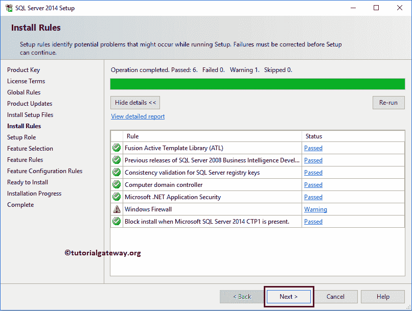
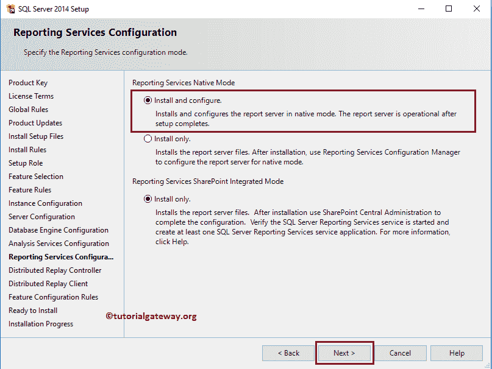

# 如何安装 SQL Server

> 原文：<https://www.tutorialgateway.org/install-sql-server/>

在本文中，我们用截图向您展示了安装 SQL Server(无论版本如何)的分步过程。如果您有安装光盘，请将安装介质插入驱动器以安装 SQL Server。

## 安装 SQL Server

单击 setup.exe 文件:在根文件夹中，双击 setup.exe 以安装 SQL Server。

SQL Server 安装中心:单击 setup.exe 后，将会打开一个名为安装中心的新安装向导。在开始安装软件之前，始终建议检查安装 SQL server 所需的硬件和软件要求。

硬件和软件要求:单击规划选项卡下的硬件和软件要求超链接。而且，如果您没有任何这些预先请求的软件，那么您必须在安装 Sql Server 之前安装它们(继续下一步)。

安装选项卡:转到安装选项卡安装 SQL Server，并选择一个或四个:

*   新的 SQL Server 独立安装或向现有安装添加功能:如果您是第一次安装，或者如果您想向现有实例添加其他功能，请选择此选项。
*   从 SQL Server 2005、2008、2008 R2 或 2012 升级:如果要从以前的版本升级，请选择此选项。

指定要安装的 Sql Server 版本:选择一个选项后，将会打开一个名为“安装”的新向导(版本可能会有所不同)。在第一页上，您必须输入产品密钥，或者您可以通过选择“指定免费版本:评估”来尝试 6 个月的评估期。

安装许可条款:选中两个复选框，然后单击下一步按钮。

检查可用更新:单击“下一步”按钮后，它将检查安装 Sql Server 的可用更新列表。如果有的话，它会下载并安装它们。因为我们下载了文件的最新版本，所以没有任何更新。

SQL 安装规则:接下来，它将进入安装规则窗口。在这里，安装程序将自动前进并执行操作。在这里，它必须通过该窗口中存在的所有规则，但是您可以保留该窗口防火墙警告。如果您想通过防火墙，请从您的 windows 设置(控制面板)中禁用 windows 防火墙。

设置角色:单击“下一步”按钮后，它将进入设置页面。请选择第一个选项，即 SQL`Server()`函数安装，如下所示。它将安装 SQL Server

*   数据库引擎服务:与[管理工作室](https://www.tutorialgateway.org/sql-server-management-studio/)合作
*   分析服务:创建多维数据集，这样我们就可以对这个多维数据使用 [MDX](https://www.tutorialgateway.org/mdx/) 查询。请参考 [SSAS](https://www.tutorialgateway.org/ssas/) 页面。
*   报告服务:它帮助您创建报告。请访问 [SSRS](https://www.tutorialgateway.org/ssrs/) 页面了解报告服务教程
*   集成服务:它帮助您提取、加载和转换数据。请访问 [SSIS](https://www.tutorialgateway.org/ssis/) 页面了解集成服务教程。

功能选择:在“功能选择”页面中，您必须选择要使用的组件。我们将此 SQL Server 用于我们的事务处理查询、MDX、SSAS、SSRS 和 SSIS 教程。因此，我们选择所有可用的 SQL Server 组件进行安装。

实例配置:单击“下一步”按钮后，将进入实例配置页面。在这里，您必须指定实例名和实例标识。

如果要升级 SQL Server，请选择默认实例，以便它更新现有安装。或者，如果您正在安装 Sql Server 第二个实例(系统已经有一个实例)，则选择命名实例，并给出唯一的名称。

服务器配置:您可以使用“服务器配置”页下的“服务帐户”部分为 SQL Server 服务分配本地系统或域用户帐户。请按照如下所示进行更改。

“排序规则”选项卡:保留“排序规则”部分的默认设置。

数据库引擎配置:单击“下一步”按钮后，它将进入“数据库引擎配置”页面。在这里，您必须指定身份验证模式。

如果您选择 windows 帐户，则逐步升级将激活 sa 帐户。或者，如果选择混合模式，则必须指定用于进入 SQL Server 数据库引擎的强密码。接下来，添加用户以访问数据库，这里我们添加当前用户。

数据目录选项卡:保留数据目录为默认值。

文件流选项卡:选中启用文件流进行事务处理-SQL 访问。

分析服务配置:单击下一步按钮后，将进入分析服务配置页面。在这里，您必须配置服务器，用户才能访问分析服务。请选择多维和数据挖掘模式，并通过单击添加当前用户按钮添加当前用户。使用添加..按钮将用户添加到服务中，删除按钮删除添加的用户。

分析服务数据目录选项卡:保留数据目录为默认值。

报告服务配置:单击下一步按钮后，将进入报告服务配置页面。请选择“安装和配置”选项来安装 Sql Server 报告服务，并将其配置为本机模式。

分布式重放控制器:在“分布式重放控制器”页面下，我们正在添加当前用户以访问此服务。

分布式重放客户端:在分布式重放客户端页面中，您必须指定要用作回复客户端的 [SQL Server](https://www.tutorialgateway.org/sql/) 控制器机器名称。

准备安装:在“准备安装”页面下，请交叉检查配置文件路径。

安装进度:单击“安装”按钮后，将出现“Sql Server 安装进度”页面，安装过程将自动前进。请等待，直到它安装 100%。

完成安装:在关闭 SQL Server 安装程序或安装向导之前，请检查每个功能的状态。如果他们成功了，那么你就可以走了。

希望您理解安装 SQL Server 以及分析服务、报告服务所需的步骤。