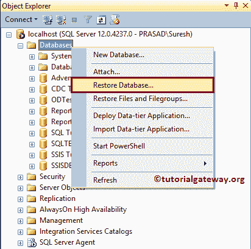
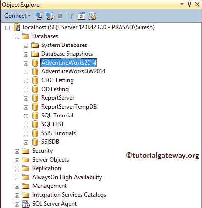

# 下载并安装 AdventureWorks 数据库

> 原文：<https://www.tutorialgateway.org/download-and-install-adventureworks-database/>

AdventureWorks 数据库是一个在线的示例数据库。您可以使用这个数据库来练习我们在这个 SQL Server 教程中指定的每个函数。在本文中，我们将通过截图向您展示下载和安装 AdventureWorks 数据库的分步方法。

在我们开始下载和安装 AdventureWorks 数据库之前，让我向您展示一下 SQL Server 中可用的数据库列表。

## 下载并安装 AdventureWorks 数据库

要在 SQL Server 中下载 AdventureWorks 数据库，请转到下载页面并选择 Adventure Works 2014 完整数据库备份. zip。如果您想要数据仓库，请选择&下载 Adventure Works DW 2014 完整数据库备份. zip

点击保存按钮下载 AdventureWorks 数据库

下载完成后，请解压缩文件。下面的截图将向您展示下载的 AdventureWorks 的解压缩文件。

### 在 SQLServer 中安装 AdventureWorks 数据库

要在 [SQL Server](https://www.tutorialgateway.org/sql/) 中安装 AdventureWorks 数据库，请转到对象资源管理器。右键单击数据库并选择恢复数据库..选项。

选择还原数据库后..选项，将会打开一个名为“还原数据库”的新窗口

请选择源作为设备，然后单击。(浏览)按钮

单击浏览按钮将打开选择备份设备窗口。请单击“添加”按钮添加或安装 AdventureWorks 备份文件。从下面的截图中，您可以看到我们正在选择文件系统中存在的 AdventureWorks.bak 文件。

从下面的截图中，您可以看到我们正在选择文件系统中存在的 AdventureWorks.bak 文件。

点击【确定】关闭

窗口

单击“确定”恢复冒险作品数据库。

如果一切顺利，将显示以下消息。

请刷新 SQL Server 对象资源管理器以查看我们新安装的 AdventureWorks 数据库。

您可以在这个 SQL Adventure works 数据库中看到[视图](https://www.tutorialgateway.org/views-in-sql-server/)、[存储过程](https://www.tutorialgateway.org/stored-procedures-in-sql/)、[表](https://www.tutorialgateway.org/sql-create-table/)。请浏览每个文件夹以了解数据。

