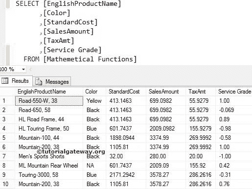

# SQL 数据

> 原文:[https://www.tutorialgateway.org/sql-data/](https://www.tutorialgateway.org/sql-data/)

本文展示了我们在 SQL Server 教程中使用的数据，并使用图像标题将它们分开。

#### 数据 1

#### 表数据 2

#### 表数据 3

#### 排名表

#### 数学表

#### 表数据 5

#### 表数据 6

