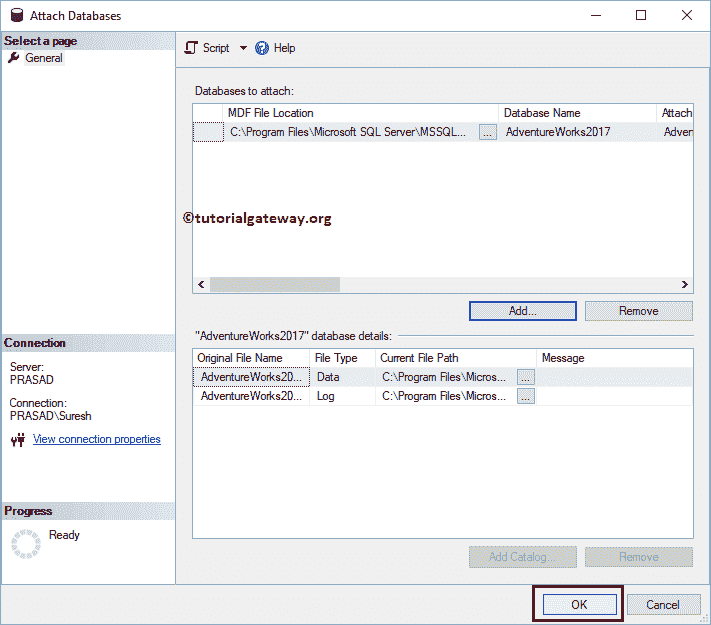

# SQL 附加数据库

> 原文：<https://www.tutorialgateway.org/sql-attach-database/>

在本节中，我们将看到在 SQL Server 中附加数据库的分步方法。在本演示中，我们将使用现有的存储过程、创建语句和 Management Studio。

## SQL 附加数据库方法

SQL server 没有 AdventureWorks2017


你可以看到 AdventureWorks 的 MDF 和 LDF 文件都在 C Drive


里面

SQL Server 有一个 sp_attach_db [存储过程](https://www.tutorialgateway.org/stored-procedures-in-sql/)将数据库连接到服务器。从 MDF 和 LDF 文件加载数据库的语法是

```sql
EXEC sp_attach_db @dbname = N'Database Name',
	@filename1 = 'location\MDFFileName.mdf',
	@filename1 = 'location\LDFFileName.ldf'
```

让我使用上面的语法来连接 Adventure Works 2017。

```sql
EXEC sp_attach_db @dbname = N'AdventureWorks2017',
	@filename1 = N'C:\Program Files\Microsoft SQL Server\MSSQL14.MSSQL Server\MSSQL\DATA\AdventureWorks2017.mdf',
	@filename2 = N'C:\Program Files\Microsoft SQL Server\MSSQL14.MSSQL Server\MSSQL\DATA\AdventureWorks2017_log.ldf'
```

```sql
Messages
-------
Commands completed successfully.
```

现在你可以在我们的 [SQL Server](https://www.tutorialgateway.org/sql/)


中看到冒险作品 2017

## SQL 附加数据库方法 2

在 SQL 中，您可以在服务器中使用创建数据库语句和附加关键字来执行此操作。语法如下所示:

```sql
CREATE DATABASE AdventureWorks2017
	ON (FILENAME = 'location\MDFFileName.mdf'),
	   (FILENAME =  'location\LDFFileName.ldf')
FOR ATTACH;
```

让我使用上面的语法来附加名为 AdventureWorks 的数据库。

```sql
CREATE DATABASE AdventureWorks2017
     ON (FILENAME = N'C:\Program Files\Microsoft SQL Server\MSSQL14.MSSQL Server\MSSQL\DATA\AdventureWorks2017.mdf'),
	(FILENAME = N'C:\Program Files\Microsoft SQL Server\MSSQL14.MSSQL Server\MSSQL\DATA\AdventureWorks2017_log.ldf')
FOR ATTACH;
```

查看查询是否被执行。

```sql
Messages
-------
Commands completed successfully.
```

现在可以看到公元 2017


## 方法 3

也可以使用[Management Studio](https://www.tutorialgateway.org/sql-server-management-studio/)附加任意数据库。为此，右键单击数据库文件夹并选择附加..选项。


单击该选项将打开以下窗口。接下来，单击添加按钮添加 MDF 文件。


使用此文件导航窗口选择所需的数据库。在这里，我们选择了 2017 年复临工程


点击【确定】连接服务器



中的数据库

现在你可以看到冒险工作 2017。

