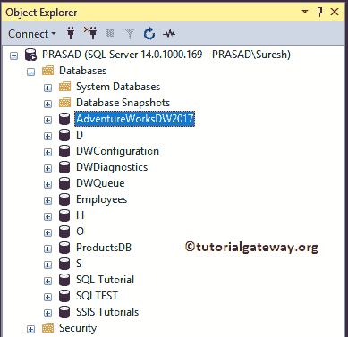
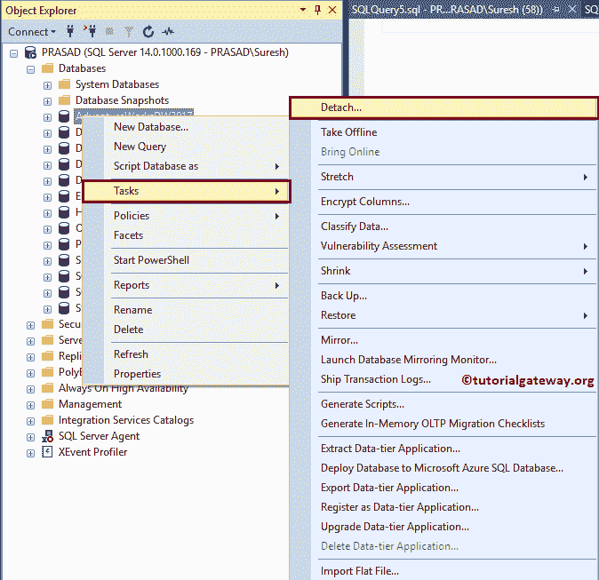
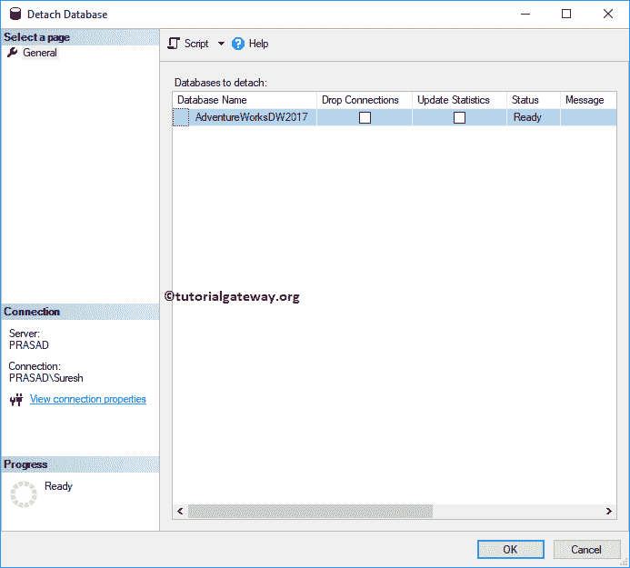
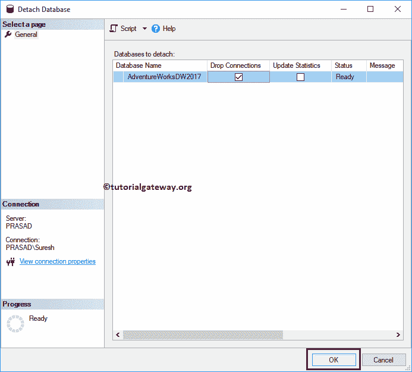
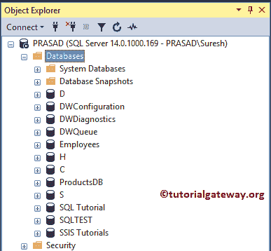
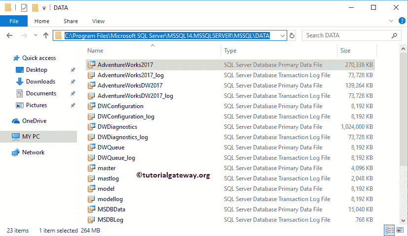

# 分离数据库

> 原文：<https://www.tutorialgateway.org/sql-detach-database/>

让我们看看在 SQL Server 中分离数据库所涉及的步骤。为了演示这个数据库删除，我们将使用现有的存储过程和 Management Studio。

## SQL 分离数据库方法

从下面的截图可以看到 [SQL server](https://www.tutorialgateway.org/sql/) 有

2017

adventureworks

SQL Server 有一个 sp_detach_db [存储过程](https://www.tutorialgateway.org/stored-procedures-in-sql/)来分离数据库。其语法是

```
EXEC sp_detach_db N'Database Name', 'true';
```

让我使用上面的语法来分离 AdventureWorks 2017。

```
EXEC sp_detach_db N'AdventureWorks2017', 'true';
```

```
Messages
-------
Commands completed successfully.
```

现在你可以看到冒险作品 2017 从我们的服务器



移除

## SQL 分离数据库方法 2

也可以使用[Management Studio](https://www.tutorialgateway.org/sql-server-management-studio/)分离 SQL Server 中的数据库。为此，右键单击数据库文件夹，选择任务选项，然后选择分离..从上下文菜单中。



单击该选项将打开以下窗口。

*   数据库名称:这将显示您要删除的名称。
*   删除连接:选中此选项可删除指向此数据库的所有现有连接。
*   更新统计信息:勾选此选项以更新现有的优化统计信息。



勾选下拉连接，点击确定



冒险作品 DW 2017 从服务器中删除



上述过程将仅从服务器中删除数据库，但会将 MDF 和 LDF 文件保留在物理位置(c 盘)内。

